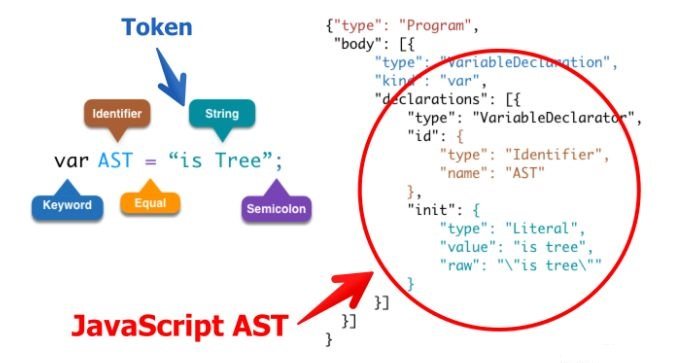
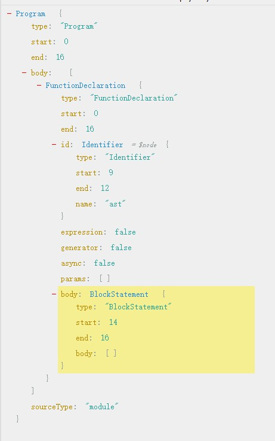
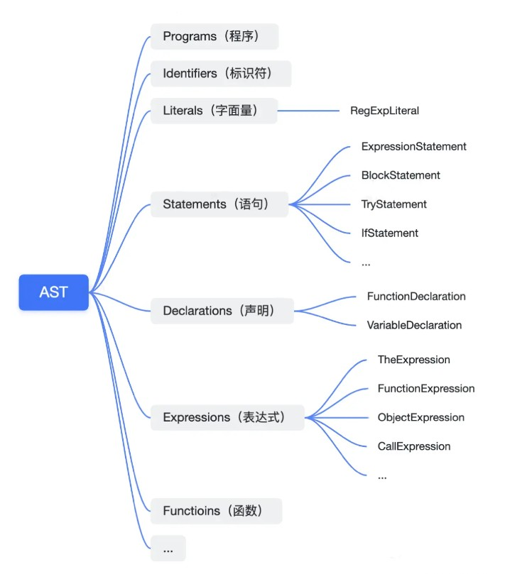
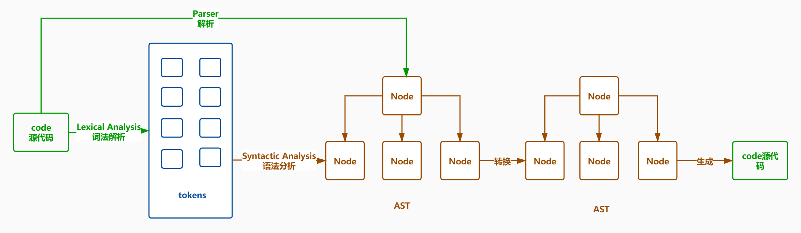

# AST抽象语法树

[TOC]


## 介绍

### 抽象语法树用途

`webpack`和`Lint`等很多的工具和库的核心都是通过`Abstract Syntax Tree`抽象语法树这个概念来实现对代码的检查、分析等操作的

- 代码语法的检查、代码风格的检查、代码的格式化、代码的高亮、代码错误提示、代码自动补全等等
  - 如 JSLint、JSHint 对代码错误或风格的检查，发现一些潜在的错误
  - IDE 的错误提示、格式化、高亮、自动补全等等
- 代码混淆压缩
  - UglifyJS2 等
- 优化变更代码，改变代码结构使达到想要的结构
  - 代码打包工具 webpack、rollup 等等
  - CommonJS、AMD、CMD、UMD 等代码规范之间的转化
  - CoffeeScript、TypeScript、JSX 等转化为原生 Javascript


### 抽象语法树定义

上面这些工具的原理都是通过`JavaScript Parser`把代码转化为一颗抽象语法树（AST），这颗树定义了代码的结构，通过操纵这颗树，我们可以精准的定位到声明语句、赋值语句、运算语句等等，实现对代码的分析、优化、变更等操作



- **词法分析**：编译器会先将一连串字符打断成（对于语言来说）有意义的片段，称为 token（记号），例如 var a = 2;。这段程序很可能会被打断成如下 token：var，a，=，2，和 ;

- **语法分析**：编译器将一个 token 的流（数组）转换为一个“抽象语法树”，它表示了程序的语法结构


### 一棵真实的抽象语法树

我们可以访问 `https://astexplorer.net`，来将代码转换为抽象语法树。

比如，我们将 `function ast(){}` 转换为抽象语法树

```json
{
  "type": "Program",
  "start": 0,
  "end": 16,
  "body": [
    {
      "type": "FunctionDeclaration",
      "start": 0,
      "end": 16,
      "id": {
        "type": "Identifier",
        "start": 9,
        "end": 12,
        "name": "ast"
      },
      "expression": false,
      "generator": false,
      "async": false,
      "params": [],
      "body": {
        "type": "BlockStatement",
        "start": 14,
        "end": 16,
        "body": []
      }
    }
  ],
  "sourceType": "module"
}
```




**AST 结构的一些基本定义**




## JavaScript Parser

- `JavaScript Parser`是把JavaScript源码转化为抽象语法树的解析器。
- 浏览器会把JavaScript源码通过解析器转为抽象语法树,再进一步转化为字节码或直接生成机器码。
- 一般来说每个JavaScript引擎都会有自己的抽象语法树格式，Chrome 的 v8 引擎，firefox 的 SpiderMonkey 引擎等等，MDN 提供了详细[SpiderMonkey AST format](https://developer.mozilla.org/zh-CN/docs/MDN/Doc_status/SpiderMonkey) 的详细说明，算是业界的标准。


**常用的 JavaScript Parser**

- esprima
- traceur
- acorn
- shift


### 在js代码中得到AST

安装：

```
npm i esprima estraverse- S
```

示例代码：
这里我们将`function ast(){}`转换为AST

```js
let esprima = require('esprima');//把JS源代码转成AST语法树
let estraverse = require('estraverse');///遍历语法树,修改树上的节点
let escodegen = require('escodegen');//把AST语法树重新转换成代码
let code = `function ast(){}`;
let ast = esprima.parse(code);
let indent = 0;
const padding = ()=>" ".repeat(indent);
estraverse.traverse(ast,{
    enter(node){
        console.log(padding()+node.type+'进入');
        if(node.type === 'FunctionDeclaration'){
            node.id.name = 'newAst';
        }
        indent+=2;
    },
    leave(node){
        indent-=2;
        console.log(padding()+node.type+'离开');
    }
});
```

输出：

```
Program进入
  FunctionDeclaration进入
    Identifier进入
    Identifier离开
    BlockStatement进入
    BlockStatement离开
  FunctionDeclaration离开
Program离开
```


### babel的工作原理

- Babel 能够转译 `ECMAScript 2015+` 的代码，使它在旧的浏览器或者环境中也能够运行
- 工作过程分为三个部人
  - Parse(解析) 将源代码转换成抽象语法树，树上有很多的[estree节点](https://github.com/estree/estree)
  - Transform(转换) 对抽象语法树进行转换
  - Generate(代码生成) 将上一步经过转换过的抽象语法树生成新的代码




## AST遍历

- AST是深度优先遍历
- 访问者模式 Visitor 对于某个对象或者一组对象，不同的访问者，产生的结果不同，执行操作也不同
- Visitor 的对象定义了用于 AST 中获取具体节点的方法
- Visitor 上挂载以节点 `type` 命名的方法，当遍历 AST 的时候，如果匹配上 type，就会执行对应的方法


### 解析过程

分为两个步骤

- 词法分析：将整个代码字符串分割成语法单元数组
- 语法分析：建立分析语法单元之间的关系


### 语法单元

JavaScript代码中的语法单元主要包括以下几种：

- 关键字：const，let，var等
- 标识符：可能是一个变量，也可能是if，else这些关键字，又或者是true，false这些常量
- 运算符
- 数字
- 空格
- 注释


### 词法分析

```js
源码1：
const add = (a, b) => {
	return a + b
}

tokens:
[
  { "type": "Keyword", "value": "const" },
  { "type": "Identifier", "value": "add" },
  { "type": "Punctuator", "value": "=" },
  { "type": "Punctuator", "value": "(" },
  { "type": "Identifier", "value": "a" },
  { "type": "Punctuator", "value": "," },
  { "type": "Identifier", "value": "b" },
  { "type": "Punctuator", "value": ")" },
  { "type": "Punctuator", "value": "=>" },
  { "type": "Punctuator", "value": "{" },
  { "type": "Keyword", "value": "return" },
  { "type": "Identifier", "value": "a" },
  { "type": "Punctuator", "value": "+" },
  { "type": "Identifier", "value": "b" },
  { "type": "Punctuator", "value": "}" }
]


---
源码2：
const a = 1;

tokens:
[
    { "type": "Keyword","value": "const" },
    { "type": "Identifier","value": "a" },
    { "type": "Punctuator","value": "=" },
    { "type": "Numeric","value": "1" },
    { "type": "Punctuator","value": ";" }
]


说明：
(1) tokens是具有type,value属性的对象组成的数组
(2) token是词法分析的最小单元，不能再分解
(3) 常见的type
- keyword关键字
- identfier标识符
- punctuator标点符号
- Numeric：数字
```


### 语法分析

- 语义分析则是将得到的词汇进行一个立体的组合，确定词语之间的关系
- 简单来说语法分析是对语句和表达式的识别，是一个递归的过程


## AST属性分析

- 最外层包含：
  - ( type  )
  - ( sourceType  )
  - ( start )
  - ( end ) 等
  - ( body )
    - body：是一个 ( 数组 ) ，包含多个 ( 内容块对象 statement )，每个内容块包含
      - type
      - start
      - end
      - kind
      - declarations：乘装变量内容的块，这个块也是一个数组，因为变量声明可能声明个
        - type
        - start
        - end
        - id
          - type
          - start
          - end
          - **name**

- ( **statement - body数组中的对象** ) 有很多类型，比如说变量声明，函数定义，if语句，while循环，等都是一个statement
  - VariableDeclaration：变量声明
  - FunctionDeclaration：函数定义
  - IfStatement：if语句
  - WhileStatement：while循环


**一个demo**

```json
源码：
var a = 1;


AST
{
  "type": "Program",
  "start": 0,
  "end": 12,
  "body": [ // ---------------------------------------------- body表示代码具体的内容
    { // ---------------------------------------------------- statement内容块对象，一个body可能包含多个statement
      "type": "VariableDeclaration", // --------------------- 变量声明
      "start": 0,
      "end": 10,
      "declarations": [
        { 
          "type": "VariableDeclarator", // ------------------ 变量声明
          "start": 4,
          "end": 9,
          "id": {
            "type": "Identifier", // ------------------------- 标识符
            "start": 4,
            "end": 5,
            "name": "a"
          },
          "init": {
            "type": "Literal",
            "start": 8,
            "end": 9,
            "value": 1,
            "raw": "1"
          }
        }
      ],
      "kind": "var" // --------------------------------------- 变量类型
    }
  ],
  "sourceType": "module"
}


说明：
(1) 最外层属性：type，start，end，body[]，sourceType
- body：表示代码的具体内容
    - 内容块：body中可能包含多个内容块，每个内容块用一个对象表示
    - 内容块包含：
        - type
        - start
        - end
        - kind
        - declarations：乘装变量内容的块，这个块也是一个数组，因为变量声明可能生命多个
            - type
            - start
            - end
            - id
                - type
                - start
                - end
                - name 
- sourceType：表示语言的种类


(2) body是一个数组，成员是statement内容块对象，因为body可以包含多个statement内容块
- statement 有很多类型，比如说变量声明，函数定义，if语句，while循环，等都是一个statement
    - VariableDeclaration：变量声明
    - FunctionDeclaration：函数定义
    - IfStatement：if语句
    - WhileStatement：while循环
```


参考文章：
[[源码-webpack01-前置知识] AST抽象语法树](https://juejin.cn/post/6844904115265339406#heading-9)

