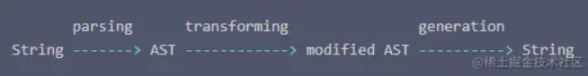
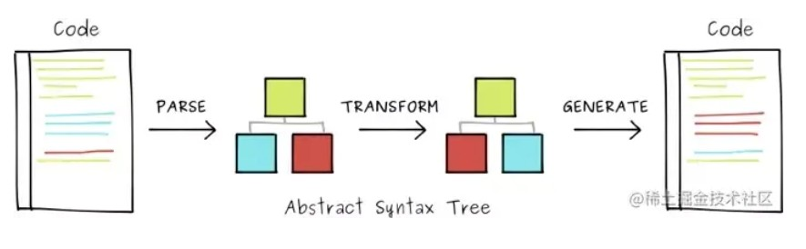

# 了解一下Babel

[TOC]


在了解Babel之前，我们需要先了解一下什么是AST👉：[AST抽象语法树](https://blog.csdn.net/weixin_52834435/article/details/126983056?spm=1001.2014.3001.5501)


## Babel的编译过程

### 流程

babel编译的过程：解析parse -> 转换transform -> 生成generate






### 具体过程

- 解析 parse

  - **@babel/parser**：将字符串转换成AST，Babylon( 现在是@babel/parser ) 是 Babel 中使用的 JavaScript 解析器
  - 解析过程分为两个阶段
    - 语法分析：字符流 -> token流
    - 词法分析：token流 -> AST
  - [@babel/parser](https://link.juejin.cn?target=https%3A%2F%2Fbabeljs.io%2Fdocs%2Fen%2Fbabel-parser%23docsNav)

- 转换 transform

  - @babel/traverse

    ：主要用于遍历AST

    - Babel接收解析得到的AST并通过 ( babel-traverse ) 对其进行 ( 深度优先遍历 )
    - 在此遍历过程中对节点进行 ( 添加 )、( 更新 ) 及 ( 移除 ) 操作
    - traverse：是遍历的意思

  - @babel/types

    ：主要用来操作AST，比如  ( 添加 )、( 更新 ) 及 ( 移除 ) 操作

    - 除了手动替换，可以使用@babel/types更加房便快捷
    - 相当于作用于 AST 的类 lodash 库

  - [@babel/traverse](https://link.juejin.cn?target=https%3A%2F%2Fbabeljs.io%2Fdocs%2Fen%2Fbabel-traverse%23docsNav)

  - [@babel/types](https://link.juejin.cn?target=https%3A%2F%2Fbabeljs.io%2Fdocs%2Fen%2Fbabel-types)

- 生成 generate

  - @babel/generator

    ：来将转换后的抽象语法树转化为Javascript 字符串

    - 将经过转换的AST通过babel-generator再转换为js代码
    - 过程及时深度遍历整个AST,然后构建转换后的代码字符串。

  - [@babel/generator](https://link.juejin.cn?target=https%3A%2F%2Fbabeljs.io%2Fdocs%2Fen%2Fbabel-generator%23docsNav)


### 相关插件

#### @babel/parser

将字符串转换为AST

```css
babelParser.parse(code, [options]) ------------------------------------ 解析所有代码
babelParser.parseExpression(code, [options]) -------------------------- 解析单个表达式

参数：
- code：表示源码字符串
- options：配置对象，可选
    - allowImportExportEverywhere：默认import和export声明只能出现在顶部，当此选项为true则可以出现在任何地方
    - ...
```


#### @babel/traverse

> **Plugin —— transform 的载体**

因为 ( @babel/parser解析 ) 和 ( @babel/generator生成 ) 基本不会变化，所以重点是 ( @babel/traverse转换 )

```ini
import * as babylon from "babylon";
import traverse from "babel-traverse";

// 源码string
const code = `function square(n) {
  return n * n;
}`;

// 解析 parse：string -> ast
const ast = babylon.parse(code);

// 转换 transform：ast -> modified ast
traverse(ast, {
  enter(path) {
    if (
      path.node.type === "Identifier" &&
      path.node.name === "n"
    ) {
      path.node.name = "x"; // ---------------- 如果是标识符并且标识符的名字是n，就把n改为x
    }
  }
```


#### @babel/generator

将AST转换为字符串

```ini
import {parse} from '@babel/parser';
import generate from '@babel/generator';

const code = 'class Example {}';
const ast = parse(code);

const output = generate(ast, { /* options */ }, code);
```


### 一个🌰

- 需求：将小写变量转换成大写

```ini
// 输入
const numberFive = 5;

// 输出
const NUMBERFIVE = 5;
```

- 实现过程

```less
安装 

@babel/core ----------------------- babel核心模块
@babel/parser --------------------- 字符流 -> token流 -> AST
@babel/traverse ------------------- AST -> modified AST
@babel/generator ------------------ modified AST -> 字符流

npm install @babel/core @babel/parser @babel/traverse @babel/generator -S

代码

const parser = require('@babel/parser');
const traverse = require('@babel/traverse').default;
const generator = require('@babel/generator').default;

// 源码字符串
const code = `
  const nubmerFive = 5
`;

// 解析
let AST = parser.parse(code)

// 转换
traverse(AST, {
  enter(path) {
    console.log(path.node.type, 'path.node.type')
    if (path.node.type === 'Identifier') { // 如果node类型是标识符，就将name转成大写形式
      path.node.name = path.node.name.toUpperCase()
    }
  }
})

// 生成
const outputObj = generator(AST)
const outputStr = outputObj.code;

console.log(outputStr, 'outputStr')
```


## Babel 的使用

### 运行环境

**运行 babel 所需的基本环境**

1. babel/cli

   `npm install i -S @babel/cli`

   @babel/cli 是 Babel 提供的内建命令行工具。提到 @babel/cli 这里就不得不提一下 @babel/node ，这俩虽然都是命令行工具，但是使用场景不同，babel/cli 是安装在项目中，而 @babel/node 是全局安装。

   当然我们一般不会使用到这个模块，因为一般我们都不会手动去做这个工作，这个工作基本都集成到模块化管理工具中去了，比如 webpack、Rollup 等。

2. babel-node

   babel-node 是 babel-cli 的一部分，所以它在安装 babel-cli 的时候也同时安装了。

   它使 ES6+ 可以直接运行在 node 环境中。

3. @babel/core

   `npm install i -S @babel/core`

   Babel 的核心功能包含在 `@babel/core` 模块中。看到 `core` 这个词了吧，意味着**核心**，没有它，在 `babel` 的世界里注定寸步难行。不安装 `@babel/core`，无法使用 `babel` 进行编译。

   安装完 @babel/cli 后就在项目目录下执行`babel test.js`会报找不到 @babel/core 的错误，因为 @babel/cli 在执行的时候会依赖 @babel/core 提供的生成 AST 相关的方法，所以安装完 @babel/cli 后还需要安装 @babel/core。

   安装完这两个插件后，如果在 Mac 环境下执行会出现 `command not found: babel`，这是因为 @babel/cli是安装在项目下，而不是全局安装，所以无法直接使用 Babel 命令,需要在 package.json 文件中加上下面这个配置项:

   ```json
   "scripts": {
      "babel":"babel"
    }
   ```

   然后执行 `npm run babel ./test.js`，顺利生成代码，此时生成的代码并没有被编译，因为 Babel 将原来集成一体的各种编译功能分离出去，独立成插件，要编译文件需要安装对应的插件或者预设，我们经常看见的什么 @babel/preset-stage-0、@babel/preset-stage-1，@babel/preset-env 等就是干这些活的。这些插件需要在配置文件中交代清楚，不然 Babel 也不知道你要用哪些插件和预设。


### 配置文件

**安装完基本的包后，就是配置 Babel 配置文件，Babel 的配置文件有四种形式**：

1. babel.config.js

   在项目的根目录（`package.json` 文件所在目录）下创建一个名为 babel.config.js 的文件，并输入如下内容。

   ```ini
   module.exports = function (api) {
    api.cache(true);
    const presets = [ ... ];
    const plugins = [ ... ];
    return {
      presets,
      plugins
    };
   }
   ```

2. .babelrc

   在你的项目中创建名为 `.babelrc` 的文件

   ```json
   {
    "presets": [...],
    "plugins": [...]
   }
   ```

   [.babelrc文档](https://link.juejin.cn?target=https%3A%2F%2Fwww.babeljs.cn%2Fdocs%2Fconfig-files%23file-relative-configuration)

3. .babelrc.js

   与 [.babelrc](https://link.juejin.cn?target=https%3A%2F%2Fwww.babeljs.cn%2Fdocs%2Fconfiguration%23babelrc) 的配置相同，你可以使用 JavaScript 语法编写。

   ```ini
   const presets = [ ... ];
   const plugins = [ ... ];
   module.exports = { presets, plugins };
   ```

4. package.json

   还可以选择将 [.babelrc](https://link.juejin.cn?target=https%3A%2F%2Fwww.babeljs.cn%2Fdocs%2Fconfiguration%23babelrc) 中的配置信息写到 `package.json` 文件中

   ```json
   {
    ...
    "babel": {
      "presets": [ ... ],
      "plugins": [ ... ],
    }
   }
   ```

四种配置方式作用都一样，选择一种即可。


## 插件(Plugins)

插件是用来定义如何转换你的代码的。在 Babel 的配置项中填写需要使用的插件名称，Babel 在编译的时候就会去加载 node_modules 中对应的 npm 包，然后编译插件对应的语法。

.babelrc

```json
{
  "plugins": ["transform-decorators-legacy", "transform-class-properties"]
}
```


### 插件执行顺序

插件在预设(Presets) 前运行。

插件的执行顺序是从左往右执行。也就是说在上面的示例中，Babel 在进行 AST 遍历的时候会先调用 transform-decorators-legacy 插件中定义的转换方法，然后再调用 transform-class-properties 中的方法。


### 插件的短名称

插件名称如果为 `@babel/plugin-XX`，可以使用短名称`@babel/XX` ，如果为 `babel-plugin-xx`，可以直接使用 `xx`。

```
{
    "plugins": [
        "@babel/transform-arrow-functions" //同 "@babel/plugin-transform-arrow-functions"
    ]
}

{
    "plugins": [
        "newPlugin", //同 "babel-plugin-newPlugin"
        "@scp/myPlugin" //同 "@scp/babel-plugin-myPlugin"
    ]
}
```


### 插件分类

`Babel` 的插件分为两种: 语法插件和转换插件。

> 语法插件

这些插件只允许 `Babel` **解析（parse）** 特定类型的语法（不是转换），可以在 `AST` 转换时使用，以支持解析新语法。

> 转换插件

转换插件会启用相应的语法插件(因此不需要同时指定这两种插件)，这点很容易理解，如果不启用相应的语法插件，意味着无法解析，连解析都不能解析，又何谈转换呢？

语法插件虽名为插件，但其本身并不具有功能性。语法插件所对应的语法功能其实都已在`@babel/parser`里实现，插件的作用只是将对应语法的解析功能打开。


## 预设(Presets)

预设就是一堆插件(Plugin)的组合，从而达到某种转译的能力，就比如 react 中使用到的 [@babel/preset-react](https://link.juejin.cn?target=https%3A%2F%2Fwww.babeljs.cn%2Fdocs%2Fbabel-preset-react) ，它就是下面几种插件的组合。

- [@babel/plugin-syntax-jsx](https://link.juejin.cn?target=https%3A%2F%2Fwww.babeljs.cn%2Fdocs%2Fbabel-plugin-syntax-jsx)
- [@babel/plugin-transform-react-jsx](https://link.juejin.cn?target=https%3A%2F%2Fwww.babeljs.cn%2Fdocs%2Fbabel-plugin-transform-react-jsx)
- [@babel/plugin-transform-react-display-name](https://link.juejin.cn?target=https%3A%2F%2Fwww.babeljs.cn%2Fdocs%2Fbabel-plugin-transform-react-display-name)

当然我们也可以手动的在 plugins 中配置一系列的 plugin 来达到目的，就像这样：

```perl
{
  "plugins":["@babel/plugin-syntax-jsx","@babel/plugin-transform-react-jsx","@babel/plugin-transform-react-display-name"]
}
```

但是这样一方面显得不那么优雅，另一方面增加了使用者的使用难度。如果直接使用预设就很方便。

```perl
{
  "presets":["@babel/preset-react"]
}
```


### 预设的执行顺序

前面提到插件的执行顺序是从左往右，而预设的执行顺序恰好反其道行之，它是从右往左

```json
{
  "presets": [
    "a",
    "b",
    "c"
  ]
}
```

它的执行顺序是 c、b、a，是不是有点奇怪，这主要是为了确保向后兼容。


### 常见预设

**`babel-preset-typescript`**

对于`TypeScript`代码，我们有两种方式去编译`TypeScript`代码成为`JavaScript`代码。

1. 使用`tsc`命令，结合`cli`命令行参数方式或者`tsconfig`配置文件进行编译`ts`代码。
2. 使用`babel`，通过`babel-preset-typescript`代码进行编译`ts`代码。


**`babel-preset-env`**

`@babel/preset-env`是一个智能预设，它可以将我们的高版本`JavaScript`代码进行转译根据内置的规则转译成为低版本的`javascript`代码。

这个preset包括支持现代JavaScript(ES6+)的所有插件，所以也就是说你安装使用了`env`preset之后, 就可以看到其它ES6+语法的转换了.

`preset-env`内部集成了绝大多数`plugin`（`State > 3`）的转译插件，它会根据对应的参数进行代码转译。

> 需要额外注意的是`babel-preset-env`仅仅针对语法阶段的转译，比如转译箭头函数，`const/let`语法。针对一些`Api`或者`Es 6`内置模块的`polyfill`，`preset-env`是无法进行转译的。这块内容我们会在之后的`polyfill`中进行介绍。


## 二者对比

**执行顺序**

很简单的几条原则：

- Plugin 会运行在 Preset 之前。
- Plugin 会从前到后顺序执行。
- Preset 的顺序则 **刚好相反**(从后向前)。

preset 的逆向顺序主要是为了保证向后兼容，因为大多数用户的编写顺序是 `['es2015', 'stage-0']`。这样必须先执行 `stage-0` 才能确保 babel 不报错。因此我们编排 preset 的时候，也要注意顺序，**其实只要按照规范的时间顺序列出即可。**


　Babel官网提供了近一百个插件，但是如果我们的代码中一个一个的配置插件就需要对每一个插件有所了解，这样必然会耗费大量的时间精力；为此，Babel提供了预设（presets）的概念，意思就是预先设置好的一系列插件包；这就相当于肯德基中的套餐，将众多产品进行搭配组合，适合不同的人群需要；总有一款适合我们的套餐。


## @babel/preset-env

上面我们简单介绍了一下这个预设，在这里进行详细说明。


默认情况下，@babel/env等于@babel/preset-es2015、@babel/preset-es2016和@babel/preset-es2017三个套餐的叠加。

如果要转义箭头函数，需要使用到 `@babel/plugin-transform-arrow-functions` 这个插件 同理转义 `class` 需要使用 `@babel/plugin-transform-classes`

```sql
yarn add @babel/plugin-transform-arrow-functions @babel/plugin-transform-classes -D
```

根目录下建立 `.babelrc` 文件：

```perl
{
  "plugins": [
    "@babel/plugin-transform-arrow-functions",
    "@babel/plugin-transform-classes"
  ]
}
```

`yarn build` 之后可以看出 箭头函数和类都被转义了。

但是假如你再使用 `async await` 之类的 `es6` 语法，你还得一个个添加，这是不实际的。

[@babel/preset-env](https://link.juejin.cn?target=https%3A%2F%2Fbabeljs.io%2Fdocs%2Fen%2Fbabel-preset-env%23docsNav) 就整合了这些语法转义插件：

```scss
Using plugins:
transform-template-literals {}
transform-literals {}
transform-function-name {}
transform-arrow-functions {}
transform-block-scoped-functions {}
transform-classes {}
transform-object-super {}
//...
```

使用如下：

```sql
yarn add @babel/preset-env -D
```

.babelrc

```
{
  "presets": ["@babel/preset-env"]
}
```


@babel/preset-env 是根据浏览器的不同版本中缺失的功能确定代码转换规则的，在配置的时候我们只需要配置需要支持的浏览器版本就好了，@babel/preset-env 会根据目标浏览器生成对应的插件列表然后进行编译：

```json
{
 "presets": [
   ["env", {
     "targets": {
       "browsers": ["last 10 versions", "ie >= 9"]
     }
   }],
 ],
 ...
}
```

在默认情况下 @babel/preset-env 支持将 JS 目前最新的语法转成 ES5，但需要注意的是，如果你代码中用到了还没有成为 JS 标准的语法，该语法暂时还处于 stage 阶段，这个时候还是需要安装对应的 stage 预设，不然编译会报错。

```json
{
 "presets": [
   ["env", {
     "targets": {
       "browsers": ["last 10 versions", "ie >= 9"]
     }
   }],
 ],
 "stage-0"
}   
```

虽然可以采用默认配置，但如果不需要照顾所有的浏览器，还是建议你配置目标浏览器和环境，这样可以保证编译后的代码体积足够小，因为在有的版本浏览器中，新语法本身就能执行，不需要编译。@babel/preset-env 在默认情况下和 preset-stage-x 一样只编译语法，不会对新方法和新的原生对象进行转译，例如：

```ini
const arrFun = ()=>{}
const arr = [1,2,3]
console.log(arr.includes(1))
```

转换后

```javascript
"use strict";

var arrFun = function arrFun() {};

var arr = [1, 2, 3];
console.log(arr.includes(1));
```

箭头函数被转换了，但是 Array.includes 方法，并没有被处理，这个时候要是程序跑在低版本的浏览器上，就会出现 `includes is not function` 的错误。这个时候就需要 polyfill 闪亮登场了。


> **@babel/preset-stage-xxx**
>
> @babel/preset-stage-xxx 是 ES 在不同阶段语法提案的转码规则而产生的预设，随着被批准为 ES 新版本的组成部分而进行相应的改变（例如 ES6/ES2015）。
>
> 提案分为以下几个阶段：
>
> - [stage-0](https://link.juejin.cn?target=https%3A%2F%2Fwww.babeljs.cn%2Fdocs%2Fbabel-preset-stage-0) - 设想（Strawman）：只是一个想法，可能有 Babel 插件，stage-0 的功能范围最广大，包含 stage-1 , stage-2 以及 stage-3 的所有功能
> - [stage-1](https://link.juejin.cn?target=https%3A%2F%2Fwww.babeljs.cn%2Fdocs%2Fbabel-preset-stage-1) - 建议（Proposal）：这是值得跟进的
> - [stage-2](https://link.juejin.cn?target=https%3A%2F%2Fwww.babeljs.cn%2Fdocs%2Fbabel-preset-stage-2) - 草案（Draft）：初始规范
> - [stage-3](https://link.juejin.cn?target=https%3A%2F%2Fwww.babeljs.cn%2Fdocs%2Fbabel-preset-stage-3) - 候选（Candidate）：完成规范并在浏览器上初步实现
> - stage-4 - 完成（Finished）：将添加到下一个年度版本发布中


## 相关 polyfill 内容

### 存在的问题

babel 默认只转换 js 语法，而不转换新的 API，比如 Iterator、Generator、Set、Maps、Proxy、Reflect、Symbol、Promise 等全局对象，以及一些定义在全局对象上的方法(比如 `Object.assign`)都不会转码。

举例来说，es2015 在 Array 对象上新增了 `Array.from` 方法。babel 就不会转码这个方法。如果想让这个方法运行，必须使用 `babel-polyfill`。(内部集成了 `core-js` 和 `regenerator`)

使用时，在所有代码运行之前增加 `require('babel-polyfill')`。或者更常规的操作是在 `webpack.config.js` 中将 `babel-polyfill` 作为第一个 entry。因此必须把 `babel-polyfill` 作为 `dependencies` 而不是 `devDependencies`


可以稍微总结一下，**语法层面的转化`preset-env`完全可以胜任。但是一些内置方法模块，仅仅通过`preset-env`的语法转化是无法进行识别转化的，所以就需要一系列类似”垫片“的工具进行补充实现这部分内容的低版本代码实现。这就是所谓的`polyfill`的作用，**


针对于`polyfill`方法的内容，`babel`中涉及两个方面来解决：

- `@babel/polyfill`
- `@babel/runtime`
- `@babel/plugin-transform-runtime`


`babel-polyfill` 主要有两个缺点：

1. 使用 `babel-polyfill` 会导致打出来的包非常大，因为 `babel-polyfill` 是一个整体，把所有方法都加到原型链上。比如我们只使用了 `Array.from`，但它把 `Object.defineProperty` 也给加上了，这就是一种浪费了。这个问题可以通过单独使用 `core-js` 的某个类库来解决，`core-js` 都是分开的。
2. `babel-polyfill` 会污染全局变量，给很多类的原型链上都作了修改，如果我们开发的也是一个类库供其他开发者使用，这种情况就会变得非常不可控。

因此在实际使用中，如果我们无法忍受这两个缺点(尤其是第二个)，通常我们会倾向于使用 `babel-plugin-transform-runtime`。

但如果代码中包含高版本 js 中类型的实例方法 (例如 `[1,2,3].includes(1)`)，这还是要使用 polyfill。


下面将会对这几个预设分别进行详细说明.


### @babel/runtime

上边我们讲到`@babel/polyfill`是存在污染全局变量的副作用，在实现`polyfill`时`Babel`还提供了另外一种方式去让我们实现这功能，那就是`@babel/runtime`。

简单来讲，`@babel/runtime`更像是一种**按需加载的解决方案**，比如哪里需要使用到`Promise`，`@babel/runtime`就会在他的文件顶部添加`import promise from 'babel-runtime/core-js/promise'`。


`babel-runtime`会将引入方式由智能完全交由我们自己，我们需要什么自己引入什么。

它的用法很简单，只要我们去安装`npm install --save @babel/runtime`后，在需要使用对应的`polyfill`的地方去单独引入就可以了。比如：

```js
// a.js 中需要使用Promise 我们需要手动引入对应的运行时polyfill
import Promise from 'babel-runtime/core-js/promise'

const promsies = new Promise()
```

总而言之，`babel/runtime`你可以理解称为就是一个运行时“哪里需要引哪里”的工具库。

> 针对`babel/runtime`绝大多数情况下我们都会配合`@babel/plugin-transfrom-runtime`进行使用达到智能化`runtime`的`polyfill`引入。


### @babel/plugin-transform-runtime

#### @babel-runtime 存在的问题

`babel-runtime`在我们手动引入一些`polyfill`的时候，它会给我们的代码中注入一些类似`_extend()， classCallCheck()`之类的工具函数，这些工具函数的代码会包含在编译后的每个文件中，比如：

```js
class Circle {}
// babel-runtime 编译Class需要借助_classCallCheck这个工具函数
function _classCallCheck(instance, Constructor) { //... } 
var Circle = function Circle() { _classCallCheck(this, Circle); };
复制代码
```

如果我们项目中存在多个文件使用了`class`，那么无疑在每个文件中注入这样一段冗余重复的工具函数将是一种灾难。

所以针对上述提到的两个问题:

- `babel-runtime`无法做到智能化分析，需要我们手动引入。
- `babel-runtime`编译过程中会重复生成冗余代码。

我们就要引入我们的主角`@babel/plugin-transform-runtime`。


#### @babel/plugin-transform-runtime 作用

`@babel/plugin-transform-runtime`插件的作用恰恰就是为了解决上述我们提到的`run-time`存在的问题而提出的插件。

- `babel-runtime`无法做到智能化分析，需要我们手动引入。

`@babel/plugin-transform-runtime`插件会智能化的分析我们的项目中所使用到需要转译的`js`代码，从而实现模块化从`babel-runtime`中引入所需的`polyfill`实现。

- `babel-runtime`编译过程中会重复生成冗余代码。

`@babel/plugin-transform-runtime`插件提供了一个`helpers`参数。

这个`helpers`参数开启后可以将上边提到编译阶段重复的工具函数，比如`classCallCheck, extends`等代码转化称为`require`语句。此时，这些工具函数就不会重复的出现在使用中的模块中了。比如这样：

```js
// @babel/plugin-transform-runtime会将工具函数转化为require语句进行引入
// 而非runtime那样直接将工具模块代码注入到模块中
var _classCallCheck = require("@babel/runtime/helpers/classCallCheck"); 
var Circle = function Circle() { _classCallCheck(this, Circle); };
```


#### 配置 @babel/plugin-transform-runtime

目前它的默认配置:

```json
{
  "plugins": [
    [
      "@babel/plugin-transform-runtime",
      {
        "absoluteRuntime": false,
        "corejs": false,
        "helpers": true,
        "regenerator": true,
        "version": "7.0.0-beta.0"
      }
    ]
  ]
}
```


> babel-runtime 是为了减少重复代码而生的。 babel生成的代码，可能会用到一些_extend()， classCallCheck() 之类的工具函数，默认情况下，这些工具函数的代码会包含在编译后的文件中。如果存在多个文件，那每个文件都有可能含有一份重复的代码。
>
> babel-transform-runtime插件能够将这些工具函数的代码转换成require语句，指向为对babel-runtime的引用，如 require('babel-runtime/helpers/classCallCheck'). 这样， classCallCheck的代码就不需要在每个文件中都存在了。


参考文章：
[[源码-webpack01-前置知识] AST抽象语法树](https://juejin.cn/post/6844904115265339406#heading-10)

[「前端基建」带你在Babel的世界中畅游](https://juejin.cn/post/7025237833543581732#heading-27)

[一口(很长的)气了解 babel](https://juejin.cn/post/6844903743121522701#heading-7)

[前端工程师的自我修养-关于 Babel 那些事儿](https://juejin.cn/post/6844904079118827533#heading-13)