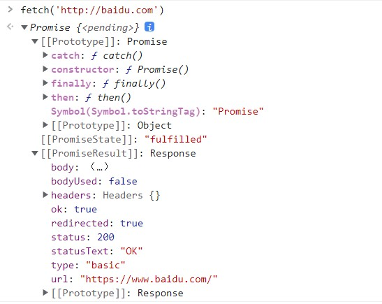
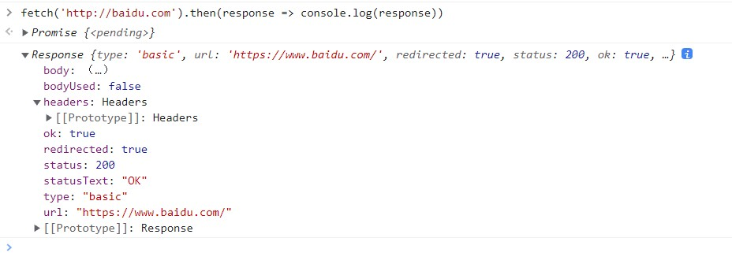
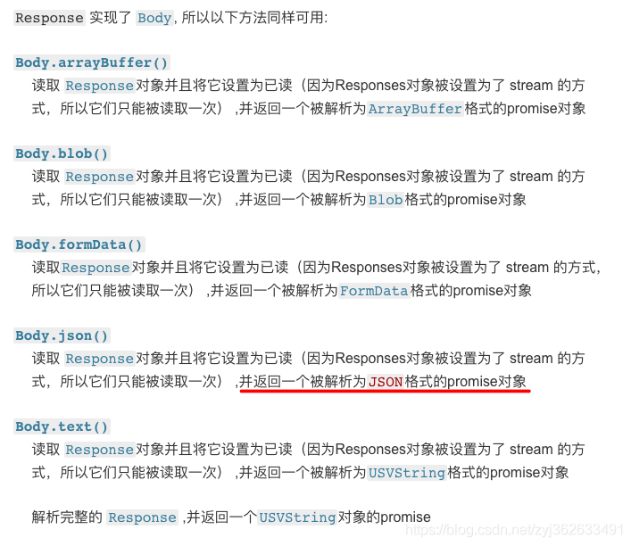

# Fetch入门

[TOC]


## 基础用法

fetch()接受一个 URL 字符串作为参数，默认向该网址发出 GET 请求，返回一个 Promise 对象。



既然返回一个promise对象，那么我们可以使用then进行链式调用。

```js
fetch('xxx.xxx')
	.then(response => console.log(response)) //此时返回的是一个response对象,它对应服务器的 HTTP 回应
```



接着我们调用response的json方法，把response对象转换为JS可操作的json对象

```js
fetch('xxx.xxx')
	.then(response => console.log(response.json()))
```

区分：

**Response.json()会将响应流数据读成json格式**

**Response.text()会将响应流数据读成text类型**



此时，response.json()返回的是一个promise对象，我们继续调用then方法。

```js
fetch('xxx.xxx')
	.then(response => console.log(response.json()))
	.then(json => console.log(json))
```


## response对象

### 概览

当fetch()方法执行结束时，会返回一个Response对象，我们可以通过Response对象的属性和方法来查看相关响应信息。

- Response.headers  值 对象， 只读 ，包含该Response所关联的Headers对象

- Response.ok 值true ，只读，包含了一个布尔值，表示该Response是否成功（状态码在200-299的为true）

- Response.status  值200 ，只读，该Response状态码，200表示成功。404表示服务器没有该资源。

- Response.statusText  值OK， 只读，表示与status状态码一直的信息，200 对应 OK

- Response.url   值是一个url地址，只读，表示该Response的url

- Response.redirected  只读，表示该 Response 是否来自一个重定向，如果是的话，它的 URL 列表将会有多个条目。

- Response.type  响应类型，只读，包含 Response 的类型（例如，basic、cors）。

- Response.body  一个简单的 getter，表示 body 内容。

几个方法：Response实现了Body接口，所以可以使用以下方法：

- Body.json() 读取 Response 对象并且将它设置为已读（因为 Responses 对象被设置为了 stream 的方式，所以它们只能被读取一次），并返回一个被解析为 JSON 格式的 Promise 对象。

- Body.text()读取 Response 对象并且将它设置为已读（因为 Responses 对象被设置为了 stream 的方式，所以它们只能被读取一次），并返回一个被解析为 USVString 格式（文本格式）的 Promise 对象。

- Body.blob()读取 Response 对象并且将它设置为已读（因为 Responses 对象被设置为了 stream 的方式，所以它们只能被读取一次），并返回一个被解析为 Blob 格式（二进制格式，包含二进制数据信息）的 Promise 对象。

- Body.formData()读取Response 对象并且将它设置为已读（因为 Responses 对象被设置为了 stream 的方式，所以它们只能被读取一次），并返回一个被解析为 FormData 格式的 Promise 对象。

- Body.arrayBuffer()读取 Response 对象并且将它设置为已读（因为 Responses 对象被设置为了 stream 的方式，所以它们只能被读取一次），并返回一个被解析为 ArrayBuffer 格式的 Promise 对象。
  


### Response 对象的同步属性

response.status和response.statusText就是 Response 的同步属性，可以立即读取。

```js
async function fetchText() {
  let response = await fetch('/readme.txt');
  console.log(response.status); 
  console.log(response.statusText);
}
```


### 判断请求是否成功

fetch()发出请求以后，有一个很重要的注意点：只有网络错误，或者无法连接时，fetch()才会报错，其他情况都不会报错，而是认为请求成功。

这就是说，即使服务器返回的状态码是 4xx 或 5xx，fetch()也不会报错（即 Promise 不会变为 rejected状态）。

只有通过Response.status属性，得到 HTTP 回应的真实状态码，才能判断请求是否成功。

```js
async function fetchText() {
  let response = await fetch('/readme.txt');
  if (response.status >= 200 && response.status < 300) {
    return await response.text();
  } else {
    throw new Error(response.statusText);
  }
}
```


### Response.headers 属性

Response 对象还有一个Response.headers属性，指向一个 Headers 对象，对应 HTTP 回应的所有标头。

Headers 对象可以使用for…of循环进行遍历。

```js
const response = await fetch(url);

for (let [key, value] of response.headers) { 
  console.log(`${key} : ${value}`);  
}

// 或者
for (let [key, value] of response.headers.entries()) { 
  console.log(`${key} : ${value}`);  
}
```

- Headers.get()：根据指定的键名，返回键值。
- Headers.has()： 返回一个布尔值，表示是否包含某个标头。
- Headers.set()：将指定的键名设置为新的键值，如果该键名不存在则会添加。
- Headers.append()：添加标头。
- Headers.delete()：删除标头。
- Headers.keys()：返回一个遍历器，可以依次遍历所有键名。
- Headers.values()：返回一个遍历器，可以依次遍历所有键值。
- Headers.entries()：返回一个遍历器，可以依次遍历所有键值对（[key, value]）。
- Headers.forEach()：依次遍历标头，每个标头都会执行一次参数函数。


### 读取内容的方法

```js
const response = await fetch('flower.jpg');
const myBlob = await response.blob();
const objectURL = URL.createObjectURL(myBlob);

const myImage = document.querySelector('img');
myImage.src = objectURL;
```


## fetch()的第二个参数：定制 HTTP 请求

fetch()的第一个参数是 URL，还可以接受第二个参数，作为配置对象，定制发出的 HTTP 请求。

### POST 请求

```js
const response = await fetch(url, {
  method: 'POST',
  headers: {
    "Content-type": "application/x-www-form-urlencoded; charset=UTF-8",
  },
  body: 'foo=bar&lorem=ipsum',
});

const json = await response.json();
```

method：HTTP 请求的方法，POST、DELETE、PUT都在这个属性设置。
headers：一个对象，用来定制 HTTP 请求的标头。
body：POST 请求的数据体。


### 提交 JSON 数据

```js
const user =  { name:  'John', surname:  'Smith'  };
const response = await fetch('/article/fetch/post/user', {
  method: 'POST',
  headers: {
   'Content-Type': 'application/json;charset=utf-8'
  }, 
  body: JSON.stringify(user) 
});
```


上面示例中，标头Content-Type要设成’application/json;charset=utf-8’。因为默认发送的是纯文本，Content-Type的默认值是’text/plain;charset=UTF-8’。

上面示例中，标头Content-Type要设成’application/json;charset=utf-8’。因为默认发送的是纯文本，Content-Type的默认值是’text/plain;charset=UTF-8’。


### 提交表单

```js
const form = document.querySelector('form');

const response = await fetch('/users', {
  method: 'POST',
  body: new FormData(form)
})
```


### 文件上传

```js
const input = document.querySelector('input[type="file"]');

const data = new FormData();
data.append('file', input.files[0]);
data.append('user', 'foo');

fetch('/avatars', {
  method: 'POST',
  body: data
});
```


### 直接上传二进制数据

fetch()也可以直接上传二进制数据，将 Blob 或 arrayBuffer 数据放在body属性里面。

```js
let blob = await new Promise(resolve =>   
  canvasElem.toBlob(resolve,  'image/png')
);

let response = await fetch('/article/fetch/post/image', {
  method:  'POST',
  body: blob
});

```


## fetch注意事项

### 错误处理

fetch只有在网络错误的情况，返回的promise会被reject。成功的 fetch() 检查不仅要包括 promise 被 resolve，还要包括 Response.ok 属性为 true。HTTP 404 状态并不被认为是网络错误，所以Promise的状态为resolve。

```js
fetch('http://baidu.com')
	.then(response => {
		if(response.ok){
			response.json();
		}
		throw new Error('error!')
	})
	.then(data => console.log(data))
```


### 中止

fetch  自身并没有提供 中止请求的方法。但是部分浏览器有实现AbortController，可以通过AbortController中止fetch请求

```javascript
const controller = new AbortController();
const signal = controller.signal;
setTimeout(() => controller.abort(), 5000);


fetch('/api/user/CaiCai', {
  signal, // 在option中加入signal
  method: 'POST',
  // credentials:'include',
  headers: {
    'Content-Type': 'application/json'
  },
  body: JSON.stringify({
    name: 'CaiCai',
    age: '26',
  })
}).then((res) => {
  return res.json()
}).then((result) => {
  console.log(result)
}).catch((err) => {
  console.log(err)
})
```


### 带Cookie发送请求

如果我们想要在异步请求中带上cookie参数，那么需要显式指定credentials参数：

credentials可设置为include、same-origin、omit。

include为了让浏览器发送包含凭据的请求（即使是跨域源）。

如果你只想在请求URL与调用脚本位于同一起源处时发送凭据，请添加credentials: 'same-origin'。

要改为确保浏览器不在请求中包含凭据，请使用credentials: 'omit'。

- omit: 默认值，忽略cookie的发送

- same-origin: 表示cookie只能同域发送，不能跨域发送

- include: cookie既可以同域发送，也可以跨域发送

- credentials所表达的含义，其实与XHR2中的withCredentials属性类似，表示请求是否携带cookie；

```css
fetch(url, {
  credentials: 'include'
})
```


参考文章：

[fetch的概念以及基本用法](https://blog.csdn.net/TroyeSivanlp/article/details/123271225?ops_request_misc=%257B%2522request%255Fid%2522%253A%2522166597440316782417013532%2522%252C%2522scm%2522%253A%252220140713.130102334..%2522%257D&request_id=166597440316782417013532&biz_id=0&utm_medium=distribute.pc_search_result.none-task-blog-2~all~top_click~default-2-123271225-null-null.142^v58^new_blog_pos_by_title,201^v3^control_2&utm_term=fetch&spm=1018.2226.3001.4187)