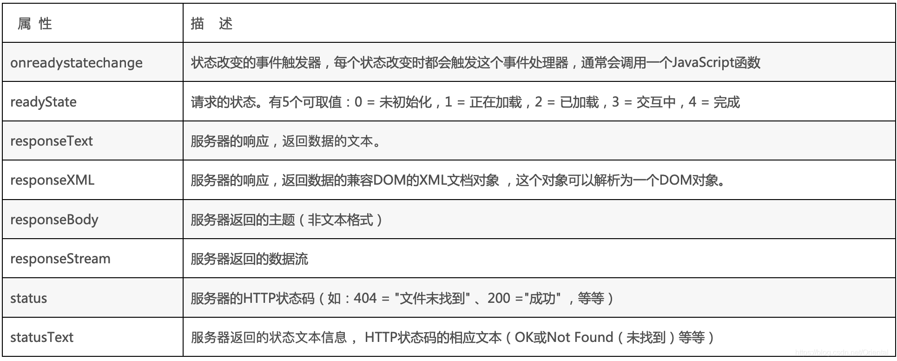

# 【JS异步】Ajax学习笔记

[TOC]


## 一、Ajax简介

> AJAX 简介 AJAX 全称为 Asynchronous JavaScript And XML，就是异步的 JS 和 XML。
>
> 通过 AJAX 可以在浏览器中向服务器发送异步请求，最大的优势：`无刷新获取数据`。
>
> AJAX 不是新的编程语言，而是一种将现有的标准组合在一起使用的新方式。


### 1. XML简介

1. XML 可扩展标记语言。
2. XML 被设计用来传输和存储数据。 
3. XML 和 HTML 类似，不同的是 HTML 中都是**预定义标签**，而 XML 中没有预定义标签， 全都是自定义标签，用来表示一些数据。


举例：

有一组数据：
`name = "孙悟空" ; age = 18 ; gender = "男" ;`

**用XML表示**：

```
<student>
<name>孙悟空</name>
<age>18</age>
<gender>男</gender>
</student>
```

**用JSON表示**：

```json
{"name":"孙悟空","age":18,"gender":"男"}
```


### 2. Ajax的优缺点

#### ① Ajax的优点

1) 可以无需刷新页面而与服务器端进行通信。 

2) 允许你根据用户事件来更新部分页面内容。

#### ② Ajax的缺点

1) 没有浏览历史，不能回退

2) 存在跨域问题(同源)

3) SEO 不友好


## 二、原生Ajax

> **XMLHttpRequest**，AJAX 的所有操作都是通过该对象进行的。


`XMLHttpRequest`对象的常用属性




`ajax请求状态`:xhr.readyState

​    0：请求未初始化，还没有调用 open()。

​	1：请求已经建立，但是还没有发送，还没有调用 send()。

​	2：请求已发送，正在处理中（通常现在可以从响应中获取内容头）。

​	3：请求在处理中；通常响应中已有部分数据可用了，没有全部完成。

​	4：响应已完成；您可以获取并使用服务器的响应了


### 1.Ajax的使用

```js
1) 创建 XMLHttpRequest 对象
var xhr = new XMLHttpRequest();

2) 设置请求信息
xhr.open(method, url);
//可以设置请求头，一般不设置
xhr.setRequestHeader('Content-Type', 'application/x-www-form-urlencoded');

3) 发送请求
xhr.send(body) //get 请求不传 body 参数，只有 post 请求使用

4) 接收响应
//xhr.responseXML 接收 xml 格式的响应数据
//xhr.responseText 接收文本格式的响应数据
xhr.onreadystatechange = function (){
if(xhr.readyState == 4 && xhr.status == 200){
	var text = xhr.responseText;
	console.log(text);
}}
```


### 2.Get方式

```js
    //绑定事件
    btn.onclick = function () {
      //1. 创建对象
      const xhr = new XMLHttpRequest();
      //2. 初始化 设置请求方法和 url
      xhr.open('GET', 'http://127.0.0.1:8000/server?a=100&b=200&c=300');
      //3. 发送
      xhr.send();
      //4. 事件绑定 处理服务端返回的结果
      // on  when 当....时候
      // readystate 是 xhr 对象中的属性, 表示状态 0 1 2 3 4
      // change  改变
      xhr.onreadystatechange = function () {
        //判断 (服务端返回了所有的结果)
        if (xhr.readyState === 4) {
          //判断响应状态码 200  404  403 401 500
          // 2xx 成功
          if (xhr.status >= 200 && xhr.status < 300) {
            //处理结果  行 头 空行 体
            //响应 
            // console.log(xhr.status);//状态码
            // console.log(xhr.statusText);//状态字符串
            // console.log(xhr.getAllResponseHeaders());//所有响应头
            // console.log(xhr.response);//响应体
            //设置 result 的文本
            result.innerHTML = xhr.response;
          } else {}
        }
      }
    }
```


### 3.Post方式

```js
     //绑定事件
        result.addEventListener("mouseover", function(){
            //1. 创建对象
            const xhr = new XMLHttpRequest();
            //2. 初始化 设置类型与 URL
            xhr.open('POST', 'http://127.0.0.1:8000/server');
            //设置请求头
            xhr.setRequestHeader('Content-Type','application/x-www-form-urlencoded');
            xhr.setRequestHeader('name','atguigu');
            //3. 发送
            xhr.send('a=100&b=200&c=300');
            // xhr.send('a:100&b:200&c:300');
            // xhr.send('1233211234567');
            //4. 事件绑定
            xhr.onreadystatechange = function(){
                //判断
                if(xhr.readyState === 4){
                    if(xhr.status >= 200 && xhr.status < 300){
                        //处理服务端返回的结果
                        result.innerHTML = xhr.response;
                    }
                }
            }
        });
```


### 4.解决ie缓存问题

问题：在一些浏览器中(IE),由于`缓存机制`的存在，ajax 只会发送的第一次请求，剩余多次请求不会再发送给浏览器而是直接加载缓存中的数据。

解决方式：浏览器的缓存是根据 url地址来记录的，所以我们只需要修改 url 地址 即可避免缓存问题 `xhr.open("get","/testAJAX?t="+Date.now());`


### 5.请求超时与网络异常

**当你的请求时间过长,或者无网络时,进行的相应处理**

```js
   btn.addEventListener('click', function(){
            const xhr = new XMLHttpRequest();
            //超时设置 2s 设置
            xhr.timeout = 2000;
            //超时回调
            xhr.ontimeout = function(){
                alert("网络异常, 请稍后重试!!");
            }
            //网络异常回调
            xhr.onerror = function(){
                alert("你的网络似乎出了一些问题!");
            }

            xhr.open("GET",'http://127.0.0.1:8000/delay');
            xhr.send();
            xhr.onreadystatechange = function(){
                if(xhr.readyState === 4){
                    if(xhr.status >= 200 && xhr.status< 300){
                        result.innerHTML = xhr.response;
                    }
                }
            }
        })
```


### 6.取消请求

在请求发出去后`但是未响应完成`时可以进行取消请求操作

> abort : 可以用来取消请求

```js
        const btns = document.querySelectorAll('button');
        let x = null;
        btns[0].onclick = function(){
            x = new XMLHttpRequest();
            x.open("GET",'http://127.0.0.1:8000/delay');
            x.send();
        }
        // abort:可以用来取消请求
        btns[1].onclick = function(){
            x.abort();
        }
```


### 7.重复请求问题

当用户在很短的时间内重复发生请求时，应该取消后续的重复的相同的请求。

解决方案：

用一个标志变量，根据标志变量的值是否为true，来取消请求

```js
   btns[0].onclick = function(){
            //判断标识变量
            if(isSending) x.abort();// 如果正在发送, 则取消该请求, 创建一个新的请求
            x = new XMLHttpRequest();
            //修改 标识变量的值
            isSending = true;
            x.open("GET",'http://127.0.0.1:8000/delay');
            x.send();
            x.onreadystatechange = function(){
                if(x.readyState === 4){
                    //修改标识变量
                    isSending = false;
                }
            }
        }
```


## 三、Axios发送Ajax请求

### 1.axios.get( )

> axios.get(url,data,params)

```js
  //配置 baseURL
    axios.defaults.baseURL = 'http://127.0.0.1:8000';

    btns[0].onclick = function () {
      //GET 请求
      axios.get('/axios-server', {
        //url 参数
        params: {
          id: 100,
          vip: 7
        },
        //请求头信息
        headers: {
          name: 'atguigu',
          age: 20
        }
      }).then(value => { //指定回调函数
        console.log(value);
      });
    }
```


### 2.axios.post()

> axios.post(url,data,params)

```js
  //配置 baseURL
    axios.defaults.baseURL = 'http://127.0.0.1:8000';  
	btns[1].onclick = function () {
      axios.post('/axios-server', {
        username: 'admin',
        password: 'admin'
      }, {
        //url 
        params: {
          id: 200,
          vip: 9
        },
        //请求头参数
        headers: {
          height: 180,
          weight: 180,
        }
      });
    }
```


### 3.axios() 通用方法

```js
  //配置 baseURL
    axios.defaults.baseURL = 'http://127.0.0.1:8000';
	btns[2].onclick = function () {
      axios({
        //请求方法
        method: 'POST',
        //url
        url: '/axios-server',
        //url参数
        params: {
          vip: 10,
          level: 30
        },
        //头信息,此部分如果使用自定义的头信息,需要服务端进行相应修改,正常不设置
        headers: {
          a: 100,
          b: 200
        },
        //请求体参数
        data: {
          username: 'admin',
          password: 'admin'
        }
      }).then(response => {
        //响应状态码
        console.log(response.status);
        //响应状态字符串
        console.log(response.statusText);
        //响应头信息
        console.log(response.headers);
        //响应体
        console.log(response.data);
      })
    }
```

