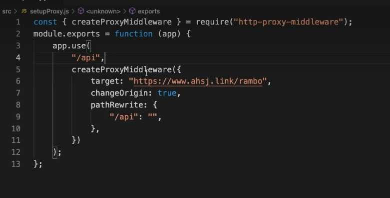
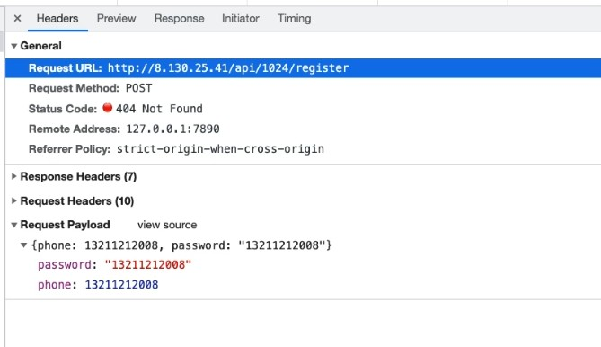

[TOC]


## 什么是跨域？

跨域：指的是浏览器不能执行其他网站的脚本。它是由浏览器的**同源策略**造成的，是浏览器对javascript施加的安全措施。

> **「同源策略」**是一个重要的安全策略，它用于限制一个[origin](https://link.juejin.cn/?target=https%3A%2F%2Fdeveloper.mozilla.org%2Fzh-CN%2Fdocs%2FGlossary%2F%E6%BA%90)的文档或者它加载的脚本如何能与另一个源的资源进行交互。它能帮助阻隔恶意文档，减少可能被攻击的媒介。
>
> --来源 MDN

### Origin

Web 内容的源由用于访问它的[URL](https://developer.mozilla.org/zh-CN/docs/Glossary/URL) 的方案 (协议)，主机 (域名) 和端口定义。只有当方案，主机和端口都匹配时，两个对象具有相同的起源。

某些操作仅限于同源内容，而可以使用 [CORS](https://developer.mozilla.org/zh-CN/docs/Glossary/CORS) 解除这个限制。


### [同源的例子](https://developer.mozilla.org/zh-CN/docs/Glossary/Origin#同源的例子)

same origin because same scheme (`http`) and host (`example.com`)

- `http://example.com/app1/index.html`
- `http://example.com/app2/index.html`

same origin because a server delivers HTTP content through port 80 by default

- `http://Example.com:80`
- `http://example.com`


### [不同源的例子](https://developer.mozilla.org/zh-CN/docs/Glossary/Origin#不同源的例子)

different schemes

- `http://example.com/app1`
- `https://example.com/app2`

different hosts

- `http://example.com`
- `http://www.example.com`
- `http://myapp.example.com`

different ports

- `http://example.com`
- `http://example.com:8080`


### 为什么需要跨域？

**限制不同源的请求**

例如用户登录 a 网站，同时新开 tab 打开了 b 网站，如果不限制同源， b 可以像 a 网站发起任何请求，会让不法分子有机可趁。


## 如何解决？

### 1.JSONP

**利用 `<script>` 标签没有跨域限制的漏洞，网页可以得到从其他来源动态产生的 JSON 数据。JSONP请求一定需要对方的服务器做支持才可以。**

**「使用限制」**

仅支持 GET 方法，如果想使用完整的 REST 接口，请使用 CORS 或者其他代理方式。

不安全 -> XSS攻击，如果我们访问的接口返回了一段恶意的js脚本，那么我们会将这段脚本插入到html中，比较危险。

**「流程解析」**

1.前端定义解析函数（例如 jsonpCallback=function(){....}）

2.通过 params 形式包装请求参数，并且声明执行函数(例如 cb=jsonpCallback)

3.后端获取前端声明的执行函数（jsonpCallback），并以带上参数并调用执行函数的方式传递给前端。

**「使用示例」**

后端实现

```js
const Koa = require("koa");
const fs = require("fs");
const app = new Koa();

app.use(async (ctx, next) => {
  if (ctx.path === "/api/jsonp") {
    const { cb, msg } = ctx.query;
    ctx.body = `${cb}(${JSON.stringify({ msg })})`;
    return;
  }
});

app.listen(8080);
```

普通 js 示例

```html
<script type="text/javascript">
  window.jsonpCallback = function(res) {
    console.log(res);
  };
</script>
<script
  src="http://localhost:8080/api/jsonp?msg=hello&cb=jsonpCallback"
  type="text/javascript"
></script>
```

**「JSONP和AJAX对比」**

JSONP和AJAX相同，都是客户端向服务器端发送请求，从服务器端获取数据的方式。

但AJAX属于同源策略，JSONP属于非同源策略（跨域请求）


### 2.cors

**CORS 需要浏览器和后端同时支持。**

浏览器会自动进行 CORS 通信，实现 CORS 通信的关键是后端。只要后端实现了 CORS，就实现了跨域。

跨域资源共享([CORS](https://link.juejin.cn/?target=https%3A%2F%2Fdeveloper.mozilla.org%2Fzh-CN%2Fdocs%2FGlossary%2FCORS)) 是一种机制，它使用额外的 [HTTP](https://link.juejin.cn/?target=https%3A%2F%2Fdeveloper.mozilla.org%2Fzh-CN%2Fdocs%2FGlossary%2FHTTP) 头来告诉浏览器 让运行在一个 origin (domain) 上的 Web 应用被准许访问来自不同源服务器上的指定的资源。

服务端设置 **Access-Control-Allow-Origin** 就可以开启 CORS。 该属性表示哪些域名可以访问资源，如果设置通配符则表示所有网站都可以访问资源。

在 cors 中会有 `简单请求` 和 `复杂请求`的概念。


#### a.简单请求

不会触发 [CORS 预检请求](https://link.juejin.cn/?target=https%3A%2F%2Fdeveloper.mozilla.org%2Fzh-CN%2Fdocs%2FWeb%2FHTTP%2FAccess_control_CORS%23Preflighted_requests)。这样的请求为“简单请求”。

> “需预检的请求”要求必须首先使用 [`OPTIONS`](https://developer.mozilla.org/zh-CN/docs/Web/HTTP/Methods/OPTIONS) 方法发起一个预检请求到服务器，以获知服务器是否允许该实际请求。"预检请求“的使用，可以避免跨域请求对服务器的用户数据产生未预期的影响。

只要同时满足以下两大条件，就属于简单请求

条件1：使用下列方法之一：

- GET
- HEAD
- POST

条件2：Content-Type 的值仅限于下列三者之一：

- text/plain
- multipart/form-data
- application/x-www-form-urlencoded

条件3：请求中的任意 XMLHttpRequestUpload 对象均没有注册任何事件监听器； XMLHttpRequestUpload 对象可以使用 XMLHttpRequest.upload 属性访问。


#### b.复杂请求

不符合以上条件的请求就肯定是复杂请求了。 复杂请求的CORS请求，会在正式通信之前，增加一次HTTP查询请求，称为"预检"请求,该请求是 option 方法的，通过该请求来知道服务端是否允许跨域请求。

**「使用示例」**

前端代码：

```js
// index.html
let xhr = new XMLHttpRequest()
document.cookie = 'name=zf' // cookie不能跨域
xhr.withCredentials = true // 前端设置是否带cookie
xhr.open('PUT', 'http://localhost:4000/getData', true)
xhr.setRequestHeader('name', 'zf')
xhr.onreadystatechange = function() {
  if (xhr.readyState === 4) {
    if ((xhr.status >= 200 && xhr.status < 300) || xhr.status === 304) {
      console.log(xhr.response)
      //得到响应头，后台需设置Access-Control-Expose-Headers
      console.log(xhr.getResponseHeader('name'))
    }
  }
}
xhr.send()
```

后端代码：

```js
//server2.js
let express = require('express')
let app = express()
let whitList = ['http://localhost:3000'] //设置白名单
app.use(function(req, res, next) {
  let origin = req.headers.origin
  if (whitList.includes(origin)) {
    // 设置哪个源可以访问我
    res.setHeader('Access-Control-Allow-Origin', origin)
    // 允许携带哪个头访问我
    res.setHeader('Access-Control-Allow-Headers', 'name')
    // 允许哪个方法访问我
    res.setHeader('Access-Control-Allow-Methods', 'PUT')
    // 允许携带cookie
    res.setHeader('Access-Control-Allow-Credentials', true)
    // 预检的存活时间
    res.setHeader('Access-Control-Max-Age', 6)
    // 允许返回的头
    res.setHeader('Access-Control-Expose-Headers', 'name')
    if (req.method === 'OPTIONS') {
      res.end() // OPTIONS请求不做任何处理
    }
  }
  next()
})
app.put('/getData', function(req, res) {
  console.log(req.headers)
  res.setHeader('name', 'jw') //返回一个响应头，后台需设置
  res.end('我不爱你')
})
app.get('/getData', function(req, res) {
  console.log(req.headers)
  res.end('我不爱你')
})
app.use(express.static(__dirname))
app.listen(4000)
```


### 3.postMessage

postMessage是HTML5 XMLHttpRequest Level 2中的API，且是为数不多可以跨域操作的window属性之一，它可用于解决以下方面的问题：

- 页面和其打开的新窗口的数据传递
- 多窗口之间消息传递
- 页面与嵌套的iframe消息传递
- 上面三个场景的跨域数据传递

**postMessage()方法允许来自不同源的脚本采用异步方式进行有限的通信，可以实现跨文本档、多窗口、跨域消息传递**。

**「使用示例」**

a.html

```html
//将b.html内嵌在a.html中，等它加载完触发一个事件
  <iframe src="http://localhost:4000/b.html" frameborder="0" id="frame" onload="load()"></iframe> 
    <script>
      function load() {
        let frame = document.getElementById('frame')
        frame.contentWindow.postMessage('我爱你', 'http://localhost:4000') //发送数据
        window.onmessage = function(e) { //接受返回数据
          console.log(e.data) //我不爱你
        }
      }
    </script>
```

b.html

```js
window.onmessage = function(e) {
    console.log(e.data) //我爱你
    e.source.postMessage('我不爱你', e.origin)
}
```


### 4.websocket

Websocket是HTML5的一个持久化的协议，它实现了浏览器与服务器的全双工通信，同时也是跨域的一种解决方案。WebSocket和HTTP都是应用层协议，都基于 TCP 协议。但是 **WebSocket 是一种双向通信协议，在建立连接之后，WebSocket 的 server 与 client 都能主动向对方发送或接收数据**。同时，WebSocket 在建立连接时需要借助 HTTP 协议，连接建立好了之后 client 与 server 之间的双向通信就与 HTTP 无关了。

原生WebSocket API使用起来不太方便，我们使用`Socket.io`，它很好地封装了webSocket接口，提供了更简单、灵活的接口，也对不支持webSocket的浏览器提供了向下兼容。

socket.html

```xml
<script>
    let socket = new WebSocket('ws://localhost:3000');
    socket.onopen = function () {
      socket.send('我爱你');//向服务器发送数据
    }
    socket.onmessage = function (e) {
      console.log(e.data);//接收服务器返回的数据
    }
</script>
```

server.js

```js
let express = require('express');
let app = express();
let WebSocket = require('ws');//记得安装ws
let wss = new WebSocket.Server({port:3000});
wss.on('connection',function(ws) {
  ws.on('message', function (data) {
    console.log(data);
    ws.send('我不爱你')
  });
})
```


### 5.nginx

配置 nginx.conf 文件

```js
server {
        listen 80;
        server_name local.test;
        location /api {
            proxy_pass http://localhost:8080; #跨域地址的URL
        }
        location / {
            proxy_pass http://localhost:8000;
        }
}
```


demo：

项目配置






去 `http` 模块的 `server` 块中的 `location /` 同级的位置添加：

```nginx
location /api {
	proxy_pass 跨域地址的baseURL;
}
```


### 6.document.domain + Iframe

**「该方式只能用于二级域名相同的情况下，比如 `a.test.com` 和 `b.test.com` 适用于该方式」**。 只需要给页面添加 `document.domain ='test.com'` 表示二级域名都相同就可以实现跨域。

```
www.   baidu.  com     .
三级域  二级域   顶级域   根域
```

a.test.com

```
<body>
  helloa
  <iframe
    src="http://b.test.com/b.html"
    frameborder="0"
    onload="load()"
    id="frame"
  ></iframe>
  <script>
    document.domain = "test.com"; //关键
    function load() {
      console.log(frame.contentWindow.a);
    }
  </script>
</body>
```

b.test.com

```
<body>
  hellob
  <script>
    document.domain = "test.com"; //关键
    var a = 100;
  </script>
</body>
```


## cli 工具中的代理

### 1.webpack

在`webpack`中可以配置`proxy`来快速获得接口代理的能力。

```js
const path = require("path");
const HtmlWebpackPlugin = require("html-webpack-plugin");

module.exports = {
  entry: {
    index: "./index.js"
  },
  output: {
    filename: "bundle.js",
    path: path.resolve(__dirname, "dist")
  },
  devServer: {
    port: 8000,
    proxy: {
      "/api": {
        target: "http://localhost:8080"
      }
    }
  },
  plugins: [
    new HtmlWebpackPlugin({
      filename: "index.html",
      template: "webpack.html"
    })
  ]
};
```

修改前端接口请求方式，改为不带域名。（因为现在是同域请求了）

```html
<button id="getlist">获取列表</button>
<button id="login">登录</button>
<script src="https://cdn.bootcss.com/axios/0.19.2/axios.min.js"></script>
<script>
  axios.defaults.withCredentials = true;
  getlist.onclick = () => {
    axios.get("/api/corslist").then(res => {
      console.log(res.data);
    });
  };
  login.onclick = () => {
    axios.post("/api/login");
  };
</script>
```


### vue-cli

编写vue.config.js配置具体代理规则

```js
  devServer: {
    // open: true,    //是否自动打开浏览器
    port: 8080,      //启动端口号
    https: false,    //是否开启https
    hotOnly: false,
    proxy: {
      // 配置跨域
      '/api': {
        target: 'http://www.xxxx/app',
        ws: true,
        changOrigin: true,    //是否开启代理
        pathRewrite: { //  /api开头的请求会去到target下请求
          '^/api': ''        //   替换/api 为空字符
        }
      }
    },
  }
```


参考文章：

[九种跨域方式实现原理（完整版）](https://juejin.cn/post/6844903767226351623)

[10种跨域解决方案（附终极大招）](https://juejin.cn/post/6844904126246027278#heading-47)