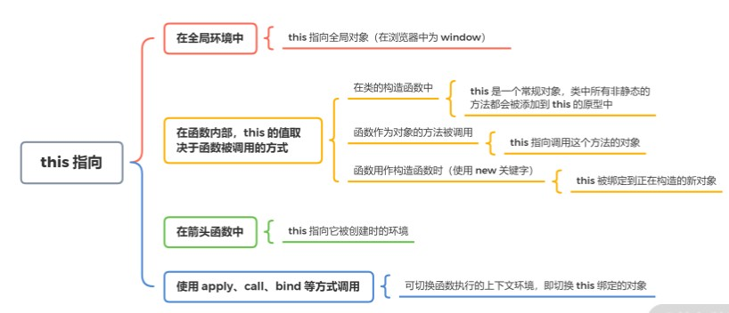

# JavaScript 引擎如何执行 JavaScript 代码？

[TOC]


## 一、JavaScript 代码运行的各个阶段

JavaScript 引擎在执行 JavaScript 代码时，也会从上到下进行词法分析、语法分析、语义分析等处理，并在代码解析完成后生成 AST（抽象语法树），最终根据 AST 生成 CPU 可以执行的机器码并执行。


这个过程，我们统一描述为语法分析阶段。除了语法分析阶段，JavaScript 引擎在执行代码时还会进行其他的处理。以 V8 引擎为例，在 V8 引擎中 JavaScript 代码的运行过程主要分成三个阶段。

1. **语法分析阶段**。 该阶段会对代码进行语法分析，检查是否有语法错误（SyntaxError），如果发现语法错误，会在控制台抛出异常并终止执行。
2. **编译阶段**。 该阶段会进行执行上下文（Execution Context）的创建，包括创建变量对象、建立作用域链、确定 this 的指向等。每进入一个不同的运行环境时，V8 引擎都会创建一个新的执行上下文。
3. **执行阶段**。 将编译阶段中创建的执行上下文压入调用栈，并成为正在运行的执行上下文，代码执行结束后，将其弹出调用栈。


## 二、编译阶段介绍：执行上下文的创建

执行上下文的创建离不开 JavaScript 的运行环境，JavaScript 运行环境包括全局环境、函数环境和eval，其中全局环境和函数环境的创建过程如下：

第一次载入 JavaScript 代码时，首先会创建一个全局环境。全局环境位于最外层，直到应用程序退出后（例如关闭浏览器和网页）才会被销毁。

每个函数都有自己的运行环境，当函数被调用时，则会进入该函数的运行环境。当该环境中的代码被全部执行完毕后，该环境会被销毁。不同的函数运行环境不一样，即使是同一个函数，在被多次调用时也会创建多个不同的函数环境。

在不同的运行环境中，变量和函数可访问的其他数据范围不同，环境的行为（比如创建和销毁）也有所区别。而每进入一个不同的运行环境时，JavaScript 都会创建一个新的执行上下文，该过程包括：

- 建立作用域链（Scope Chain）；

- 创建变量对象（Variable Object，简称 VO）；

- 确定 this 的指向。


### 创建变量对象

什么是变量对象呢？每个执行上下文都会有一个关联的变量对象，该对象上会保存这个上下文中定义的所有变量和函数。

而在浏览器中，全局环境的变量对象是window对象，因此所有的全局变量和函数都是作为window对象的属性和方法创建的。相应的，在 Node 中全局环境的变量对象则是global对象。

创建变量对象将会创建arguments对象（仅函数环境下），同时会检查当前上下文的函数声明和变量声明。

对于变量声明：此时会给变量分配内存，并将其初始化为undefined（该过程只进行定义声明，执行阶段才执行赋值语句）。

对于函数声明：此时会在内存里创建函数对象，并且直接初始化为该函数对象。

上述变量声明和函数声明的处理过程，便是我们常说的变量提升和函数提升，其中**函数声明提升会优先于变量声明提升**。因为变量提升容易带来变量在预期外被覆盖掉的问题，同时还可能导致本应该被销毁的变量没有被销毁等情况。因此 ES6 中引入了let和const关键字，从而使 JavaScript 也拥有了块级作用域。

> 在各类编程语言中，作用域分为静态作用域和动态作用域。JavaScript 采用的是词法作用域（Lexical Scoping），也就是静态作用域。词法作用域中的变量，在**编译过程**中会产生一个确定的作用域（而不是在执行过程中）。

词法作用域中的变量，在编译过程中会产生一个确定的作用域，这个作用域即当前的执行上下文，在 ES5 后我们使用词法环境（Lexical Environment）替代作用域来描述该执行上下文。因此，词法环境可理解为我们常说的作用域，同样也指当前的执行上下文（注意，是当前的执行上下文）。

在 JavaScript 中，词法环境又分为词法环境（Lexical Environment）和变量环境（Variable Environment）两种，其中：

变量环境用来记录`var/function`等变量声明；

词法环境是用来记录`let/const/class`等变量声明。

也就是说，**创建变量过程中会进行函数提升和变量提升，JavaScript 会通过词法环境来记录函数和变量声明。通过使用两个词法环境（而不是一个）分别记录不同的变量声明内容，JavaScript 实现了支持块级作用域的同时，不影响原有的变量声明和函数声明**。

这就是**创建变量的过程，它属于执行上下文创建中的一环**。


### 建立作用域链

作用域就是词法环境，而词法环境由两个成员组成。

- 环境记录（Environment Record）：用于记录自身词法环境中的变量对象。

- 外部词法环境引用（Outer Lexical Environment）：记录外层词法环境的引用。

通过外部词法环境的引用，作用域可以层层拓展，建立起从里到外延伸的一条作用域链。当某个变量无法在自身词法环境记录中找到时，可以根据外部词法环境引用向外层进行寻找，直到最外层的词法环境中外部词法环境引用为null，这便是作用域链的变量查询。


### 确定 this 的指向



- 在全局环境中，this指向全局对象（在浏览器中为window）

- 在函数内部，this的值取决于函数被调用的方式

- 函数作为对象的方法被调用，this指向调用这个方法的对象

- 函数用作构造函数时（使用new关键字），它的this被绑定到正在构造的新对象

- 在类的构造函数中，this是一个常规对象，类中所有非静态的方法都会被添加到this的原型中

- 在箭头函数中，this指向它被创建时的环境

- 使用apply、call、bind等方式调用：根据 API 不同，可切换函数执行的上下文环境，即this绑定的对象


## 三、执行阶段

编译阶段会进行变量对象（VO）的创建，该过程会进行函数声明和变量声明，这时候变量的值被初始化为 undefined。

**在代码进入执行阶段之后**，JavaScript 会对变量进行赋值，此时变量对象会转为活动对象（Active Object，简称 AO），转换后的活动对象才可被访问，这就是 VO -> AO 的过程。

举例：

```js
function foo(a) {

  var b = 2;

  function c() {}

  var d = function() {};

}


foo(1);

```

在执行`foo(1)`时，首先进入定义期，此时：

- 参数变量`a`的值为`1`
- 变量`b`和`d`初始化为`undefined`
- 函数`c`创建函数并初始化

```js
AO = {

  arguments: {

    0: 1,

    length: 1

  },

  a: 1,

  b: undefined,

  c: reference to function c(){},

  d: undefined

}

```

进入执行期之后，会执行赋值语句进行赋值，此时变量`b`和`d`会被赋值为 2 和函数表达式：

```js
AO = {

   arguments: {

    0: 1,

    length: 1

  },

  a: 1,

  b: 2,

  c: reference to function c(){},

  d: reference to FunctionExpression "d"

}

```

这就是 VO -> AO 过程。

- 在定义期（编译阶段）：该对象值仍为`undefined`，且处于不可访问的状态。
- 进入执行期（执行阶段）：VO 被激活，其中变量属性会进行赋值。

实际上在执行的时候，除了 VO 被激活，活动对象还会添加函数执行时传入的参数和`arguments`这个特殊对象，因此 AO 和 VO 的关系可以用以下关系来表达：

```
AO = VO + function parameters + arguments
```

