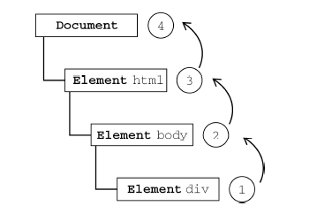
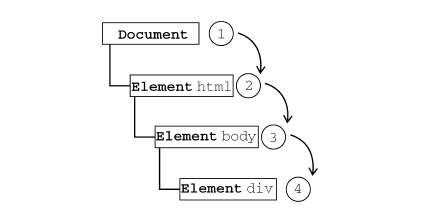
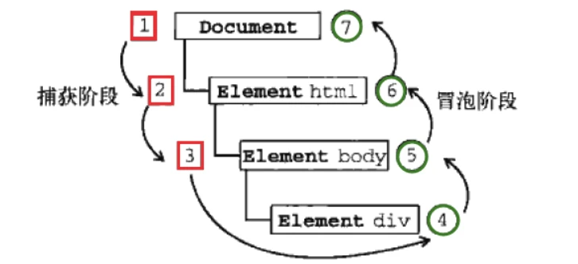
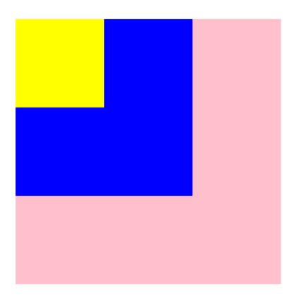

# javascript 事件


[TOC]


## 一、事件监听

javaScript脚本和浏览器之间交互时，浏览器给我们提供的BOM、DOM等一些对象模型。

事实上还有一种需要和浏览器经常交互的事情就是事件监听：
浏览器在某个时刻可能会发生一些事件，比如鼠标点击、移动、滚动、获取、失去焦点、输入内容等等一系列
的事件；

- 我们需要以某种方式（代码）来对其进行响应，进行一些事件的处理；
  在Web当中，事件在浏览器窗口中被触发，并且通过绑定到某些元素上或者浏览器窗口本身，那么我们就可以
  给这些元素或者window窗口来绑定事件的处理程序，来对事件进行监听。
-  如何进行事件监听呢?
  - 事件监听方式一：在script中直接监听；
  - 事件监听方式二：通过元素的on来监听事件；
  - 事件监听方式三：通过EventTarget中的`addEventListener`来监听；


#### 事件监听方式一：在script中直接监听；

在JavaScript代码中（即`script`标签内）绑定事件可以使JavaScript代码与HTML标签分离，文档结构清晰，便于管理和开发。

```js
<!DOCTYPE html>
<html lang="en">
  <head>
    <meta charset="UTF-8" />
    <meta http-equiv="X-UA-Compatible" content="IE=edge" />
    <meta name="viewport" content="width=device-width, initial-scale=1.0" />
    <title>Document</title>
    <style>
      .box {
        height: 200px;
        width: 200px;
        background-color: antiquewhite;
      }
    </style>
  </head>
  <body>
    <!-- <div class="box" onclick="console.log('div元素被点击')"></div> -->

    <div class="box" onclick="divClick()"></div>

    <script>
      function divClick() {
        console.log("div元素被点击2");
      }
    </script>
  </body>
</html>

```


#### 事件监听方式二：通过元素的on来监听事件；

我们可以在DOM元素上绑定onclick、onmouseover、onmouseout、onmousedown、onmouseup、ondblclick、onkeydown、onkeypress、onkeyup等。

如果想知道更多事件类型请查看，[DOM事件](https://link.juejin.cn/?target=http%3A%2F%2Fwww.runoob.com%2Fjsref%2Fdom-obj-event.html)。

```js
<!DOCTYPE html>
<html lang="en">
  <head>
    <meta charset="UTF-8" />
    <meta http-equiv="X-UA-Compatible" content="IE=edge" />
    <meta name="viewport" content="width=device-width, initial-scale=1.0" />
    <title>Document</title>
    <style>
      .box {
        height: 200px;
        width: 200px;
        background-color: antiquewhite;
      }
    </style>
  </head>
  <body>
    <div class="box" onclick="divClick()"></div>

    <script>
      const divEl = document.querySelector(".box");
      divEl.onclick = function () {
        console.log("div元素被点击3");
      };
    </script>
  </body>
</html>

```


#### 事件监听方式三：通过EventTarget中的`addEventListener`来监听；

```

element.addEventListener(event, function, useCapture)

```

event : （必需）事件名，支持所有[DOM事件](https://link.juejin.cn/?target=http%3A%2F%2Fwww.runoob.com%2Fjsref%2Fdom-obj-event.html)。
function：（必需）指定要事件触发时执行的函数。
useCapture：（可选）指定事件是否在捕获或冒泡阶段执行。**true，捕获。false，冒泡。默认false**。


#### addEventListener 事件监听的优点 

1、可以绑定多个事件。常规的事件绑定只执行最后绑定的事件。

2、可以解除相应的绑定


## 二、事件冒泡

* 即事件开始时由 **最具体的元素**(点击处文档中嵌套层次最深的那个节点) 接收到
* 然后逐级向上传播到较为不具体的节点(文档)
* 所有现代浏览器都支持事件冒泡,并且会一直冒泡到`Window`
* **即内部元素的事件会先被触发，然后再触发外部元素**




## 三、事件捕获



它的原理刚好和事件冒泡相反，它的用意在于在事件到达预定目标之前捕获它，而最具体的节点应该是最后才接收到事件的。

事件捕获的思想是不太具体的节点应该更早的接收到事件，而在最具体的节点应该最后接收到事件。事件捕获的用以在于**事件到达预定目标之前**捕获它。


## 四、DOM事件流

事件流包括三个阶段。简而言之：事件一开始从文档的根节点流向目标对象（捕获阶段），然后在目标对象上被触发（目标阶段），之后再回溯到文档的根节点（冒泡阶段）。


'DOM2级事件' 规定事件流包括三个阶段: 事件捕获阶段、处于目标阶段、事件冒泡阶段

* 首先发生事件的捕获,为截获事件提供了机会
* 然后是实际的目标接受了事件
* 最后一个阶段是冒泡阶段,可以在这个阶段对事件做出响应




#### 事件捕获阶段（Capture Phase）

事件的第一个阶段是捕获阶段。事件从文档的根节点出发，随着 DOM 树的结构向事件的目标节点流去。途中经过各个层次的 DOM 节点，并在各节点上触发捕获事件，直到到达事件的目标节点。捕获阶段的主要任务是建立传播路径，在冒泡阶段，事件会通过这个路径回溯到文档跟节点。

#### 目标阶段（Target Phase）

当事件到达目标节点的，事件就进入了目标阶段。事件在目标节点上被触发，然后会逆向回流，直到传播至最外层的文档节点。

#### 冒泡阶段（Bubble Phase）

事件在目标元素上触发后，并不在这个元素上终止。它会随着 DOM 树一层层向上冒泡，直到到达最外层的根节点。也就是说，同一个事件会依次在目标节点的父节点，父节点的父节点...直到最外层的节点上被触发。

冒泡过程非常有用。它将我们从对特定元素的事件监听中释放出来，相反，我们可以监听 DOM 树上更上层的元素，等待事件冒泡的到达。如果没有事件冒泡，在某些情况下，我们需要监听很多不同的元素来确保捕获到想要的事件。


## 五、DOM 中的事件对象

- 当一个事件发生时，就会有和这个事件相关的很多信息：
  - 比如事件的类型是什么，你点击的是哪一个元素，点击的位置是哪里等等相关的信息；
  - 那么这些信息会被封装到一个Event对象中；
  - 该对象给我们提供了想要的一些属性，以及可以通过该对象进行某些操作；
- 常见的属性：
  - type：事件的类型；
  - target：当前事件发生的元素；
  - currentTarget：当前处理事件的元素；
  - offsetX、offsetY：点击元素的位置；
-  常见的方法：
  - preventDefault：取消事件的默认行为；
  - stopPropagation：阻止事件的进一步传递；


## 六、阻止事件传播（捕获或冒泡）（Stopping Propagation）

可以通过调用事件对象的 stopPropagation 方法，在任何阶段（捕获阶段或者冒泡阶段）中断事件的传播。此后，事件不会在后面传播过程中的经过的节点上调用任何的监听函数。

```js
<input type="button" value="Click Me" id="btn">
<script>
    var btn=document.getElementById("btn");
    btn.onclick = function (event) {
        console.log("Clicked"); // 触发
        event.stopPropagation();
    }
    document.body.onclick = function (event) {
        console.log("Body clicked"); // 传播阻断 不触发
    }
</script>

```

起初，在未设置`event.stopPropagation();`时，点击Click Me按钮，会触发事件冒泡，

控制台会输出：

```js
Clicked
Body clicked
```

但是，当阻止冒泡后，控制台只会输出：

```
Clicked
```


## 七、阻止浏览器默认行为：event.preventDefault()

当特定事件发生的时候，浏览器会有一些默认的行为作为反应。最常见的事件不过于 link 被点击。当一个 click 事件在一个`<a>`元素上被触发时，它会向上冒泡直到 DOM 结构的最外层 document，浏览器会解释 href 属性，并且在窗口中加载新地址的内容。

在 web 应用中，开发人员经常希望能够自行管理导航（navigation）信息，而不是通过刷新页面。为了实现这个目的，我们需要阻止浏览器针对点击事件的默认行为，而使用我们自己的处理方式。这时，我们就需要调用 `event.preventDefault()`.

```js
    <a href="https://www.baidu.com" class="tab">click</a>
    <script>
      var btn = document.querySelector(".tab");
      btn.onclick = function (event) {
        console.log("Clicked");
        event.preventDefault();
        console.log("Clicked2");
      };
    </script>
```


## 八、**事件委托：**

  每个函数都是对象，都会占用内存，内存中的对象越多，性能就越差。对事件处理程序过多问题的解决方案就是事件委托。

  事件委托利用事件冒泡，只指定一个事件处理程序即可，就可以管理某一个类型的所有事件。例如：

有三个li,都需要一个click事件，此时不需要给每个li都绑定click事件，主要给他的父级 ul增加一个绑定事件即可。这样点击li，利用冒泡，直接触发ul的click，只要判断是哪个li的id

点击即可。而不需要三个li都绑定click事件。

```js
<ul id="myLinks">
    <li id="myLi1">text1</li>
    <li id="myLi2">text2</li>
    <li id="myLi3">text3</li>
</ul>
```


## 九、return false

包含特有退出执行`return false ` 之后的所有触发事件和动作都不会被执行,有时候`return false` 可以替代`event.stopPropagation`和`event.preventDefult()`来阻止默认行为发生和冒泡

```html
<body>
<br />
<div>
    <a href="http://www.baidu.com">点击</a>
</div>
<script type="text/javascript">
   document.querySelector('a').onclick=function(){
       alert('警告');
       return false;
   }
</script>
</body>
```

结果只是出现了警告的弹窗,并没有跳转到百度页面

如果将 `retuen false` 提前到 `alert('警告')` 的前面,结果就是什么都不显示,原因是 return false 会中止事件与默认行文


#### `return false ` 和 `event.stopPropagation`区别?

* `return false` 不仅阻止了冒泡而且还阻止了事件本身
* `event.stopPropagation()`只阻止了冒泡

注意: 虽然`teturn false` 能够替代前面两个阻止默认行为和冒泡函数,但也有其他作用(比如中止循环);可能导致不可预料的结果,所以推荐还是使用前两者更好,提高代码的高效性 


## 十、例题


```html
<div id="a">
    <div id="b">
        <div id="c"></div>
    </div>
</div>
```

```css
#a{
    width: 300px;
    height: 300px;
    background: pink;
}
#b{
    width: 200px;
    height: 200px;
    background: blue;
}
#c{
    width: 100px;
    height: 100px;
    background: yellow;
}
```

```js
var a = document.getElementById("a"),
    b = document.getElementById("b"),
    c = document.getElementById("c");
c.addEventListener("click", function (event) {
    console.log("c1");
    // 注意第三个参数没有传进 false , 因为默认传进来的是 false
    //，代表冒泡阶段调用，个人认为处于目标阶段也会调用的
});
c.addEventListener("click", function (event) {
    console.log("c2");
}, true);
b.addEventListener("click", function (event) {
    console.log("b");
}, true);
a.addEventListener("click", function (event) {
    console.log("a1");
}, true);
a.addEventListener("click", function (event) {
    console.log("a2")
});
a.addEventListener("click", function (event) {
    console.log("a3");
    event.stopImmediatePropagation();
}, true);
a.addEventListener("click", function (event) {
    console.log("a4");
}, true);
```

整个的html页面就是下面这三个小盒子。



那么现在有三个问题：

- 如果点击c或者b，输出什么?

  （答案是 `a1、a3`）

  `stopImmediatePropagation`包含了`stopPropagation`的功能，即阻止事件传播（捕获或冒泡），但同时也阻止该元素上**后来绑定的事件处理程序**被调用，所以不输出 `a4`。因为事件捕获被拦截了，自然不会触发 `b、c` 上的事件，所以不输出 `b、c1、c2`，冒泡更谈不上了，所以不输出 `a2`。

  

  

- 如果点击a，输出什么?

  （答案是 `a1、a2、a3`）

  不应该是 `a1、a3、a2` 吗？有同学就会说：“`a1、a3`可是在捕获阶段被调用的处理程序的，`a2 `是在冒泡阶段被调用的啊。”这正是要说明的：虽然这三个事件处理程序注册时指定了`true`、`false`，但现在事件流是处于**目标阶段**，不是冒泡阶段、也不是捕获阶段，事件处理程序被调用的顺序是**注册的顺序**。不论你指定的是`true`还是`false`。换句话来说就是现在点击的是`a`这个盒子本身，它处于事件流的目标状态，而既非冒泡，又非捕获。（需要注意的是，此时的`eventPhase`为2，说明事件流处于目标阶段。当点击`a`的时候，先从`document`捕获，然后一步步往下找，找到`a`这个元素的时候，此时的`target`和`currentTarget`是一致的，所以认定到底了，不需要再捕获了，此时就按顺序执行已经预定的事件处理函数，执行完毕后再继续往上冒泡...）

  

  

- 如果注释掉`event.stopImmediatePropagation`，点击c，会输出什么？

  （答案是 `a1、a3、a4、b、c1、c2、a2`）

  如果同一个事件处理程序（指针相同，比如用 `handler` 保存的事件处理程序），用 `addEventListener`或 `attachEvent`绑定多次，如果第三个参数是相同的话，也只会被调用一次。当然，如果第三个参数一个设置为`true`，另一个设置为`false`，那么会被调用两次。
  而在这里，都是给监听函数的回调赋予了一个匿名函数，所以其实每个处理函数都会被调用。需要注意的是，如果你还不明白为什么在`c`上触发的先是`c1`再是`c2`的话，那么你就需要在去看看第二个问题所描述的内容了。