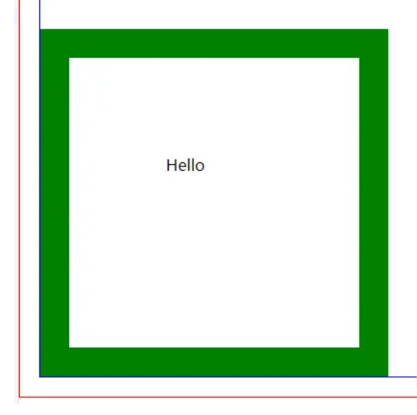

# 【JavaScript】关于坐标和距离的属性

[TOC]


## JS中鼠标事件的各个坐标

### MouseEvent 接口

```js
let event = new MouseEvent('click', {
    // ...
})
```

通过 `addEventListener` 添加的 `click` 事件所产生的事件对象也是 MouseEvent 实例。

```js
let box = document.querySelector('.box')

box.addEventListener('click', (e) => {
  console.log(e) // MouseEvent事件对象
  consoloe.log(e.offsetX); //简单使用
})
```


### 常见属性

| 属性    | 说明                                                         | 兼容性            |
| ------- | ------------------------------------------------------------ | ----------------- |
| offsetX | 以`当前的目标元素`左上角为原点，定位x轴坐标                  | 除Mozilla外都兼容 |
| offsetY | 以当前的目标元素左上角为原点，定位y轴坐标                    | 除Mozilla外都兼容 |
| clientX | 以`浏览器窗口`左上角为原点，定位x轴坐标                      | 都兼容            |
| clientY | 以浏览器窗口左上角为原点，定位y轴坐标                        | 都兼容            |
| pageX   | 以`doument对象`左上角为原点，定位x轴坐标                     | 除IE外都兼容      |
| pageY   | 以doument对象左上角为原点，定位y轴坐标                       | 除IE外都兼容      |
| screenX | 以`计算机显示器屏幕`左上顶角为原点，定位x轴坐标(多屏幕会影响) | 全兼容            |
| screenY | 以计算机显示器屏幕左上顶角为原点，定位y轴坐标                | 全兼容            |


### MouseEvent.offsetX 和 MouseEvent.offsetY


分别返回鼠标位置相对于 **目标节点（即当前元素）** 左上角 **padding 边缘** 的 水平距离和垂直距离。

offset 有偏移的意思，所以这里也可以理解为鼠标位置相对于目标元素内部左上角的偏移值，和目标元素本身以及外部的元素都无关。



图中有一个块级元素，它的内容为hello所在的地方，边框为绿色，30px。

给 hello 元素添加一个 click 事件监听函数：

```js
let hello = document.querySelector('.hello')

hello.addEventListener('click', (e) => {
  console.log(e)
  console.log(e.offsetX)
  console.log(e.offsetY)
})
```

分别点击 hello 元素的绿色边框和空白区域，会发现前者的值为负数，后者的值为整数，且都是相对空白区域的左上角开始计算的。


### MouseEvent.clientX VS MouseEvent.pageX

**clientX** 鼠标相对于浏览器（这里说的是浏览器的有效区域）左上角x轴的坐标； 不随滚动条滚动而改变；

**clientY** 鼠标相对于浏览器（这里说的是浏览器的有效区域）左上角y轴的坐标； 不随滚动条滚动而改变；

**pageX** 鼠标相对于浏览器（这里说的是浏览器的有效区域）左上角x轴的坐标； 随滚动条滚动而改变；

**pageY** 鼠标相对于浏览器（这里说的是浏览器的有效区域）左上角y轴的坐标； 随滚动条滚动而改变；

## Window视图的各个尺寸

### 属性

| 属性        | 说明                                                       |
| ----------- | ---------------------------------------------------------- |
| innerWidth  | 浏览器窗口可视区宽度（不包括浏览器控制台、菜单栏、工具栏） |
| innerHeight | 浏览器窗口可视区高度（不包括浏览器控制台、菜单栏、工具栏） |
| screenX     | 浏览器窗口左上角相对于当前屏幕左上角的水平距离             |
| screenY     | 浏览器窗口左上角相对于当前屏幕左上角的垂直距离             |
| outerHeight | 返回浏览器窗口的高度，包括浏览器菜单和边框（单位像素）     |
| outerWidth  | 返回浏览器窗口的宽度，包括浏览器菜单和边框（单位像素）     |
| scrollX     | 别名：window.pageXOffset，返回页面的水平滚动距离           |
| scrollY     | 别名：window.pageYOffset，返回页面的垂直滚动距离           |


### 方法

#### window.scrollTo() , window.scroll() , window.scrollBy()

window.scrollTo 方法  --> 别名： window.scroll 方法

> 用于将文档滚动到指定位置。
>
> 它接受两个参数，表示滚动后位于窗口左上角的页面坐标。

也可以接受一个配置对象作为参数。

```
window.scrollTo(options)
```

配置对象 options 有三个属性。

- top：滚动后页面左上角的垂直坐标，即 y 坐标。
- left：滚动后页面左上角的水平坐标，即 x 坐标。
- behavior：字符串，表示滚动的方式，有三个可能值（smooth、instant、auto），默认值为 auto。

window.scrollBy 方法用于将网页滚动指定距离（单位像素）。

> 它接受两个参数：水平向右滚动的像素，垂直向下滚动的像素。


## JS中元素（Element）的各个尺寸

对于 Document文档视图也适用

```js
// 举例：
document.documentElement.scrollLeft
document.documentElement.scrollTop
```


| 属性         | 说明                                                         |
| ------------ | ------------------------------------------------------------ |
| offsetLeft   | 获取当前元素到定位父节点的left方向的距离                     |
| offsetTop    | 获取当前元素到定位父节点的top方向的距离                      |
| offsetWidth  | 获取当前元素 width + 左右padding + 左右border-width          |
| offsetHeight | 获取当前元素 height + 上下padding + 上下border-width         |
| clientWidth  | 获取当前元素 width + 左右padding,(不包括 border 和 margin)   |
| clientHeight | 获取当前元素 height + 上下padding                            |
| scrollWidth  | 当前元素内容真实的宽度，内容不超出盒子宽度时为盒子的clientWidth |
| scrollHeight | 当前元素内容真实的高度，内容不超出盒子高度时为盒子的clientHeight |
| scrollLeft   | 返回当前元素的水平滚动距离                                   |
| scrollTop    | 返回当前元素的垂直滚动距离                                   |


### Element.clientHeight，Element.clientWidth

注意：如果有滚动条，返回的数值会减去滚动条占据的宽度或高度。（即不包含滚动条在内）

```js
// 浏览器视口高度
document.documentElement.clientHeight

// 网页总高度
document.body.clientHeight
```


### Element.scrollHeight，Element.scrollWidth

返回当前元素的总高度和总宽度，包括溢出容器、当前并不可见的部分。

包括 padding 区域。

包括伪元素的宽度和高度。

不包含滚动条的宽度和高度。


### Element.scrollLeft，Element.scrollTop

可读写，设置该属性的值，会导致浏览器将当前元素自动滚动到相应的位置。

对于那些没有滚动条的网页元素，这两个属性总是等于 0。

如果要查看整张网页的水平的和垂直的滚动距离，要从 document.documentElement 元素上读取。

```js
document.documentElement.scrollLeft
document.documentElement.scrollTop
```


### Element.offsetHeight，Element.offsetWidth

分别返回元素的高度和宽度，包括元素本身的高和宽、padding 和 border ，以及滚动条的高和宽。

如果元素的 display 为 none，则返回 0。


### 总结：

offset --> 不包括外边距，包括元素宽度、内边距和边框

client --> 不包括边框和外边距，包括元素宽度、内边距

scroll --> 包括元素宽度、内边距和`溢出尺寸`，不包括边框和外边距

