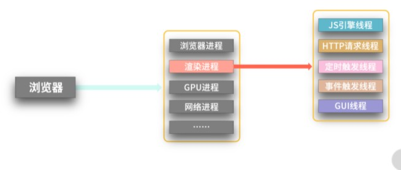
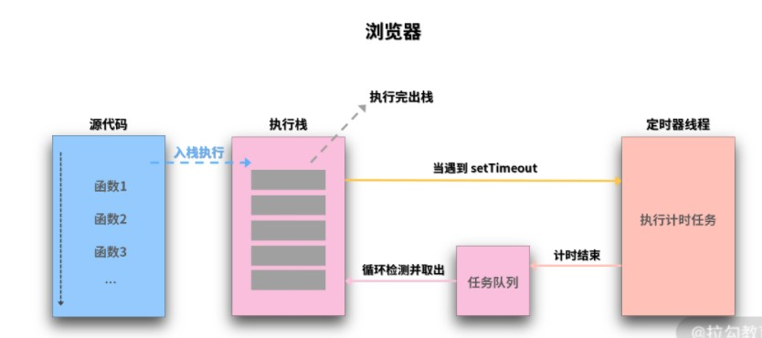
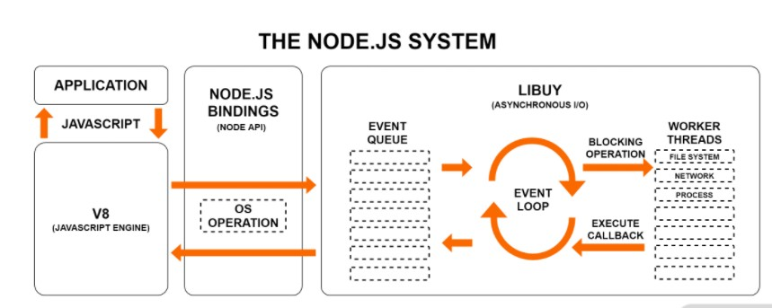
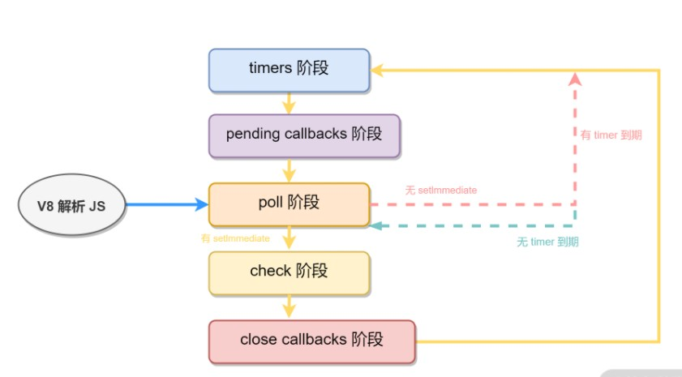

# 【JavaScript】再学JS事件循环

[TOC]


## 一、浏览器中的事件循环




### 执行栈与任务队列

JS 在解析一段代码时，会将同步代码按顺序排在某个地方，即执行栈，然后依次执行里面的函数。当遇到异步任务时就交给其他线程处理，待当前执行栈所有同步代码执行完成后，会从一个队列中去取出已完成的异步任务的回调加入执行栈继续执行，遇到异步任务时又交给其他线程，.....，如此循环往复。而其他异步任务完成后，将回调放入任务队列中待执行栈来取出执行。

JS 按顺序执行执行栈中的方法，每次执行一个方法时，会为这个方法生成独有的执行环境（上下文 context)，待这个方法执行完成后，销毁当前的执行环境，并从栈中弹出此方法（即消费完成），然后继续下一个方法。




- 主线程运行时会产生执行栈，

栈中的代码调用某些api时，它们会在事件队列中添加各种事件（当满足触发条件后，如ajax请求完毕）

- 而栈中的代码执行完毕，就会读取事件队列中的事件，去执行那些回调
- 如此循环
- **注意，总是要等待栈中的代码执行完毕后才会去读取事件队列中的事件**


### 宏任务和微任务

事件循环的过程中，执行栈在同步代码执行完成后，优先检查微任务队列是否有任务需要执行，如果没有，再去宏任务队列检查是否有任务执行，如此往复。微任务一般在当前循环就会优先执行，而宏任务会等到下一次循环，因此，**微任务一般比宏任务先执行，并且微任务队列只有一个，宏任务队列可能有多个**。


#### 宏任务

可以理解是每次执行栈执行的代码就是一个宏任务（包括每次从事件队列中获取一个事件回调并放到执行栈中执行）。

包括 script 全部代码、setTimeout、setInterval、setImmediate（Node.js）、requestAnimationFrame（浏览器）、I/O 操作、UI 渲染（浏览器），这些代码执行便是宏任务。

- 每一个task会从头到尾将这个任务执行完毕，不会执行其它
- 浏览器为了能够使得JS内部task与DOM任务能够有序的执行，会在一个task执行结束后，在下一个 task 执行开始前，对页面进行重新渲染

```
（`task->渲染->task->...`）
```


#### 微任务

- 在当前task任务后，下一个task之前，在渲染之前
- 所以它的响应速度相比setTimeout（setTimeout是task）会更快，因为无需等渲染
- 也就是说，在某一个宏任务执行完后，就会将在它执行期间产生的所有微任务都执行完毕（在渲染前）


常见宏任务：

**事件队列中的每一个事件都是一个macrotask**

- setTimeout()

- setInterval()

- setImmediate()
- 常见的点击和键盘等事件
- 主代码块

常见微任务：

- promise.then()、promise.catch()

- new MutaionObserver()

- process.nextTick()


微任务是在当前事件循环的尾部去执行；宏任务是在下一次事件循环的开始去执行。


#### 执行过程：

在浏览器的异步回调队列中，宏任务和微任务的执行过程如下：

1. **宏任务队列一次只从队列中取一个任务执行**，执行完后就去执行微任务队列中的任务。
2. 微任务队列中所有的任务都会被依次取出来执行，直到微任务队列为空。

3. 在执行完所有的微任务之后，执行下一个宏任务之前，浏览器会执行 UI 渲染操作、更新界面。


## 二、NodeJS 中的异步方法

NodeJS 中还有一些其他常见异步形式。

- 文件 I/O：异步加载本地文件。

- setImmediate()：与 setTimeout 设置 0ms 类似，在某些同步任务完成后立马执行。

- process.nextTick()：在某些同步任务完成后立马执行。

- server.close、socket.on('close',...）等：关闭回调。


### 事件循环模型

NodeJS 的跨平台能力和事件循环机制都是基于 Libuv 库实现的，不用关心这个库的具体内容。我们只需要知道 Libuv 库是事件驱动的，并且封装和统一了不同平台的 API 实现。

NodeJS  中 V8 引擎将 JS 代码解析后调用 Node API，然后 Node API 将任务交给 Libuv 去分配，最后再将执行结果返回给 V8 引擎。在 Libux 中实现了一套事件循环流程来管理这些任务的执行，所以 **NodeJS 的事件循环主要是在 Libuv 中完成的**。




### 事件循环各阶段

在 NodeJS  中 JS 的执行，主要需要关心的过程分为以下几个阶段，下面每个阶段都有自己单独的任务队列，当执行到对应阶段时，就判断当前阶段的任务队列是否有需要处理的任务。

- **timers 阶段**：执行所有 setTimeout() 和 setInterval() 的回调。
- **pending callbacks 阶段**：某些系统操作的回调，如 TCP 链接错误。除了 timers、close、setImmediate 的其他大部分回调在此阶段执行。
- **poll 阶段**：轮询等待新的链接和请求等事件，执行 I/O 回调等。V8 引擎将 JS 代码解析并传入 Libuv 引擎后首先进入此阶段。如果此阶段任务队列已经执行完了，则进入 check 阶段执行 setImmediate 回调（如果有 setImmediate），或等待新的任务进来（如果没有 setImmediate）。在等待新的任务时，如果有 timers 计时到期，则会直接进入 timers 阶段。此阶段可能会阻塞等待。
- **check 阶段**：setImmediate 回调函数执行。
- **close callbacks 阶段**：关闭回调执行，如 socket.on('close', ...)。



上面每个阶段都会去执行完当前阶段的任务队列，然后继续执行当前阶段的微任务队列，只有当前阶段所有微任务都执行完了，才会进入下个阶段。


### process.nextTick() 

process.nextTick()比 promise.then() 的执行还早，在同步任务之后，其他所有异步任务之前，会优先执行 nextTick。可以想象是把 nextTick 的任务放到了当前循环的后面，与 promise.then() 类似，但比 promise.then() 更前面。

意思就是在当前同步代码执行完成后，不管其他异步任务，先尽快执行 nextTick。