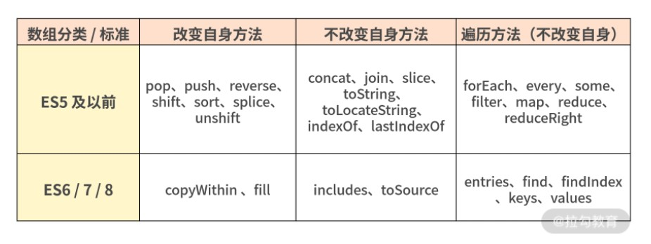

# 【JavaScript】再学数组相关方法

[TOC]


## 一、声明数组


### Array 构造器

```js
let a = Array(6);//[ <6 empty items> ]

let c = new Array(5);

console.log(c);//[ <5 empty items> ]
```

Array 构造器根据参数长度的不同，有如下两种不同的处理方式：

- **new Array(arg1, arg2,…)**，参数长度为 0 或长度大于等于 2 时，传入的参数将按照顺序依次成为新数组的第 0 至第 N 项（参数长度为 0 时，返回空数组）；
- **new Array(len)**，当 len 不是数值时，处理同上，返回一个只包含 len 元素一项的数组；当 len 为数值时，len 最大不能超过 32 位无符号整型，即需要小于 2 的 32 次方（len 最大为 Math.pow(2,32)），否则将抛出 RangeError。


注：

**数组是引用类型**，可以使用 const 声明，并修改它的值

```js
const a = [1,2,3];

a[0] = 10;

console.log(a);//[ 10, 2, 3 ]
```


### 对象字面量

```js
let b = [1,2,3];//对象字面量方式创建
```


### ES6 新增的构造方法：Array.of 和 Array.from

#### Array.of

Array.of 用于将参数依次转化为数组中的一项，然后返回这个新数组，而不管这个参数是数字还是其他。它基本上与 Array 构造器功能一致，唯一的区别就在单个数字参数的处理上。

Array.of 当传入的元素只有一项时，它会将这一项当成数组元素，而不是数组的 长度。

```js
Array.of(8.0); // [8]

Array(8.0); // [empty × 8]

Array.of(8.0, 5); // [8, 5]

Array(8.0, 5); // [8, 5]

Array.of('8'); // ["8"]

Array('8'); // ["8"]
```


#### Array.from

Array.from 的设计初衷是快速便捷地**基于其他对象创建新数组**，准确来说就是从一个类似数组的可迭代对象中创建一个新的数组实例。其实就是，只要一个对象有迭代器，Array.from 就能把它变成一个数组（注意：是返回新的数组，不改变原对象）。


**使用`Array.from`可将类数组转换为数组，类数组指包含 `length` 属性或可迭代的对象。**


从语法上看，Array.from 拥有 3 个参数：

1. 类似数组的对象，必选；
2. 加工函数，新生成的数组会经过该函数的加工再返回；
3. this 作用域，表示加工函数执行时 this 的值。

这三个参数里面第一个参数是必选的，后两个参数都是可选的。

```html
<body>
    <button message="123">button</button>
    <button message="456">button</button>
</body>

<script>
    let btns = document.querySelectorAll('button');
    console.log(btns); //包含length属性
    Array.from(btns, (item) => {
        item.style.background = 'red';
    });
</script>
```


```js
// String

Array.from('abc');         // ["a", "b", "c"]

// Set

Array.from(new Set(['abc', 'def'])); // ["abc", "def"]

// Map

Array.from(new Map([[1, 'ab'], [2, 'de']])); // [[1, 'ab'], [2, 'de']]

```

```js
var obj = {0: 'a', 1: 'b', 2:'c', length: 3};

Array.from(obj, function(value, index){

  console.log(value, index);

  console.log(arguments.length);

  console.log(arguments[0],arguments[1]);

  console.log("----------------------");

});

/*
a 0
2
a 0
----------------------
b 1
2
b 1
----------------------
c 2
2
c 2
*/
```


## 二、Array的判断

判断一个变量是否为数组:

```js
var a = [];

// 1.基于instanceof

a instanceof Array;

// 2.基于constructor

a.constructor === Array;

// 3.基于Object.prototype.isPrototypeOf

Array.prototype.isPrototypeOf(a);

// 4.基于getPrototypeOf

Object.getPrototypeOf(a) === Array.prototype;

// 5.基于Object.prototype.toString

Object.prototype.toString.apply(a) === '[object Array]';


```


### Array.isArray 方法

ES6 之后新增了一个 Array.isArray 方法，能直接判断数据类型是否为数组。

```js
console.log(Array.isArray([1, 2, 3])); //true
console.log(Array.isArray(9)); //false
```


## 三、数组与其他类型的转换

可以将数组转换为字符串也可以将其他类型转换为数组。

### 数组 --> 字符串

大部分数据类型都可以使用`.toString()` 函数转换为字符串。

```js
console.log(([1, 2, 3]).toString()); // 1,2,3
```

也可以使用函数 `String` 转换为字符串。

```js
console.log(String([1, 2, 3]));
```

或使用`join`连接为字符串

```js
console.log([1, 2, 3].join("-"));//1-2-3
```


### 字符串 --> 数组

```js
//展开语法
let str = "abc";
console.log([...str]);//[ 'a', 'b', 'c' ]
```


### 类数组 --> 数组

#### Array.from

使用`Array.from`可将类数组转换为数组，类数组指包含 `length` 属性或可迭代的对象。

```js
let str = "abc";
console.log(Array.from(str));//[ 'a', 'b', 'c' ]
```


为对象设置`length`属性后可以转换为数组，但要**下标为数值或数值字符串**。

注意：下标要从0开始，length是转换后的数组的长度

```js
let obj = {
  "1": "aaa",
  "2": "bbb",
  "3": "ccc",
  length:3
}
console.log(Array.from(obj));//[ undefined, 'aaa', 'bbb' ]
```


DOM元素转换为数组后来使用数组函数，第二个参数类似于`map` 函数的方法，可对数组元素执行函数处理。

```html
<body>
    <button message="123">button</button>
    <button message="456">button</button>
</body>

<script>
    let btns = document.querySelectorAll('button');
    console.log(btns); //包含length属性
    Array.from(btns, (item) => {
        item.style.background = 'red';
    });
</script>
```


## 四、数组元素的处理

利用 length : 向数组追加元素

```js
let arr = [1,2,3];
arr[arr.length] = '4';
console.log(arr);//[ 1, 2, 3, '4' ]
```


利用 展开语法：批量添加元素

```js
let arr = [1,2,3];
let a = ["aaa","bbb"];
arr.push(...a);
console.log(arr);//[ 1, 2, 3, 'aaa', 'bbb' ]
```


### push

向数组末尾追加元素，直接改变原数组，返回值为数组元素的数量

```js
let arr = ["aaa","bbb","ccc"];
console.log(arr.push("nba","cba"));//5
console.log(arr);//[ 'aaa', 'bbb', 'ccc', 'nba', 'cba' ]
```


### pop

从数组末尾弹出元素，直接改变原数组，返回值为弹出的元素

```js
let arr = ["aaa","bbb","ccc"];
console.log(arr.pop());//ccc
console.log(arr);//[ 'aaa', 'bbb' ]
```


### shift

从数组前面取出一个元素,改变原数组，返回值为取出的那个元素

```js
let arr = ["aaa","bbb","ccc"];
console.log(arr.shift());//aaa
console.log(arr);// ['bbb', 'ccc']
```


### unshift

从数组前面添加元素，返回值为数组的长度

```js
let arr = ["aaa","bbb","ccc"];
console.log(arr.unshift("nab"));//4
console.log(arr);//[ 'nab', 'aaa', 'bbb', 'ccc' ]
```


### fill

使用`fill` 填充数组元素

`fill`的第二个和第三参数用来指定填充的位置，**参数均表示数组的下标**，改变的位置是左闭右开，如果第三个元素不填，表示填充到末尾

```js
console.log(Array(5).fill("aaa"));//[ 'aaa', 'aaa', 'aaa', 'aaa', 'aaa' ]

console.log([1,2,3,4,5].fill("aaa",1,3));//[ 1, 'aaa', 'aaa', 4, 5 ]

console.log([1,2,3,4,5,6].fill("aaa",2));//[ 1, 2, 'aaa', 'aaa', 'aaa', 'aaa' ]
```


### slice

使用 `slice` 方法从数组中截取部分元素组合成新数组（**并不会改变原数组**），不传第二个参数时截取到数组的最后元素。

```js
let arr = [0, 1, 2, 3, 4, 5, 6];
console.log(arr.slice(1, 3)); // [1,2]

console.log(arr);//[0, 1, 2, 3, 4, 5, 6]
```

不设置参数是为获取所有元素:

```js
let arr = [0, 1, 2, 3, 4, 5, 6];
console.log(arr.slice()); //[0, 1, 2, 3, 4, 5, 6]
```


### splice

使用 `splice` 方法可以添加、删除、替换数组中的元素，**会对原数组进行改变**，返回值为删除的元素。

删除数组元素第一个参数为从哪开始删除，**第二个参数为删除的数量**。

```js
let arr = [0, 1, 2, 3, 4, 5, 6];
console.log(arr.splice(1, 3)); //返回删除的元素 [1, 2, 3] 
console.log(arr); //删除数据后的原数组 [0, 4, 5, 6]
```

通过修改`length`删除最后一个元素：

```js
let arr = ["aaa", "bbb"];
arr.length = arr.length - 1;
console.log(arr);//[ 'aaa' ]
```

通过指定第三个参数来设置在删除位置添加的元素:

```js
let arr = [0, 1, 2, 3, 4, 5, 6];
console.log(arr.splice(1, 3, 'aaa', 'bbb')); //[1, 2, 3]
console.log(arr); //[ 0, 'aaa', 'bbb', 4, 5, 6 ]
```

向末尾添加元素:

```js
let arr = [0, 1, 2, 3, 4, 5, 6];
console.log(arr.splice(arr.length, 0, 'aaa', 'bbb')); //[]
console.log(arr); // [0, 1, 2, 3, 4, 5, 6, "aaa", "bbb"]
```

向数组前添加元素:

```js
let arr = [0, 1, 2, 3];
console.log(arr.splice(0, 0, 'aaa', 'bbb')); //[]
console.log(arr); // [ 'aaa', 'bbb', 0, 1, 2, 3 ]
```

向数组中间位置添加元素：

注意：**是向起始位置的下标前面添加元素**

```js
let arr = [0, 1, 2, 3];
console.log(arr.splice(2, 0, 'aaa', 'bbb')); //[]
console.log(arr); // [ 0, 1, 'aaa', 'bbb', 2, 3 ]
```


### 总结

| 方法      | 描述                                                         | 备注           |
| :-------- | :----------------------------------------------------------- | :------------- |
| push()    | 向数组的**最后面**插入一个或多个元素，返回结果为新数组的**长度** | 会改变原数组   |
| pop()     | 删除数组中的**最后一个**元素，返回结果为**被删除的元素**     | 会改变原数组   |
| unshift() | 在数组**最前面**插入一个或多个元素，返回结果为新数组的**长度** | 会改变原数组   |
| shift()   | 删除数组中的**第一个**元素，返回结果为**被删除的元素**       | 会改变原数组   |
| slice()   | 从数组中**提取**指定的一个或多个元素，返回结果为**新的数组** | 不会改变原数组 |
| splice()  | 从数组中**删除**指定的一个或多个元素，返回结果为**被删除元素组成的新数组** | 会改变原数组   |
| fill()    | 填充数组：用固定的值填充数组，返回结果为**新的数组**         | 会改变原数组   |


## 五、数组的合并拆分

### join

使用`join`连接成字符串

如果不指定连接符，则默认使用 `,` 作为连接符

**不会改变原数组**

```js
let arr = [0, 1, 2, 3];
console.log(arr.join('-')); //0-1-2-3
console.log(arr.join());//0,1,2,3

```


### split

`split` 方法用于将字符串分割成数组，类似`join`方法的反函数。

**不会改变原数组**

```js
let arr = "2022,07,05";
console.log(arr.split(',')); //[ '2022', '07', '05' ]

```


### concat

`concat`方法用于连接两个或多个数组，元素是值类型的是复制操作，如果是引用类型还是指向同一对象

返回结果为**新的数组**。不会改变原数组。

```js
let arr = ["aaa","bbb","ccc"];
let a = [1,2];
let b = [4,5,6];
console.log(arr.concat(a,b)); //['aaa', 'bbb', 'ccc', 1, 2, 4, 5, 6]
console.log(arr);//[ 'aaa', 'bbb', 'ccc' ]
```


### copyWithin

使用 `copyWithin` 从数组中复制一部分到同数组中的另外位置。

```
array.copyWithin(target, start, end)
```

参数说明

| 参数     | 描述                                                         |
| :------- | :----------------------------------------------------------- |
| *target* | 必需。复制到指定目标索引位置。                               |
| *start*  | 可选。元素复制的起始位置。                                   |
| *end*    | 可选。停止复制的索引位置 (默认为 *array*.length)。如果为负值，表示倒数。 |

```js
const arr = [1, 2, 3, 4];
console.log(arr.copyWithin(2, 0, 2)); //[1, 2, 1, 2]
//说明：复制的起始位置是 下标为2的地方，要复制的元素是从下标为0到下标为2(左闭右开)
```


### 总结

| 方法       | 描述                                                 | 备注             |
| :--------- | :--------------------------------------------------- | :--------------- |
| concat()   | 合并数组：连接两个或多个数组，返回结果为**新的数组** | 不会改变原数组   |
| join()     | 将数组转换为字符串，返回结果为**转换后的字符串**     | 不会改变原数组   |
| split()    | 将字符串按照指定的分隔符，组装为数组                 | 不会改变原字符串 |
| copyWith() | 从数组中复制一部分到同数组中的另外位置               | 会改变原数组     |


## 六、查找元素

### indexOf

#### Array类型使用 IndexOf()

使用 `indexOf` 从前向后查找元素出现的位置，如果找不到返回 `-1`。

```js
let arr = [7, 3, 2, 8, 2, 6];
console.log(arr.indexOf(2)); // 2 从前面查找2出现的位置
```


`indexOf` 类似于`===`是严格类型约束

如下面代码一下，使用 `indexOf` 查找字符串将找不到。

```js
let arr = [7, 3, 2, '8', 2, 6];
console.log(arr.indexOf(8)); // -1
```


第二个参数用于指定查找开始位置，**此时参数代表的是下标**。

规定字符串中开始检索的位置。它的合法取值是 0 到 length-1。如省略该参数，则将从字符串的首字符开始检索。

```js
let arr = [7, 3, 2, 8, 2, 6];
//从下标为3的位置开始查找
console.log(arr.indexOf(2, 3)); //4
```


#### String类型使用IndexOf()

```js
let str = "12345";
console.log(str.indexOf('a'));//-1
console.log(str.indexOf(1));//0
console.log(str.indexOf('1'));//0
```

String类型在转换时，会对查找的元素进行隐式转换，如果参数是数字，会先将它转换成字符。


###  lastIndexOf

使用 `lastIndexOf` 从后向前查找元素出现的位置，如果找不到返回 `-1`。

```js
let arr = [7, 3, 2, 8, 2, 6];
console.log(arr.lastIndexOf(2)); // 4 从后查找2出现的位置
```

第二个参数用于指定查找开始位置

当第二个参数为正数时，此时参数代表从下标

```js
let arr = [7, 3, 2, 8, 2, 6];
//从下标为2的地方向前查找
console.log(arr.lastIndexOf(2, 4));//4
console.log(arr.lastIndexOf(2,2));//2
```

当第二个参数为负数时，此时参数代表从后往前倒着数，第几个元素。

```js
let arr = [7, 3, 2, 8, 2, 6];

//从最后一个字符向前查找
console.log(arr.lastIndexOf(2, -2));//4
console.log(arr.lastIndexOf(2,-4));//2
```


### includes

使用 `includes` 查找字符串返回值是布尔类型更方便判断

```js
let arr = [7, 3, 2, 6];
console.log(arr.includes(6)); //true
```

当查找的数据是引用类型时，必须要值相同，即严格相同，

使用`includes`等不能查找引用类型，因为它们的内存地址是不相等的

```js
let lessons = [{name:"js"},{name:"css"},{name:"es6"}];

console.log(lessons.includes({name:"js"}));//false
```


### find

find 方法找到后会把值返回出来

- 如果找不到返回值为`undefined`

返回第一次找到的值，不继续查找

```js
let arr = ["aaa","bbb","ccc"];

let find = arr.find(function(item){
  return item === "aaa";
});

console.log(find);//aaa
```

`find` 可以方便的查找引用类型

```js
let lessons = [{name:"js"},{name:"css"},{name:"es6"}];

console.log(lessons.includes({name:"js"}));//false

let find = lessons.find(function(item){
  return item.name === "js";
});
console.log(find);//{ name: 'js' }
```


### findIndex

`findIndex` 与 `find` 的区别是返回索引值，参数也是 : 当前值，索引，操作数组。

查找不到时返回 `-1`

```js
let arr = [7, 3, 2, '8', 2, 6];

console.log(arr.findIndex(function (v) {
	return v == 8;
})); //3
```


## 七、扩展方法

### every

确保数组中的每个元素都满足「指定条件返回 true」，则停止遍历，此方法才返回 true

`every` 用于递归的检测元素，要所有元素操作都要返回真结果才为真。

```js
const user = [
  { name: "李四", js: 89 },
  { name: "马六", js: 55 },
  { name: "张三", js: 78 }
];
const result = user.every(user => user.js >= 60);
console.log(result);//false
```


### some

数组中只要有一个元素满足「指定条件返回 true」，则停止遍历，此方法就返回 true

使用 `some` 函数可以递归的检测元素，如果有一个返回true，表达式结果就是真。第一个参数为元素，第二个参数为索引，第三个参数为原数组。


### filter

使用 `filter` 可以过滤数据中元素，返回结果是 true 的项

返回结果为**新的数组**，不会改变原数组

```js
let lessons = [
  {title: '媒体查询响应式布局',category: 'css'},
  {title: 'FLEX 弹性盒模型',category: 'css'},
  {title: 'MYSQL多表查询随意操作',category: 'mysql'}
];

let cssLessons = lessons.filter(function (item, index, array) {
  if (item.category.toLowerCase() == 'css') {
    return true;
  }
});

console.log(cssLessons);
/*
[
  { title: '媒体查询响应式布局', category: 'css' },
  { title: 'FLEX 弹性盒模型', category: 'css' }
]
*/
```


### map

使用 `map` 映射可以在数组的所有元素上应用函数，用于映射出新的值。

获取数组所有标题组合的新数组

```
arr.map(function (item, index, arr) {
    return newItem;
});
```


```js
let lessons = [
  {title: '媒体查询响应式布局',category: 'css'},
  {title: 'FLEX 弹性盒模型',category: 'css'},
  {title: 'MYSQL多表查询随意操作',category: 'mysql'}
];

console.log(lessons.map(item => item.title));
//[ '媒体查询响应式布局', 'FLEX 弹性盒模型', 'MYSQL多表查询随意操作' ]
```

```js
var arr1 = [1, 3, 6, 2, 5, 6];

var arr2 = arr1.map(function (item, index) {
    return item + 10; //让arr1中的每个元素加10
});
console.log(arr2);//(6) [11, 13, 16, 12, 15, 16]
```


### reduce

reduce 的两个参数：

首先是 callback（一个在数组的每一项中调用的函数，接受四个参数）：

- previousValue（上一次调用回调函数时的返回值，或者初始值）
- currentValue（当前正在处理的数组元素）
- currentIndex（当前正在处理的数组元素下标）
- array（调用 reduce() 方法的数组）

然后是 initialValue（可选的初始值，作为第一次调用回调函数时传给 previousValue 的值）。


```js
/* 题目：数组 arr = [1,2,3,4] 求数组的和：*/

// 第一种方法：

var arr = [1,2,3,4];

var sum = 0;

arr.forEach(function(e){sum += e;}); // sum = 10

// 第二种方法

var arr = [1,2,3,4];

var sum = 0;

arr.map(function(obj){sum += obj});

```

redece 求和

```js
const arr = [2, 0, 1, 9, 6];
// 数组求和
const total = arr.reduce((prev, item) => {
    return prev + item;
});

console.log('total:' + total); // 打印结果：18

```

求元素最大值

```js
const arr = [2, 0, 1, 9, 6];
// 数组求最大值
const maxValue = arr.reduce((prev, item) => {
    return prev > item ? prev : item;
});

console.log(maxValue); // 打印结果：9

```


## 八、总结



