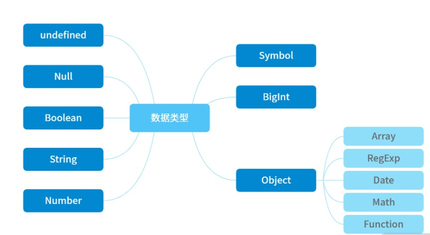
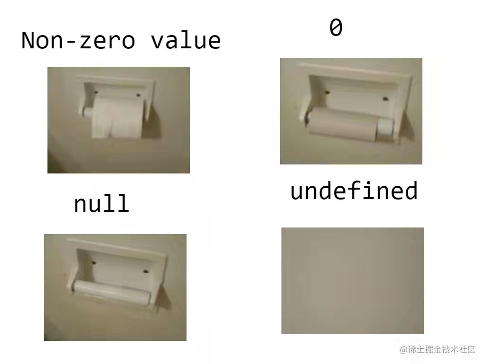

# 【JavaScript】再学数据类型及判断

[TOC]


## 数据类型




## 数据类型检测

### 第一种判断方法：typeof

```js
typeof 1 // 'number'

typeof '1' // 'string'

typeof undefined // 'undefined'

typeof true // 'boolean'

typeof Symbol() // 'symbol'

typeof null // 'object'

typeof [] // 'object'

typeof {} // 'object'

typeof console // 'object'

typeof console.log // 'function'

```

**引用数据类型 Object，用 typeof 来判断的话，除了 function 会判断为 OK 以外，其余都是 'object'，是无法判断出来的。**

这里返回的数据类型均为小写，可以与`Object.prototype.toString`进行对比，它返回的数据类型的首字母为大写。


### 第二种判断方法：instanceof

`instanceof`可以正确判断对象的类型，**其内部运行机制是判断在其原型链中能否找到该类型的原型**。

`instanceof` 主要的实现原理就是只要右边变量的 `prototype` 在左边变量的原型链上即可。

`instanceof` 在查找的过程中会遍历左边变量的原型链，直到找到右边变量的 `prototype`，如果查找失败，则会返回 false。

```js
console.log(2 instanceof Number);                    // false
console.log(true instanceof Boolean);                // false 
console.log('str' instanceof String);                // false 
 
console.log([] instanceof Array);                    // true
console.log(function(){} instanceof Function);       // true
console.log({} instanceof Object);                   // true
```

```js
let str = new String('hhh');
console.log(str instanceof String);//true

let ss = 'hhhh';
console.log(ss instanceof String);//false
```


`instanceof`**只能正确判断引用数据类型**，而不能判断基本数据类型。


自己实现一个`instanceof`操作符，点击这里👉[【JavaScript】实现 instanceof 操作符](https://blog.csdn.net/weixin_52834435/article/details/123840182?spm=1001.2014.3001.5501)


### 第三种判断方法：constructor

```js
console.log((2).constructor === Number); // true
console.log((true).constructor === Boolean); // true
console.log(('str').constructor === String); // true
console.log(([]).constructor === Array); // true
console.log((function() {}).constructor === Function); // true
console.log(({}).constructor === Object); // true
```

```js
function Person() {

}
var person = new Person();
console.log(person.constructor);//[Function: Person]
```

`constructor`有两个作用，一是判断基本数据的类型，二是对象实例通过 `constructor` 对象访问它的构造函数。


### 第四种判断方法：Object.prototype.toString

toString() 是 Object 的原型方法，调用该方法，可以统一返回格式为 “[object Xxx]” 的字符串，其中 Xxx 就是对象的类型。对于 Object 对象，直接调用 toString() 就能返回 [object Object]；而对于其他对象，则需要通过 call 来调用，才能返回正确的类型信息。

```js
var a = Object.prototype.toString;
 
console.log(a.call(2));//[object Number]
console.log(a.call(true));//[object Boolean]
console.log(a.call('str'));//[object String]
console.log(a.call([]));//[object Array]
console.log(a.call(function(){}));//[object Function]
console.log(a.call({}));//[object Object]
console.log(a.call(undefined));//[object Undefined]
console.log(a.call(null));//[object Null]
```

使用这个方法最后返回统一字符串格式为 "[object Xxx]" ，而这里字符串里面的 "Xxx" ，**第一个首字母要大写**（注意：使用 typeof 返回的是小写）


> 同样是检测对象obj调用toString方法，obj.toString()的结果和Object.prototype.toString.call(obj)的结果不一样，这是为什么？
>
> 这是因为toString是Object的原型方法，而Array、function等**类型作为Object的实例，都重写了toString方法**。不同的对象类型调用toString方法时，根据原型链的知识，调用的是对应的重写之后的toString方法（function类型返回内容为函数体的字符串，Array类型返回元素组成的字符串…），而不会去调用Object上原型toString方法（返回对象的具体类型），所以**采用obj.toString()不能得到其对象类型，只能将obj转换为字符串类型**；因此，在想要得到对象的具体类型时，应该调用Object原型上的toString方法。

**举例：**

```js
var str = function(){

};

console.log(str.toString());//function(){}
console.log(Object.prototype.toString.call(str));//[object Function]
```


## 相关问题引出

### ① undefined 与 null 的区别？

* undefined代表定义未赋值

* nulll定义并赋值了, 只是值为null


首先 Undefined 和 Null 都是基本数据类型，这两个基本数据类型分别都只有一个值，就是 undefined 和 null。


undefined 代表的含义是**未定义**，null 代表的含义是**空对象**。一般变量声明了但还没有定义的时候会返回 undefined，null主要用于赋值给一些可能会返回对象的变量，作为初始化。


undefined 在 JavaScript 中不是一个保留字，这意味着可以使用 undefined 来作为一个变量名，但是这样的做法是非常危险的，它会影响对 undefined 值的判断。我们可以通过一些方法获得安全的 undefined 值，比如说 void 0。


**当对这两种类型使用 typeof 进行判断时，null 类型化会返回 “object”，这是一个历史遗留的问题。当使用双等号对两种类型的值进行比较时会返回 true，使用三个等号时会返回 false**。




### ② 什么时候给变量赋值为 null ？

* 初始赋值, 表明将要赋值为对象,`可以用做约定俗成的占位符`

* 结束前, 让对象成为垃圾对象(被垃圾回收器回收)

```js
  //起始,可以用做约定俗成的占位符
  var b = null  // 初始赋值为null, 表明将要赋值为对象
  //确定对象就赋值
  b = ['atguigu', 12]
  //最后在不使用的时候,将其引用置空,就可以释放b这个对象占用的内存      ---当没有引用指向它的对象称为垃圾对象
  b = null // 让b指向的对象成为垃圾对象(被垃圾回收器回收)
```


### ③ typeof null 的结果是什么，为什么？

typeof null 的结果是Object。


在 JavaScript 第一个版本中，所有值都存储在 32 位的单元中，每个单元包含一个小的 **类型标签(1-3 bits)** 以及当前要存储值的真实数据。类型标签存储在每个单元的低位中，共有五种数据类型：

```
000: object   - 当前存储的数据指向一个对象。
  1: int      - 当前存储的数据是一个 31 位的有符号整数。
010: double   - 当前存储的数据指向一个双精度的浮点数。
100: string   - 当前存储的数据指向一个字符串。
110: boolean  - 当前存储的数据是布尔值。
```

如果最低位是 1，则类型标签标志位的长度只有一位；如果最低位是 0，则类型标签标志位的长度占三位，为存储其他四种数据类型提供了额外两个 bit 的长度。

有两种特殊数据类型：

- undefined的值是 (-2)^30(一个超出整数范围的数字)；
- null 的值是机器码 NULL 指针(null 指针的值全是 0)

那也就是说null的类型标签也是000，和Object的类型标签一样，所以会被判定为Object。


### ④ intanceof 操作符的实现原理及实现

instanceof原理：
instanceof可以正确判断对象的类型，其内部运行机制是判断在其原型链中能否找到该类型的原型。

instanceof 主要的实现原理就是只要右边变量的 prototype 在左边变量的原型链上即可。

instanceof 在查找的过程中会遍历左边变量的原型链，直到找到右边变量的 prototype，如果查找失败，则会返回 false。

```js
function myInstanceof(left,right) {
  //先用typeof判断基础数据类型，如果是，直接返回false
  if(typeof left !== 'object' || left === null) {
    return false;
  }
  //getPrototypeOf能够拿到参数的原型对象(显式原型)
  let proto = Object.getPrototypeOf(left);
  while(true){
    if(proto === null) {//如果找到了原型链的尽头
      return false;
    }
    if(proto === right.prototype) {
      return true;
    }
    proto = Object.getPrototypeOf(proto);
  }
}
//验证
console.log(myInstanceof(new Number(123),Number));//true
console.log(myInstanceof(123,Number));//false

```


### ⑤ === 与 ==

#### 1. ==

`==`和`！=`都会先进行类型转换，再确定操作数是否相等

如果任一操作数是布尔值，则将其转换为数值再比较是否相等

```js
let result1 = (true == 1); // true
```


如果一个操作数是字符串，另一个操作数是数值，则尝试将字符串转换为数值，再比较是否相等

```js
let result1 = ("55" == 55); // true
```


如果一个操作数是对象，另一个操作数不是，则调用对象的 valueOf()方法取得其原始值，再根据前面的规则进行比较

```js
let obj = {valueOf:function(){return 1}}
let result1 = (obj == 1); // true
```

如果有任一操作数是 `NaN` ，则相等操作符返回 `false`

```js
let result1 = (NaN == NaN ); // false
```

如果两个操作数都是对象，则比较它们是不是同一个对象。如果两个操作数都指向同一个对象，则相等操作符返回true

```js
let obj1 = {name:"xxx"}
let obj2 = {name:"xxx"}
let result1 = (obj1 == obj2 ); // false
```

总结：

- 两个都为简单类型，字符串和布尔值都会转换成数值，再比较
- 简单类型与引用类型比较，对象转化成其原始类型的值，再比较
- 两个都为引用类型，则比较它们是否指向同一个对象
- null 和 undefined 相等(相等是 == )
- 存在 NaN 则返回 false


#### 2. === 

只有两个操作数在不转换的前提下相等才返回 `true`。即类型相同，值也需相同。

```js
let result1 = ("55" === 55); // false，不相等，因为数据类型不同
let result2 = (55 === 55); // true，相等，因为数据类型相同值也相同
```

`undefined` 和 `null` 与自身严格相等

```js
let result1 = (null === null)  //true
let result2 = (undefined === undefined)  //true
```


### ⑥ 0, " ", null, false, undefined的区别

```js
console.log(false==undefined);	//false
console.log(false==null);		//false
console.log(undefined==0);		//false
console.log(null==0);		//false
console.log(""==0);			//true
console.log(false==0);		//true
console.log(false=="");		//true
console.log(null==undefined);	//true
```

0、" " 和 false 是相等的，null 和 undefined 是相等的，而 undefined 和 null 并不等于 false 对象。

可以把0、" " 和 false 归为一类，称之为 “假值” ，把 null 和 undefined 归为一类，称之为“空值”。

假值还是一个有效的对象，所以可以对其使用toString等类型相关方法，空值则不行。

```js
console.log(false.toString());    // false
console.log("".length);         // 0
console.log((0).toString());   // 0
console.log(undefined.toString());   
// throw exception "undefined has no properties"
console.log(null.toString());        // "null has no properties"
```

