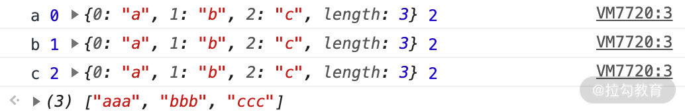

# 【JavaScript】数组常用API

[TOC]


## Array 的构造器

### 普通方法

```js
// 使用 Array 构造器，可以自定义长度

var a = Array(6); // [empty × 6]

// 使用对象字面量

var b = [];

b.length = 6; // [undefined × 6]

```

Array 构造器根据参数长度的不同，有如下两种不同的处理方式：

- **new Array(arg1, arg2,…)**，参数长度为 0 或长度大于等于 2 时，传入的参数将按照顺序依次成为新数组的第 0 至第 N 项（参数长度为 0 时，返回空数组）；
- **new Array(len)**，当 len 不是数值时，处理同上，返回一个只包含 len 元素一项的数组；当 len 为数值时，len 最大不能超过 32 位无符号整型，即需要小于 2 的 32 次方（len 最大为 Math.pow(2,32)），否则将抛出 RangeError。


### ES6 新增的构造方法：Array.of 和 Array.from

### Array.of

Array.of 用于将参数依次转化为数组中的一项，然后返回这个新数组，而不管这个参数是数字还是其他。它基本上与 Array 构造器功能一致，唯一的区别就在单个数字参数的处理上。

比如，在下面的这几行代码中，你可以看到区别：当参数为两个时，返回的结果是一致的；当参数是一个时，Array.of 会把参数变成数组里的一项，而构造器则会生成长度和第一个参数相同的空数组。

```js
Array.of(8.0); // [8]

Array(8.0); // [empty × 8]

Array.of(8.0, 5); // [8, 5]

Array(8.0, 5); // [8, 5]

Array.of('8'); // ["8"]

Array('8'); // ["8"]

```


### Array.from

Array.from 的设计初衷是快速便捷地基于其他对象创建新数组，准确来说就是从一个类似数组的可迭代对象中创建一个新的数组实例。其实就是，只要一个对象有迭代器，Array.from 就能把它变成一个数组（注意：是返回新的数组，不改变原对象）。

从语法上看，Array.from 拥有 3 个参数：

1. 类似数组的对象，必选；
2. 加工函数，新生成的数组会经过该函数的加工再返回；
3. this 作用域，表示加工函数执行时 this 的值。

这三个参数里面第一个参数是必选的，后两个参数都是可选的。

```js
var obj = {0: 'a', 1: 'b', 2:'c', length: 3};

Array.from(obj, function(value, index){

  console.log(value, index, this, arguments.length);

  return value.repeat(3);   //必须指定返回值，否则返回 undefined

}, obj);

```




举例2：

```js
// String

Array.from('abc');         // ["a", "b", "c"]

// Set

Array.from(new Set(['abc', 'def'])); // ["abc", "def"]

// Map

Array.from(new Map([[1, 'ab'], [2, 'de']])); 

// [[1, 'ab'], [2, 'de']]

```


## Array 的判断

判断一个变量是否为数组:

```js
var a = [];

// 1.基于instanceof

a instanceof Array;

// 2.基于constructor

a.constructor === Array;

// 3.基于Object.prototype.isPrototypeOf

Array.prototype.isPrototypeOf(a);

// 4.基于getPrototypeOf

Object.getPrototypeOf(a) === Array.prototype;

// 5.基于Object.prototype.toString

Object.prototype.toString.apply(a) === '[object Array]';

```


ES6 之后新增了一个 Array.isArray 方法，能直接判断数据类型是否为数组。

如果 isArray 不存在，那么 Array.isArray 的 polyfill 通常可以这样写：

```js
if (!Array.isArray){

  Array.isArray = function(arg){

    return Object.prototype.toString.call(arg) === '[object Array]';

  };

}

```


## 常用API（一）：改变自身的方法

基于 ES6，会改变自身值的方法一共有 9 个，分别为 pop、push、reverse、shift、sort、splice、unshift，以及两个 ES6 新增的方法 copyWithin 和 fill。

```js
// pop方法

var array = ["cat", "dog", "cow", "chicken", "mouse"];

var item = array.pop();

console.log(array); // ["cat", "dog", "cow", "chicken"]

console.log(item); // mouse

// push方法

var array = ["football", "basketball",  "badminton"];

var i = array.push("golfball");

console.log(array); 

// ["football", "basketball", "badminton", "golfball"]

console.log(i); // 4

// reverse方法

var array = [1,2,3,4,5];

var array2 = array.reverse();

console.log(array); // [5,4,3,2,1]

console.log(array2===array); // true

// shift方法

var array = [1,2,3,4,5];

var item = array.shift();

console.log(array); // [2,3,4,5]

console.log(item); // 1

// unshift方法

var array = ["red", "green", "blue"];

var length = array.unshift("yellow");

console.log(array); // ["yellow", "red", "green", "blue"]

console.log(length); // 4

// sort方法

var array = ["apple","Boy","Cat","dog"];

var array2 = array.sort();

console.log(array); // ["Boy", "Cat", "apple", "dog"]

console.log(array2 == array); // true

// splice方法

var array = ["apple","boy"];

var splices = array.splice(1,1);

console.log(array); // ["apple"]

console.log(splices); // ["boy"]

// copyWithin方法

var array = [1,2,3,4,5]; 

var array2 = array.copyWithin(0,3);

console.log(array===array2,array2);  // true [4, 5, 3, 4, 5]

// fill方法

var array = [1,2,3,4,5];

var array2 = array.fill(10,0,3);

console.log(array===array2,array2); 

// true [10, 10, 10, 4, 5], 可见数组区间[0,3]的元素全部替换为10

```


## 常用API（二）：不改变自身的方法

基于 ES7，不会改变自身的方法也有 9 个，分别为 concat、join、slice、toString、toLocaleString、indexOf、lastIndexOf、未形成标准的 toSource，以及 ES7 新增的方法 includes。

```js
// concat方法

var array = [1, 2, 3];

var array2 = array.concat(4,[5,6],[7,8,9]);

console.log(array2); // [1, 2, 3, 4, 5, 6, 7, 8, 9]

console.log(array); // [1, 2, 3], 可见原数组并未被修改

// join方法

var array = ['We', 'are', 'Chinese'];

console.log(array.join()); // "We,are,Chinese"

console.log(array.join('+')); // "We+are+Chinese"

// slice方法

var array = ["one", "two", "three","four", "five"];

console.log(array.slice()); // ["one", "two", "three","four", "five"]

console.log(array.slice(2,3)); // ["three"]

// toString方法

var array = ['Jan', 'Feb', 'Mar', 'Apr'];

var str = array.toString();

console.log(str); // Jan,Feb,Mar,Apr

// tolocalString方法

var array= [{name:'zz'}, 123, "abc", new Date()];

var str = array.toLocaleString();

console.log(str); // [object Object],123,abc,2016/1/5 下午1:06:23

// indexOf方法

var array = ['abc', 'def', 'ghi','123'];

console.log(array.indexOf('def')); // 1

// includes方法

var array = [-0, 1, 2];

console.log(array.includes(+0)); // true

console.log(array.includes(1)); // true

var array = [NaN];

console.log(array.includes(NaN)); // true

```


**注意点：**

-  includes 方法：如果元素中有 0，那么在判断过程中不论是 +0 还是 -0 都会判断为 True，这里的 includes 忽略了 +0 和 -0。

- **slice 不改变自身，而 splice 会改变自身**

slice 的语法是：arr.slice([start[, end]])，而 splice 的语法是：arr.splice(start,deleteCount[, item1[, item2[, …]]])。我们可以看到从第二个参数开始，二者就已经有区别了，splice 第二个参数是删除的个数，而 slice 的第二个参数是 end 的坐标（可选）。


## 常用API（三）：数组遍历的方法

基于 ES6，不会改变自身的遍历方法一共有 12 个，分别为 forEach、every、some、filter、map、reduce、reduceRight，以及 ES6 新增的方法 entries、find、findIndex、keys、values。

```js
// forEach方法

var array = [1, 3, 5];

var obj = {name:'cc'};

var sReturn = array.forEach(function(value, index, array){

  array[index] = value;

  console.log(this.name); // cc被打印了三次, this指向obj

},obj);

console.log(array); // [1, 3, 5]

console.log(sReturn); // undefined, 可见返回值为undefined

// every方法

var o = {0:10, 1:8, 2:25, length:3};

var bool = Array.prototype.every.call(o,function(value, index, obj){

  return value >= 8;

},o);

console.log(bool); // true

// some方法

var array = [18, 9, 10, 35, 80];

var isExist = array.some(function(value, index, array){

  return value > 20;

});

console.log(isExist); // true 

// map 方法

var array = [18, 9, 10, 35, 80];

array.map(item => item + 1);

console.log(array);  // [19, 10, 11, 36, 81]

// filter 方法

var array = [18, 9, 10, 35, 80];

var array2 = array.filter(function(value, index, array){

  return value > 20;

});

console.log(array2); // [35, 80]

// reduce方法

var array = [1, 2, 3, 4];

var s = array.reduce(function(previousValue, value, index, array){

  return previousValue * value;

},1);

console.log(s); // 24

// ES6写法更加简洁

array.reduce((p, v) => p * v); // 24

// reduceRight方法 (和reduce的区别就是从后往前累计)

var array = [1, 2, 3, 4];

array.reduceRight((p, v) => p * v); // 24

// entries方法

var array = ["a", "b", "c"];

var iterator = array.entries();

console.log(iterator.next().value); // [0, "a"]

console.log(iterator.next().value); // [1, "b"]

console.log(iterator.next().value); // [2, "c"]

console.log(iterator.next().value); // undefined, 迭代器处于数组末尾时, 再迭代就会返回undefined

// find & findIndex方法

var array = [1, 3, 5, 7, 8, 9, 10];

function f(value, index, array){

  return value%2==0;     // 返回偶数

}

function f2(value, index, array){

  return value > 20;     // 返回大于20的数

}

console.log(array.find(f)); // 8

console.log(array.find(f2)); // undefined

console.log(array.findIndex(f)); // 4

console.log(array.findIndex(f2)); // -1

// keys方法

[...Array(10).keys()];     // [0, 1, 2, 3, 4, 5, 6, 7, 8, 9]

[...new Array(10).keys()]; // [0, 1, 2, 3, 4, 5, 6, 7, 8, 9]

// values方法

var array = ["abc", "xyz"];

var iterator = array.values();

console.log(iterator.next().value);//abc

console.log(iterator.next().value);//xyz

```


**注意**：

有些遍历方法不会返回处理之后的数组，比如 forEach；有些方法会返回处理之后的数组，比如 filter。


**reduce 方法详解**

 reduce 的两个参数：

首先是 callback（一个在数组的每一项中调用的函数，接受四个参数）：

1. previousValue（上一次调用回调函数时的返回值，或者初始值）
2. currentValue（当前正在处理的数组元素）
3. currentIndex（当前正在处理的数组元素下标）
4. array（调用 reduce() 方法的数组）

然后是 initialValue（可选的初始值，作为第一次调用回调函数时传给 previousValue 的值）。


举例：

```js
/* 题目：数组 arr = [1,2,3,4] 求数组的和：*/

// 第一种方法：

var arr = [1,2,3,4];

var sum = 0;

arr.forEach(function(e){sum += e;}); // sum = 10

// 第二种方法

var arr = [1,2,3,4];

var sum = 0;

arr.map(function(obj){sum += obj});

// 第三种方法

var arr = [1,2,3,4];

arr.reduce(function(pre,cur){return pre + cur});

```


举例2：

 var arr = [ {name: 'brick1'}, {name: 'brick2'}, {name: 'brick3'} ]

希望最后返回到 arr 里面每个对象的 name 拼接数据为 'brick1, brick2 & brick3' ，如果用 reduce 如何实现呢？

```js
var arr =  [ {name: 'one'}, {name: 'two'}, {name: 'three'} ];

arr.reduce(function(prev, current, index, array){

  if (index === 0){

    return current.name;

  } else if (index === array.length - 1){

    return prev + ' & ' + current.name;

  } else {

    return prev + ', ' + current.name;

  }

}, '');

// 返回结果 "one, two & three"

```


## 总结

