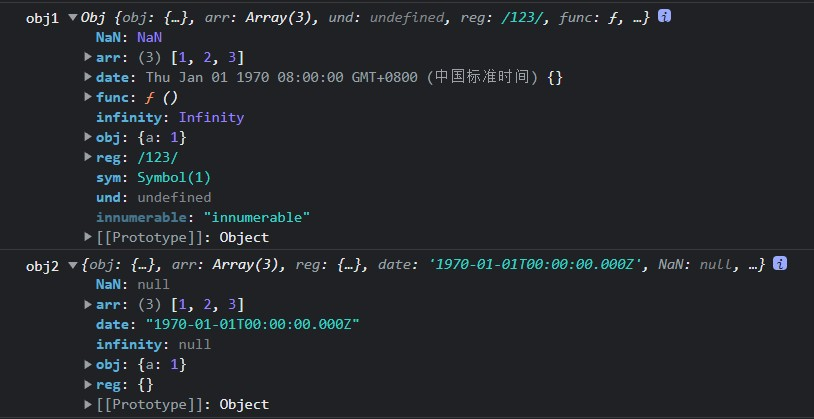
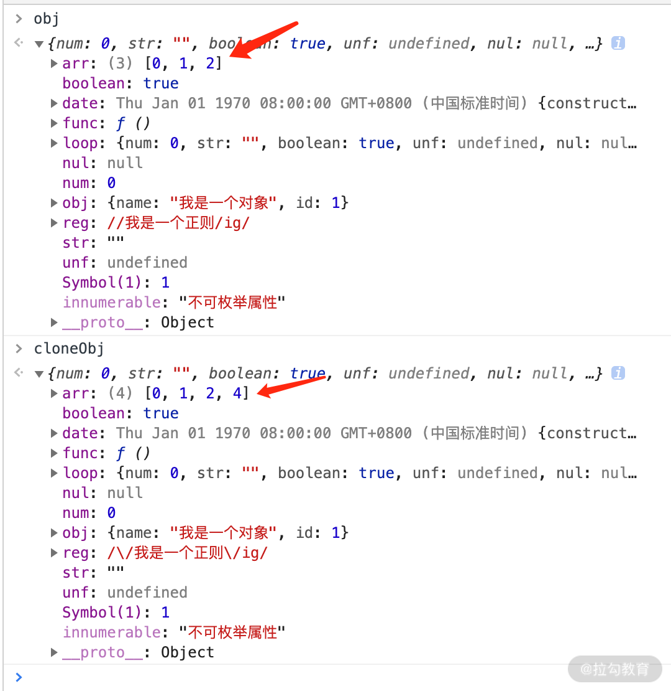

# 【JavaScript】深拷贝与浅拷贝

[TOC]


## 浅拷贝的原理和实现

**浅拷贝的定义**：

> 自己创建一个新的对象，来接受你要重新复制或引用的对象值。如果对象属性是基本的数据类型，复制的就是基本类型的值给新对象；但如果**属性是引用数据类型，复制的就是内存中的地址**，如果其中一个对象改变了这个内存中的地址，肯定会影响到另一个对象。


### 方法一：object.assign

**该方法的第一个参数是拷贝的目标对象，后面的参数是拷贝的来源对象（也可以是多个来源）**。

```
Object.assign(target, ...sources)
```

举例：

```js
let target = {};
let source = {
  a:{
    b:2
  }
};
Object.assign(target, source);
console.log(target);//{ a: { b: 2 } }
source.a.b = 10;
console.log(source);//{ a: { b: 10 } }
console.log(target);//{ a: { b: 10 } }
```


使用 object.assign 方法有几点需要注意：

- 它不会拷贝对象的继承属性；

- 它不会拷贝对象的不可枚举的属性；

- 可以拷贝 Symbol 类型的属性。

举例：

```js
let obj1 = { a:{ b:1 }, sym:Symbol(1)}; 

Object.defineProperty(obj1, 'innumerable' ,{

    value:'不可枚举属性',

    enumerable:false

});

let obj2 = {};

Object.assign(obj2,obj1)

obj1.a.b = 2;

console.log('obj1',obj1);

console.log('obj2',obj2);

```

控制台输出结果：


### 方法二：扩展运算符方式

扩展运算符的语法为：`let cloneObj = { ...obj };`

扩展运算符 和 object.assign 有同样的缺陷，也就是实现的浅拷贝的功能差不多，但是如果属性都是基本类型的值，使用扩展运算符进行浅拷贝会更加方便。

```js
/* 对象的拷贝 */

let obj = {a:1,b:{c:1}}

let obj2 = {...obj}

obj.a = 2

console.log(obj)  //{a:2,b:{c:1}} 
console.log(obj2); //{a:1,b:{c:1}}

obj.b.c = 2

console.log(obj)  //{a:2,b:{c:2}} 
console.log(obj2); //{a:1,b:{c:2}}


/* 数组的拷贝 */

let arr =  [{a:1},{b:2},{c:3}];
let newArr = [...arr]; //跟arr.slice()是一样的效果

console.log(newArr);//[ { a: 1 }, { b: 2 }, { c: 3 } ]

newArr[1].b = 10;

console.log(newArr);//[ { a: 1 }, { b: 10 }, { c: 3 } ]
console.log(arr);//[ { a: 1 }, { b: 10 }, { c: 3 } ]


```


### 方法三：concat 拷贝数组

```js
let arr = [{a:1},{b:2},{c:3}];

let newArr = arr.concat();

console.log(newArr);//[ { a: 1 }, { b: 2 }, { c: 3 } ]

newArr[1].b = 10;

console.log(newArr);//[ { a: 1 }, { b: 10 }, { c: 3 } ]
console.log(arr);//[ { a: 1 }, { b: 10 }, { c: 3 } ]
```


### 方法四：slice 拷贝数组

slice 方法也比较有局限性，因为它仅仅针对数组类型。slice 方法会返回一个新的数组对象，这一对象由该方法的前两个参数来决定原数组截取的开始和结束时间，是不会影响和改变原始数组的。

slice 的语法为：`arr.slice(begin, end);`

```js
let arr = [1, 2, {val: 4}];

let newArr = arr.slice();

newArr[2].val = 1000;

console.log(arr);  //[ 1, 2, { val: 1000 } ]

```


### 手工实现一个浅拷贝

1. 对基础类型做一个最基本的一个拷贝；
2. 对引用类型开辟一个新的存储，并且拷贝一层对象属性。


```js
const shallowClone = (target) => {
    if (typeof target === 'object' && target !== null) {  //如果源对象是引用数据类型

      const cloneTarget = Array.isArray(target) ? []: {}; 

      for (let prop in target) {  //遍历源对象中的属性
        if (target.hasOwnProperty(prop)) { 
            cloneTarget[prop] = target[prop]; 
        }  
      }  
      return cloneTarget; 

    } else {  //如果是基本数据类型，直接返回
      return target;  
    }  
}

let obj = {a:2,b:{c:1}};

let obj1 = shallowClone(obj);

console.log(obj1);//{ a: 2, b: { c: 1 } }

obj1.b.c = 10;
obj1.a = 20;

console.log(obj);//{ a: 2, b: { c: 10 } }
console.log(obj1);//{ a: 20, b: { c: 10 } }

```


## 深拷贝的原理和实现

浅拷贝只是创建了一个新的对象，复制了原有对象的基本类型的值，而引用数据类型只拷贝了一层属性，再深层的还是无法进行拷贝。深拷贝则不同，对于复杂引用数据类型，其在堆内存中完全开辟了一块内存地址，并将原有的对象完全复制过来存放。

这两个对象是相互独立、不受影响的，彻底实现了内存上的分离。

> 将一个对象从内存中完整地拷贝出来一份给目标对象，并从堆内存中开辟一个全新的空间存放新对象，且新对象的修改并不会改变原对象，二者实现真正的分离。


### 方法一：JSON.stringify 实现深拷贝

> 把一个对象序列化成为 JSON 的字符串，并将对象里面的内容转换成字符串，最后再用 JSON.parse() 的方法将JSON 字符串生成一个新的对象。

JSON 的 详细解释：点击这里👉 [JSON 详解](https://blog.csdn.net/weixin_52834435/article/details/123437494?spm=1001.2014.3001.5501)

```js
let obj1 = { a:1, b:[1,2,3] }

let str = JSON.stringify(obj1);

let obj2 = JSON.parse(str);

console.log(obj2);   //{a:1,b:[1,2,3]} 

obj1.a = 2;

obj1.b.push(4);

console.log(obj1);   //{a:2,b:[1,2,3,4]}

console.log(obj2);   //{a:1,b:[1,2,3]}

```


使用 `JSON.stringify` 实现深拷贝的注意点：

1. 拷贝的对象的值中如果有函数、undefined、symbol 这几种类型，经过 JSON.stringify 序列化之后的字符串中这个键值对会消失；
2. 拷贝 Date 引用类型会变成字符串；
3. 无法拷贝不可枚举的属性；
4. 无法拷贝对象的原型链；
5. 拷贝 RegExp 引用类型会变成空对象；
6. 对象中含有 NaN、Infinity 以及 -Infinity，JSON 序列化的结果会变成 null；
7. 无法拷贝对象的循环应用，即对象成环 (obj[key] = obj)。


举例：

```js
function Obj() { 

    this.func = function () { alert(1) }; 
  
    this.obj = {a:1};
  
    this.arr = [1,2,3];
  
    this.und = undefined; 
  
    this.reg = /123/; 
  
    this.date = new Date(0); 
  
    this.NaN = NaN;
  
    this.infinity = Infinity;
  
    this.sym = Symbol(1);
  
} 
  
let obj1 = new Obj();//obj1为原对象
  
Object.defineProperty(obj1,'innumerable',{ 
  
    enumerable:false,
  
    value:'innumerable'
  
});
  
console.log('obj1',obj1);
  
let str = JSON.stringify(obj1);
  
let obj2 = JSON.parse(str);//obj2为拷贝后的对象(即目标对象)
  
console.log('obj2',obj2);
  
```

控制台输出结果：



### 方法二：手写递归 实现深拷贝 

下面是一个实现 deepClone 函数封装的例子，通过 for in 遍历传入参数的属性值，如果值是引用类型则再次递归调用该函数，如果是基础数据类型就直接复制。

```js
let obj1 = {a:{b:1}};

function deepClone(obj) { 
  
    let cloneObj = {}
  
    for(let key in obj) { //遍历原对象的所有属性  
      if(typeof obj[key] ==='object') { //如果原对象的属性为引用类型  
        cloneObj[key] = deepClone(obj[key])  //是对象就再次调用该函数递归  
      } else {  
        cloneObj[key] = obj[key]  //基本类型的话直接复制值  
      }  
    }  
    return cloneObj  
}
  
let obj2 = deepClone(obj1);
  
obj1.a.b = 2;
  
console.log(obj2);   //  {a:{b:1}}
  
```

这个函数存在和 `JSON.stringify`相同的问题：

1. 这个深拷贝函数并不能复制不可枚举的属性以及 Symbol 类型；
2. 这种方法只是针对普通的引用类型的值做递归复制，而对于 Array、Date、RegExp、Error、Function 这样的引用类型并不能正确地拷贝；
3. 对象的属性里面成环，即循环引用没有解决。


#### 基础版

**简易版深拷贝的另一种代码形式**

```js
function isObject(value) {
  const valueType = typeof value;
  return (value !== null) && (valueType === 'object' || valueType === 'function');
}

function deepClone(originValue) {
  //判断传入的originValue 是否是一个对象
  if(!isObject(originValue)) {
      return originValue;
  }

  const newObject = {};
  for(const key in originValue) {
    newObject[key] = deepClone(originValue[key]);
  }

  return newObject;
}

//测试代码
const obj = {
  name: "hhh",
  age: 19,
  friend: {
    name: "pjy",
    address: {
      city: "China"
    }
  }
}


const newObj  = deepClone(obj);

console.log(newObj === obj);//false

obj.friend.name = "Pan";

console.log(newObj); 
/*
{
  name: 'hhh',
  age: 19,
  friend: { name: 'pjy', address: { city: 'China' } }
}
*/
```


#### 改进版（增加对其他类型的判断）

**对其他数据类型的改进**

- 增加了对数组的判断
- 增加了对函数的判断
- 增加了对Symbol类型的判断：当Symbol类型作为key时，无法被遍历。eg:`[s2]: "abc"`
- 增加了对 Set/Map 类型数据的处理：原来会出现**是空值**的现象


注：

循环引用问题：

`obj.info = obj`

会出现栈溢出的错误。

可以用 Map 来存储上一次拷贝的对象，在下一次拷贝中，如果上一次拷贝的结果存在，就直接使用保存在Map中的结果。


```js
function isObject(value) {
  const valueType = typeof value;
  return (value !== null) && (valueType === 'object' || valueType === 'function');
}

//# 5.2 创建一个局部的Map
function deepClone(originValue, map = new WeakMap()) {
  //4.判断是否是一个Set/Map类型
  if(originValue instanceof Set) {
    return new Set([...originValue]);
  }
  if(originValue instanceof Map) {
    return new Map([...originValue]);
  }

  //3.判断如果是Symbol的value，那么创建一个新的Symbol
  if(typeof originValue === "symbol") {
    return Symbol(originValue.description);
  }

  //2.判断传入的对象是否是函数类型,如果是函数类型，直接使用同一个函数
  if(typeof originValue == "function") {
    return originValue;
  }

  //判断传入的originValue 是否是一个对象
  if(!isObject(originValue)) {
      return originValue;
  }

  //# 5.1 判断这个newObject 在上一次有没有已经存储过
  if(map.has(originValue)) {
    return map.get(originValue);
  }

  //1.判断传入的对象是数组还是对象
  const newObject = Array.isArray(originValue) ? []: {};
  //# 5.解决循环引用的问题
  map.set(originValue, newObject);
  
  for(const key in originValue) {
    newObject[key] = deepClone(originValue[key], map);
  }

  //3.1 对Symbol作为key值时，进行特殊处理
  const symbolKeys = Object.getOwnPropertySymbols(originValue);
  for(const sKey of symbolKeys) {
    newObject[sKey] = deepClone(originValue[sKey]);
  }

  return newObject;
}

//测试代码

//判断Symbol 类型
let s1 = Symbol("aaa");
let s2 = Symbol("bbb");


const obj = {
  name: "hhh",
  age: 19,
  friend: { 
    name: "pjy",
    address: {
      city: "China"
    }
  },
  //1.增加对数组的判断
  hobbies: ["abc","cba","nba"],

  foo: function() { //2.增加对函数类型的判断
      console.log("foo function");
  },

  //3.判断Symbol类型的判断
  [s1]: "abc",
  s2: s2,

  //4.处理 Set/Map 类型的数据
  set: new Set(["aaa", "bbb", "ccc"]),
  map: new Map([["aaa","abc"], ["bbb","cba"]])
}

//5.解决 循环引用 问题
obj.info = obj


const newObj  = deepClone(obj);

console.log(newObj === obj);//false

obj.friend.name = "Pan";

console.log(newObj); 

console.log(newObj.s2 === obj.s2);//false

console.log(newObj.info.info);

/**
false
<ref *1> {
  name: 'hhh',
  age: 19,
  friend: { name: 'pjy', address: { city: 'China' } },
  hobbies: [ 'abc', 'cba', 'nba' ],
  foo: [Function: foo],
  s2: Symbol(bbb),
  set: Set(3) { 'aaa', 'bbb', 'ccc' },
  map: Map(2) { 'aaa' => 'abc', 'bbb' => 'cba' },
  info: [Circular *1],
  [Symbol(aaa)]: 'abc'
}
false
<ref *1> {
  name: 'hhh',
  age: 19,
  friend: { name: 'pjy', address: { city: 'China' } },
  hobbies: [ 'abc', 'cba', 'nba' ],
  foo: [Function: foo],
  s2: Symbol(bbb),
  set: Set(3) { 'aaa', 'bbb', 'ccc' },
  map: Map(2) { 'aaa' => 'abc', 'bbb' => 'cba' },
  info: [Circular *1],
  [Symbol(aaa)]: 'abc'
}
 */
```


### 方法三：最终改进版（改进后递归实现）

解决方案：

1. 针对能够遍历对象的不可枚举属性以及 Symbol 类型，我们可以使用 Reflect.ownKeys 方法；
2. 当参数为 Date、RegExp 类型，则直接生成一个新的实例返回；
3. 利用 Object 的 getOwnPropertyDescriptors 方法可以获得对象的所有属性，以及对应的特性，顺便结合 Object 的 create 方法创建一个新对象，并继承传入原对象的原型链；
4. 利用 WeakMap 类型作为 Hash 表，因为 WeakMap 是弱引用类型，可以有效防止内存泄漏（你可以关注一下 Map 和 weakMap 的关键区别，这里要用 weakMap），作为检测循环引用很有帮助，如果存在循环，则引用直接返回 WeakMap 存储的值。


当你不太了解 WeakMap 的真正作用时，建议不要在面试中写出这样的代码，如果只是死记硬背，会给自己挖坑的。**因为你写的每一行代码都是需要经过深思熟虑并且非常清晰明白的，这样你才能经得住面试官的推敲**。

```js
const isComplexDataType = obj => (typeof obj === 'object' || typeof obj === 'function') && (obj !== null)

const deepClone = function (obj, hash = new WeakMap()) {

  if (obj.constructor === Date) 

  return new Date(obj)       // 日期对象直接返回一个新的日期对象

  if (obj.constructor === RegExp)

  return new RegExp(obj)     //正则对象直接返回一个新的正则对象

  //如果循环引用了就用 weakMap 来解决

  if (hash.has(obj)) return hash.get(obj)

  let allDesc = Object.getOwnPropertyDescriptors(obj)

  //遍历传入参数所有键的特性

  let cloneObj = Object.create(Object.getPrototypeOf(obj), allDesc)

  //继承原型链

  hash.set(obj, cloneObj)

  for (let key of Reflect.ownKeys(obj)) { 

    cloneObj[key] = (isComplexDataType(obj[key]) && typeof obj[key] !== 'function') ? deepClone(obj[key], hash) : obj[key]

  }

  return cloneObj

}

// 下面是验证代码

let obj = {

  num: 0,

  str: '',

  boolean: true,

  unf: undefined,

  nul: null,

  obj: { name: '我是一个对象', id: 1 },

  arr: [0, 1, 2],

  func: function () { console.log('我是一个函数') },

  date: new Date(0),

  reg: new RegExp('/我是一个正则/ig'),

  [Symbol('1')]: 1,

};

Object.defineProperty(obj, 'innumerable', {

  enumerable: false, value: '不可枚举属性' }

);

obj = Object.create(obj, Object.getOwnPropertyDescriptors(obj))

obj.loop = obj    // 设置loop成循环引用的属性

let cloneObj = deepClone(obj)

cloneObj.arr.push(4)

console.log('obj', obj)

console.log('cloneObj', cloneObj)

```

cloneObj 在 obj 的基础上进行了一次深拷贝，cloneObj 里的 arr 数组进行了修改，并未影响到 obj.arr 的变化。




以上笔记均来自 拉钩教育 的《JavaScript 核心原理精讲》课程 学习。