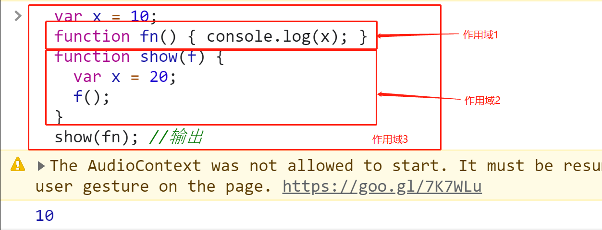
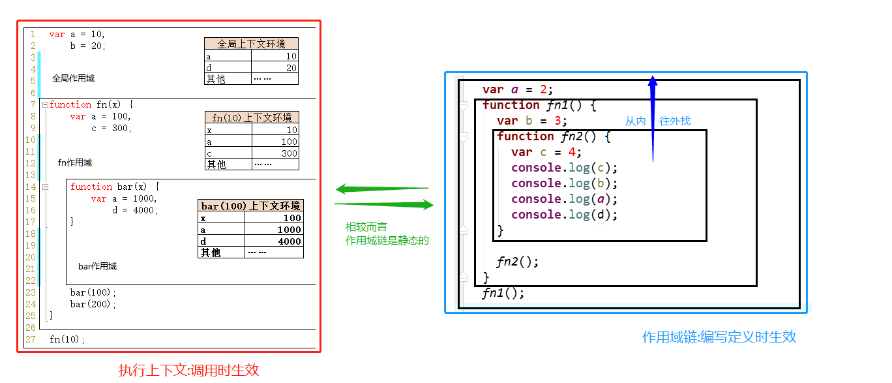

[TOC]


### 一.作用域

- **概念**：通俗来讲，作用域是一个变量或函数的作用范围。作用域在**函数定义**时，就已经确定了。它是静态的(相对于上下文对象), 在编写代码时就确定了。	
- **理解**：作用域是程序源代码中定义变量的区域。作用域规定了如何查找变量，也就是确定当前执行代码对变量的访问权限。

- **目的**：为了提高程序的可靠性，同时减少命名冲突。隔离变量，不同作用域下同名变量不会有冲突

在 JS 中，一共有两种作用域：（ES5 中）

- **全局作用域**：作用于整个 script 标签内部，或者作用于一个独立的 JS 文件。
- **函数作用域**（局部作用域）：作用于函数内的代码环境。

#### 1.全局作用域 和 window 对象

直接编写在 script 标签中的 JS 代码，都在全局作用域。全局作用域在页面打开时创建，在页面关闭时销毁。

在全局作用域中有一个全局对象 window，它代表的是一个浏览器的窗口，由浏览器创建，我们可以直接使用。相关知识点如下：

- 创建的**变量**都会作为 window 对象的属性保存。比如在全局作用域内写 `var a = 100`，这里的 `a` 等价于 `window.a`。
- 创建的**函数**都会作为 window 对象的方法保存。

#### 2.函数作用域  

- 函数作用域是函数执行时创建的作用域，每次调用函数都会创建一个新的函数作用域。
- 函数作用域在函数执行时创建，在函数执行结束时销毁。 
- 在函数作用域中创建的变量，不能在全局中访问。 
- 当在函数作用域中使用一个变量时，它会先在自身作用域中寻找， 
- 如果找到了则直接使用，如果没有找到则到上一级作用域中寻找， 
- 如果找到了则使用，找不到则继续向上找，直到全局作用域, 如果还找不到就抛出找不到的异常

```js
function greet() {
  var greeting = 'Hello World!';
  console.log(greeting);
}
// 打印 'Hello World!'
greet();
// 报错： Uncaught ReferenceError: greeting is not defined
console.log(greeting);
```


#### 3.块级作用域

ES6引入了`let`和`const`关键字,和`var`关键字不同，在大括号中使用`let`和`const`声明的变量存在于块级作用域中。在大括号之外不能访问这些变量。

```js
{
  // 块级作用域中的变量
  let greeting = 'Hello World!';
  var lang = 'English';
  console.log(greeting); // Prints 'Hello World!'
}
// 变量 'English'
console.log(lang);
// 报错：Uncaught ReferenceError: greeting is not defined
console.log(greeting);
```


#### 4.全局变量、局部变量

根据作用域的不同，变量可以分为两类：全局变量、局部变量。

**全局变量**：

- 在全局作用域下声明的变量，叫「全局变量」。在全局作用域的任何一地方，都可以访问这个变量。
- 在全局作用域下，使用 var 声明的变量是全局变量。
- 特殊情况：在函数内不使用 var 声明的变量也是全局变量（不建议这么用）。

**局部变量**：

- 定义在函数作用域的变量，叫「局部变量」。仅限函数内部访问这个变量。
- 在函数内部，使用 var 声明的变量是局部变量。
- 函数的**形参**也是属于局部变量。

从执行效率来看全局变量和局部变量：

- 全局变量：只有浏览器关闭时才会被销毁，比较占内存。
- 局部变量：当其所在的代码块运行结束后，就会被销毁，比较节约内存空间。

#### 5.作用域的访问关系

在内部作用域中可以访问到外部作用域的变量，在外部作用域中无法访问到内部作用域的变量。

代码举例：

```js
var a = 'aaa';
function foo() {
    var b = 'bbb';
    console.log(a); // 打印结果：aaa。说明 内层作用域 可以访问 外层作用域 里的变量
}

foo();
console.log(b); // 报错：Uncaught ReferenceError: b is not defined。说明 外层作用域 无法访问 内层作用域 里的变量
```

#### 6.作用域的上下级关系

当在函数作用域操作一个变量时，它会先在自身作用域中寻找，如果有就直接使用（**就近原则**）。如果没有则向上一级作用域中寻找，直到找到全局作用域；如果全局作用域中依然没有找到，则会报错 ReferenceError。

在函数中要访问全局变量可以使用 window 对象。（比如说，全局作用域和函数作用域都定义了变量 a，如果想访问全局变量，可以使用`window.a`）

#### 7.作用域的预处理

**预处理（预解析）**的概念：浏览器在解析 JS 代码之前，会进行一个操作叫" 预处理(预解析) "：将当前 JS 代码中所有变量的定义和函数的定义，放到所有代码的最前面。

这种预解析，也称之为声明提前。

##### ①全局作用域-变量的声明提前（变量提升）

使用 var 关键字声明的变量（ 比如 `var a = 1`），**会在所有的代码执行之前被声明**（但是不会赋值），但是如果声明变量时不是用 var 关键字（比如直接写`a = 1`），则变量不会被声明提前。

举例1：

```js
console.log(a);
var a = 123;//undefined
```

相当于执行了：

```js
var a;
console.log(a);
a=123;
```

举例 2：

```javascript
console.log(a);
a = 123; //此时a相当于window.a
```

程序会报错：`Uncaught ReferenceError: a is not defined`。

举例 3：

```javascript
a = 123; //此时a相当于window.a
console.log(window.a);//123
```

举例4：

```js
function foo() {
    if (false) {
        var i = 123;
    }
    console.log(i);
}

foo();//undefined
```

变量 i 在函数执行前，就被提前声明了，只是尚未被赋值。`if(false)`里面的代码虽然不会被执行，但是整个代码有**解析**的环节，解析的时候就已经把 变量 i 给提前声明了。

相当于执行了：

```js

function foo(){
    var i;
    if(false){
        i=123;
    }
    console.log(i);
}
foo();//undefined
```

##### ②全局作用域-函数的声明提前

**函数声明**：

使用`函数声明`的形式创建的函数`function foo(){}`，**会被声明提前**。

也就是说，整个函数会在所有的代码执行之前就被**创建完成**。所以，在代码顺序上，我们可以先调用函数，再定义函数。

代码举例：

```javascript
fn1(); // 虽然 函数 fn1 的定义是在后面，但是因为被提前声明了， 所以此处可以调用函数

function fn1() {
    console.log('我是函数 fn1');
}
```

**函数表达式**：

使用`函数表达式`创建的函数`var foo = function(){}`，**不会被声明提前**，所以不能在声明前调用。

因为此时 foo 被声明了（这里只是变量声明），且为 undefined，并没有把 `function(){}` 赋值给 foo。

举例：

```js

fun();

var fun = function(){
    console.log("fun()函数");
}
```

此时会报错： `Uncaught TypeError: fun is not a function`

##### ③函数作用域的声明提前

在函数作用域中，也有声明提前的特性：

- 函数中，使用 var 关键字声明的变量，会在函数中所有的代码执行之前被声明。
- 函数中，没有 var 声明的变量都是**全局变量**，而且并不会提前声明。

举例：

```js
var a = 1;

function foo() {
    console.log(a);
    a = 2; // 此处的a相当于window.a
}

foo();//1
console.log(window.a); //打印结果是2
console.log(a); //打印结果是2
//为什么是2而不是1：函数里的a=2是一个全局变量，相当于先var a=1,然后a=2(把a的值改成了2)
```

定义形参就相当于在函数作用域中声明了变量：

```javascript
function fun(e) {
    // 这个函数中，因为有了形参 e，此时就相当于在函数内部的第一行代码里，写了 var e;
    console.log(e);
}

fun(); //打印结果为 undefined
fun(123); //打印结果为123
```

### 二.静态作用域与动态作用域

ECMAScript6之前只有全局作用域和函数作用域。之后增加了块级作用域。

JavaScript采用词法作用域(lexical scoping)，也就是静态作用域。

因为采用词法作用域，函数的作用域在函数定义的时候就决定了。

与词法作用域相对的是动态作用域，函数的作用域在函数调用的时候才决定。

```js
var value = 1;

function foo() {
    console.log(value);
}

function bar() {
    var value = 2;
    foo();
}

bar();//1
```

解释：

1.当采用静态作用域时，执行foo函数，先从foo函数内部查找是否有局部变量value，如果没有，就根据书写的位置，查找上面一层的代码，在这里是全局作用域，也就是value等于1，所以最后会打印1

 作用域是静态的，**并不会说放在其他函数里执行而改变作用域的位置** 。


2.当采用动态作用域时，执行foo函数，依然是从foo函数内部查找是否有局部变量value。如果没有，就从调用函数的作用域，也就是bar函数内部查找value变量，所以最后会打印2

### 三.作用域链

- 只要是代码，就至少有一个作用域
- 写在函数内部是的局部作用域
- 如果函数中还有函数，那么在这个作用域中就又可以诞生一个作用域

**作用域链**：内部函数访问外部函数的变量，采用的是链式查找的方式来决定取哪个值，这种结构称之为作用域链。查找时，采用的是**就近原则**。


在当前作用域中查找所需变量，但是该作用域没有这个变量，那这个变量就是自由变量。如果在自己作用域找不到该变量就去父级作用域查找，依次向上级作用域查找，直到访问到window对象就被终止，这一层层的关系就是作用域链。

作用域链的作用是**保证对执行环境有权访问的所有变量和函数的有序访问，通过作用域链，可以访问到外层环境的变量和函数。**

作用域链的本质上是一个指向变量对象的指针列表。变量对象是一个包含了执行环境中所有变量和函数的对象。作用域链的前端始终都是当前执行上下文的变量对象。全局执行上下文的变量对象（也就是全局对象）始终是作用域链的最后一个对象。

当查找一个变量时，如果当前执行环境中没有找到，可以沿着作用域链向后查找。

举例：

```js
var num = 10;

function fn() {
    // 外部函数
    var num = 20;

    function fun() {
        // 内部函数
        console.log(num);
    }
    fun();
}
fn();//20
```

test1：

​	作用域在函数定义时就已经确定了。而不是在函数调用时

​     作用域是静态的，**并不会说放在其他函数里执行而改变作用域的位置** 

```js
    var x = 10;
    function fn() { console.log(x); }
    function show(f) {
        var x = 20;
        f();
    }
    show(fn); //输出10
    /*解释
    作用域一：全局作用域
    作用域二：function fn() { console.log(x); }
    作用域三：function show(f) {
                var x = 20;
                f();
            }
    */

```



test2:

**对象变量不能产生局部作用域**

```js
var obj = { //对象变量不能产生局部作用域,所以会找到全局去,导致报错
        fn2: function () {
            console.log(fn2)
        }
    }
    console.log(obj.fn2);//此时不报错，结果为 f(){console.log(fn2)}
    console.log(obj.fn2());
    /*报错：
    Uncaught ReferenceError: fn2 is not defined
        at Object.fn2 (面试题.html:74)
        at 面试题.html:78
    
    */
    /*解释
        1.两个作用域：
            一个是  function () {
                        console.log(fn2)
                    }
            另一个是：全局作用域
            两个作用域都没有fn2，所以报错
        2.fn2是一个obj的属性，而fn2()会被看成一个函数
    */
```


### 四.作用域与执行上下文的区别与联系

​    区别1:

-   全局作用域之外，每个函数都会创建自己的作用域，作用域在函数定义时就已经确定了。而不是在函数调用时。
-   全局执行上下文环境是在全局作用域确定之后, js代码马上执行之前创建
-   函数执行上下文是在调用函数时, 函数体代码执行之前创建

​    区别2:

-   作用域是静态的, 只要函数定义好了就一直存在, 且不会再变化
-   执行上下文是动态的, 调用函数时创建, 函数调用结束时就会自动释放

​    联系:

- ​      执行上下文(对象)是从属于所在的作用域
- ​      全局上下文环境==>全局作用域
- ​      函数上下文环境==>对应的函数使用域

​    ps:**执行上下文：调用时生效，作用域：编写定义时生效**

