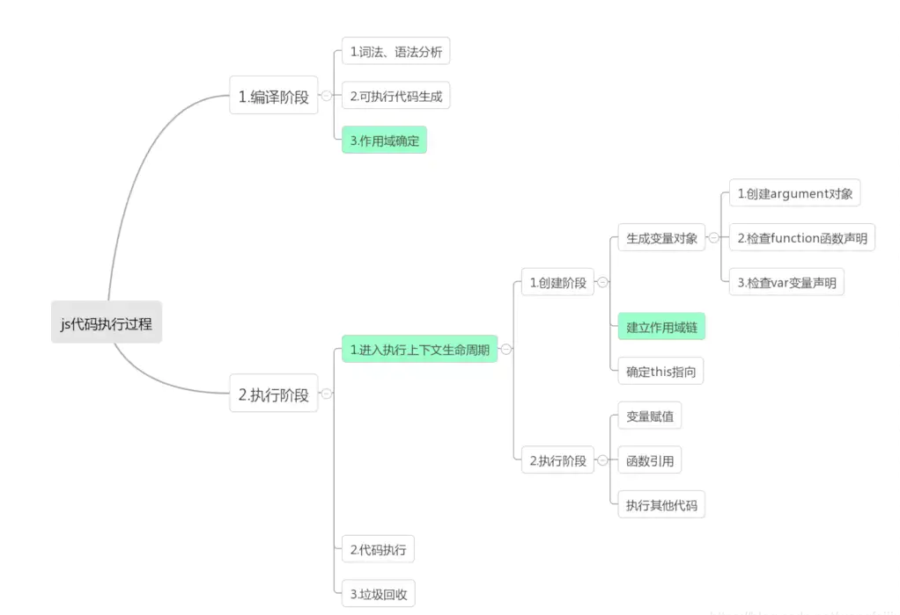

# 执行上下文与执行上下文栈




## 一.执行上下文

#### 1.什么是执行上下文？

执行上下文是评估和执行 JavaScript 代码的环境的抽象概念。每当 Javascript 代码在运行的时候，它都是在执行上下文中运行。


#### 2.执行上下文的类型

执行上下文总共有三种类型：

- **全局执行上下文：** 这是默认的、最基础的执行上下文。不在任何函数中的代码都位于全局执行上下文中。它做了两件事：1. 创建一个全局对象，在浏览器中这个全局对象就是 window 对象。2. 将 `this` 指针指向这个全局对象。一个程序中只能存在一个全局执行上下文。
- **函数执行上下文：** 每次调用函数时，都会为该函数创建一个新的执行上下文。每个函数都拥有自己的执行上下文，但是只有在函数被调用的时候才会被创建。一个程序中可以存在任意数量的函数执行上下文。每当一个新的执行上下文被创建，它都会按照特定的顺序执行一系列步骤。
- **Eval 函数执行上下文：** 运行在 `eval` 函数中的代码也获得了自己的执行上下文，但由于 Javascript 开发人员不常用 eval 函数，所以在这里不再讨论。


##### 全局执行上下文

 * 在执行全局代码前将window确定为全局执行上下文
 * 对全局数据进行预处理
   * var定义的全局变量==>undefined, 添加为window的属性
   * function声明的全局函数==>赋值(fun), 添加为window的方法
   * this==>赋值(window)
 * 开始执行全局代码


##### 函数执行上下文

 * 在调用函数, 准备执行函数体之前, 创建对应的函数执行上下文对象(虚拟的, 存在于栈中)
 * 对局部数据进行预处理
   * 形参变量==>赋值(实参)==>添加为执行上下文的属性
   * `arguments`==>赋值(实参列表), 添加为执行上下文的属性 
   * var定义的局部变量==>undefined, 添加为执行上下文的属性
   * function声明的函数 ==>赋值(fun), 添加为执行上下文的方法
   * this==>赋值(调用函数的对象)
 * 开始执行函数体代码


#### 3.创建执行上下文

创建执行上下文有两个阶段：**创建阶段**和**执行阶段**

##### 1）创建阶段

1. **this** 值的决定，即我们所熟知的 **this 绑定**。
2. 创建**词法环境**组件。
3. 创建**变量环境**组件。

##### 2) 执行阶段

在此阶段，完成对所有这些变量的分配，最后执行代码。

## 二.执行上下文栈

1. 在全局代码执行前, JS引擎就会创建一个栈来存储管理所有的执行上下文对象
2. 在全局执行上下文(window)确定后, 将其添加到栈中(压栈)-->`所以栈底百分百是[window]`
3. 在函数执行上下文创建后, 将其添加到栈中(压栈)
4. 在当前函数执行完后,将栈顶的对象移除(出栈)
5. 当所有的代码执行完后, 栈中只剩下window
6. `上下文栈数==函数调用数+1`

```js
//1. 进入全局执行上下文
var a = 10
var bar = function (x) {
  var b = 5
  foo(x + b)   //3. 进入foo执行上下文           
}
var foo = function (y) {
  var c = 5
  console.log(a + c + y)
}
bar(10) //2. 进入bar函数执行上下文
```


## 三.当程序调用一个函数时，会发生什么?

当我们启动程序时，我们从全局执行上下文中开始。一些变量是在全局执行上下文中声明的。我们称之为全局变量。当程序调用一个函数时，会发生什么?

以下几个步骤：

1. JavaScript创建一个新的执行上下文，我们叫作本地执行上下文。
2. 这个本地执行上下文将有它自己的一组变量，这些变量将是这个执行上下文的本地变量。
3. 新的执行上下文被推到到执行堆栈中。可以将执行堆栈看作是一种保存程序在其执行中的位置的容器。

函数什么时候结束?当它遇到一个`return`语句或一个结束括号`}`。

当一个函数结束时，会发生以下情况:

1. 这个本地执行上下文从执行堆栈中弹出。
2. 函数将返回值返回调用上下文。调用上下文是调用这个本地的执行上下文，它可以是全局执行上下文，也可以是另外一个本地的执行上下文。这取决于调用执行上下文来处理此时的返回值，返回的值可以是一个对象、一个数组、一个函数、一个布尔值等等，如果函数没有`return`语句，则返回`undefined`。
3. 这个本地执行上下文被销毁，销毁是很重要，这个本地执行上下文中声明的所有变量都将被删除，不在有变量，这个就是为什么 称为本地执行上下文中自有的变量。

