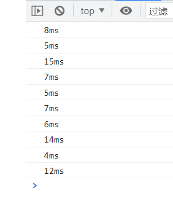
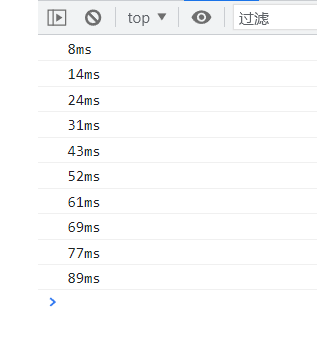

[TOC]


## 定时器延迟问题

### 使用 setInterval 实现计时

```js
  let count = 0;
  const startTime = new Date().getTime()
  const interval = setInterval(() => {
    count++;
    console.log(new Date().getTime() - (startTime + count*1000) + 'ms');
    if(count === 10){
      clearInterval(interval);
    }
  }, 1000)
```

`new Date().getTime() - (startTime + count * 1000)`理想情况下应该是 0ms，然而事实并不是这样，而是存在着误差：



**对代码的解释：**

- startTime 是获取计时器开始时的时间节点
- count 用来记录当前输出了多少次，当输出10次时我们就停止定时器
- new Date().getTime() - (startTime + count*1000) 的含义：
  - 这个式子用来获取时间差
  - new Date().getTime() 获取当前执行时的时间节点，那么减去开始时间节点就是时间差
  - 还要减去 count*1000 是因为：我们一共输出10次，所以对于每次的时间差，还要减去它前面几次定时器的时间，我们设置的是隔1s输出一次
- 关于 `clearInterval(interval)`，在 当前定时器 interval 中，我们是可以获取当前定时器的


### 使用 setTimeout 实现计时

```js
  let count = 0
  const startTime = new Date().getTime(), delay = 1000
  setTimeout(doFunc, delay)
  function doFunc(){
    count++
    console.log(new Date().getTime() - (startTime + count * 1000) + 'ms')
    if(count < 10){
      setTimeout(doFunc, delay)
    }
  }
```



setTimeout 也同样存在着误差，而且时间越来越大（setTimeout 需要在同步代码执行完成后才重新开始计时）


## 实现准时的setTimeout

### 方案一：while

想得到准确的，我们第一反应就是如果我们能够主动去触发，获取到最开始的时间，以及不断去轮询当前时间，如果差值是预期的时间，那么这个定时器肯定是准确的，那么用 while 可以实现这个功能。

```js
function timer(time) {
    const startTime = Date.now();
    while(true) {
        const now = Date.now();
        if(now - startTime >= time) { //一直轮询，不断计算是否到达了时间差
            console.log('误差', now - startTime - time);
            return;
        }
    }
}
timer(5000);
//打印：误差 0
```

显然这样的方式很精确，但是我们知道 js 是单线程运行，使用这样的方式强行霸占线程会使得页面进入卡死状态，这样的结果显然是不合适的。


### 方案二：Web Worker

那么既然无法在当前主线程避免这个误差，我们能否另开一个线程去处理呢？当然可以，JavaScript 也提供给我们这样一个能力，通过 Web Worker 我们就可以在另一个线程来运行我们的代码。

> Web Worker为Web内容在后台线程中运行脚本提供了一种简单的方法。线程可以执行任务而不干扰用户界面。       


剩下的方案的使用自己又看不懂，没必要再抄一遍，直接甩链接吧

[setTimeout不准时？你大意了](http://t.csdn.cn/uaRZh)


### 方法四：setTimeout 系统时间补偿

```js
function _timerSetInterval(fn, delay, ...args) {
  let current = Date.now();
  let timer = null;

  const task = () => {
    current += delay; //每次按道理讲：应该的正确时间点
    timer = setTimeout(() => {
      fn.apply(this, args);
      console.log('current: ', current, 'now: ', Date.now(), '差值: ', current - Date.now())
      task();
    }, current - Date.now()); //Date.now()是实际上的时间节点，按照延迟，它是比规定输出的时间点迟的，所以我们把时间向前提一点，也就是说这里的值是负数
  };

  task();
  return () => clearTimeout(timer);
}

let timer = _timerSetInterval(() => {
  console.log('123')
}, 1000)

setTimeout(() => {
  timer()
}, 8000);
```


**定时器里面的时间是可以为负数的**

```js
setTimeout(() => {
  console.log('3s');
  setTimeout(() => {
    console.log('-')
  }, 4500);
}, 5000);

setTimeout(() => {
  console.log('3s');
  setTimeout(() => {
    console.log('-')
  }, -4500);
}, 5000);

//上面这两种是不一样的
```


## 为什么setTimeout会有4ms的延时

对于4秒的标准：

不同浏览器的最低时延会不一致，比如 chrome 的最低时延是 `1ms`。而如果 timer 嵌套层级很多，那么最低时延是 `4ms`。具体嵌套层级的阈值不同浏览器也不一致，HTML Standard 当中是 `>5`，chrome 当中是 `>=5`。


### 既然追求低延迟，为什么不直接设置为 `0ms` 呢？

其原因在于如果浏览器允许 `0ms`，会导致 JavaScript 引擎过度循环，也就是说如果浏览器架构是单进程的，那么可能网站很容易无响应。因为浏览器本身也是建立在 event loop 之上的，如果速度很慢的 JavaScript engine 通过 0ms timer 不断安排唤醒系统，那么 event loop 就会被阻塞。那么此时用户会面对什么情况呢？同时遇到 CPU spinning 和基本挂起的浏览器，想想就让人崩溃。如果一个浏览器经常让用户体验到这种情况，绝对没人愿意用的，毕竟很少有人愿意受虐。这也是为什么 chrome 1.0 beta 设置的是 `1ms`。


### 一个疑惑的面试题

```js
  setTimeout(()=>console.log('输出0'),0);
  setTimeout(()=>console.log('输出1'),1);
```

先输出0还是先输出1

这里好像和放的位置有关系，并且好像侧面证明了Chrome浏览器是允许出现 0ms 延迟的


[为什么 setTimeout 有最小时延 4ms ?](https://zhuanlan.zhihu.com/p/155752686)

