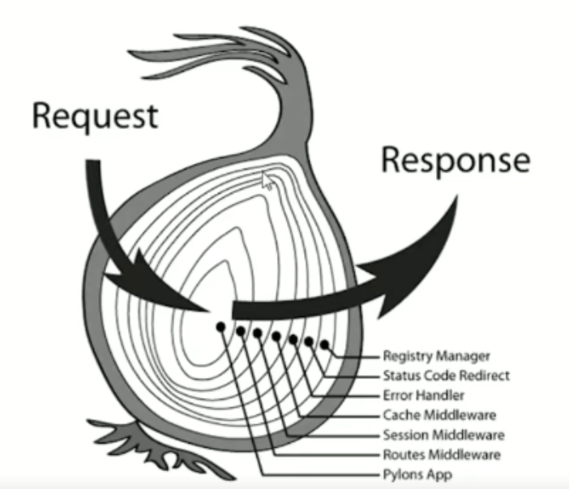
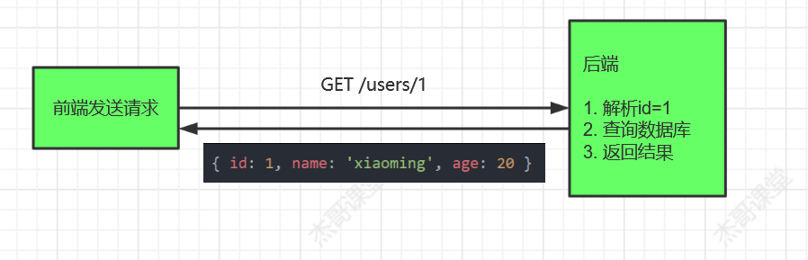
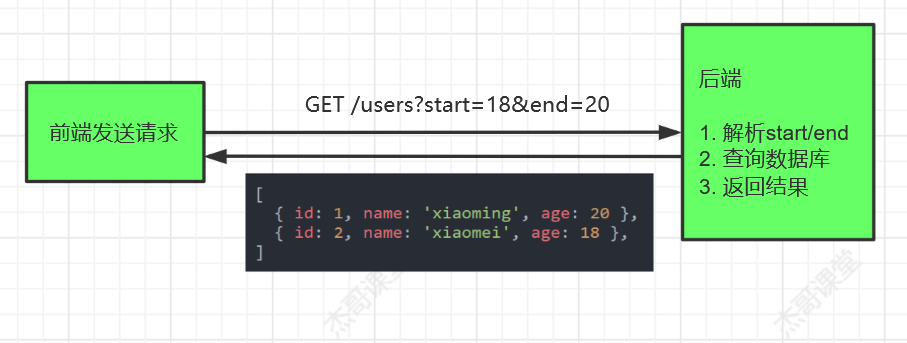
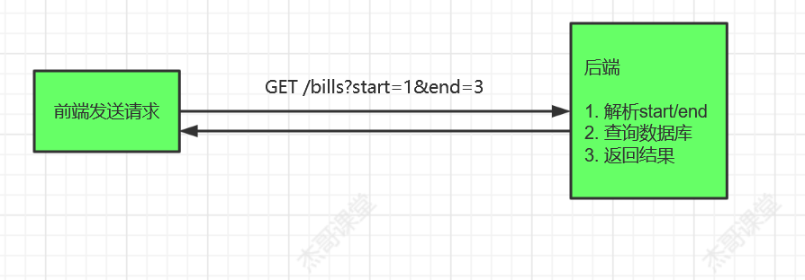
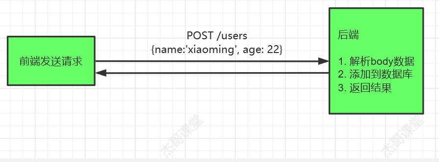
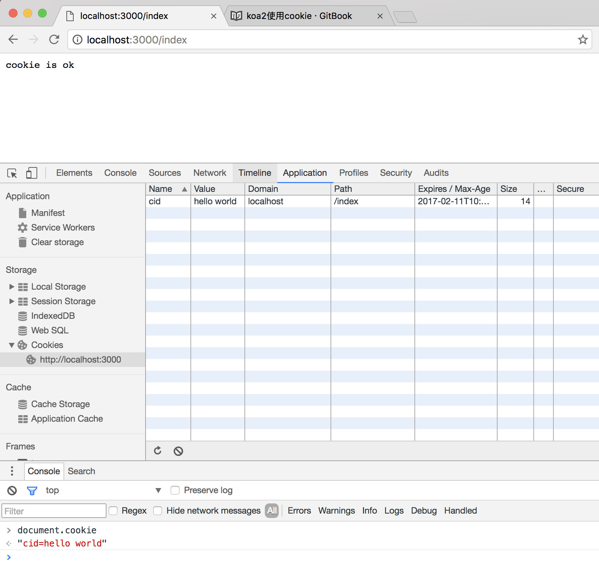
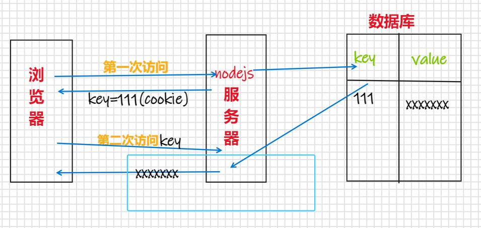
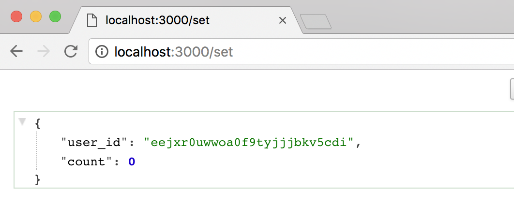
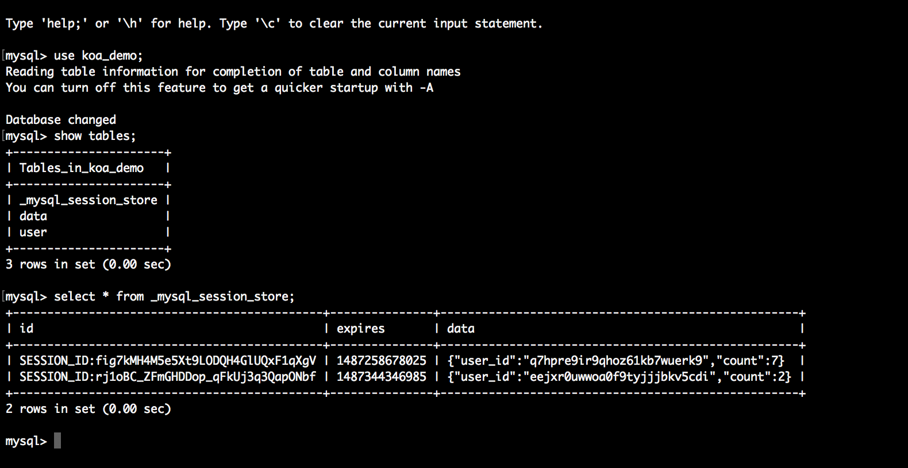

[TOC]


## 一、koa起步

### 1.项目初始化

执行 `npm init -y`, 生成package.json

```text
npm init -y
```

### 2.安装Koa

执行命令

```text
npm i koa
```

### 3.编写服务程序

编写`src/01_quickstart.js`

1. 导入koa包
2. 实例化app对象
3. 编写中间件
4. 启动服务, 监听3000端口

```js
// 一. 导入koa
const Koa = require('koa')
// 二. 实例化对象
const app = new Koa()
// 三. 编写中间件
app.use((ctx) => {
  ctx.body = 'hello Koa2'
})
// 四. 启动服务
app.listen(3000, () => {
  console.log('server is running on http://localhost:3000')
})
```

注意：`ctx.body`是返回给客户端的响应, 如果没有通过`ctx.body`返回给客户端, 最终会得到`Not Found`


## 二、中间件

### 1 基本概念

#### 1) 什么叫中间件

顾名思义, 中间件就是在什么的中间

> 在请求和响应中间的处理程序

有时候从请求到响应的业务比较复杂, 将这些复杂的业务拆开成一个个功能独立的**函数**, 就是**中间件**

对于处理请求来说，在响应发出之前，可以在请求和响应之间做一些操作，并且可以将这个处理结果传递给下一个函数继续处理

```text
中间件函数，帮助拆解主程序的业务逻辑，
并且每一个的中间件函数处理的结果都会传递给下一个中间件函数。
就好比工厂里流水线工人清洗一个箱子:
第一个人清洗侧面，第二个人清洗底面，第三个人清洗顶面，。。。
这条流水线结束后，箱子也就清洗干净了
各做各的，不相互影响，又彼此协作
```

#### 2) 基本使用

```js
// 一. 导入koa
const Koa = require('koa')
// 二. 实例化对象
const app = new Koa()
// 三. 编写中间件
app.use((ctx, next) => {
  console.log('我来组成身体')
  next()
})
app.use((ctx, next) => {
  console.log('我来组成头部')
  next()
})
app.use((ctx) => {
  console.log('---------')
  ctx.body = '组装完成'
})
// 四. 启动服务
app.listen(3000, () => {
  console.log('server is running on http://localhost:3000')
})
```

输出结果

```text
我来组成身体
我来组成头部
----------
```

#### 3) 链式调用

app.use`实际上会返回`this

上述代码可以写成

```js
// 一. 导入koa
const Koa = require('koa')
// 二. 实例化对象
const app = new Koa()
// 三. 编写中间件
app
  .use((ctx, next) => {
    console.log('我来组成身体')
    next()
  })
  .use((ctx, next) => {
    console.log('我来组成头部')
    next()
  })
  .use((ctx) => {
    console.log('---------')
    ctx.body = '组装完成'
  })
// 四. 启动服务
app.listen(3000, () => {
  console.log('server is running on http://localhost:3000')
})
```


### 2.洋葱圈模型



```js
// 1. 导入koa包
const Koa = require('koa')
// 2. 实例化对象
const app = new Koa()
// 3. 编写中间件
app.use((ctx, next) => {
  console.log(1)
  next()
  console.log(2)
  console.log('---------------')
  ctx.body = 'hello world'
})

app.use((ctx, next) => {
  console.log(3)
  next()
  console.log(4)
})

app.use((ctx)=>{
  console.log(5)
})
// 4. 监听端口, 启动服务
app.listen(3000)
console.log('server is running on http://localhost:3000')
```

当我们发送请求后，返回结果为：

```
1
3
5
4
2
---------------
```

**解释**

当我们执行第一个中间件时，首先输出1，然后调用next()，那么此时它会等第二个中间件执行完毕才会继续执行第一个中间件。然后执行第二个中间件，输出3，调用next()，执行第三中间件，输出5.此时第三个中间件执行完毕，返回到第二个中间件，输出4，然后返回到第一个中间件。

**其实很像递归**


### 3.异步处理

如果中间件中存在一些异步的代码, Koa也提供了统一的处理方式.

我们可以使用 async await语法

**demo**

1. 在middleware1中, 构造一个message = aa
2. 在middleware2中, 同步追加bb
3. 在middleware3中, 异步追加cc

最终在middleware1中, 通过body返回数据

```js
// 1. 导入koa包
const Koa = require('koa')
// 2. 实例化对象
const app = new Koa()
// 3. 编写中间件
app.use(async (ctx, next) => {
  ctx.message = 'aa'
  await next();
  ctx.body = ctx.message
})

app.use(async (ctx, next) => {
  ctx.message += 'bb';
  await next();
})

app.use(async (ctx)=>{
  const res = await Promise.resolve('cc');
  ctx.message += res
})
// 4. 监听端口, 启动服务
app.listen(3000, () => {
  console.log('server is running on http://localhost:3000')
})
```

客户端最终会返回：aabbcc


## 三、路由

### 1.什么是路由

> 路由
>
> - 建立URL和处理函数之间的对应关系
> - **主要作用**: 根据不同的Method和URL返回不同的内容


**需求**

根据不同的Method+URL, 返回不同的内容

- Get 请求/, 返回'这是主页'
- Get 请求/users, 返回'这是用户页'
- Post请求/users, 返回'创建用户'

```js
// 一. 导入koa
const Koa = require('koa')
// 二. 实例化对象
const app = new Koa()
// 三. 编写中间件
app.use((ctx) => {
  if (ctx.url == '/') {
    ctx.body = '这是主页'
  } else if (ctx.url == '/users') {
    if (ctx.method == 'GET') {
      ctx.body = '这是用户列表页'
    } else if (ctx.method == 'POST') {
      ctx.body = '创建用户'
    } else {
      ctx.status = 405 // 不支持的请求方法
    }
  } else {
    ctx.status = 404
  }
})
// 四. 启动服务
app.listen(3000, () => {
  console.log('server is running on http://localhost:3000')
})
```


### 2.使用koa-router

#### 1) 安装

```text
npm i koa-router
```

#### 2) 使用

在koa的基础上

1. 导入`koa-router`包
2. 实例化router对象
3. 使用router处理路由
4. 注册中间件

```js
// 一. 导入koa
const Koa = require('koa')
// 二. 实例化对象
const app = new Koa()

// 三. 导入koa-router, 实例化路由对象
const Router = require('koa-router')
const router = new Router()
router.get('/', (ctx) => {
  ctx.body = '这是主页'
})
router.get('/users', (ctx) => {
  ctx.body = '这是用户页'
})
router.post('/users', (ctx) => {
  ctx.body = '创建用户页'
})
// 四. 注册路由中间件
app.use(router.routes())
app.use(router.allowedMethods())//该方法使得可以返回错误状态码404或者5xx
// 五. 启动服务
app.listen(3000, () => {
  console.log('server is running on http://localhost:3000')
})
```

#### 3) 优化

我们最好将一个模块放到一个单独的文件中. 分离出一个router路由层

创建`src/router/user.route.js`

```js
// 导入koa-router, 实例化路由对象
const Router = require('koa-router')
const router = new Router()

router.get('/users', (ctx) => {
  ctx.body = '这是用户页'
})
router.post('/users', (ctx) => {
  ctx.body = '创建用户页'
})

module.exports = router
```

再导入

```js
// 一. 导入koa
const Koa = require('koa')
// 二. 实例化对象
const app = new Koa()

const userRouter = require('./router/user.route')

// 四. 注册路由中间件
app.use(userRouter.routes()).use(userRouter.allowedMethods())

// 五. 启动服务
app.listen(3000, () => {
  console.log('server is running on http://localhost:3000')
})
```

可以进一步优化, 使代码更加简洁

给路由设置一个统一的前缀

```js
// 导入koa-router, 实例化路由对象
const Router = require('koa-router')
const router = new Router({ prefix: '/users' })

router.get('/', (ctx) => {
  ctx.body = '这是用户页'
})
router.post('/', (ctx) => {
  ctx.body = '创建用户页'
})

module.exports = router
```


## 四、请求参数解析

### 1.为什么

在很多场景中, 后端都需要解析请求的参数, 做为数据库操作的条件

**场景一**：

前端希望通过请求, 获取id=1的用户信息



接口设计

```text
GET /users/:id
```


**场景二：**

前端希望查询年龄在18到20的用户信息



前端希望查询1月到3月的账单信息



接口设计

```text
GET /bills?start=1&end=3
```

**场景三：**

前端注册, 填写了用户名, 年龄, 传递给后端, 后端需要解析这些数据, 保存到数据库




### 2.处理query参数

在GET请求中, 如果以键值对的形式传参, 可以通过`query`得到

```js
//在这里我们模拟一个数据库
const db = [
    {id: 1, name: 'xiaoming', age: 20},
    {id: 2, name: 'xiaomei', age: 18},
    {id: 3, name: 'xiaopang', age: 12},
]


// GET /users?start=18&end=20 ---- 获取所有的用户信息, 返回一个数组
router.get('/', (ctx) => {
  // 通过 ctx.query 是ctx.request.query的代理 解析键值对参数
  const { start = 0, end = 0 } = ctx.query
  const res = db.filter((item) => item.age >= start && item.age <= end)
  // 解析键值对
  res.length == 0 ? ctx.throw(404) : (ctx.body = res)
})
```


### 2.处理params参数

在GET请求中, 有些参数可以通过路由传参, 可以通过`params`得到

```js
// GET /users/:id ---- 根据id获取单个用户的信息, 返回一个对象
router.get('/:id', (ctx) => {
  // 解析id参数
  const id = ctx.params.id
  const res = db.filter((item) => item.id == id)

  if (!res[0]) ctx.throw(404)

  ctx.body = res[0]
})
```


### 3.处理body参数

Koa原生支持body参数解析, 通常借助社区的中间件实现. 官方推荐的有

- koa-bodyparser
- koa-body

#### 1) 安装koa-body

```text
npm install koa-body
```

#### 2) 注册

```js
// 注册KoaBody中间件, 解析请求体中的参数, 挂载到ctx.request.body
const KoaBody = require('koa-body')
app.use(KoaBody())
```

#### 3) 使用

通过`ctx.request.body`获取请求体中的数据

```js
router.post('/', (ctx) => {
	console.log(ctx.request.body);
	ctx.body = '创建用户'
})
```


## 五、错误处理

对于接口编程, 错误处理是非常重要的环节, 通过提供更友好的提示

1. 提高错误定位的效率
2. 提高代码的稳定性和可靠性

### 1.原生的错误处理

一般Koa中的错误分为三类

- 404: 当请求的资源找不到, 或者没有通过`ctx.body`返回时, 由koa自动返回
- 手动抛出: 通过`ctx.throw`手动抛出
- 500: 运行时错误

Koa类是继承Emitter类, 因此可以

- 通过emit提交一个错误
- 通过on进行统一错误处理

```js
// 该代码放在最后
app.on('error', (err, ctx) => {
  console.error(err)
  ctx.body = err
})
```


### 2.使用中间件

#### 1) 安装

```text
npm i koa-json-error
```

#### 2) 使用

> 基本使用

```js
const error = require('koa-json-error')
app.use(error())
```


> 高级使用

```js
const error = require('koa-json-error')
app.use(
  error({
    format: (err) => { // 返回错误的格式
      return { code: err.status, message: err.message, result: err.stack }
    },
    postFormat: (err, obj) => { //根据不同环境，返回不同格式的错误信息
      const { result, ...rest } = obj
      return process.env.NODE_ENV == 'production' ? rest : obj
    },
  })
)
```


## 六、访问静态资源 koa-static

安装中间件：

```
npm install --save koa-static
```

使用：

```js
const Koa = require('koa')
const path = require('path')
const static = require('koa-static')

const app = new Koa()

const staticPath = './static'

app.use(static(path.join(__dirname,staticPath))) //静态资源路径的拼接

app.use(async (ctx) => {
  ctx.body = 'hello world'
})

app.listen(3000,() => {
  console.log('server is running on http://localhost:3000')
})
```


## 七、模板引擎ejs

### 安装模块

```sh
# 安装koa模板使用中间件
npm install --save koa-views

# 安装ejs模板引擎
npm install --save ejs
```


### demo

#### 文件目录

```
├── package.json
├── index.js
└── view
    └── index.ejs
```

#### ./index.js文件

```js
const Koa = require('koa')
const views = require('koa-views')
const path = require('path')
const app = new Koa()

// 加载模板引擎
app.use(views(path.join(__dirname, './view'), {
  extension: 'ejs'
}))

app.use( async ( ctx ) => {
  let title = 'hello koa2'
  await ctx.render('index', {
    title,
  })
})

app.listen(3000)
```

#### ./view/index.ejs 模板

```html
<!DOCTYPE html>
<html>
<head>
    <title><%= title %></title>
</head>
<body>
    <h1><%= title %></h1>
    <p>EJS Welcome to <%= title %></p>
</body>
</html>
```


## 八、koa2使用cookie

### 使用方法

koa提供了从上下文直接读取、写入cookie的方法

- ctx.cookies.get(name, [options]) 读取上下文请求中的cookie
- ctx.cookies.set(name, value, [options]) 在上下文中写入cookie

koa2 中操作的cookies是使用了npm的cookies模块，所以在读写cookie的使用参数与该模块的使用一致。

### 例子代码

```js
const Koa = require('koa')
const app = new Koa()

app.use( async ( ctx ) => {

  if ( ctx.url === '/index' ) {
    ctx.cookies.set(
      'cid', 
      'hello world',
      {
        domain: 'localhost',  // 写cookie所在的域名
        path: '/index',       // 写cookie所在的路径
        maxAge: 10 * 60 * 1000, // cookie有效时长
        expires: new Date('2017-02-15'),  // cookie失效时间
        httpOnly: false,  // 是否只用于http请求中获取
        overwrite: false  // 是否允许重写
      }
    )
    ctx.body = 'cookie is ok'
  } else {
    ctx.body = 'hello world' 
  }

})

app.listen(3000, () => {
  console.log('[demo] cookie is starting at port 3000')
})
```

### 运行例子

- 可以在控制台的cookie列表中中看到写在页面上的cookie
- 在控制台的console中使用document.cookie可以打印出在页面的所有cookie（需要是httpOnly设置false才能显示）




## 九、koa2使用session

当浏览器访问服务器并发送第一次请求时，服务器端会创建一个session对象，生成一个类似于key,value的键值对，然后将key(cookie)返回到浏览器(客户)端，浏览器下次在访问时，携带key(cookie)，找到对应的session(value).客户的信息都保存在session中。




在koa2中实现session的方案有一下几种

- 如果session数据量很小，可以直接存在内存中
- 如果session数据量很大，则需要存储介质存放session数据

### 数据库存储方案

- 将session存放在MySQL数据库中
- 需要用到中间件
  - **koa-session-minimal** 适用于koa2 的session中间件，提供存储介质的读写接口 。
  - **koa-mysql-session** 为koa-session-minimal中间件提供MySQL数据库的session数据读写操作。
  - 将sessionId和对于的数据存到数据库
- 将数据库的存储的sessionId存到页面的cookie中
- 根据cookie的sessionId去获取对于的session信息


### 案例

```js
const Koa = require('koa')
const session = require('koa-session-minimal')
const MysqlSession = require('koa-mysql-session')

const app = new Koa()

// 配置存储session信息的mysql
let store = new MysqlSession({
  user: 'root',
  password: 'abc123',
  database: 'koa_demo',
  host: '127.0.0.1',
})

// 存放sessionId的cookie配置
let cookie = {
  maxAge: '', // cookie有效时长
  expires: '',  // cookie失效时间
  path: '', // 写cookie所在的路径
  domain: '', // 写cookie所在的域名
  httpOnly: '', // 是否只用于http请求中获取
  overwrite: '',  // 是否允许重写
  secure: '',
  sameSite: '',
  signed: '',

}

// 使用session中间件
app.use(session({
  key: 'SESSION_ID',
  store: store,
  cookie: cookie
}))

app.use( async ( ctx ) => {

  // 设置session
  if ( ctx.url === '/set' ) {
    ctx.session = {
      user_id: Math.random().toString(36).substr(2),
      count: 0
    }
    ctx.body = ctx.session
  } else if ( ctx.url === '/' ) {

    // 读取session信息
    ctx.session.count = ctx.session.count + 1
    ctx.body = ctx.session
  } 

})

app.listen(3000)
console.log('[demo] session is starting at port 3000')
```


### 运行例子

#### 访问连接设置session：

http://localhost:3000/set



#### 查看数据库session是否存储




#### 查看cookie中是否种下了sessionId

http://localhost:3000


## 十、log4js日志

### 安装 log4js

```
npm install log4js --save
```


### 基本使用

```js
const log4js = require("log4js"); // 引入 log4js
const logger = log4js.getLogger(); // 获得 default category 
logger.level = "debug"; // 设置 level
logger.debug("调试信息"); // 输出日志

// 输出： [2020-10-31T16:02:24.527] [DEBUG] default - 调试信息
```


**logger的类型**

```js
const logger = log4js.getLogger(); // 获取到 default 分类
logger.level = "debug"; // 设置 level

//设置不同日志的类型
logger.trace("Entering cheese testing");
logger.debug("Got cheese.");
logger.info("Cheese is Comté.");
logger.warn("Cheese is quite smelly.");
logger.error("Cheese is too ripe!"); // 从这里开始写入日志文件
logger.fatal("Cheese was breeding ground for listeria.");
```


### 对日志进行配置

```js
const log4js = require("log4js");
// 对日志进行配置
log4js.configure({
    // 指定输出文件类型和文件名,这里将日志写入cheese.log文件中
    appenders: { cheese: { type: "file", filename: "cheese.log" } }, 
    // appenders 指定了日志追加到 cheese
    // level 设置为 error
    categories: { default: { appenders: ["cheese"], level: "error" } } 
});

const logger = log4js.getLogger(); // 获取到 default 分类
logger.trace("Entering cheese testing");
logger.debug("Got cheese.");
logger.info("Cheese is Comté.");
logger.warn("Cheese is quite smelly.");
logger.error("Cheese is too ripe!"); // 从这里开始写入日志文件
logger.fatal("Cheese was breeding ground for listeria.");
```

从上面的设置看到 `appenders` 指定了日志追加到 `cheese`（也就是cheese.log）里面去，`level` 设置为 `"error"`，也就是说只有日志等级大于 `"error"` 的才会添加到 log 文件。

当执行了上面的代码，可以看到项目目录里面多了一个 cheese.log 文件，内如如下：

```
[2020-10-31T16:26:17.188] [ERROR] default - Cheese is too ripe!
[2020-10-31T16:26:17.194] [FATAL] default - Cheese was breeding ground for listeria.
```


### log4js实战

在真实开发中，我们会对log4js进行抽离，配置包括**访问方法**、**请求原始地址**、**客户端 IP**、**响应状态码**、**响应内容**、**错误名称**、**错误信息**、**错误详情**、**服务器响应时间**。并且使用中间件对每次请求和响应生效。


**配置**

在 `config/config.js` 文件中，来对 log4js 编写一些配置：

```js
// config/config.js

const CONFIG = {
    "API_PREFIX": "/api", // 配置了路由前缀
    "LOG_CONFIG":
        {
            "appenders": {
                "error": {
                    "category": "errorLogger",      // logger 名称
                    "type": "dateFile",             // 日志类型为 dateFile
                    "filename": "logs/error/error", // 日志输出位置
                    "alwaysIncludePattern": true,   // 是否总是有后缀名
                    "pattern": "yyyy-MM-dd-hh.log"  // 后缀，每小时创建一个新的日志文件
                },
                "response": {
                    "category": "resLogger",
                    "type": "dateFile",
                    "filename": "logs/response/response",
                    "alwaysIncludePattern": true,
                    "pattern": "yyyy-MM-dd-hh.log"
                }
            },
            "categories": {
                "error": {
                    "appenders": ["error"],         // 指定日志被追加到 error 的 appenders 里面
                    "level": "error"                // 等级大于 error 的日志才会写入
                },
                "response": {
                    "appenders": ["response"],
                    "level": "info"
                },
                "default": {
                    "appenders": ["response"],
                    "level": "info"
                }
            }
        }
};
module.exports = CONFIG;
```

写好了配置，接下来就是使用配置，先来看一下使用的代码示例：

```js
const log4js = require("log4js");
const CONFIG = require('./config/config');
// 对日志进行配置
log4js.configure(CONFIG);

// 分别获取到 categories 里面的 error 和 response 元素
// 目的是为了输出错误日志和响应日志
const errorLogger = log4js.getLogger('error'); 
const resLogger = log4js.getLogger('response');

// 输出日志
errorLogger.error('错误日志');
resLogger.info('响应日志');
```

运行完成之后，可以在 log 目录查看到对应的日志文件，里面的内容分别如下：

错误日志

```
[2020-10-31T17:12:37.263] [ERROR] error - 错误日志
```

响应日志

```
[2020-10-31T17:12:37.265] [INFO] response - 响应日志
```

#### 日志格式

我们关心用户请求的信息有哪些？这里列出关注的日志内容，包括**访问方法**、**请求原始地址**、**客户端 IP**、**响应状态码**、**响应内容**、**错误名称**、**错误信息**、**错误详情**、**服务器响应时间**。

为了使请求产生的 log 方便查看，新增一个文件 `app/util/log_format.js` 来统一格式：

```js
// app/util/log_format.js

const log4js = require('log4js');

const { LOG_CONFIG } = require('../../config/config'); //加载配置文件
log4js.configure(LOG_CONFIG);

let logFormat = {};

// 分别获取到 categories 里面的 error 和 response 元素
// 目的是为了输出错误日志和响应日志
let errorLogger = log4js.getLogger('error');
let resLogger = log4js.getLogger('response');

//封装错误日志
logFormat.error = (ctx, error, resTime) => {
    if (ctx && error) {
        errorLogger.error(formatError(ctx, error, resTime));
    }
};

//封装响应日志
logFormat.response = (ctx, resTime) => {
    if (ctx) {
        resLogger.info(formatRes(ctx, resTime));
    }
};

//格式化响应日志
const formatRes = (ctx, resTime) => {
    let responserLog = formatReqLog(ctx.request, resTime); // 添加请求日志
    responserLog.push(`response status: ${ctx.status}`); // 响应状态码
    responserLog.push(`response body: \n${JSON.stringify(ctx.body)}`); // 响应内容
    responserLog.push(`------------------------ end\n`); // 响应日志结束
    return responserLog.join("\n");
};

//格式化错误日志
const formatError = (ctx, err, resTime) => {
    let errorLog = formatReqLog(ctx.request, resTime); // 添加请求日志
    errorLog.push(`err name: ${err.name}`); // 错误名称
    errorLog.push(`err message: ${err.message}`); // 错误信息
    errorLog.push(`err stack: ${err.stack}`); // 错误详情
    errorLog.push(`------------------------ end\n`); // 错误信息结束
    return errorLog.join("\n");
};

// 格式化请求日志
const formatReqLog = (req, resTime) => {
    let method = req.method;
    // 访问方法 请求原始地址 客户端ip
    let formatLog = [`\n------------------------ ${method} ${req.originalUrl}`, `request client ip: ${req.ip}`];

    if (method === 'GET') { // 请求参数
        formatLog.push(`request query: ${JSON.stringify(req.query)}\n`)
    } else {
        formatLog.push(`request body: ${JSON.stringify(req.body)}\n`)
    }

    formatLog.push(`response time: ${resTime}`); // 服务器响应时间
    return formatLog;
};

module.exports = logFormat;
```

这段 JavaScript 最终返回了一个 `logFormat` 对象的工具，提供了 `response` 和 `error` 记录前面提到的必要信息，接下来就需要在中间件里面去使用。

#### logger 中间件

有了 log4js 的配置并且统一格式之后，我们需要将它们都做进一个中间件中，这样才能对每次请求和响应生效，下面来创建一个中间件 `logger` ：

```js
// app/middleware/logger.js

const logFormat = require('../util/log_format');

const logger = () => {
    return async (ctx, next) => {
        const start = new Date(); //开始时间
        let ms; //间隔时间
        try {
            await next(); // 下一个中间件
            ms = new Date() - start;
            logFormat.response(ctx, `${ms}ms`); //记录响应日志
        } catch (error) {
            ms = new Date() - start;
            logFormat.error(ctx, error, `${ms}ms`); //记录异常日志
        }
    }
};

module.exports = logger;
```

#### 使用

中间件 `logger` 已经建立好，下面来使用这个中间件：

```js
// ...

// 引入logger
+ const logger = require('./app/middleware/logger');

// 使用模板引擎
// ...

+ app.use(logger()); // 处理log的中间件

// ...

app.listen(3000, () => {
    console.log('App started on http://localhost:3000/api')
});
```

完成这一节实战之后，整个文件目录如下：

```js
koa-blog
├── package.json
├── app.js
├── app
│   ├── middleware //logger 中间件,我们最终将这个中间件在 app.js中引入并使用即可
│   |   └── logger.js
|   |
│   └── util
│      └── log_format.js  //配置日志格式的文件
|
├── logs //最终生成的日志的存放路径
│   ├── error
│   └── response
└── config
    └── config.js //对日志的配置，即 log4js.configure
```

当然，我们不需要将 `logs` 目录提交到 git 仓库，我们可以在 `.gitignore` 文件中将其忽略。


**参考**

[《Koa2进阶学习笔记》已完结](https://chenshenhai.github.io/koa2-note/)

[从零开始的Koa实战](https://github.com/YuQian2015/koa-blog)