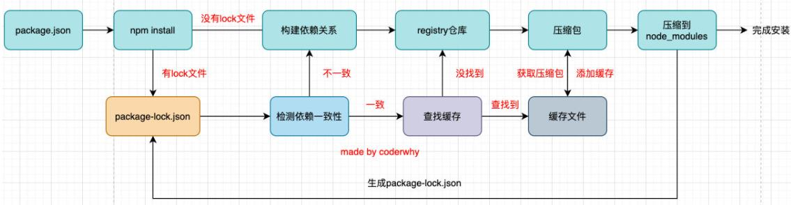
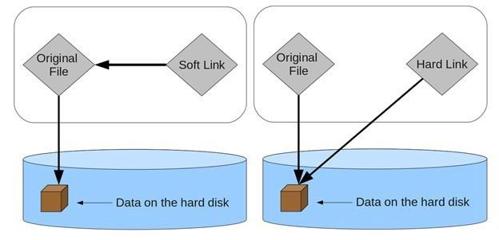
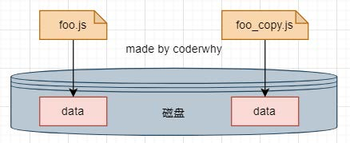
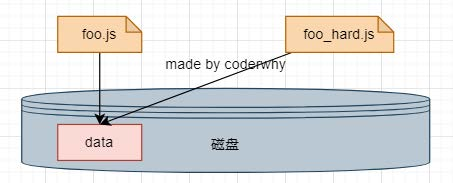
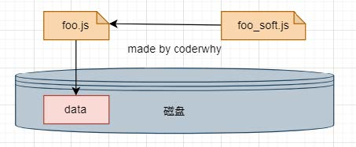
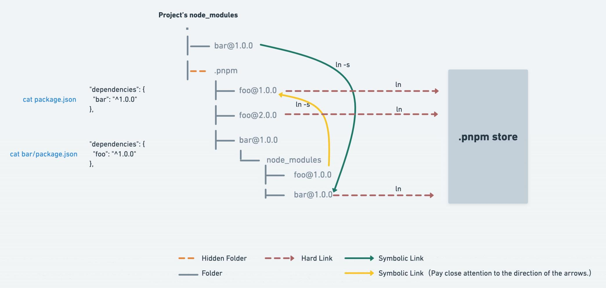

# 包管理工具详解npm、yarn、cnpm、npx、pnpm

[TOC]


## 包管理工具npm

包管理工具npm： 

- Node Package Manager，也就是Node包管理器； 
- 但是目前已经不仅仅是Node包管理器了，在前端项目中我们也在使用它来管理依赖的包； 
- 比如vue、vue-router、vuex、express、koa、react、react-dom、axios、babel、webpack等等； 

  

如何下载和安装npm工具呢？ 

 - npm属于node的一个管理工具，所以我们需要先安装Node； 
 - node管理工具：https://nodejs.org/en/，安装Node的过程会自动安装npm工具； 


npm管理的包可以在哪里查看、搜索呢？ 

- https://www.npmjs.org/ 

 - 这是我们安装相关的npm包的官网； 


npm管理的包存放在哪里呢？

- 我们发布自己的包其实是发布到registry上面的；

- 当我们安装一个包时其实是从registry上面下载的包；


### package.json文件

这个配置文件如何得到呢？ 

方式一：手动从零创建项目，npm init –y 

方式二：通过脚手架创建项目，脚手架会帮助我们生成package.json，并且里面有相关的配置

```
npm init  #创建时填写信息
npm init -y  #所有信息使用默认的
```


必须填写的属性：name、version 

- name是项目的名称； 

- version是当前项目的版本号； 

- description是描述信息，很多时候是作为项目的基本描述； 

- author是作者相关信息（发布时用到）； 

- license是开源协议（发布时用到）； 


private属性： 

- private属性记录当前的项目是否是私有的； 

- 当值为true时，npm是不能发布它的，这是防止私有项目或模块发布出去的方式；


main属性： 

- 设置程序的入口。 

  - 比如我们使用axios模块 const axios = require('axios'); 

  - 如果有main属性，实际上是找到对应的main属性查找文件的；


scripts属性 

- scripts属性用于配置一些脚本命令，以键值对的形式存在； 

- 配置后我们可以通过 npm run 命令的key来执行这个命令； 

- npm start和npm run start的区别是什么？ 

  - 它们是等价的； 

  - 对于常用的 start、 test、stop、restart可以省略掉run直接通过 npm start等方式运行；


dependencies属性 

- dependencies属性是指定无论开发环境还是生成环境都需要依赖的包； 

- 通常是我们项目实际开发用到的一些库模块vue、vuex、vue-router、react、react-dom、axios等等； 

- 与之对应的是devDependencies；


devDependencies属性 

- 一些包在生成环境是不需要的，比如webpack、babel等； 

- 这个时候我们会通过 npm install webpack --save-dev，将它安装到devDependencies属性中；


peerDependencies属性 

- 还有一种项目依赖关系是对等依赖，也就是你依赖的一个包，它必须是以另外一个宿主包为前提的； 

- 比如element-plus是依赖于vue3的，ant design是依赖于react、react-dom；


optionalDependencies

optionalDependencies 字段用于设置一些项目中的可选包，这些包不一定要下载，但是却很有用，设置在该字段下后，对应的包只会在需要的时候被下载，比如 fsevents 模块，尽在 mac 下有效。


补充：

**依赖的版本管理**

我们会发现安装的依赖版本出现：^2.0.3或~2.0.3，这是什么意思呢？

npm的包通常需要遵从semver版本规范：

semver版本规范是X.Y.Z： 

- X主版本号（major）：当你做了不兼容的 API 修改（可能不兼容之前的版本）； 

- Y次版本号（minor）：当你做了向下兼容的功能性新增（新功能增加，但是兼容之前的版本）； 

- Z修订号（patch）：当你做了向下兼容的问题修正（没有新功能，修复了之前版本的bug）；

我们这里解释一下 ^和~的区别： 

- x.y.z：表示一个明确的版本号； 

- ^x.y.z：表示x是保持不变的，y和z永远安装最新的版本； 

- ~x.y.z：表示x和y保持不变的，z永远安装最新的版本；


engines属性 

- engines属性用于指定Node和NPM的版本号； 

- 在安装的过程中，会先检查对应的引擎版本，如果不符合就会报错； 

- 事实上也可以指定所在的操作系统 "os" : [ "darwin", "linux" ]，只是很少用到；


局部安装分为开发时依赖和生产时依赖： 

默认安装开发和生产依赖 

npm install axios 

npm i axios 


开发依赖：在打包上线时并不需要

npm install webpack --save-dev 

npm install webpack -D 

npm i webpack –D


### npm install 原理

很多同学之前应该已经会了 npm install ，但是你是否思考过它的内部原理呢？ 

- 执行 npm install它背后帮助我们完成了什么操作？ 

- 我们会发现还有一个称之为package-lock.json的文件，它的作用是什么？ 

- 从npm5开始，npm支持缓存策略（来自yarn的压力），缓存有什么作用呢？




npm install会检测是有package-lock.json文件：

没有lock文件 

- 分析依赖关系，这是因为我们可能包会依赖其他的包，并且多个包之间会产生相同依赖的情况； 

- 从registry仓库中下载压缩包（如果我们设置了镜像，那么会从镜像服务器下载压缩包）； 

- 获取到压缩包后会对压缩包进行缓存（从npm5开始有的）； 

- 将压缩包解压到项目的node_modules文件夹中（前面我们讲过，require的查找顺序会在该包下面查找）

有lock文件 

- 检测lock中包的版本是否和package.json中一致（会按照semver版本规范检测）； 
  - 不一致，那么会重新构建依赖关系，直接会走顶层的流程； 

- 一致的情况下，会去优先查找缓存 
  - 没有找到，会从registry仓库下载，直接走顶层流程； 

- 查找到，会获取缓存中的压缩文件，并且将压缩文件解压到node_modules文件夹中；


### npm install 和 npm ci 有什么区别呢？

#### npm install

`npm install`，或者 `npm i`，通常是用来安装依赖项：

- 它将会安装 Node.js 项目所有的依赖项；
- 如果使用 `^` 或 `~` 来匹配依赖项的版本时，则 npm 可能无法安装确切版本；
- 利用 `npm install` 安装新依赖项时，会更新 package-lock.json。


#### npm ci

别被它的名字骗了。`npm ci` 并不仅仅适用于持续集成系统，在日常开发中，`npm ci` 非常实用。和 `npm install` 不同，`npm ci` 根据 `package-lock.json` 安装依赖，这可以保证整个开发团队都**使用版本完全一致的依赖**，避免把时间浪费在排查因为依赖不一致而导致的各种奇怪问题上。

不仅如此，`npm ci` 还有一个很好的副作用，**加快 node 模块安装速度**。因为 `npm ci` 直接根据 `package-lock.json` 中指定的版本安装，无需计算求解依赖满足问题，在大多数情况下都可以大大加速 node 模块安装过程。

使用 `npm ci`，会发生：

- 自动删除 node_modules。当 `npm ci` 时，如果 node_modules 存在，则自动删除它，这是为了保证一个干净的 node_modules 环境，避免遗留旧版本库的副作用。
- package-lock.json 必须存在。`package-lock.json` 用于锁住 package 的版本号，避免在生产环境中因版本导致的构建错误或者运行时错误，对于前端工程化也意义非凡。简单来说，就是 `npm ci` 根据 `package-lock.json` 安装依赖
- 不像 `npm install`，`npm ci` 不会修改你的 `package-lock.json`。但是它确实期望你的项目中有一个 `package-lock.json` 文件 - 如果你没有这个文件，`npm ci` 将不起作用，此时必须使用 `npm install`。
- 不能单独装包。这一条很容易解释，它适用于持续集成环境中，无法单独装包，例如无法仅仅安装 `lodash`。


#### npm ci vs npm install — 该用哪一个？

**如果你使用 npm v6+** ：

- 使用 npm install 安装新的依赖项，或更新现有的依赖项（例如，从版本1到版本2）;
- 在持续集成工具中运行时使用 `npm ci`，或者某些不修改 package-lock.json 的情况下安装依赖项。

**如果你使用 npm v5 或者更低的版本**：

- 只能通过 `npm install` 来安装或者更新依赖项；
- 尝试升级到最新的 npm 版本。除了`npm ci` 之外，它还具有 `npm audit` 命令，可以更轻松地识别和修复依赖项的安全漏洞。此外，使用 `npm v6` 安装依赖项应该更快。


### 运行 npm run xxx 的时候发生了什么？

👉 [vue|运行 npm run xxx 的时候发生了什么？](https://juejin.cn/post/7122267489798471716)

   [三面面试官：运行 npm run xxx 的时候发生了什么？](https://juejin.cn/post/7078924628525056007)


### package-lock.json

package-lock.json文件解析： 

- name：项目的名称； 

- version：项目的版本； 

- lockfileVersion：lock文件的版本； 

- requires：使用requires来跟踪模块的依赖关系；

- dependencies：项目的依赖 

  - 当前项目依赖axios，但是axios依赖follow-redireacts； 

  - axios中的属性如下： 
    - version表示实际安装的axios的版本； 
    - resolved用来记录下载的地址，registry仓库中的位置； 
    - requires/dependencies记录当前模块的依赖； 
    - integrity用来从缓存中获取索引，再通过索引去获取压缩包文件；


### npx工具

npx是npm5.2之后自带的一个命令。 

- npx的作用非常多，但是比较常见的是使用它来调用项目中的某个模块的指令。 

我们以webpack为例： 

- 全局安装的是webpack5.1.3 

- 项目安装的是webpack3.6.0 

如果我在终端执行 webpack --version使用的是哪一个命令呢？ 

- 显示结果会是 webpack 5.1.3，事实上使用的是全局的，为什么呢？ 

- 原因非常简单，在当前目录下找不到webpack时，就会去全局找，并且执行命令；


### 局部命令的执行

那么如何使用项目（局部）的webpack，常见的是两种方式： 

- 方式一：明确查找到node_module下面的webpack 

- 方式二：在 scripts定义脚本，来执行webpack；

方式一：在终端中使用如下命令（在项目根目录下）

```
./node_modules/.bin/webpack --version
```

方式二：修改package.json中的scripts

```
"scripts": {
	"webpack": "webpack --version"
}
```

 方式三：使用npx

```
npx webpack --version
```

**npx的原理非常简单，它会到当前目录的node_modules/.bin目录下查找对应的命令**


## 什么是pnpm呢？

### 硬链接和软连接的概念

硬链接（hard link）： 

- 硬链接（英语：hard link）是电脑文件系统中的多个文件平等地共享同一个文件存储单元； 

- 删除一个文件名字后，还可以用其它名字继续访问该文件；

符号链接（软链接soft link、Symbolic link）： 

- 符号链接（软链接、Symbolic link）是一类特殊的文件； 

- 其包含有一条以绝对路径或者相对路径的形式指向其它文件或者目录的引用；




### 硬链接和软连接的演练

文件的拷贝：文件的拷贝每个人都非常熟悉，会在硬盘中复制出来一份新的文件数据；

```
window: copy foo.js foo_copy.js
macos : cp foo.js foo_copy.js
```



文件的硬链接

```
window: mklink /H aaa_hard.js aaa.js
macos : ln foo.js foo_hard.js
```



文件的软连接

```
window: mklink aaa_soft.js aaa.js
macos : ln -s foo.js foo_copy.js
```




### pnpm到底做了什么呢？

当使用 npm 或 Yarn 时，如果你有 100 个项目，并且所有项目都有一个相同的依赖包，那么，你在硬盘上就需要保存 100 份该相同依赖包的副本。 

如果是使用 pnpm，依赖包将被存放在一个统一的位置，因此： 

- 如果你对同一依赖包使用相同的版本，那么磁盘上只有这个依赖包的一份文件； 

- 如果你对同一依赖包需要使用不同的版本，则仅有 版本之间不同的文件会被存储起来； 

- 所有文件都保存在硬盘上的统一的位置： 

  - 当安装软件包时，其包含的所有文件都会硬链接到此位置，而不会占用额外的硬盘空间； 

  - 这让你可以在项目之间方便地共享相同版本的依赖包；


### pnpm创建非扁平的 node_modules 目录

当使用 npm 或 Yarn Classic 安装依赖包时，所有软件包都将被提升到 node_modules 的 根目录下，这样会创建扁平的 node_modules 目录。 比如某依赖包被安装，并且该依赖包会依赖一些其他的依赖包，那么这些依赖依赖包也会直接出现在node_modules 目录下，其结果是，源码可以访问 本不属于当前项目所设定的依赖包。

虽然我们没有直接安装过它，但是可以访问，因为我们在安装某依赖包时它因为被依赖，所以也会默认安装。

> 幽灵依赖，也就是你明明没有声明在 dependencies 里的依赖，但在代码里却可以 require 进来。



pnpm 则是用了另一种方式，不再是复制了，而是都从全局 store 硬连接到 node_modules/.pnpm，然后之间通过软链接来组织依赖关系。


一个与 npm 等价命令的对照表

| npm命令             | pnpm命令          |
| ------------------- | ----------------- |
| npm install         | pnpm install      |
| npm install <pkq>   | pnpm add <pkq>    |
| npm uninstall <pkq> | pnpm remove <pkq> |
| npm run <cmd>       | pnpm <cmd>        |


## 一些问题

### npm run start 为什么可以简写为 npm start，npm run start 与 npm start 区别

npm start 其实是内置的命令。只是巧合，并不是 npm run xxx 可以简写为 npm xxx

npm start和&nbsp;npm run start是等效关系，在一个npm管理项目中，一般默认有start的定义，且会经常使用，所以就在npm执行中简化输入目的设置了npm run start的简写，类似的还有npm stop、npm test等等。而其他的一些不太通用的命令项则只能通过npm run <命令项>的形式执行啦。


### npm run dev 和 npm run start

```
"scripts": {
    "dev": "webpack-dev-server --inline --progress --config build/webpack.dev.conf.js",
    "start": "npm run dev",
    "lint": "eslint --ext .js,.vue src",
    "build": "node build/build.js"
  },
```

当我们执行`npm run dev`时，系统就会跑到package.json文件中执行scripts中对应的脚本。我们可以看到`start`对应的是`npm run dev`。

- 所以`npm run dev`和`npm run start`的作用是一样的，没有什么区别。
- 作用:以开发环境运行vue项目。


### npm run dev和npm run serve的区别

**我们在前端项目开发的过程中，经常碰到需要使用npm run dev或者npm run serve命令来启动项目，同样都是启动项目的命令，但是有些时候运行npm run serve会报错，而运行npm run dev则正常运行，那么这两者到底有什么区别呢？**

在项目目录下，我们可以看到一个名为package.json的文件，该文件是对项目、模块包的描述，在package.json文件中，有一个scripts的字段

```json
// 运行npm run serve的scripts字段
  "scripts": {
    "serve": "vue-cli-service serve",
    "build": "vue-cli-service build",
    "lint": "vue-cli-service lint"
  },


//运行npm run dev的scripts字段
"scripts": {
    "dev": "vue-cli-service serve",
    "build": "vue-cli-service build",
    "lint": "vue-cli-service lint",
    "webpack": "webpack --version"
  },
```

原因只是因为我们设置的命令不同。

本质上都还是执行`vue-cli-service serve`命令。

在vue-cli2.0中，dev字段的命令是

```scripts
"dev": "webpack-dev-server --inline --progress --config build/webpack.dev.conf.js",
```

而

```scripts
"serve": "vue-cli-service serve",
```

则是在vue-cli3.0中才开始使用，所以虽然我们可以通过改变serve的字段名来改变npm run 命令，但是在使用时，npm run dev和npm run serve本质上还是运行vue-cli不同版本下启动项目的脚本。

**npm run dev** 是vue-cli2.0版本使用的

**npm run serve** 是vue-cli3.0版本使用的


## npm 和 yarn

另一个node包管理工具yarn： 

- yarn是由Facebook、Google、Exponent 和 Tilde 联合推出了一个新的 JS 包管理工具； 

- yarn 是为了弥补 早期npm 的一些缺陷而出现的； 

- 早期的npm存在很多的缺陷，比如**安装依赖速度很慢、版本依赖混乱**等等一系列的问题； 

- 虽然从npm5版本开始，进行了很多的升级和改进，但是依然很多人喜欢使用yarn


### 早期的npm

其实在最早期的`npm`版本(npm v2)，`npm`的设计可以说是非常的简单,在安装依赖的时候会将依赖放到` node_modules`文件中; 同时,如果某个直接依赖A依赖于其他的依赖包B,那么依赖B会作为间接依赖,安装到依赖A的文件夹`node_modules`中,然后可能多个包之间也会有出现同样的依赖递归的,如果项目一旦过大,那么必然会形成一棵巨大的依赖树，依赖包会出现重复,形成`嵌套地狱`。

那么我们如何去理解"嵌套地狱"呢？

- 首先,项目的依赖树的层级过于深，如果有问题不利于排查和调试
- 在依赖的分支中,可能会出现同样版本的相互依赖的问题

那么这样的重复问题会带来什么后果呢？

- 首先,会使得安装的结果占据了大量的空间资源,造成了资源的浪费
- 同时,因为安装的依赖重复,会造成在安装依赖时,安装时间过长
- 甚至是,因为目录层级过深,导致文件路径过长,会在`windows`系统下删除`node_modules`文件,出现删除不掉的情况


### yarn的优点

`yarn` 提出的安装理念很好的解决了当时 `npm` 的依赖管理问题：

1. **确定性**。通过 `yarn.lock` 等机制，保证了确定性，这里的确定性包括但不限于明确的依赖版本、明确的依赖安装结构等。即在任何机器和环境下，都可以以相同的方式被安装。
2. **模块扁平化安装**。将依赖包的不同版本，按照一定策略，归结为单个版本，以避免创建多个副本造成冗余。（npm 也有相同的优化)
3. **更好的网络性能**。yarn 是同步执行(并行下载)多个包，在性能上有显著的提高；同时引入了更好的安装失败时的重试机制。（npm 较早的版本是顺序下载，当第一个包完全下载完成后，才会将下载控制权交给下一个包)
4. **引入缓存机制，实现离线策略。（npm 也有类似的优化)**

5. 输出简洁

   - npm 的输出信息比较冗长。在执行 npm install  的时候，命令行里会不断地打印出所有被安装上的依赖。
   - Yarn 简洁太多：默认情况下，结合了 emoji 直观且直接地打印出必要的信息，也提供了一些命令供开发者查询额外的安装信息。

   

### package-lock.json和yarn.lock的包依赖区别

**相比于npm,Yarn另一个显著的区别就是yarn.lock的子依赖的版本不是固定的版本**。这其实就说明了一个问题: 一个单独的`yarn.lock`的问题并不能确定✅`node-modules`的文件结构,还需要`package.json`的配合。

`package-lock.json`记录了项目的一些信息和所依赖的模块。这样在每次安装都会出现相同的结果. 不管你在什么机器上面或什么时候安装。

当我们下次再`npm install`时候，npm 发现如果项目中有 `package-lock.json` 文件，会根据 `package-lock.json` 里的内容来处理和安装依赖而不再根据 `package.json`。

package-lock.json 自带版本锁定+依赖结构，你想改动一些依赖，可能影响的范围要比表面看起开的复杂的多.

> 注意，使用`cnpm install`时候，并不会生成 `package-lock.json` 文件，也不会根据 `package-lock.json` 来安装依赖包，还是会使用 `package.json` 来安装。


### package-lock.json 可能被意外更改的原因

1. 新增或者删除了一些包，但是没有及时 install

我们可以想象出现这样一种场景，a 同学给 package.json 添加了一个 package，但是没有执行 npm install，代码被 push 上去后，b 同学执行 npm i，就会发现 lockfiles 被更改了

2. 挪动了包的位置

将部分包的位置从 dependencies 移动到 devDependencies这种操作，虽然包未变，但是也会影响 lockfiles，会将部分包的 dev 字段设置为 true

3. registry 的影响

经过实际使用发现，如果我们 node_modules 文件夹下的包中下载时的的 registry 与 lockfiles 中包即使 version 相同，但是registry是不同，执行 npm i 时也会修改。

> 如果改了package.json，且package.json和lock文件不同，那么执行`npm i`时npm会根据package中的版本号以及语义含义去下载最新的包，并更新至lock。


### 使用建议

至于我们要不要提交 **lockfiles** 到仓库中？ 这个就需要看我们具体的项目的定位了。

- 如果是开发一个应用, 我的理解是 `package-lock.json`文件提交到代码版本仓库.这样可以保证项目中成员、运维部署成员或者是 CI 系统, 在执行 `npm install`后, 保证在不同的节点能得到完全一致的依赖安装的内容
- 如果你的目标是开发一个给外部环境用的库(开发一个 `npm`包)，那么就需要认真考虑一下了, 因为**库文件一般都是被其他项目依赖的，在不使用 package-lock.json的情况下，就可以复用主项目已经加载过的包，减少依赖重复和体积**,`npm` 默认也不会把 `package-lock.json` 文件发布出去.
- 如果说我们开发的库依赖了一个精确版本号的模块， 那么在我们去提交 lockfiles 到仓库中可能就会出现, 同一个依赖被不同版本都被下载的情况。如果我们作为一个库的开发者， 其实如果真的使用到某个特定的版本依赖的需求, 那么定义**peerDependencies** 是一个更好的选择。

所以, 比较推荐的一个做法是: 把 package-lock.json一起提交到仓库中去, 不需要 ignore. 但是在执行 npm publish 命令的时候,也就是发布一个库的时候, 它其实应该是被忽略的不应该被发布出去的。

