[TOC]

### 写在前面

这里是小飞侠Pan🥳，立志成为一名优秀的前端程序媛！！！

本篇博客收录于我的[github](https://github.com/mengqiuleo)前端笔记仓库中，持续更新中，欢迎star~

👉 [https://github.com/mengqiuleo/myNote](https://github.com/mengqiuleo/myNote)

因为自己的域名备案已通过，所以就想自己配置个二级域名。

但是网上的教程都很分散，我自己踩坑了很多，花了很长时间才配置好，所以在这里进行一个总结

> **二级域名根据作用不同，可以分为两类**
>
> **第一类就是：将二级域名用来存放网站（比如，我的顶级域名用来存放我的博客网站，但是，如果我想把我的vue项目打包上线呢，就是用二级域名）**
>
> **第二类是：将一个二级域名用来 自定义 OSS对象存储 的图片路径**

### 第一类：用来存放网站

首先，打开顶级域名，并点击右侧**解析**

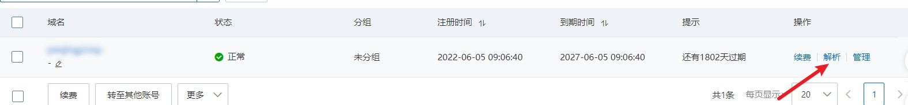

然后进入**解析设置**，并点击**添加记录**

此时就是在进行添加二级域名，除了图中红色的标注，剩下的按图中的填写就好

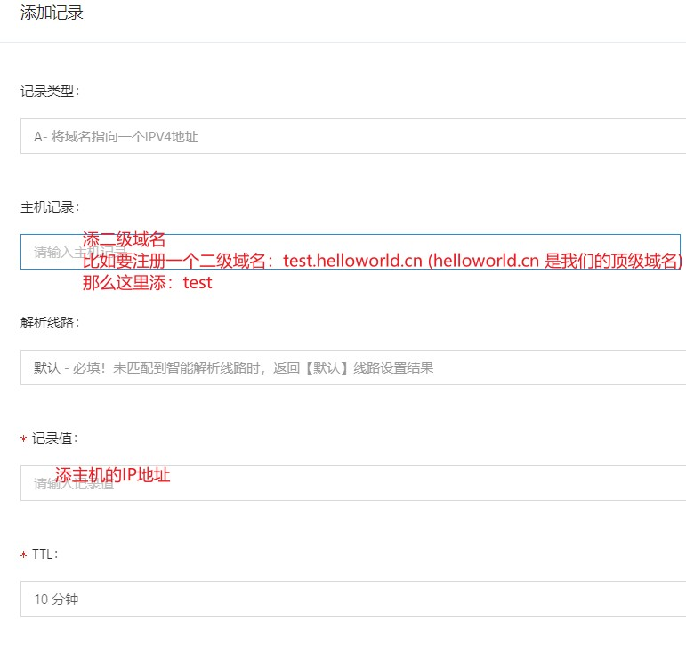

然后我们会看到多了一条解析记录：

过一会，可以在cmd窗口中输入：`ping  test.helloworld.cn` 就可以检测成功

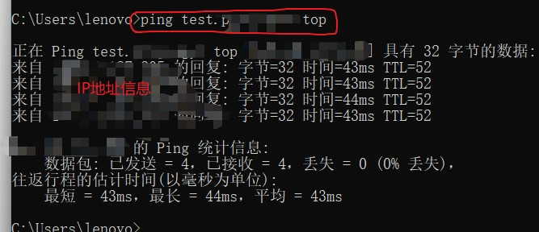

现在，二级域名就已经注册好了

**注意：**

我们并不需要，单独为二级域名设置解析：

**否则，后面为二级域名配置SSL证书会出错**，

**这里一定要注意：自己就是因为这里单独添加了一个二级域名，导致SSL证书配置出错，卡了好久**

然后，现在为二级域名配置SSL证书：

首先进入SSL证书的创建（可以从左侧控制台快速进入）

注意：这里我们演示的是如何注册二级域名的SSL证书，所以默认我们已经申请的20个免费的SSL证书（如果是首次为顶级域名配置证书，请搜索别的视频或指南）

点击创建证书，进行证书申请：

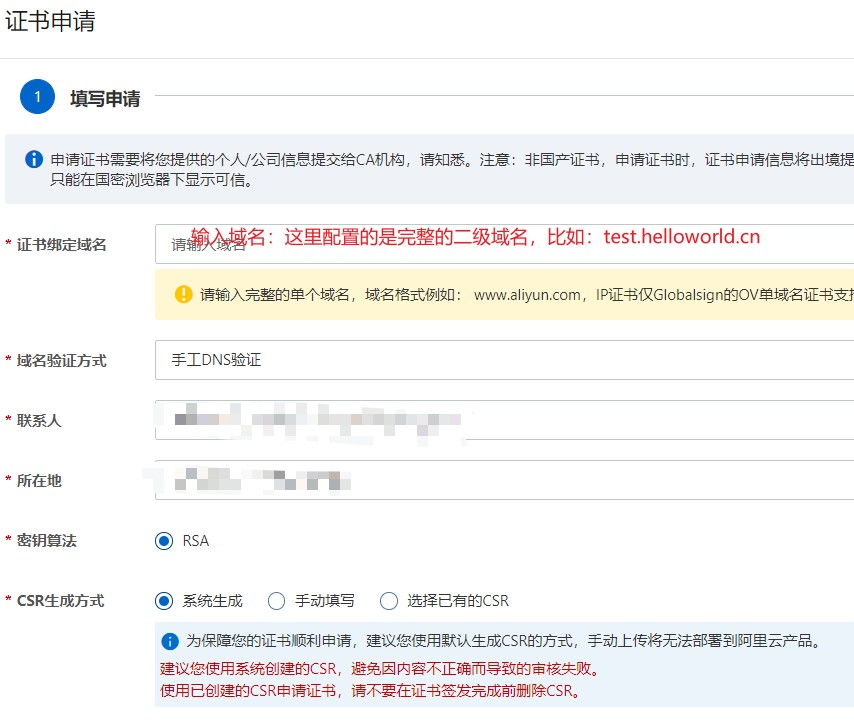

下一步，是设置DNS解析：

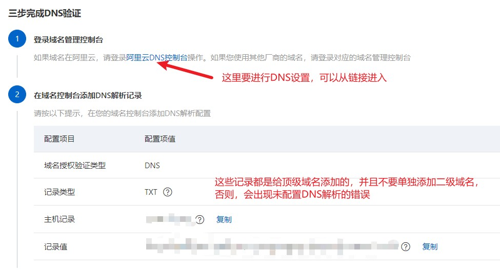

然后我们已经跳转到了DNS设置：

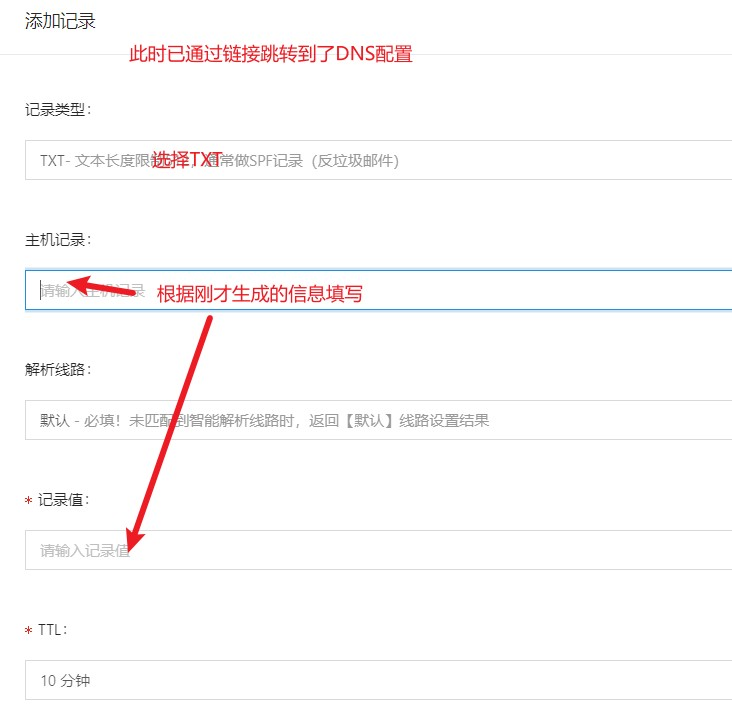

填写完毕后，返回SSL证书申请处，点击验证即可，然后提交审核。

**总结：**

**整个过程还是要注意，不要单独为二级域名添加解析，所有信息都会添加在顶级域名的配置下**

**不要出现下图的操作！！！**

当我们SSL证书配置完毕后，可以看一下顶级域名的解析，会出现两条新的记录：

下面是**顶级域名的添加记录信息！！！**

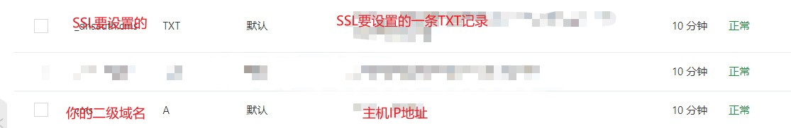

也就是说，当我们的二级域名配置完成，并且完成SSL证书申请后，域名解析列表始终只有一个域名，就是你的顶级域名

### 第二类：自定义 OSS对象存储 的图片路径

> OSS对象存储我们可以自定义图片的存储路径名称
>
> 注意：**OSS的二级域名我们并不需要和上面一样先把二级域名配置好再使用**，而是在OSS里直接配置一个新的二级域名（其实自己先配置好也可以实现，就是选项不是选A，而是选CNAME），在这里我们使用OSS直接配置二级域名。
>
> 在OSS中配置好二级域名后再为这个二级域名添加SSL证书

首先，点开OSS存储的域名管理

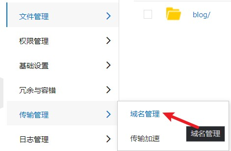

选择**绑定域名**

**注意：这里填写的二级域名不需要像上面一样是已经在顶级域名中添加过的，也就是说，这里的二级域名不需要经过上面的一套流程**

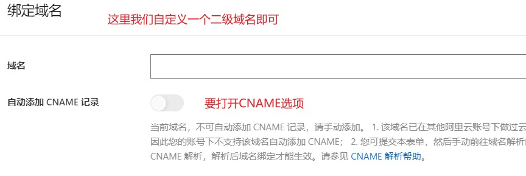

在域名绑定完成后，我们可以先查看一下：顶级域名的解析记录：

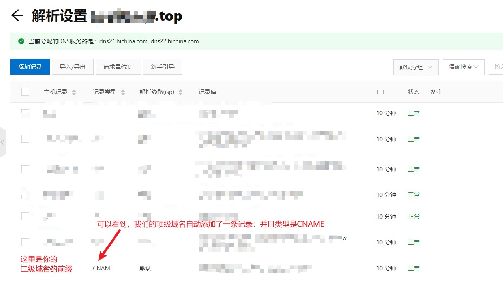

这里就是和用来放网站的二级域名的不同了：这里的记录类型不同：**A vs CNAME**

然后，为OSS的二级域名添加SSL证书：

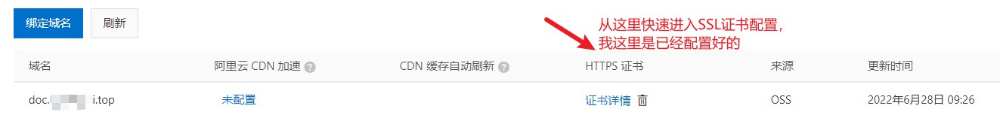

此时，为OSS的二级域名申请SSL证书：

流程和上面的一样，并且注意点也一样：我们**不需要单独将这个二级域名添加到域名解析中**，否则SSL的DNS验证会失效。也就是说，整个流程结束后，我们的域名解析列表始终只有一个域名，就是我的顶级域名。

最后SSL证书配置完成后，返回OSS控制台，为这个二级域名添加SSL认证即可。

然后我们可以在文件管理下查看我们上传的图片（我使用Picgo上传的）

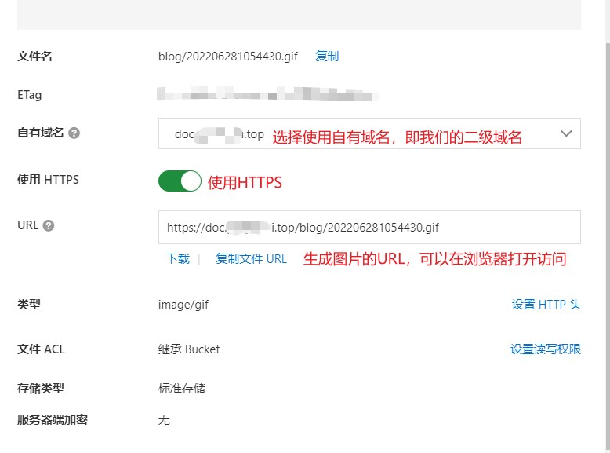