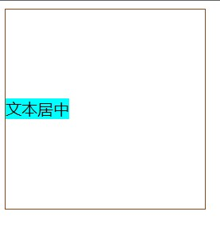
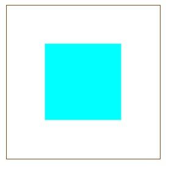

# 【CSS】水平垂直布局

[TOC]


## 一、水平布局

### （1）行内元素

`text-align: center`（给行内元素的父元素加）

```html
    <style>
      .parent {
        width: 200px;
        height: 200px;
        border: 1px saddlebrown solid;
        text-align: center;
      }
    </style>

  <body>
    <main class="parent">
      <span class="inline">456871335</span>
    </main>
  </body>
```


### （2）块级元素

#### 给要居中的块级元素设置 `margin: 0 auto;`

```html
    <style>
      .parent {
        width: 200px;
        height: 200px;
        border: 1px saddlebrown solid;
      }
      .child {
        width: 100px;
        height: 100px;
        background-color: aqua;
        margin: 0 auto;
      }
    </style>

  <body>
    <main class="parent">
      <div class="child"></div>
    </main>
```


#### 要居中的块级元素：left + margin-left

**要注意该元素的position：absolute，父元素的position：relative**

该元素的 margin-left ：为自身width的一半

```html
    <style>
      .parent {
        width: 200px;
        height: 200px;
        border: 1px saddlebrown solid;
        position: relative;
      }
      .child {
        width: 100px;
        height: 100px;
        background-color: aqua;
        position: absolute;//设置定位
        left: 50%;
        margin-left: -50px;//等于自身width/2
      }
    </style>

  <body>
    <main class="parent">
      <div class="child"></div>
    </main>
  </body>
```


#### 要居中的元素：left + transform

```html
    <style>
      .parent {
        width: 200px;
        height: 200px;
        border: 1px saddlebrown solid;
        position: relative;
      }
      .child {
        width: 100px;
        height: 100px;
        background-color: aqua;
        position: absolute;
        left: 50%;
        transform: translateX(-50%);
      }
    </style>

  <body>
    <main class="parent">
      <div class="child"></div>
    </main>
  </body>
```


#### 父元素开启 flex布局(1)

父元素：`justify-content: center;`

```html
    <style>
      .parent {
        width: 200px;
        height: 200px;
        border: 1px saddlebrown solid;
        display: flex;
        justify-content: center;
      }
      .child {
        width: 100px;
        height: 100px;
        background-color: aqua;
      }
    </style>

  <body>
    <main class="parent">
      <div class="child"></div>
    </main>
  </body>
```


#### 父元素开启 flex布局(2)

给子元素设置 `margin: 0 auto;`

```html
    <style>
      .parent {
        width: 200px;
        height: 200px;
        border: 1px saddlebrown solid;
        display: flex;
        /* justify-content: center; */
      }
      .child {
        width: 100px;
        height: 100px;
        background-color: aqua;
        margin: 0 auto;
      }
    </style>

  <body>
    <main class="parent">
      <div class="child"></div>
    </main>
  </body>
```


## 二、垂直布局

### （1）单行文本元素

单行文本垂直居中：父元素`line-height`等于自身的高度

```html
    <style>
      .parent {
        width: 200px;
        height: 200px;
        border: 1px saddlebrown solid;
        line-height: 200px;
      }
      .child {
        width: 100px;
        height: 100px;
        background-color: aqua;
      }
    </style>
  </head>
  <body>
    <main class="parent">
      <span class="child"> 文本居中</span>
    </main>
  </body>
```




### （2）行内块元素垂直居中

将子元素设置为`display:inline-block`，给父元素添加`line-height`，值等于自身的高度。

然后给子元素设置`vertical-align:middle`

```html
    <style>
      .parent {
        width: 200px;
        height: 200px;
        border: 1px saddlebrown solid;
        line-height: 200px;
      }
      .child {
        width: 100px;
        height: 100px;
        vertical-align: middle;
        display: inline-block;
        background-color: aqua;
      }
    </style>

  <body>
    <main class="parent">
      <div class="child"></span>
    </main>
  </body>
```


### （3）块级元素垂直居中

#### 要居中的元素：top + margin-top

给父元素设置`position：relative`，给子元素设置`position:absolute`，`top=50%,margin-top: - 自身高度/2`

```html
    <style>
      .parent {
        width: 200px;
        height: 200px;
        border: 1px saddlebrown solid;
        position: relative;
      }
      .child {
        width: 100px;
        height: 100px;
        position: absolute;
        top:50%;
        margin-top: -50px;
        background-color: aqua;
      }
    </style>

  <body>
    <main class="parent">
      <div class="child"></span>
    </main>
  </body>
```


#### 要垂直居中的元素: top + transform

先给父元素和子元素设置定位，然后给子元素设置`top:50%`和`transform:translateY(-50%)`，这个与`margin-top`的区别是

`margin-top`设置的是自身的具体的值，需要计算，而`transform`只需要一个百分数。

```html 
    <style>
      .parent {
        width: 200px;
        height: 200px;
        border: 1px saddlebrown solid;
        position: relative;
      }
      .child {
        width: 100px;
        height: 100px;
        position: absolute;
        top:50%;
        transform: translateY(-50%);
        background-color: aqua;
      }
    </style>

  <body>
    <main class="parent">
      <div class="child"></span>
    </main>
  </body>
```


#### 要垂直居中的元素：top + bottom + margin

先给父元素和子元素设置定位，然后用`top:0`和`bottom:0`将子元素拉开，再给子元素设置固定的高度`height:xx px`，最后给子元素设置`margin:auto`。

```html
    <style>
      .parent {
        width: 200px;
        height: 200px;
        border: 1px saddlebrown solid;
        position: relative;
      }
      .child {
        width: 100px;
        height: 100px;
        position: absolute;
        top:0;
        bottom:0;
        margin: auto;
        background-color: aqua;
      }
    </style>

  <body>
    <main class="parent">
      <div class="child"></span>
    </main>
  </body>
```


#### 父元素开启 flex 布局

父元素开启 flex 布局后。给子元素 设置：`margin:auto`

```html
    <style>
      .parent {
        width: 200px;
        height: 200px;
        border: 1px saddlebrown solid;
        display: flex;
      }
      .child {
        width: 100px;
        height: 100px;
        margin: auto;
        background-color: aqua;
      }
    </style>

  <body>
    <main class="parent">
      <div class="child"></span>
    </main>
  </body>
```


#### 父元素开启 flex 布局（2）

父元素开启 flex 布局后，并在父元素上设置`align-items: center;`

```html
    <style>
      .parent {
        width: 200px;
        height: 200px;
        border: 1px saddlebrown solid;
        display: flex;
        align-items: center;
      }
      .child {
        width: 100px;
        height: 100px;
        background-color: aqua;
      }
    </style>

  <body>
    <main class="parent">
      <div class="child"></div>
    </main>
  </body>
```


## 三、水平垂直居中

### （1）行内块级元素

父元素的行高等于自身高度，给父元素添加`text-align: center`实现水平居中，将子元素设置为`inline-block`，然后给子元素设置`vertical-align: middle`

```html 
    <style>
      .parent {
        width: 200px;
        height: 200px;
        border: 1px saddlebrown solid;
        line-height: 200px;
        text-align: center; /*水平居中*/
      }
      .child {
        height: 100px;
        width: 100px;
        background-color: aqua;
        display: inline-block;
        vertical-align: middle; /*垂直居中*/
      }
    </style>

  <body>
    <main class="parent">
      <span class="child"></span>
    </main>
  </body>
```


### （2）单个块级元素

#### 要水平垂直居中的元素：top + left + transform

先给父元素和子元素设置相关定位，然后给子元素设置`top:50%`，`left:50%`，`transform:translate(-50%,-50%)`

```html 
    <style>
      .parent {
        width: 200px;
        height: 200px;
        border: 1px saddlebrown solid;
        position: relative;
      }
      .child {
        width: 100px;
        height: 100px;
        background-color: aqua;
        position: absolute;
        top: 50%;
        left: 50%;
        transform: translate(-50%, -50%);
      }
    </style>

  <body>
    <main class="parent">
      <div class="child"></div>
    </main>
  </body>
```




#### 要水平垂直居中的元素：top + left + right + bottom + margin

先给父元素和子元素设置定位，然后设置要居中的那个元素的top等四个方向的值都为0，然后给这个歌元素设置宽高，最后将`margin:auto`

```html 
    <style>
      .parent {
        width: 200px;
        height: 200px;
        border: 1px saddlebrown solid;
        position: relative;
      }
      .child {
        width: 100px;
        height: 100px;
        background-color: aqua;
        position: absolute;
        top: 0;
        left: 0;
        bottom: 0;
        right: 0;
        margin: auto;
      }
    </style>

  <body>
    <main class="parent">
      <div class="child"></div>
    </main>
  </body>
```


#### 要水平垂直居中的元素：top + left + margin-top + margin-left

先给父元素和子元素设置定位，设置要居中的元素`top:50%`和`left:50%`，然后给`margin-top`和`margin-left`设置为自身宽高的一半。

```html
    <style>
      .parent {
        width: 200px;
        height: 200px;
        border: 1px saddlebrown solid;
        position: relative;
      }
      .child {
        width: 100px;
        height: 100px;
        background-color: aqua;
        position: absolute;
        top: 50%;
        left: 50%;
        margin-top: -50px;
        margin-left: -50px;
      }
    </style>

  <body>
    <main class="parent">
      <div class="child"></div>
    </main>
  </body>
```


#### 要水平垂直居中的元素: top + left + calc()函数

**注：在使用 calc()函数时，运算符前后都要留一个空格，否则样式不生效**

```html 
    <style>
      .parent {
        width: 200px;
        height: 200px;
        border: 1px saddlebrown solid;
        position: relative;
      }
      .child {
        height: 100px;
        width: 100px;
        background-color: aqua;
        position: absolute;
        left: calc(50% - 50px);
        top: calc(50% - 50px);
      }
    </style>
 
  <body>
    <main class="parent">
      <div class="child"></div>
    </main>
  </body>
```


#### 父元素开启 flex 布局

父元素开启 flex 布局，并给父元素设置`align-items:center` 和` justify-content:center `。

```html
    <style>
      .parent {
        width: 200px;
        height: 200px;
        border: 1px saddlebrown solid;
        display: flex;
        align-items: center;
        justify-content: center;
      }
      .child {
        width: 100px;
        height: 100px;
        background-color: aqua;
      }
    </style>

  <body>
    <main class="parent">
      <div class="child"></div>
    </main>
  </body>
```


#### 父元素开启 flex 布局（2）

父元素开启 flex 布局，给子元素设置`margin:auto`

```html 
    <style>
      .parent {
        width: 200px;
        height: 200px;
        border: 1px saddlebrown solid;
        display: flex;
      }
      .child {
        width: 100px;
        height: 100px;
        background-color: aqua;
        margin: auto;
      }
    </style>

  <body>
    <main class="parent">
      <div class="child"></div>
    </main>
  </body>
```


