# 【css】再学盒模型

[TOC]


# 一.标准模型和IE模型

盒模型包含了`margin`、`border`、`padding`、`content`这四个部分。

它俩的**区别就一个，计算宽度（高度）的方式不一样。**

- 标准盒模型的 width 和 height 属性的范围只包含了 content，
- IE 盒模型的 width 和 height 属性的范围包含了 border、padding 和 content。

可以通过修改元素的 box-sizing 属性来改变元素的盒模型：

- `box-sizing: content-box`表示标准盒模型（默认值）
- `box-sizing: border-box`表示 IE 盒模型（怪异盒模型）


>`box-sizing`属性：
>
>```
>box-sizing: content-box|border-box|inherit;
>```
>
>- `content-box`：标准盒模型；
>- `border-box`：IE 盒模型；
>- inherit ：规定应从父元素继承 box-sizing 属性的值

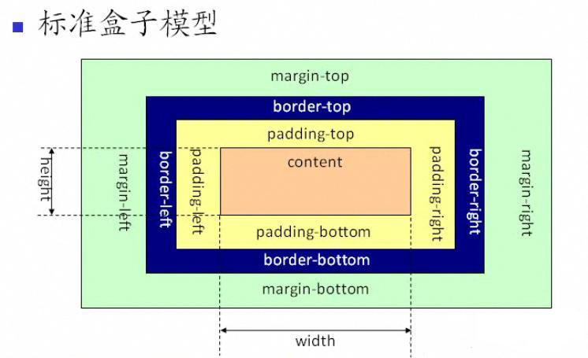

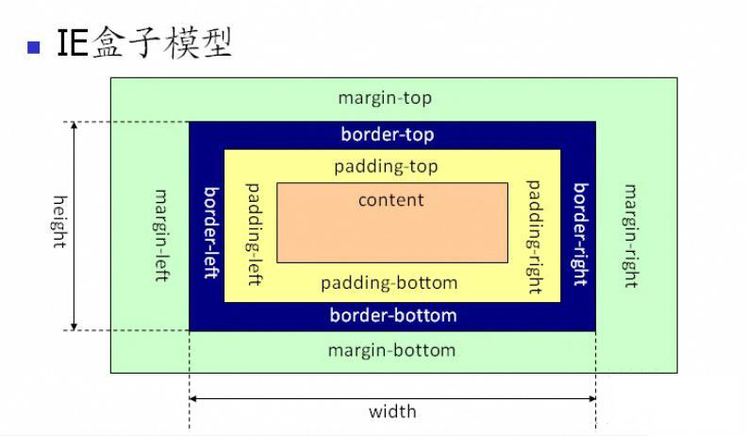


# 二、盒模型的注意点

### 1.背景色会平铺到非margin的区域

也就是说：边框其实也有背景色，只是因为边框自己的颜色把背景色盖住了。

  举例：

```css
  <style>
    .box1 {
      width: 100px;
      height: 100px;
      background: pink;
      padding: 20px;
      border: 10px black solid;
      margin: 20px;
    }
    .box2 {
      width: 100px;
      height: 100px;
      background: skyblue;
    }
  </style>
  <body>
    <div class="box1">a box1</div>
    <div class="box2">a box2</div>
  </body>
```

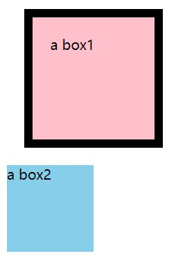


当给边框设置为透明时，

```css
  <style>
    .box1 {
      width: 100px;
      height: 100px;
      background: pink;
      padding: 20px;
      border: 10px rgba(0, 0, 0, 0.3) solid;/*更改边框的颜色*/
      margin: 20px;
    }
    .box2 {
      width: 100px;
      height: 100px;
      background: skyblue;
    }
  </style>
  <body>
    <div class="box1">a box1</div>
    <div class="box2">a box2</div>
  </body>
```

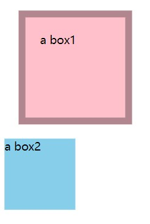

此时可以看出，边框其实也是粉色，后来边框自己的颜色将背景色盖住了。


### 2.margin-top 传递的现象

**（给子盒子设置margin-top，父盒子会受到影响）**

```css
  <style>
    .box1 {
      width: 200px;
      height: 200px;
      background: pink;
    }
    .box2 {
      width: 100px;
      height: 100px;
      background: skyblue;
      /*margin-top: 30px;*/
    }
  </style>
  <body>
    <div class="box1">
      <div class="box2"></div>
    </div>
  </body>
```

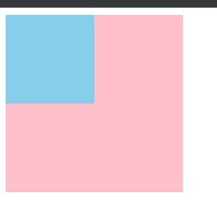

给里面的盒子，也就是box2 加上`margin-top`后，父盒子也被向下拉了30px（本来应该只有里面的盒子向下30px）

```css
  <style>
    .box1 {
      width: 200px;
      height: 200px;
      background: pink;
    }
    .box2 {
      width: 100px;
      height: 100px;
      background: skyblue;
      margin-top: 30px; /*加上margin-top*/
    }
  </style>
  <body>
    <div class="box1">
      <div class="box2"></div>
    </div>
  </body>
```

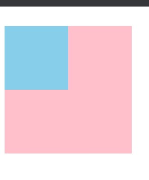


#### 解决方案：

##### 1.给父元素加边框

```css
  <style>
    .box1 {
      width: 200px;
      height: 200px;
      background: pink;
      border: 1px solid black;/*给父元素加边框*/
    }
    .box2 {
      width: 100px;
      height: 100px;
      background: skyblue;
      margin-top: 30px;
    }
  </style>
  <body>
    <div class="box1">
      <div class="box2"></div>
    </div>
  </body>
```

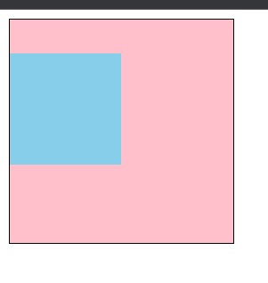

将边框设为透明即可：

`   border: 1px solid rgba(0, 0, 0, 0);`

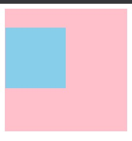


##### 2.利用padding-top

**去掉子元素的margin-top，给父元素添加padding-top属性**

```css
  <style>
    .box1 {
      width: 200px;
      height: 200px;
      background: pink;
      padding-top: 20px;/*给父元素加padding-top*/
    }
    .box2 {
      width: 100px;
      height: 100px;
      background: skyblue;
      margin-top: 30px;
    }
  </style>
```


##### 3.利用BFC解决

**给父元素加 overflow：hidden**

```css
  <style>
    .box1 {
      width: 200px;
      height: 200px;
      background: pink;
      overflow: hidden;
    }
    .box2 {
      width: 100px;
      height: 100px;
      background: skyblue;
      margin-top: 30px;
    }
  </style>
```


### 3.margin上下叠加的现象（边距重叠）

当两个外边距相遇时，他们将形成一个外边距，合并后的外边距高度等于两个发生合并的外边距的高度中的较大者。

对于折叠的情况，主要有两种：**兄弟之间重叠**和**父子之间重叠**

注意：**只有普通文档流中块框的垂直外边距才会发生外边距合并，左右边距不会出现问题，行内框、浮动框或绝对定位（position：absolute）之间的外边距不会合并**。

合并规则如下：

- 如果两个盒子的margin均为正值，取最大值
- 如果是一正一负，就会正值减去负值的绝对值
- 两个都是负值时，用 0 减去两个中绝对值大的那个

举例：

```css
  <style>
    .div1 {
      width: 200px;
      height: 200px;
      margin-bottom: 70px;
      background-color: pink;
    }
    .div2 {
      width: 100px;
      height: 100px;
      margin-top: 40px;
      background-color: pink;
    }
  </style>
  <body>
    <div class="div1">这是一个div</div>
    <div class="div2">这是一个div</div>
  </body>
```

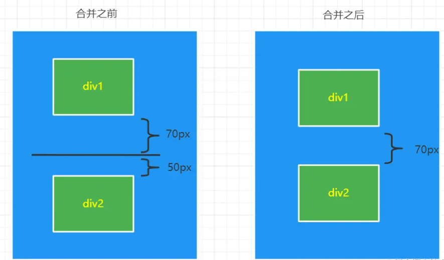


#### 解决方案：

##### 1.只给其中一个元素添加 margin

##### 2. 父子之间重叠

- 父元素加入：`overflow: hidden`
- 父元素添加透明边框：`border:1px solid transparent`
- 子元素变为行内盒子：`display: inline-block`
- 子元素加入浮动属性或定位

##### 3.兄弟之间重叠

- 底部元素变为行内盒子：`display: inline-block`
- 底部元素设置浮动：`float`
- 底部元素的 position 的值为`absolute/fixed`


# 三、块级盒子(block box)与内联盒子(inline box)

> 块级盒子：div、p、h1 ...
>
> 内联盒子：span、a、strong ...

### 块级盒子的特性

- 独占一行
- 支持所以样式
- 不写宽度的时候，跟父容器的宽度相同
- 所占区域是一个矩形


### 内联盒子的特性

- 盒子不会产生换行
- 有些样式不支持，例如：width、height等
- 不写宽度的时候，宽度由内容决定
- 所占区域不一定是一个矩形
- 内联标签之间会有空隙

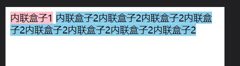


**通过对盒子display 属性的设置，比如 inline 或者 block ，来控制盒子的外部显示类型。**

### display

#### 控制显示隐藏

使用 `display` 控制元素的显示机制。

| 选项         | 说明                        |
| ------------ | --------------------------- |
| none         | 隐藏元素                    |
| block        | 显示为块元素                |
| inline       | 显示为行元素，不能设置宽/高 |
| inline-block | 行级块元素，允许设置宽/高   |


### 解决 inline-block 的间隙问题

用了display:inline-block后，存在间隙问题，间隙为4像素，这个问题产生的原因是换行引起的，因为我们写标签时通常会在标签结束符后顺手打个回车，而回车会产生回车符，回车符相当于空白符，通常情况下，多个连续的空白符会合并成一个空白符，而产生“空白间隙”的真正原因就是这个让我们并不怎么注意的空白符。

```css
.space a {
    display: inline-block;
    padding: 0.5em 1em;
    background-color: #cad5eb;
}

<div class="space">
    <a href="##">惆怅</a>
    <a href="##">淡定</a>
    <a href="##">热血</a>
</div>

```

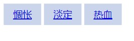


可以将代码放在一行，这样就去掉了空格

```css
    <div class="space">
      <a href="##">惆怅</a><a href="##">淡定</a><a href="##">热血</a>
    </div>
```

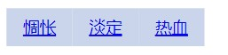

更详细的解决文章 [去除inline-block元素间间距的N种方法](https://www.zhangxinxu.com/wordpress/2012/04/inline-block-space-remove-%e5%8e%bb%e9%99%a4%e9%97%b4%e8%b7%9d/)


# 四、自适应盒模型的特性

**当不写宽度时，当给子元素添加相关盒模型的属性值时，content会进行重新的计算，并且会往里收缩，不会溢出。**

举例：
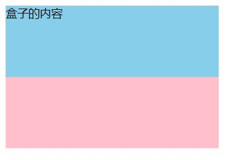

```css
  <style>
    .box1 {
      width: 300px;
      height: 200px;
      background: pink;
    }
    .box2 {
      width: 300px;
      height: 100px;
      background: skyblue;
    }
  </style>
  <body>
    <div class="box1">
      <div class="box2">盒子的内容</div>
    </div>
  </body>
```


当给子盒子添加相关属性时，

```css
  <style>
    .box1 {
      width: 300px;
      height: 200px;
      background: pink;
    }
    .box2 {
      width: 300px;
      height: 100px;
      background: skyblue;
      padding: 10px;
      border: 5px black solid;
      margin: 10px; 
    }
  </style>
  <body>
    <div class="box1">
      <div class="box2">盒子的内容</div>
    </div>
  </body>
```

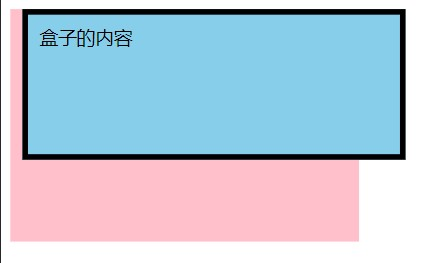


但利用自适应盒模型的特性时，即：**不给子元素设置宽度**，

```css
  <style>
    .box1 {
      width: 300px;
      height: 200px;
      background: pink;
    }
    .box2 {
      /* width: 300px; */
      height: 100px;
      background: skyblue;
      padding: 10px;
      border: 5px black solid;
      margin: 10px;
    }
  </style>
```

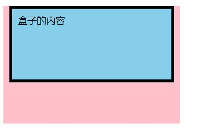

此时盒子会往里收缩，并不会溢出。