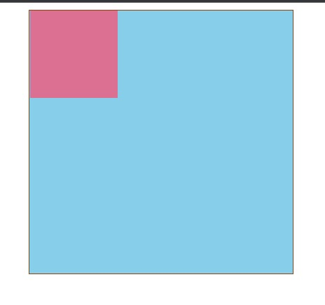
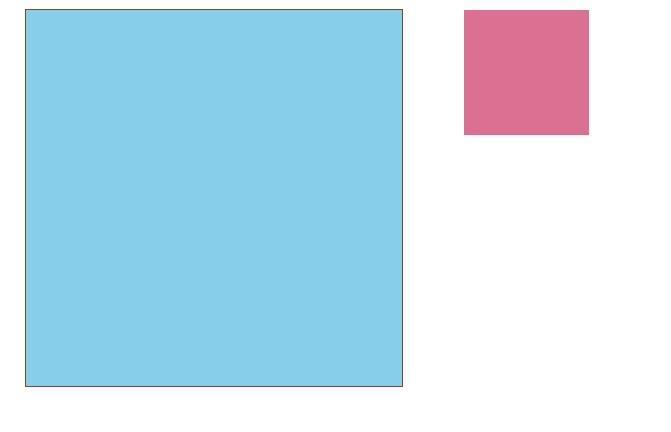
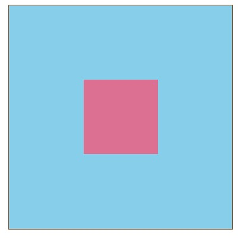
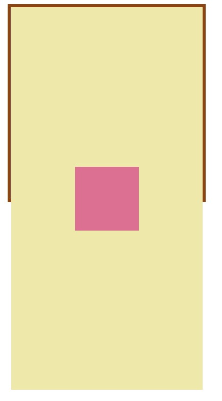
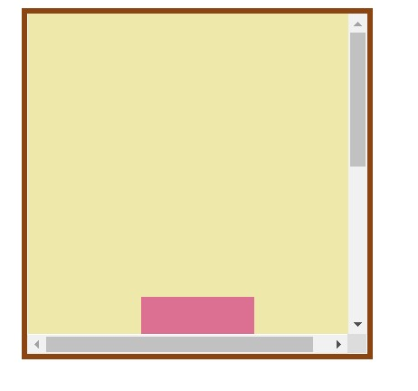
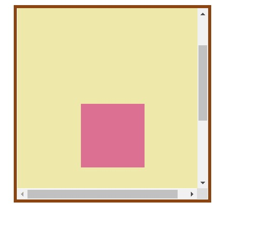
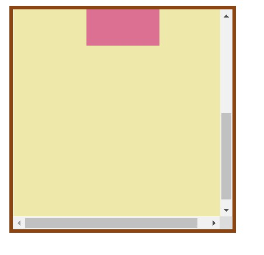

# 【css】定位布局

[TOC]


## 一、position的属性

position 有以下属性值：

| 属性值   | 概述                                                         |
| -------- | ------------------------------------------------------------ |
| absolute | 生成**绝对定位**的元素，相对于 static 定位以外的一个父元素进行定位。元素的位置通过 left、top、right、bottom 属性进行规定。 |
| relative | 生成**相对定位**的元素，相对于其原来的位置进行定位。元素的位置通过 left、top、right、bottom 属性进行规定。 |
| fixed    | 生成**固定定位**的元素，指定元素相对于屏幕视⼝（viewport）的位置来指定元素位置。元素的位置在屏幕滚动时不会改变，⽐如回到顶部的按钮⼀般都是⽤此定位⽅式。 |
| static   | 默认值，没有定位，元素出现在正常的文档流中，会忽略 top, bottom, left, right 或者 z-index 声明，块级元素从上往下纵向排布，⾏级元素从左向右排列。 |
| inherit  | 规定从父元素继承 position 属性的值                           |
| sticky   | **粘性定位**                                                 |


### relative（相对定位）

相对定位是相对于元素原来的位置控制，当元素发生位置偏移时，原位置留白

元素的位置通过 left、top、right、bottom 属性进行规定。


#### 位置偏移

可以为部分类型的定位元素设置`上、下、左、右` 的位置偏移。

| 选项   | 说明     |
| ------ | -------- |
| top    | 距离顶边 |
| bottom | 距离下边 |
| left   | 距离左部 |
| right  | 距离右边 |


举例：

```css
  <style>
    .box {
      width: 300px;
      height: 300px;
      margin: auto;
      background: skyblue;
      border: 1px saddlebrown solid;
    }
    .box1 {
      width: 100px;
      height: 100px;
      background-color: palevioletred;
    }
  </style>
  <body>
    <div class="box">
      <div class="box1"></div>
    </div>
  </body>
```





当给子盒子添加 相对定位（relative）时，

```css
  <style>
    .box {
      width: 300px;
      height: 300px;
      margin: auto;
      background: skyblue;
      border: 1px saddlebrown solid;
    }
    .box1 {
      width: 100px;
      height: 100px;
      background-color: palevioletred;
      position: relative;/*添加相对定位*/
      left: 350px;
    }
  </style>
  <body>
    <div class="box">
      <div class="box1"></div>
    </div>
  </body>
```

**相对定位是相对于元素原来的位置发生改变，和其他元素没关系，也不会影响其他元素**




### absolute（绝对定位）

如果补个元素设置了absolute，且为absolute设置了 top、left等值，浏览器会递归查找该元素的所有父元素，如果找到一个设置了`position:relative/absolute/fixed/sticky`的元素，就以该元素为基准定位，如果没找到，就以浏览器边界定位。


#### 居中定位

通过将 `left` 设置为50% ,并向左偏移子元素宽度一半可以实现水平居中，垂直居中使用方式类似。

```css
  <style>
    .box {
      width: 300px;
      height: 300px;
      margin: auto;
      background: skyblue;
      border: 1px saddlebrown solid;
      position: relative;
    }
    .box1 {
      width: 100px;
      height: 100px;
      background-color: palevioletred;
      position: absolute;
      left: 50%;/*将 left 设置为50%*/
      top: 50%;
      margin-left: -50px;/*向左偏移子元素宽度一半*/
      margin-top: -50px;
    }
  </style>
  <body>
    <div class="box">
      <div class="box1"></div>
    </div>
```




#### 发生滚动的情况

当有absolute定位的子元素的父级元素可以有滚动条时，移动滚动条，子元素会随着滚动条发生移动，位置不是固定的。

举例：

先给absolute的父元素设置为溢出，

```css
  <style>
    .box {
      width: 300px;
      height: 300px;
      margin: auto;
      border: 5px saddlebrown solid;
      position: relative;
    }
    .parent {
      width: 300px;
      height: 600px;
      background: palegoldenrod;
      position: relative;
    }
    .box1 {
      width: 100px;
      height: 100px;
      background-color: palevioletred;
      position: absolute;
      left: 50%;
      top: 50%;
      margin-left: -50px;
      margin-top: -50px;
    }
  </style>
  <body>
    <div class="box">
      <div class="parent">
        <div class="box1"></div>
      </div>
    </div>
  </body>
```



然后将溢出设置为 overflow：scroll，此时可以出现滚动条

```css
  <style>
    .box {
      width: 300px;
      height: 300px;
      margin: auto;
      border: 5px saddlebrown solid;
      position: relative;
      overflow: scroll;/*设置滚动条*/
    }
    .parent {
      width: 300px;
      height: 600px;
      background: palegoldenrod;
      position: relative;
    }
    .box1 {
      width: 100px;
      height: 100px;
      background-color: palevioletred;
      position: absolute;
      left: 50%;
      top: 50%;
      margin-left: -50px;
      margin-top: -50px;
    }
  </style>
  <body>
    <div class="box">
      <div class="parent">
        <div class="box1"></div>
      </div>
    </div>
  </body>
```







可以发现，本来 子元素是在父元素中居中的，但随着父元素的移动，子元素的位置也会发生改变。


### sticky（粘性定位）

某个元素设置粘性定位后，通过滚动条移动，并不会一直移动，而是会定在某处。

```css
  <style>
    .box {
      width: 300px;
      height: 300px;
      margin: auto;
      border: 5px saddlebrown solid;
      overflow: scroll;
    }
    .box2 {
      width: 300px;
      height: 600px;
      background: palegoldenrod;
    }
    .box1 {
      height: 50px;
      background-color: palevioletred;
      position: sticky;
      top: 0;
    }
  </style>
  <body>
    <div class="box">
      <div class="box2"></div>
      <div class="box1"></div>
      <div class="box2"></div>
    </div>
  </body>
```


### fixed（固定定位）

它的参考位置是页面浏览器，但是它具有破坏性，会导致其他元素位置的变化。

```css
  <style>
    header {
      height: 60px;
      border-bottom: solid 5px #7f35c9;
      box-shadow: 0 5px 8px rgba(100, 100, 100, 0.6);
      position: fixed;
      top: 0px;
      left: 0px;
      right: 0px;
    }
    article {
      height: 3000px;
      margin-top: 80px;
      background: #f3f3f3;
      border: solid 5px #ddd;
    }
  </style>
  <body>
    <header></header>
    <article></article>
  </body>
```


## 二、absolute 与 fixed 共同点与不同点

**共同点：**

- 改变行内元素的呈现方式，将 display 置为 inline-block
- 使元素脱离普通文档流，不再占据文档物理空间
- 覆盖非定位文档元素

**不同点：**

- absolute 与 fixed 的根元素不同，absolute 的根元素可以设置，fixed 根元素是浏览器。
- 在有滚动条的页面中，absolute 会跟着父元素进行移动，fixed 固定在页面的具体位置。