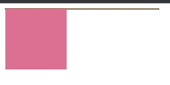
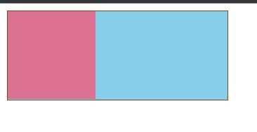

# 【css】清除浮动及BFC

[TOC]


## 一、理解BFC

### BFC的定义：

BFC 是一个独立的布局环境，可以理解为一个容器，在这个容器中按照一定规则进行物品摆放，并且不会影响其它环境中的物品。如果一个元素符合触发 BFC 的条件，则 BFC 中的元素布局不受外部影响。

**他指定了一块环境，在这块环境内部的元素布局与外界不产生相互影响**。


### BFC的渲染规则：

- 内部盒子垂直排列，自上而下，间距由margin决定（也就是说在BFC中上下相邻的两个容器的margin会重叠）
- 计算BFC的高度时，需要计算浮动元素的高度
- BFC的区域不会与浮动的区域重叠
- BFC 是独立的容器，容器内部元素不会影响外部元素


### 创建 BFC 的条件：

- 根元素：body；
- 元素设置浮动：float 除 none 以外的值；
- 元素设置绝对定位：position (absolute、fixed)；
- display 值为：inline-block、table-cell、table-caption、flex 等；
- overflow 值为：hidden、auto、scroll；（即不为visible）


### BFC 的作用：

#### 1.用BFC防止垂直 margin 合并

关于垂直margin合并👉 [【css】再学盒模型](https://blog.csdn.net/weixin_52834435/article/details/123749315)

BFC 渲染原理之一：同一个 BFC 下的垂直 margin 会发生合并。所以如果让 2 个元素不在同一个 BFC 中即可阻止垂直 margin 合并。那如何让 2 个相邻的兄弟元素不在同一个 BFC 中呢？可以给其中一个元素外面包裹一层，然后触发其包裹层的 BFC，这样一来 2 个元素就不会在同一个 BFC 中了。

注：分别给两个元素添加一层，分别触发他们包裹层的BFC，也可以实现。


#### 2.解决高度塌陷的问题：

在对子元素设置浮动后，父元素会发生高度塌陷，也就是父元素的高度变为 0。解决这个问题，只需要把父元素变成一个 BFC。常用的办法是给父元素设置`overflow:hidden`。


#### 3.利用BFC清除浮动

给父元素添加 overflow:hidden 或 overflow:auto


## 二、清除浮动

#### 1.给父级元素定义height属性

因为内部元素浮动，脱离文档流，父元素在没有添加高度时，默认是被子元素撑开的，当设置浮动后，父元素会出现高度塌陷的现象，此时可以给父元素添加height，使父元素自己撑开


#### 2.在最后一个浮动元素之后添加一个空的div标签，并添加clear：both样式

举例：

```css
  <style>
    .box {
      width: 250px;
      background: skyblue;
      border: 1px saddlebrown solid;
    }
    .box1 {
      width: 100px;
      height: 100px;
      float: left;
      background-color: palevioletred;
    }
  </style>
  <body>
    <div class="box">
      <div class="box1"></div>
    </div>
  </body>
```



可以注意到，此时高度塌陷。

```css
  <style>
    .clearfix {
      clear: both;
    }
    .box {
      width: 250px;
      background: skyblue;
      border: 1px saddlebrown solid;
    }
    .box1 {
      width: 100px;
      height: 100px;
      float: left;
      background-color: palevioletred;
    }
  </style>
  <body>
    <div class="box">
      <div class="box1"></div>
      <div class="clearfix"></div>/*这里加了一个空的div，并给div设置clearfix类*/
    </div>
  </body>
```




#### 3.包含浮动元素的父级标签添加overflow:hidden或者overflow:auto

```css
  <style>
    .box {
      width: 250px;
      overflow: hidden;/*添加 overflow:hidden*/
      background: skyblue;
      border: 1px saddlebrown solid;
    }
    .box1 {
      width: 100px;
      height: 100px;
      float: left;
      background-color: palevioletred;
    }
  </style>
  <body>
    <div class="box">
      <div class="box1"></div>
    </div>
  </body>
```


#### 4.使用  ::after 伪类为父元素添加后标签，实现清除浮动影响

```css
    .box::after {
      content: "";
      display: block;
      clear: both;
    }
```


整体代码如下：

```css
    .box {
      width: 250px;
      background: skyblue;
      border: 1px saddlebrown solid;
    }
    .box1 {
      width: 100px;
      height: 100px;
      float: left;
      background-color: palevioletred;
    }

    .box::after {
      content: "";
      display: block;
      clear: both;
    }
  </style>
  <body>
    <div class="box">
      <div class="box1"></div>
    </div>
  </body>
```

