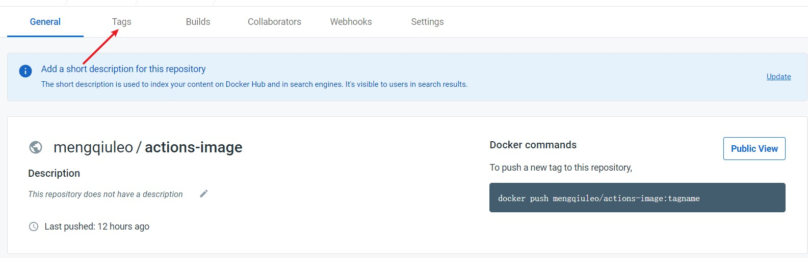
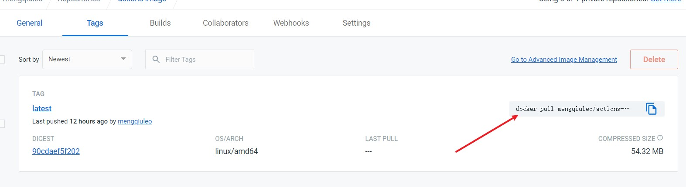

# Docker+github actions部署前端项目

[TOC]

## 前言

在进行本篇实践前，建议先了解一下：使用linux+Nginx部署，使用docker部署，使用github actions部署.

- [【vue项目部署】Linux+Nginx实现项目部署及跨域](https://blog.csdn.net/weixin_52834435/article/details/126896157?spm=1001.2014.3001.5501)
- [【github actions】部署前端项目](https://blog.csdn.net/weixin_52834435/article/details/126967415?csdn_share_tail=%7B%22type%22%3A%22blog%22%2C%22rType%22%3A%22article%22%2C%22rId%22%3A%22126967415%22%2C%22source%22%3A%22weixin_52834435%22%7D)
- [【Docker】docker+Nginx部署前端项目](https://blog.csdn.net/weixin_52834435/article/details/126967506?csdn_share_tail=%7B%22type%22%3A%22blog%22%2C%22rType%22%3A%22article%22%2C%22rId%22%3A%22126967506%22%2C%22source%22%3A%22weixin_52834435%22%7D)


实现自动化部署的整体流程应该是：

- 在 vue 项目中增加 Dockerfile 文件 和 nginx.conf 配置文件
- 部署时,首先将 dist + Dockerfile + nginx.conf 打成镜像 (docker build 相关明令)
- 将打包出来的镜像上传至存储应用的服务器或DockerHub(私服仓库)
- 最后在部署服务器上从存储镜像的那台服务器上拉取镜像,执行 `docker run` 相关命令进行发布


因为这些步骤在前面的文章中都有相关的更详细的解释，所以这里并不会进行很详细的解释，更多的是将这些分散的步骤进行串联起来。


## 1.Docker相关文件配置

在根目录下创建`Dockerfile`文件

```dockerfile
FROM node:14
COPY ./ /app
WORKDIR /app
RUN yarn install && yarn build

FROM nginx
RUN mkdir /app
COPY --from=0 /app/dist /app
COPY default.conf /etc/nginx/nginx.conf
```

在项目根目录创建 `.dockerignore` 文件

- 设置 `.dockerignore` 文件能防止 `node_modules` 和其他中间构建产物被复制到镜像中导致构建问题。

```text
**/node_modules
**/dist
```

在项目根目录创建 `nginx.conf` 文件，名字是什么无所谓，但是要注意与上面的Dokcerfile文件中的名字相对应。

```js
user  nginx;
worker_processes  1;
error_log  /var/log/nginx/error.log warn;
pid        /var/run/nginx.pid;
events {
  worker_connections  1024;
}
http {
  include       /etc/nginx/mime.types;
  default_type  application/octet-stream;
  log_format  main  '$remote_addr - $remote_user [$time_local] "$request" '
                    '$status $body_bytes_sent "$http_referer" '
                    '"$http_user_agent" "$http_x_forwarded_for"';
  access_log  /var/log/nginx/access.log  main;
  sendfile        on;
  keepalive_timeout  65;
  server {
    listen       80;
    server_name  localhost;
    location / {
      root   /app;
      index  index.html;
      try_files $uri $uri/ /index.html;
    }
    error_page   500 502 503 504  /50x.html;
    location = /50x.html {
      root   /usr/share/nginx/html;
    }
  }
}
```

我们这里还是使用的容器的80端口。


## 2.创建自己的dokcer hub仓库

和创建github仓库类似，按照步骤走即可。

并且我们可以体验一下，先使用手动执行命令来pull和push镜像。

一个demo：

- 首先执行：`dokcer build -t [要设置的镜像名] [文件的具体目录]`，这样就打包好了一个镜像

  比如我的：`docker build -t actions:latest  .`

- `docker run -d -p 5555:80 --name actions mengqiuleo/actions-image:latest  `，我们使用该命令将容器运行起来

  actions是我运行的容器名，`actions mengqiuleo/actions-image:latest`是我的镜像名

- 然后将该镜像上传到docker hub,使用命令：`docker push mengqiuleo/actions-image:latest`

  如果不知道要设置的镜像名是什么，可以登录到docker hub 中进行查看，

  

  

  


其他命令

**移除容器与镜像：**

```
docekr rmi 镜像id

docker rm 容器id

docker stop 容器id
```


**docker tag :** 标记本地镜像，将其归入某一仓库。

**语法**

```
docker tag [OPTIONS] IMAGE[:TAG] [REGISTRYHOST/][USERNAME/]NAME[:TAG]
```

**实例**

将镜像ubuntu:15.10标记为 runoob/ubuntu:v3 镜像。

```
root@runoob:~# docker tag ubuntu:15.10 runoob/ubuntu:v3
root@runoob:~# docker images   runoob/ubuntu:v3
REPOSITORY          TAG                 IMAGE ID            CREATED             SIZE
runoob/ubuntu       v3                  4e3b13c8a266        3 months ago        136.3 MB
```


## 3.yml文件配置

```yml
name: CI/CD
# 触发条件为 push
on: [push] # 执行时机
# 任务
jobs:  
  test:
    # 运行的环境
    runs-on: ubuntu-latest
    # 步骤
    steps:
      - uses: actions/checkout@v2 # git pull
      - name: Use Node.js
        uses: actions/setup-node@v1
        with:
          node-version: 14
      - name: 打包镜像, 上传 Docker Hub
        run: |
          docker login -u ${{ secrets.DOCKER_USERNAME }} -p ${{ secrets.DOCKER_PASSWORD }}
          docker build -t actions:latest  .
          docker tag actions:latest ${{ secrets.DOCKER_REPOSITORY }}
          docker push ${{ secrets.DOCKER_REPOSITORY }}:latest

      - name: 登录服务器, 执行脚本
        uses: appleboy/ssh-action@master
        with:
          host: ${{ secrets.SSH_HOST }}   
          username: ${{ secrets.SSH_USERNAME }}
          password: ${{ secrets.SSH_PASSWORD }}
          script: |
            docker stop actions
            docker rm actions
            docker rmi mengqiuleo/actions-image:latest
            docker pull mengqiuleo/actions-image:latest
            docker run -d -p 5555:80 --name actions mengqiuleo/actions-image:latest  
```

在这里解释一下，上面的一些操作步骤：

首先是：

```
          docker login -u ${{ secrets.DOCKER_USERNAME }} -p ${{ secrets.DOCKER_PASSWORD }}
          docker build -t actions:latest  .
          docker tag actions:latest ${{ secrets.DOCKER_REPOSITORY }}
          docker push ${{ secrets.DOCKER_REPOSITORY }}:latest
```

- 先登录自己的dokcer hub，`DOCKER_USERNAME`和`DOCKER_PASSWORD`是私有变量，内容对应的是我们的docker hub账号和密码

- 然后构建一个镜像，我的镜像名为 `actions:latest`，要进行构建的文件目录在`.`目录下

- 然后给`actions:latest`打tag，标记名为`DOCKER_REPOSITORY`

  **注意**，这里的DOCKER_REPOSITORY是有要求的，内容为自己的区域名再加上仓库名(镜像名)。比如你有一个区域叫aaa，然后你创建了一个仓库希望存放的镜像是bbb，那你的`DOCKER_REPOSITORY`应该为`aaa/bbb`，而不是单纯的`bbb`。

- 因为构建的时候，我们不是很方便的查看哪里报错了，所以最好在执行github actions之前我们可以进行手动构建，保证整个流程是通的，不要出现不存在某个仓库或文件的错误

- 标记完后就是将这个镜像推送到远程仓库


然后解释，在服务器上拉取镜像并构建容器运行的相关脚本：

```
            docker stop actions
            docker rm actions
            docker rmi mengqiuleo/actions-image:latest
            docker pull mengqiuleo/actions-image:latest
            docker run -d -p 5555:80 --name actions mengqiuleo/actions-image:latest  
```

因为我们构建的容器名叫actions，所以先停止容器，移出容器与镜像，再拉取镜像，并运行新的容器


**一些小的疑惑？**

在执行整个自动化构建的流程之前，我们需要自己手动先运行一次相关命令，为了保证云服务上存在actions的容器和相关镜像。

否则直接执行yml文件的话，在最后的脚本中，我们无法移除容器与镜像，会报错：不存在镜像与容器。