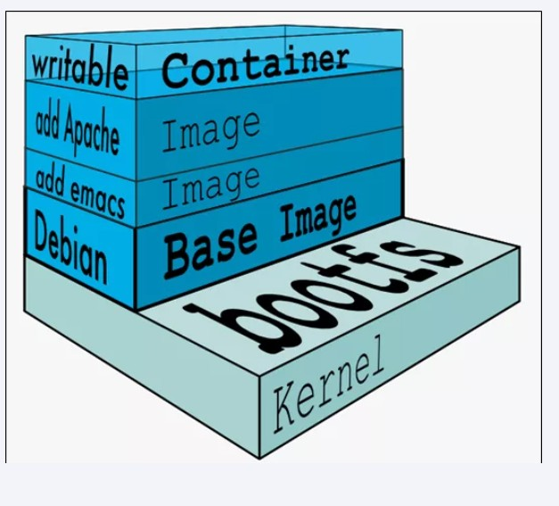

# Docker入门指南(基础篇)

[TOC]


## Docker简介

为什么会有docker出现？

假定您在开发一个尚硅谷的谷粒商城，您使用的是一台笔记本电脑而且您的开发环境具有特定的配置。其他开发人员身处的环境配置也各有不同。您正在开发的应用依赖于您当前的配置且还要依赖于某些配置文件。此外，您的企业还拥有标准化的测试和生产环境，且具有自身的配置和一系列支持文件。您希望尽可能多在本地模拟这些环境而不产生重新创建服务器环境的开销。请问？

您要如何确保应用能够在这些环境中运行和通过质量检测？并且在部署过程中不出现令人头疼的版本、配置问题，也无需重新编写代码和进行故障修复？

 

答案就是使用容器。Docker之所以发展如此迅速，也是因为它对此给出了一个标准化的解决方案-----系统平滑移植，容器虚拟化技术。

环境配置相当麻烦，换一台机器，就要重来一次，费力费时。很多人想到，能不能从根本上解决问题，软件可以带环境安装？也就是说，**安装的时候，把原始环境一模一样地复制过来。开发人员利用 Docker 可以消除协作编码时“在我的机器上可正常工作”的问题**。

**Docker容器在任何操作系统上都是一致的，实现了跨平台、跨服务器**


## Docker安装

Docker 镜像（Image）就是一个**只读**的模板。镜像可以用来创建 Docker 容器，一个镜像可以创建很多容器。

| 容器(可以很多个) | 对象 |
| ---------------- | ---- |
| 镜像             | 类   |

仓库（Repository）是集中存放镜像文件的场所

容器看做是一个简易版的Linux环境（包括root用户权限、进程空间、用户空间和网络空间等）和运行在其中的应用程序。

仓库分为公开仓库（Public）和私有仓库（Private）两种形式。

最大的公开仓库是 Docker Hub(https://hub.docker.com/)，存放了数量庞大的镜像供用户下载。国内的公开仓库包括阿里云 、网易云等


> docker安装地址：[Install Docker Engine on CentOS](https://docs.docker.com/engine/install/centos/)


### 具体步骤：

- Uninstall old versions

  ```
   sudo yum remove docker \
                    docker-client \
                    docker-client-latest \
                    docker-common \
                    docker-latest \
                    docker-latest-logrotate \
                    docker-logrotate \
                    docker-engine
  ```

- yum安装gcc相关

  ```
  yum install gcc -y
  yum install gcc-c++ -y
  ```

- 安装需要的软件包

  ```
  yum install -y yum-utils
  ```

- 设置stable镜像仓库(设置国内的阿里云镜像仓库)

  ```
  yum-config-manager --add-repo http://mirrors.aliyun.com/docker-ce/linux/centos/docker-ce.repo
  ```

- 更新yum软件包索引

  ```
  yum makecache fast
  ```

- 安装DOCKER CE 

  ```
  yum -y install docker-ce docker-ce-cli containerd.io
  ```

- 启动docker

  ```
  systemctl start docker
  ```

- 测试

  ```
  docker version
  ```

  

### 阿里云镜像加速

**获取加速器地址链接**


**粘贴脚本直接执行**

```
mkdir -p /etc/docker
tee /etc/docker/daemon.json <<-'EOF'
{
  "registry-mirrors": ["https://aa25jngu.mirror.aliyuncs.com"]
}
EOF
```

**重启服务器**

```
systemctl daemon-reload
systemctl restart docker
```


### 永远的Hello World

执行命令

```
docker run hello-world
```


**run干了什么**


## Docker常用命令

Docker应用需要用到各种端口，逐一去修改防火墙设置。非常麻烦，因此建议大家直接关闭防火墙！但是，在企业中就不要这么操作了，我们如果处于学习阶段是可以这么操作的。

启动docker前，一定要关闭防火墙后！！

启动docker前，一定要关闭防火墙后！！

启动docker前，一定要关闭防火墙后！！


- 启动docker： systemctl start docker

- 停止docker： systemctl stop docker

- 重启docker： systemctl restart docker

- 查看docker状态： systemctl status docker

- 开机启动： systemctl enable docker

- 查看docker概要信息： docker info

- 查看docker总体帮助文档： docker --help

- 查看docker命令帮助文档： docker 具体命令 --help
- docker版本：docker -v


## 镜像命令

- **docker images**

  OPTIONS说明：

  - -a :列出本地所有的镜像（含历史映像层）

  - -q :只显示镜像ID。

  列出本地主机上的镜像

  

  各个选项说明:

  REPOSITORY：表示镜像的仓库源

  TAG：镜像的标签版本号

  IMAGE ID：镜像

  IDCREATED：镜像创建时间

  SIZE：镜像大小

  同一仓库源可以有多个 TAG版本，代表这个仓库源的不同个版本，我们使用 REPOSITORY:TAG 来定义不同的镜像。

  如果你不指定一个镜像的版本标签，例如你只使用 ubuntu，docker 将默认使用 ubuntu:latest 镜像

- **docker search 某个XXX镜像名字**

  OPTIONS说明：

  - --limit : 只列出N个镜像，默认25个

  - `docker search --limit 5 redis`

  

- **docker pull 某个XXX镜像名字**

  没有TAG就是最新版

- **docker rmi 某个XXX镜像名字ID**

  删除镜像

- **docker system df**

  查看镜像/容器/数据卷所占的空间

  


## 容器命令

**有镜像才能创建容器， 这是根本前提(下载一个CentOS或者ubuntu镜像演示)**

```
docker pull centos
docker pull ubuntu
```


**新建+启动容器**

```
docker run [OPTIONS] IMAGE [COMMAND] [ARG...]
```

OPTIONS说明（常用）：有些是一个减号，有些是两个减号 

--name="容器新名字"    为容器指定一个名称；

-d: 后台运行容器并返回容器ID，也即启动守护式容器(后台运行)；

-i：以交互模式运行容器，通常与 -t 同时使用；

-t：为容器重新分配一个伪输入终端，通常与 -i 同时使用；

也即启动交互式容器(前台有伪终端，等待交互)；

-P: 随机端口映射，大写P

-p: 指定端口映射，小写p


启动交互式容器: `docker run -it centos /bin/bash`


**列出当前所有正在运行的容器**

```
docker ps [OPTIONS]
```

OPTIONS说明（常用）：

-a :列出当前所有正在运行的容器+历史上运行过的

-l :显示最近创建的容器。

-n：显示最近n个创建的容器。

-q :静默模式，只显示容器编号。


**退出容器**

- 两种退出方式

  - exit

    run进去容器，exit退出，容器停止

  - ctrl+p+q

    run进去容器，ctrl+p+q退出，容器不停止


**启动已停止运行的容器**

- docker start 容器ID或者容器名


**重启容器**

- docker restart 容器ID或者容器名


**停止容器**

- docker stop 容器ID或者容器名


**强制停止容器**

- docker kill 容器ID或容器名


**删除已停止的容器**

- docker rm 容器ID

- 一次性删除多个容器实例

  - docker rm -f $(docker ps -a -q)

  - docker ps -a -q | xargs docker rm


**启动守护式容器(后台服务器)**

在大部分的场景下，我们希望 docker 的服务是在后台运行的， 我们可以过 -d 指定容器的后台运行模式。

```
docker run -d 容器名
```

问题：然后docker ps -a 进行查看, 会发现容器已经退出

很重要的要说明的一点: Docker容器后台运行,就必须有一个前台进程.

容器运行的命令如果不是那些一直挂起的命令（比如运行top，tail），就是会自动退出的。


这个是docker的机制问题,比如你的web容器,我们以nginx为例，正常情况下,

我们配置启动服务只需要启动响应的service即可。例如service nginx start

但是,这样做,nginx为后台进程模式运行,就导致docker前台没有运行的应用,

这样的容器后台启动后,会立即自杀因为他觉得他没事可做了.

所以，最佳的解决方案是,将你要运行的程序以前台进程的形式运行，


**查看容器日志**

- docker logs 容器ID


**查看容器内运行的进程**

- docker top 容器ID


**查看容器内部细节**

- docker inspect 容器ID


**进入正在运行的容器并以命令行交互(重要)**

```
docker exec -it 容器ID bashShell
```


重新进入 `docker attach 容器ID`

**对比**

attach 直接进入容器启动命令的终端，不会启动新的进程 用exit退出，会导致容器的停止。


exec 是在容器中打开新的终端，并且可以启动新的进程 用exit退出，不会导致容器的停止。


**推荐大家使用 docker exec 命令，因为退出容器终端，不会导致容器的停止。**


**从容器内拷贝文件到主机上**

容器→主机

```
docker cp 容器ID:容器内路径 目的主机路径
```


**导入和导出容器**

export 导出容器的内容留作为一个tar归档文件[对应import命令]

```
docker export 容器ID > 文件名.tar
```

import 从tar包中的内容创建一个新的文件系统再导入为镜像[对应export]

```
cat 文件名.tar | docker import - 镜像用户/镜像名:镜像版本号
```


## 镜像生成

### 是什么

以我们的pull为例，在下载的过程中我们可以看到docker的镜像好像是在一层一层的在下载


Docker镜像加载原理：

docker的镜像实际上由一层一层的文件系统组成，这种层级的文件系统UnionFS。

bootfs(boot file system)主要包含bootloader和kernel, bootloader主要是引导加载kernel, Linux刚启动时会加载bootfs文件系统，在Docker镜像的最底层是引导文件系统bootfs。这一层与我们典型的Linux/Unix系统是一样的，包含boot加载器和内核。当boot加载完成之后整个内核就都在内存中了，此时内存的使用权已由bootfs转交给内核，此时系统也会卸载bootfs。

rootfs (root file system) ，在bootfs之上。包含的就是典型 Linux 系统中的 /dev, /proc, /bin, /etc 等标准目录和文件。rootfs就是各种不同的操作系统发行版，比如Ubuntu，Centos等等。 

> Docker镜像层都是只读的，容器层是可写的 当容器启动时，一个新的可写层被加载到镜像的顶部。 这一层通常被称作“容器层”，“容器层”之下的都叫“镜像层”。

当容器启动时，一个新的可写层被加载到镜像的顶部。这一层通常被称作“容器层”，“容器层”之下的都叫“镜像层”。

所有对容器的改动 - 无论添加、删除、还是修改文件都只会发生在容器层中。只有容器层是可写的，容器层下面的所有镜像层都是只读的。




### 案例

- docker commit 提交容器副本使之成为一个新的镜像

- docker commit -m="提交的描述信息" -a="作者" 容器ID 要创建的目标镜像名:[标签名]


演示ubuntu安装vim

从Hub上下载ubuntu镜像到本地并成功运行

原始的默认Ubuntu镜像是不带着vim命令的


外网连通的情况下，安装vim

docker容器内执行上述两条命令：

- apt-get update

- apt-get -y install vim

安装完成后，commit我们自己的新镜像


**总结**

Docker中的镜像分层，支持通过扩展现有镜像，创建新的镜像。类似Java继承于一个Base基础类，自己再按需扩展。

新镜像是从 base 镜像一层一层叠加生成的。每安装一个软件，就在现有镜像的基础上增加一层


## 本地镜像发布到阿里云


### 创建仓库镜像

**选择控制台，进入容器镜像服务**


**选择个人实例**


**命名空间**


**仓库名称**


选择本地仓库


**进入管理界面获取脚本**


### 将镜像推送到阿里云

**管理界面脚本**


一个实例：

```
docker login --username=zzyybuy registry.cn-hangzhou.aliyuncs.com
docker tag cea1bb40441c registry.cn-hangzhou.aliyuncs.com/atguiguwh/myubuntu:1.1
docker push registry.cn-hangzhou.aliyuncs.com/atguiguwh/myubuntu:1.1
```


