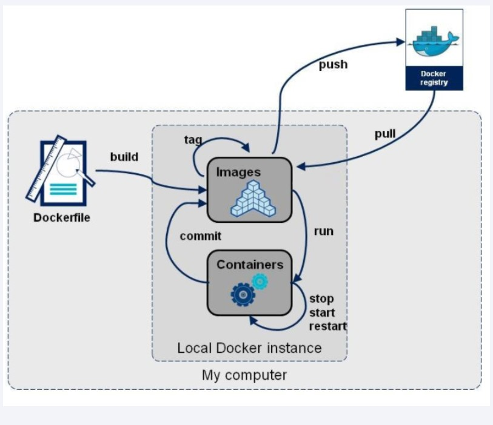
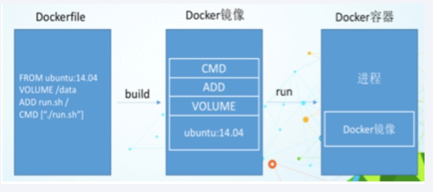
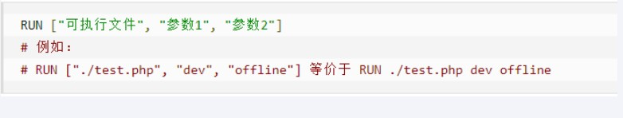
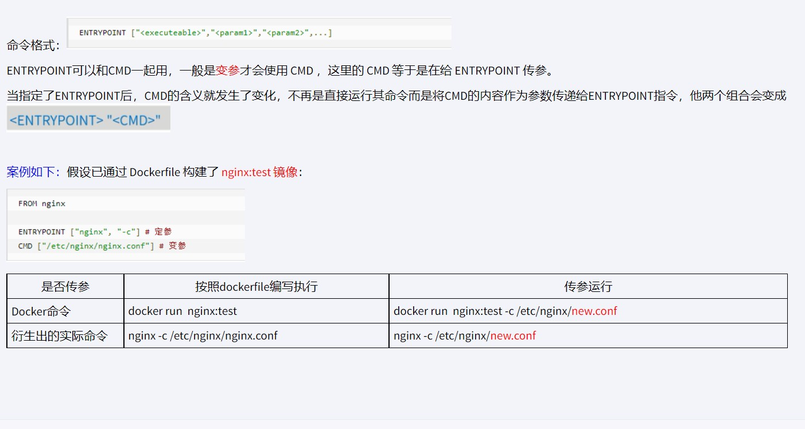
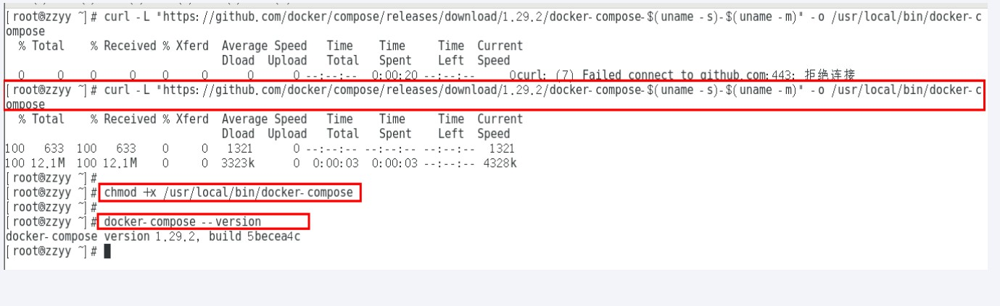

# docker入门指南(高级篇)

[TOC]


## DockerFile解析

### 是什么

在基础篇中，介绍了如何发布我们自己的镜像，但是如果我们需要在原本发布的镜像上继续添加新功能，那就需要重新在基础镜像上继续添加新功能，反复commit。

DockerFile相当于一个list，里面随时可以加入需要的功能。

 

构建三步骤

- 编写Dockerfile文件

- docker build命令构建镜像

- docker run依镜像运行容器实例


### 构建过程

**Dockerfile内容基础知识**

- 每条保留字指令都必须为大写字母且后面要跟随至少一个参数

- 指令按照从上到下，顺序执行

- #表示注释

- 每条指令都会创建一个新的镜像层并对镜像进行提交


**Docker执行Dockerfile的大致流程**

（1）docker从基础镜像运行一个容器

（2）执行一条指令并对容器作出修改

（3）执行类似docker commit的操作提交一个新的镜像层

（4）docker再基于刚提交的镜像运行一个新容器

（5）执行dockerfile中的下一条指令直到所有指令都执行完成


从应用软件的角度来看，Dockerfile、Docker镜像与Docker容器分别代表软件的三个不同阶段，

\*  Dockerfile是软件的原材料

\*  Docker镜像是软件的交付品

\*  Docker容器则可以认为是软件镜像的运行态，也即依照镜像运行的容器实例

Dockerfile面向开发，Docker镜像成为交付标准，Docker容器则涉及部署与运维，三者缺一不可，合力充当Docker体系的基石。



- Dockerfile，需要定义一个Dockerfile，Dockerfile定义了进程需要的一切东西。Dockerfile涉及的内容包括执行代码或者是文件、环境变量、依赖包、运行时环境、动态链接库、操作系统的发行版、服务进程和内核进程(当应用进程需要和系统服务和内核进程打交道，这时需要考虑如何设计namespace的权限控制)等等;

- Docker镜像，在用Dockerfile定义一个文件之后，docker build时会产生一个Docker镜像，当运行 Docker镜像时会真正开始提供服务;

- Docker容器，容器是直接提供服务的。

 

### DockerFile常用保留字指令

一个参考的DockerFile文件：[dockerfile](https://github.com/docker-library/tomcat/blob/master/10.0/jdk17/temurin-focal/Dockerfile)

**FROM**

- 基础镜像，当前新镜像是基于哪个镜像的，指定一个已经存在的镜像作为模板，第一条必须是from

**MAINTAINER**

- 镜像维护者的姓名和邮箱地址

**RUN**

- 容器构建时需要运行的命令

- 两种格式

  - shell格式 `RUN yum -y install vim` => `RUN <命令行命令>`

  - exec格式 

    

  - RUN是在 docker build时运行

    

**EXPOSE**

  - 当前容器对外暴露出的端口

  

**WORKDIR**

- 指定在创建容器后，终端默认登陆的进来工作目录，一个落脚点


**USER**

- 指定该镜像以什么样的用户去执行，如果都不指定，默认是root


**ENV**

- 用来在构建镜像过程中设置环境变量

- ENV MY_PATH /usr/mytest

  这个环境变量可以在后续的任何RUN指令中使用，这就如同在命令前面指定了环境变量前缀一样；

  也可以在其它指令中直接使用这些环境变量，


**ADD**

- 将宿主机目录下的文件拷贝进镜像且会自动处理URL和解压tar压缩包


**COPY**

- 类似ADD，拷贝文件和目录到镜像中。 将从构建上下文目录中 <源路径> 的文件/目录复制到新的一层的镜像内的 <目标路径> 位置

  - COPY src dest

  - COPY ["src", "dest"]

  - <src源路径>：源文件或者源目录
  - <dest目标路径>：容器内的指定路径，该路径不用事先建好，路径不存在的话，会自动创建。


**VOLUME**

- 容器数据卷，用于数据保存和持久化工作


**CMD**

- 指定容器启动后的要干的事情


注意:

Dockerfile 中可以有多个 CMD 指令，但只有最后一个生效，CMD 会被 docker run 之后的参数替换

它和前面RUN命令的区别

- CMD是在docker run 时运行。

- RUN是在 docker build时运行。


**ENTRYPOINT**

- 也是用来指定一个容器启动时要运行的命令

- 类似于 CMD 指令，但是ENTRYPOINT不会被docker run后面的命令覆盖， 而且这些命令行参数会被当作参数送给 ENTRYPOINT 指令指定的程序



在执行docker run的时候可以指定 ENTRYPOINT 运行所需的参数。

如果 Dockerfile 中如果存在多个 ENTRYPOINT 指令，仅最后一个生效


一个dockrfile实例：

```
FROM centos
MAINTAINER zzyy<zzyybs@126.com>
 
ENV MYPATH /usr/local
WORKDIR $MYPATH
 
#安装vim编辑器
RUN yum -y install vim
#安装ifconfig命令查看网络IP
RUN yum -y install net-tools
#安装java8及lib库
RUN yum -y install glibc.i686
RUN mkdir /usr/local/java
#ADD 是相对路径jar,把jdk-8u171-linux-x64.tar.gz添加到容器中,安装包必须要和Dockerfile文件在同一位置
ADD jdk-8u171-linux-x64.tar.gz /usr/local/java/
#配置java环境变量
ENV JAVA_HOME /usr/local/java/jdk1.8.0_171
ENV JRE_HOME $JAVA_HOME/jre
ENV CLASSPATH $JAVA_HOME/lib/dt.jar:$JAVA_HOME/lib/tools.jar:$JRE_HOME/lib:$CLASSPATH
ENV PATH $JAVA_HOME/bin:$PATH
 
EXPOSE 80
 
CMD echo $MYPATH
CMD echo "success--------------ok"
CMD /bin/bash
```


## Docker-compose容器编排

### 是什么

Compose 是 Docker 公司推出的一个工具软件，可以管理多个 Docker 容器组成一个应用。你需要定义一个 YAML 格式的配置文件docker-compose.yml，写好多个容器之间的调用关系。然后，只要一个命令，就能同时启动/关闭这些容器

Docker-Compose是Docker官方的开源项目， 负责实现对Docker容器集群的快速编排。


### 能干嘛

docker建议我们每一个容器中只运行一个服务,因为docker容器本身占用资源极少,所以最好是将每个服务单独的分割开来但是这样我们又面临了一个问题？

如果我需要同时部署好多个服务,难道要每个服务单独写Dockerfile然后在构建镜像,构建容器,这样累都累死了,所以docker官方给我们提供了docker-compose多服务部署的工具

例如要实现一个Web微服务项目，除了Web服务容器本身，往往还需要再加上后端的数据库mysql服务容器，redis服务器，注册中心eureka，甚至还包括负载均衡容器等等。。。。。。

Compose允许用户通过一个单独的docker-compose.yml模板文件（YAML 格式）来定义一组相关联的应用容器为一个项目（project）。

可以很容易地用一个配置文件定义一个多容器的应用，然后使用一条指令安装这个应用的所有依赖，完成构建。Docker-Compose 解决了容器与容器之间如何管理编排的问题。


### 安装

```
curl -L "https://github.com/docker/compose/releases/download/1.29.2/docker-compose-$(uname -s)-$(uname -m)" -o /usr/local/bin/docker-compose

chmod +x /usr/local/bin/docker-compose

docker-compose --version
```




### Compose核心概念

一文件

- docker-compose.yml

两要素

- 服务（service）

  - 一个个应用容器实例，比如订单微服务、库存微服务、mysql容器、nginx容器或者redis容器

 - 工程（project）

   - 由一组关联的应用容器组成的一个完整业务单元，在 docker-compose.yml 文件中定义。


### Compose使用的三个步骤

- 编写Dockerfile定义各个微服务应用并构建出对应的镜像文件

  一个dockerfile文件实例：

  ```yml
  version: "3.2"
  
  services:
    nacos:
      image: nacos/nacos-server
      environment:
        MODE: standalone
      ports:
        - "8848:8848"
    mysql:
      image: mysql:5.7.25
      environment:
        MYSQL_ROOT_PASSWORD: 123
      volumes:
        - "$PWD/mysql/data:/var/lib/mysql"
        - "$PWD/mysql/conf:/etc/mysql/conf.d/"
    userservice:
      build: ./user-service
    orderservice:
      build: ./order-service
    gateway:
      build: ./gateway
      ports:
        - "10010:10010"
  ```

  > 可以看到，其中包含5个service服务：
  >
  > - `nacos`：作为注册中心和配置中心
  >   - `image: nacos/nacos-server`： 基于nacos/nacos-server镜像构建
  >   - `environment`：环境变量
  >     - `MODE: standalone`：单点模式启动
  >   - `ports`：端口映射，这里暴露了8848端口
  > - `mysql`：数据库
  >   - `image: mysql:5.7.25`：镜像版本是mysql:5.7.25
  >   - `environment`：环境变量
  >     - `MYSQL_ROOT_PASSWORD: 123`：设置数据库root账户的密码为123
  >   - `volumes`：数据卷挂载，这里挂载了mysql的data、conf目录，其中有我提前准备好的数据
  > - `userservice`、`orderservice`、`gateway`：都是基于Dockerfile临时构建的

- 使用 docker-compose.yml 定义一个完整业务单元，安排好整体应用中的各个容器服务。

- 最后，执行`docker-compose up`命令 来启动并运行整个应用程序，完成一键部署上线


### Compose常用命令

docker-compose -h              # 查看帮助

docker-compose up              # 启动所有docker-compose服务

docker-compose up -d             # 启动所有docker-compose服务并后台运行

docker-compose down             # 停止并删除容器、网络、卷、镜像。


docker-compose exec  yml里面的服务id         

#进入容器实例内部 docker-compose exec docker-compose.yml文件中写的服务id /bin/bash


docker-compose ps            # 展示当前docker-compose编排过的运行的所有容器

docker-compose top           # 展示当前docker-compose编排过的容器进程

 

docker-compose logs  yml里面的服务id   # 查看容器输出日志

docker-compose config   # 检查配置

docker-compose config -q # 检查配置，有问题才有输出

docker-compose restart  # 重启服务

docker-compose start   # 启动服务

docker-compose stop    # 停止服务