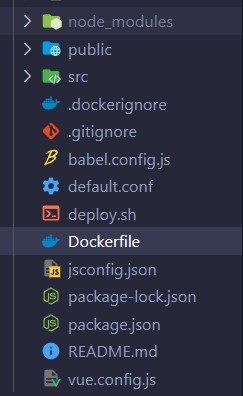
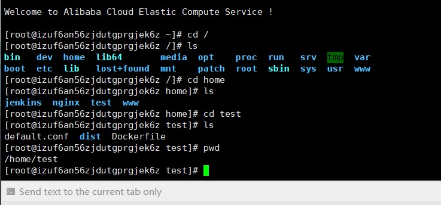
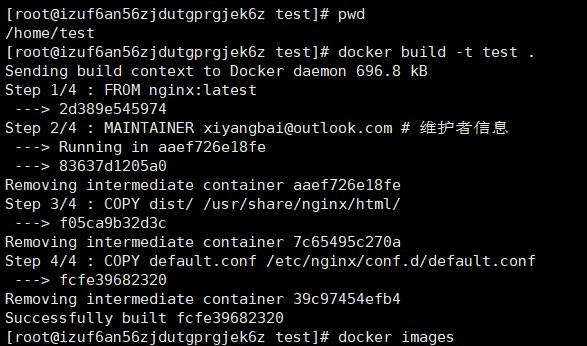
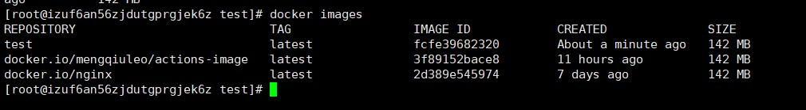

# 【Docker】docker+Nginx部署前端项目

[TOC]


## 相关配置安装

**安装`Docker`**

```
 yum install docker
```

**启动服务 `start docker`**

```sql
systemctl start docker
```

**Docker中拉取`nginx`镜像**

```
docker pull nginx
```


## 创建配置文件

我们需要在根目录下创建Dockerfile文件和default.conf文件。

其中default.conf文件的名称是什么无所谓，只要在配置文件中注意使用相同名称即可。



Dokcerfile文件具体内容如下：

```dockerfile
FROM nginx:latest

# 将项目根目录下dist文件夹下的所有文件复制到镜像中 /usr/share/nginx/html/ 目录下
COPY dist/ /usr/share/nginx/html/
COPY default.conf /etc/nginx/conf.d/default.conf
```

- `FROM nginx:latest`: 命令的意思该镜像是基于 nginx:latest 镜像而构建的。

- `COPY dist/ /usr/share/nginx/html/ `:命令的意思是将项目根目录下 dist 文件夹下的所有文件复制到镜像中 `/usr/share/nginx/html/ `目录下。

  这里镜像中的目录我们不要动，但需要保证我们项目的打包目录是`dist/`，或者自定义到你打包的目录下。

- `COPY default.conf /etc/nginx/conf.d/default.conf` 命令的意思是将 Nginx 目录下的 default.conf 复制到 etc/nginx/conf.d/default.conf，用本地的 default.conf 配置来替换 Nginx 镜像里的默认配置。

  这里镜像中的目录我们不要动，但需要保证我们编写的文件名也为`default.conf`，或者与你自己写的文件名对应


**default.conf**

下面的配置直接照抄就好，特别注意，监听的端口号并不需要动，这里的80端口指的是容器的端口，最后我们会将容器的端口映射到我们宿主服务器的端口，比如映射到8888端口。

```
8888:80
```

- 然后 注意修改为自己的服务器IP地址

完整配置：

```js
upstream my_server{
  server 121.41.4.33:3000; # 后端server 地址
  keepalive 2000;
}

server {
    listen       80; #这里的端口号不要动，80端口指的是容器的端口，最后我们会将容器的端口映射到我们宿主服务器的端口，比如映射到8888端口
    server_name  111.20.xxx.xxx; # 修改为docker服务宿主机的ip/域名
    
    #charset koi8-r;
    access_log  /var/log/nginx/host.access.log  main;
    error_log  /var/log/nginx/error.log  error;

    location / {
        root   /usr/share/nginx/html;
        index  index.html index.htm;
        try_files $uri $uri/ /index.html =404;
    }
     #  这里就是和vue本地代理的意思一样，已api开头的路径都代理到本机的3000端口
    location /api/ {
        proxy_pass http://my_server/api;
        proxy_set_header Host $host:$server_port;
        rewrite ^/api/(.*) /$1 break;
    }

    error_page   500 502 503 504  /50x.html;
    location = /50x.html {
        root   html;
    }
    
}
```


## 项目打包与部署

将打包项目，把`dist`文件夹和刚刚创建的`Dockerfile`,`default.conf`放到同一目录，并上传到服务器。



比如，我的代码存放位置是`/home/test`目录。

然后需要**构建镜像**

```
docker build -t test .
```

`docker build -t`我们并不需要动，

后面的test是我们构建的镜像的名称，`.`代表需要进行构建的代码的存放位置，这里是`.`是因为我当期所在目录就是`/home/test`，并且我的项目的三个文件就位于`/home/test`目录下。

如果我们此时位于其他目录，当前目录下没有要进行镜像打包的文件，那就需要更改路径。

比如：

```
dokcer build -t test /home/test
```



然后使用`dokcer images`可以查看我们已经存在的镜像




**镜像构建好后，我们就可以拿这个镜像启动一个容器**

```
docker run -d -p 8888:80 --name test-image test
```

- -d 后台方式运行
- -p 8888:80 端口映射，将宿主的8888端口映射到容器的80端口
- –name 容器名 镜像名

然后我们可以使用`docker ps`查看当前正在运行的容器

并且使用IP地址和端口号访问当前的项目


**注意**

上面我们进行了端口映射，那就需要在服务器中开启要使用的端口，

我们可以在云服务器中的安全组进行设置。

或者使用命令设置

**查看已开放端口命令：firewall-cmd --list-all**

- 查看防火墙状态：active (running) 即是开启状态

  systemctl status firewalld

-  查看已开发端口命令：firewall-cmd --list-all

- 新增防火墙开放端口：

	firewall-cmd --zone=public --add-port=3306/tcp --permanent

- 开放端口后需要重新加载防火墙：

	firewall-cmd --reload


**一些相关指令**

如果我们不再需要这个容器和镜像，

首先需要先停止这个容器，然后在移出容器和镜像。

首先拿`docker ps`找到指定容器的ID，

使用`docker stop [ID]` 停止容器

`docker rm [ID]` 移除容器

然后拿`docker images`查看已存在的镜像ID，

使用`docker rmi [ID]` 移除镜像


可能我们的docker没有设置开机启动：

```
systemctl start docker # 启动docker
systemctl status docker # 查看docker的运行状态
```

一个相关报错：[关于：Cannot connect to the Docker daemon at unix:///var/run/docker.sock. Is the docker daemon running?](https://blog.csdn.net/cfy1009/article/details/124797287?ops_request_misc=%257B%2522request%255Fid%2522%253A%2522166340722816782391823834%2522%252C%2522scm%2522%253A%252220140713.130102334.pc%255Fall.%2522%257D&request_id=166340722816782391823834&biz_id=0&utm_medium=distribute.pc_search_result.none-task-blog-2~all~first_rank_ecpm_v1~rank_v31_ecpm-3-124797287-null-null.142^v47^new_blog_pos_by_title,201^v3^add_ask&utm_term=Cannot%20connect%20to%20the%20Docker%20daemon%20at%20unix%3A%2F%2F%2Fvar%2Frun%2Fdocker.sock.%20Is%20the%20docker%20daemon%20running&spm=1018.2226.3001.4187.4)


后续，我们将使用docker和github actions实现自动化部署。