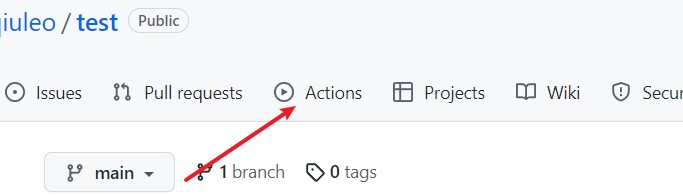
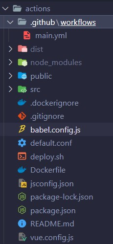
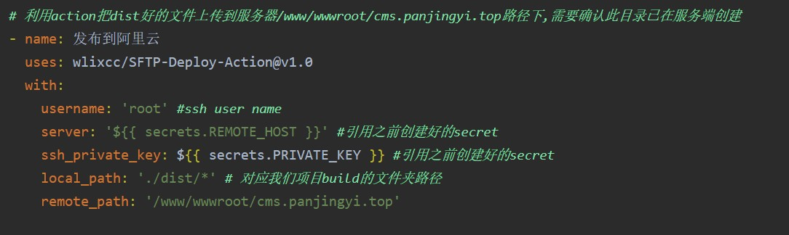
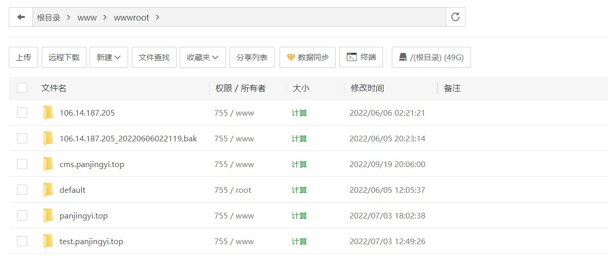
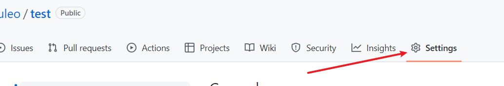
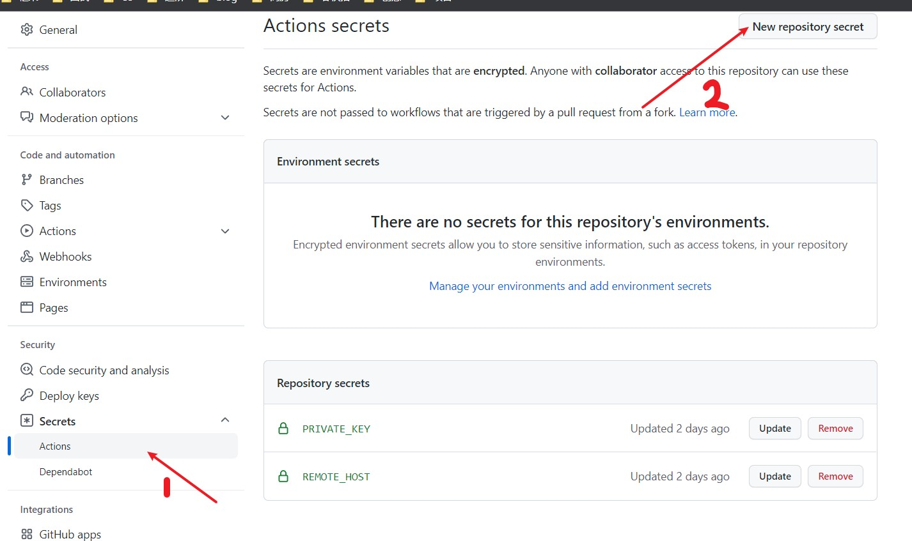

# 【github actions】部署前端项目

[TOC]


## 前言

对于前端，部署一个网站，当我们对网站内容进行修改后再次进行部署时，仍然需要手动将打包后的文件上传到服务器，这个过程比较繁琐，那么我们可以使用github actions实现持续集成，我们只需要负责修改代码即可，当代码被push到远程仓库时，这个push行为会被监听到，会自动发布到服务器上。

最开始的使用linux+Nginx进行前端项目部署的教程：[【vue项目部署】Linux+Nginx实现项目部署及跨域](https://blog.csdn.net/weixin_52834435/article/details/126896157?spm=1001.2014.3001.5501)


## github actions

github提供了对于开源项目免费的github actions使用。




### 具体实现

首先，我们需要在自己的项目下建立一个 `.github`文件夹，然后在该文件夹下再建立一个`workflows`文件夹，然后在这个文件夹中建立一个后缀为`.yml`的文件，文件名叫什么无所谓，比如我的文件叫`main.yml`。




然后我们需要在`main.yml`文件中编写具体要进行操作的步骤。

一个yml文件实例：

```yml
name: 打包应用并上传阿里云

on:
    push:
        branches:
            - main

jobs:
    build:
        # runs-on 指定job任务运行所需要的虚拟机环境(必填字段)
        runs-on: ubuntu-latest
        steps:
            # 获取源码
            - name: 迁出代码
              # 使用action库  actions/checkout获取源码
              uses: actions/checkout@master

            # # 安装Node10
            # - name: 安装node.js
            # # 使用action库  actions/setup-node安装node
            #   uses: actions/setup-node@v2.5.1
            #   with:
            #       node-version: 14.0.0

            # 安装依赖
            - name: 安装依赖
              run: npm install

            # 打包
            - name: 打包
              run: npm run build

            # # 上传阿里云
            # - name: 发布到阿里云
            #   uses: easingthemes/ssh-deploy@v2.1.1
            #   env:
            #       # 私钥
            #       SSH_PRIVATE_KEY: ${{ secrets.PRIVATE_KEY }}
            #       # scp参数
            #       ARGS: '-avzr --delete'
            #       # 服务器ip：换成你的服务器IP
            #       REMOTE_HOST: ${{ secrets.REMOTE_HOST }}
            #       # 用户
            #       REMOTE_USER: 'root'
            #       # 对应我们项目build的文件夹路径
            #       local_path: './dist/*' 
            #       # 目标地址
            #       TARGET: '/www/wwwroot/cms.panjingyi.top'
            
            # 利用action把dist好的文件上传到服务器/www/wwwroot/cms.panjingyi.top路径下,需要确认此目录已在服务端创建
            - name: 发布到阿里云
              uses: wlixcc/SFTP-Deploy-Action@v1.0
              with:
                username: 'root' #ssh user name
                server: '${{ secrets.REMOTE_HOST }}' #引用之前创建好的secret
                ssh_private_key: ${{ secrets.PRIVATE_KEY }} #引用之前创建好的secret
                local_path: './dist/*' # 对应我们项目build的文件夹路径
                remote_path: '/www/wwwroot/cms.panjingyi.top'
                  
```


相关概念解释：

##### `name`

> 工作流程的名称（可空），如果设置，则会在GitHub的操作页面上显示工作流的名称

##### `on`

> 触发工作流的事件名称。譬如发起的push/pull_request等操作触发。可以只监听某一个事件`string`，或者多个事件。
>
> 比如上面这个文件，设置的是当执行push操作时，会触发github actions

##### `job`

`任务`，任务是工作流的主体，一个工作流由一个任务（job）或者多个任务（jobs）构成，表示一次持续集成的运行

###### job_id

> 每个任务都必须要有个id，其实就是一个字符串

###### runs-on

任务运行的虚拟环境，必须要指定，不然无法工作

```
# 使用
runs-on: ubuntu-latest
```

##### `steps`

`步骤`，每个任务由多个step构成，通过一个多或者多个步骤完成一个任务。可以在运行命令、运行任务、运行仓库中的操作、docker注册表中发布操作。

注意点： 不是所有的step都会运行操作，但是所有的操作都会作为step运行，每个step在虚拟环境中都会有个独立的进程，可以访问工作区和文件系统。

###### name

> 步骤名称

###### run

> 该步骤运行的命令或者 action

###### env

> 该步骤所需的环境变量

###### uses

> 选择任务步骤中一部分运行的操作。其实就是步骤使用的`actions`,可以是一个或多个


### 实例解释：

对于上面的例子，对照概念我们进行解释：

- 首先，我们定义了一个工作流程，它的名字叫：打包应用并上传阿里云

- 它的执行时机是当我们触发main分支上的push操作时执行

- 然后我们触发的一个job的名字是build

- 这个job运行的环境是`ubuntu-latest`

- 在这个job中，具体工作如下：

  - 首先会获取源码，通过使用action库  actions/checkout来获取源码

  - 然后会安装依赖和进行打包

  - 接下来就是登录服务器并上传代码

    

- 我这里使用的私钥登录服务器，`REMOTE_HOST`是一个私有变量，后面会讲如何设置私有变量，`REMOTE_HOST`中放的是我们的云服务器的IP地址

- 登录云服务器，我们使用root用户名登录

- `PRIVATE_KEY `是我们的私钥

- local_path指的是：我们当前文件进行打包后的目录

- remote_path指的是：我们云服务器上存放当前网站的地址

- 我使用的是宝塔面板

  

  我想将打包好的文件放在`cms.panjingyi.top`这个域名下，并且如果我们使用xshell5连接云服务器，查看网站文件具体位置，会发现文件其实就位于`/www/wwwroot/cms.panjingyi.top`目录下，宝塔会自动将我们的域名当做文件名。

- 接下来我们需要设置一下私有变量，私有变量的设置和yml文件的编写并没有先后顺序，因为只有在这两个步骤结束后，我们才会将代码push到github上

- 

  

  设置新的私钥，名称就是在yml文件中编写的变量，比如：REMOTE_HOST和PRIVATE_KEY

- 对于私钥，我们可以直接使用当时登录云服务器时使用的那个私钥。