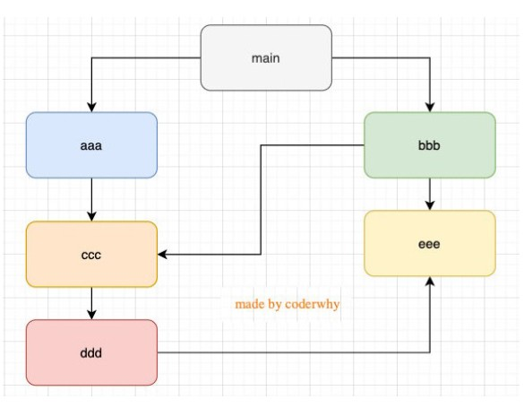

[TOC]


# JavaScript 模块化规范

JavaScript 模块化规范，包括原生规范 ES6 模块、Node.js 采用的 CommonJS，以及开源社区早期为浏览器提供的规范 AMD，具有 CommonJS 特性和 AMD 特性的 CMD，让 CommonJS 和 AMD 模块跨端运行的 UMD。


## CommonJS

- 在Node中每一个js文件都是一个单独的模块；
- 这个模块中包括CommonJS规范的核心变量：exports、module.exports、require；

- 我们可以使用这些变量来方便的进行模块化开发；

> - exports和module.exports可以负责对模块中的内容进行导出；
> - require函数可以帮助我们导入其他模块（自定义模块、系统模块、第三方库模块）中的内容；


### 定义和引用

CommonJS 规定每个文件就是一个模块，有独立的作用域。每个模块内部，都有一个 module 对象，代表当前模块。通过它来导出 API，它有以下属性：

- id 模块的识别符，通常是带有绝对路径的模块文件名；

- filename 模块的文件名，带有绝对路径；

- loaded 返回一个布尔值，表示模块是否已经完成加载；

- parent 返回一个对象，表示调用该模块的模块；

- children 返回一个数组，表示该模块要用到的其他模块；

- exports 表示模块对外输出的值。


引用模块则需要通过 require 函数，它的基本功能是，读入并执行一个 JavaScript 文件，然后返回该模块的 exports 对象。


### 特性

CommonJS ，它采用的是**值拷贝和动态声明**。值拷贝和值引用相反，一旦输出一个值，模块内部的变化就影响不到这个值了，可以简单地理解为**变量浅拷贝**。

动态声明，就是消除了静态声明的限制，可以“自由”地在表达式语句中引用模块。


### 举例

```js
//test.js
const name = 'pjy';
const age = 19;

function sayHello(name) {
  console.log("hello " + name);
}

module.exports = {
  name,
  age,
  sayHello
}

//main.js
const a = require('./test');

console.log(a.age);//19
console.log(a.sayHello);//[Function: sayHello]
```


### require文件查找规则

导入格式如下：require(X)

- 情况一：X是一个Node核心模块，比如path、http

​		  直接返回核心模块，并且停止查找

- 情况二：X是以./ 或../ 或/（根目录）开头的

  - 第一步：将X当做一个文件在对应的目录下查找；
    1.如果有后缀名，按照后缀名的格式查找对应的文件
    2.如果没有后缀名，会按照如下顺序：

    - 直接查找文件X
    - 查找X.js文件
    - 查找X.json文件
    - 查找X.node文件

  - 第二步：没有找到对应的文件，将X作为一个目录
      查找目录下面的index文件

    - 查找X/index.js文件

    - 查找X/index.json文件

    - 查找X/index.node文件

      

  - 如果没有找到，那么报错：not found


### 模块的加载过程

- 结论一：模块在被第一次引入时，模块中的js代码会被运行一次
- 结论二：模块被多次引入时，会缓存，最终只加载（运行）一次
  - 为什么只会加载运行一次呢？
  - 这是因为每个模块对象module都有一个属性：loaded。
  - 为false表示还没有加载，为true表示已经加载；
- 结论三：如果有循环引入，那么加载顺序是什么？
  - 如果出现下图模块的引用关系，那么加载顺序是什么呢？
    - 这个其实是一种数据结构：图结构；
    - 图结构在遍历的过程中，有深度优先搜索（DFS, depth first search）和广度优先搜索（BFS, breadth first search）；
    - Node采用的是深度优先算法：main -> aaa -> ccc -> ddd -> eee ->bbb




### CommonJS规范缺点

- CommonJS加载模块是同步的：
  - 同步的意味着只有等到对应的模块加载完毕，当前模块中的内容才能被运行；
  - 这个在服务器不会有什么问题，因为服务器加载的js文件都是本地文件，加载速度非常快；
- 如果将它应用于浏览器呢？
  - 浏览器加载js文件需要先从服务器将文件下载下来，之后再加载运行；
  - 那么采用同步的就意味着后续的js代码都无法正常运行，即使是一些简单的DOM操作；
- 所以在浏览器中，我们通常不使用CommonJS规范：
  - 当然在webpack中使用CommonJS是另外一回事；
  - 因为它会将我们的代码转成浏览器可以直接执行的代码；
- 在早期为了可以在浏览器中使用模块化，通常会采用AMD或CMD：
  - 但是目前一方面现代的浏览器已经支持ES Modules，另一方面借助于webpack等工具可以实现对CommonJS或者ESModule代码的转换；
  - AMD和CMD已经使用非常少了


## AMD

### 定义和引用

AMD主要是应用于浏览器的一种模块化规范，它采用的是**异步加载模块**。

异步加载，就是指同时并发加载所依赖的模块，当所有依赖模块都加载完成之后，再执行当前模块的回调函数。这种加载方式和浏览器环境的性能需求刚好吻合。

AMD 实现的比较常用的库是 require.js 和 curl.js


AMD 规范只定义了一个全局函数 define，通过它就可以定义和引用模块，它有 3 个参数：

```
define(id?, dependencies?, factory);
```

第 1 个参数 id 为模块的名称，该参数是可选的。如果没有提供该参数，模块的名字应该默认为模块加载器请求的指定脚本的名字；如果提供了该参数，模块名必须是“顶级”的和绝对的（不允许相对名字）。

第 2 个参数 dependencies 是个数组，它定义了所依赖的模块。依赖模块必须根据模块的工厂函数优先级执行，并且执行的结果应该按照依赖数组中的位置顺序以参数的形式传入（定义中模块的）工厂函数中。

第 3 个参数 factory 为模块初始化要执行的函数或对象。如果是函数，那么该函数是单例模式，只会被执行一次；如果是对象，此对象应该为模块的输出值。


举例：

```js
//foo.js
define(function() {
  const name = "pjy";
  const age = 19;
  function sum(num1,num2) {
    return num1 + num2
  }

  return {
    name,
    age,
    sum
  }
})


//main.js
require.config({
  baseUrl: './src',
  paths: {
    foo: "./foo",
    bar: "./bar"
  }
})

require(["foo","bar"],function(foo) {
  console.log("main:",foo);
})

```


举例2：

创建一个名为“alpha”的模块，依赖了 require、exports、beta 3 个模块，并导出了 verb 函数。

```js
 define("alpha", ["require", "exports", "beta"], function (require, exports, beta) {

     exports.verb = function() {

         return beta.verb();

     }

 });

```


## CMD

### 定义和引用

CMD 定义模块也是通过一个全局函数 define 来实现的，但只有一个参数，该参数既可以是函数也可以是对象：

```
define(factory);
```

如果这个参数是对象，那么模块导出的就是对象；如果这个参数为函数，那么这个函数会被传入 3 个参数 require 、 exports 和 module。

```
define(function(require, exports, module) {

  //...

});
```

第 1 个参数 require 是一个函数，通过调用它可以引用其他模块，也可以调用 require.async 函数来异步调用模块。

第 2 个参数 exports 是一个对象，当定义模块的时候，需要通过向参数 exports 添加属性来导出模块 API。

第 3 个参数 module 是一个对象，它包含 3 个属性：

- uri，模块完整的 URI 路径；
- dependencies，模块的依赖；
- exports，模块需要被导出的 API，作用同第二个参数 exports。

举例：

```js
//foo.js
define(function(require, exports, module) {
  const name = "pjy";
  const age = 19;
  function sum(num1,num2) {
    return num1 + num2
  }

  // exports.name = name;
  // exports.age = age
  module.exports = {
    name,
    age
  }
})


//main.js 
define(function(require, exports, module) {
  const foo = require("./foo");
  console.log("main:", foo);
})

```


举例2：

定义了一个名为 increment 的模块，引用了 math 模块的 add 函数，经过封装后导出成 increment 函数。

```js
define(function(require, exports, module) {

  var add = require('math').add;

  exports.increment = function(val) {

    return add(val, 1);

  };

  module.id = "increment";

});

```


## ES6 模块

### 定义和引用

ES Module和CommonJS的模块化有一些不同之处：

- 一方面它使用了import和export关键字；
- 另一方面它采用编译期的静态分析，并且也加入了动态引用的方式；

ES Module模块采用export和import关键字来实现模块化：

- export负责将模块内的内容导出；

- import负责从其他模块导入内容；

**采用ES Module将自动采用严格模式：use strict**


- 虽然大部分主流浏览器支持 ES6 模块，但是和引入普通 JS 的方式略有不同，需要在对应 script 标签中将属性 type 值设置为“module”才能被正确地解析为 ES6 模块；

```html
    <script src="./main.js" type="module"></script>
```


- 在 Node.js 下使用 ES6 模块则需要将文件名后缀改为“.mjs”，用来和 Node.js 默认使用的 CommonJS 规范模块作区分。


ES6 模块对于引用声明有严格的要求，首先必须在文件的首部，不允许使用变量或表达式，不允许被嵌入到其他语句中。所以下面 3 种引用模块方式都会报错。

```js
// 必须首部声明

let a = 1

import { app } from './app';

// 不允许使用变量或表达式

import { 'a' + 'p' + 'p' } from './app';

// 不允许被嵌入语句逻辑

if (moduleName === 'app') {

  import { init } from './app';

} else {

  import { init } from './bpp';

}

```


### exports关键字(导出)

- 方式一：在语句声明的前面直接加上export关键字

```js
export const name = "pjy";
export const age = 19;
```

- 方式二：将所有需要导出的标识符，放到export后面的{}中
  - 注意：这里的{}里面不是ES6的对象字面量的增强写法，{}也不是表示一个对象的；
  - 所以： export {name: name}，是错误的写法；

```js
//声明和导出分开
const name = "pjy";
const age = 19;
function foo() {
  console.log("foo function");
}
export {
  name,
  age,
  foo
}
```

- 方式三：导出时给标识符起一个别名

```js
const name = "pjy";
const age = 19;
function foo() {
  console.log("foo function");
}
export {
  name as fName,
  age as fAge,
  foo as fFoo
}

//此时导入时要用别名导入
import {fName,fAge} from "./foo.js"
```


### import关键字(导入)

- 方式一：import {标识符列表} from '模块'；
   注意：这里的{}也不是一个对象，里面只是存放导入的标识符列表内容；

​     就是普通的导入

```js
import {name,age} from "./foo.js"
```

- 方式二：导入时给标识符起别名

  ```js
  import {name as fName,age as fAge} from "./foo.js"
  ```

- 方式三：通过* 将模块功能放到一个模块功能对象（a module object）上

将导出的所有内容放到一个标识符中

```js

import * as foo from "./foo.js"

//在使用时
console.log(foo.name);
console.log(foo.age);
```


### export和import结合使用

这里是在当前js文件中导入math.js 和 format.js，然后统一将导入的模块以当前文件的形式导出

```js
import {add, sub} from './math.js'
import {timeFormat, priceFormat} from './format.js'

export {
  add,
  sub,
  timeFormat,
  priceFormat
}
```


### default用法

**在一个模块中，只能有一个默认导出（default export）**。

- 默认导出export时可以不需要指定名字；
- 在导入时不需要使用{}，并且可以自己来指定名字；
  

```js
//foo.js
const foo = "foo value";

export default foo;


//main.js
import pjy from "./foo.js"

console.log(pjy);//foo value
```

