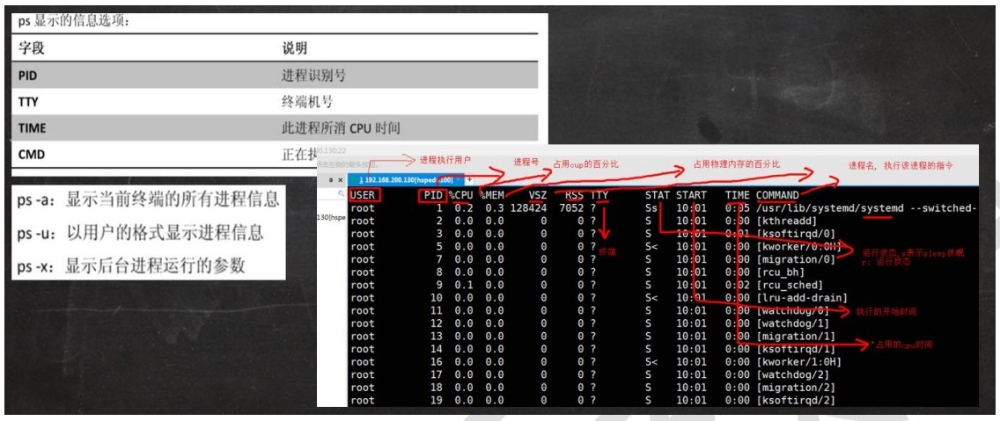
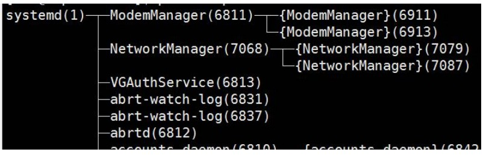
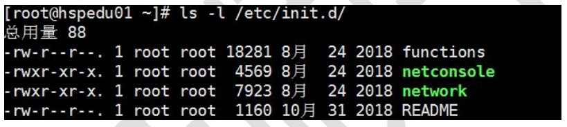
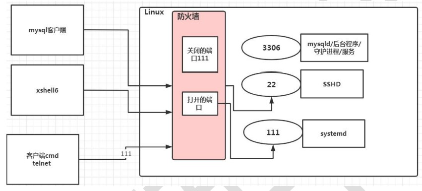
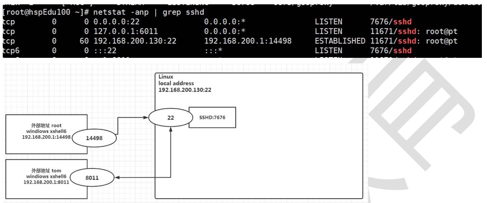

# 进程管理(重点)

[TOC]

## 1.显示系统执行的进程

### 基本介绍 

ps 命令是用来查看目前系统中，有哪些正在执行，以及它们执行的状况。可以不加任何参数.

### ps 详解 

1) 指令：ps –aux|grep xxx ，比如我看看有没有 sshd 服务 

2) 指令说明 

- System V 展示风格 

- USER：用户名称 

- PID：进程号 

- %CPU：进程占用 CPU 的百分比 

- %MEM：进程占用物理内存的百分比 

- VSZ：进程占用的虚拟内存大小（单位：KB） 

- RSS：进程占用的物理内存大小（单位：KB） 

- TT：终端名称,缩写 . 

- STAT：进程状态，其中 S-睡眠，s-表示该进程是会话的先导进程，N-表示进程拥有比普通优先级更低的优先级，R-正在运行，D-短期等待，Z-僵死进程，T-被跟踪或者被停止等等 
- STARTED：进程的启动时间 
- TIME：CPU 时间，即进程使用 CPU 的总时间 

- COMMAND：启动进程所用的命令和参数，如果过长会被截断显示

### 应用实例 

- 要求：以全格式显示当前所有的进程，查看进程的父进程。 查看 sshd 的父进程信息

  ps -ef 是以全格式显示当前所有的进程 

  -e 显示所有进程。-f 全格式 

  ps -ef|grep sshd 

- 是 BSD 风格 

  UID：用户 ID 

  PID：进程 ID 

  PPID：父进程 ID 

  C：CPU 用于计算执行优先级的因子。数值越大，表明进程是 CPU 密集型运算，执行优先级会降低；数值越小，表明进程是 I/O 密集型运算，执行优先级会提高 

  STIME：进程启动的时间 

  TTY：完整的终端名称 

  TIME：CPU 时间 

  CMD：启动进程所用的命令和参数 

## 2.终止进程 kill 和 killall 

### 介绍: 

若是某个进程执行一半需要停止时，或是已消了很大的系统资源时，此时可以考虑停止该进程。使用kill 命令来完成此项任务。 

### 基本语法 

kill [选项] 进程号（功能描述：通过进程号杀死/终止进程） 

killall 进程名称 （功能描述：通过进程名称杀死进程，也支持通配符，这在系统因负载过大而变得很慢时很有用）

### 常用选项

-9 :表示强迫进程立即停止 

### 最佳实践 

1) 案例 1：踢掉某个非法登录用户 

kill 进程号 , 比如 kill 11421 

2) 案例 2: 终止远程登录服务 sshd, 在适当时候再次重启 sshd 服务 

kill sshd 对应的进程号; /bin/systemctl start sshd.service 

3) 案例 3: 终止多个 gedit , 演示 killall gedit 

4) 案例 4：强制杀掉一个终端, 指令 kill -9 bash 对应的进程号

## 4.查看进程树 pstree 

### 基本语法 

pstree [选项] ,可以更加直观的来看进程信息 

### 常用选项 

-p :显示进程的 PID 

-u :显示进程的所属用户 

### 应用实例： 

- 案例 1：请你树状的形式显示进程的 

pid pstree -p 

- 案例 2：请你树状的形式进程的用户 

pstree -u

## 5.服务(service)管理

### 介绍: 

服务(service) 本质就是进程，但是是运行在后台的，通常都会监听某个端口，等待其它程序的请求，比如(mysqld, sshd防火墙等)，因此我们又称为守护进程，是 Linux 中非常重要的知识点。 

14.5.2 service 管理指令 

1) service 服务名 [start | stop | restart | reload | status] 

2) 在 CentOS7.0 后 很多服务不再使用 service ,而是 systemctl (后面专门讲) 

3) service 指令管理的服务在 /etc/init.d 查看

### service 管理指令案例 

请使用 service 指令，查看，关闭，启动 network [注意：在虚拟系统演示，因为网络连接会关闭] 

指令: 

service network status 

service network stop 

service network start

### 查看服务名: 

- 方式 1：使用 setup -> 系统服务 就可以看到全部。

- 方式 2: /etc/init.d 看到 service 指令管理的服务 `ls -l /etc/init.d`

### 服务的运行级别(runlevel): 

- Linux 系统有 7 种运行级别(runlevel)：常用的是级别 3 和 5 

运行级别 0：系统停机状态，系统默认运行级别不能设为 0，否则不能正常启动 

运行级别 1：单用户工作状态，root 权限，用于系统维护，禁止远程登陆 

运行级别 2：多用户状态(没有 NFS)，不支持网络 

运行级别 3：完全的多用户状态(有 NFS)，无界面，登陆后进入控制台命令行模式 

运行级别 4：系统未使用，保留 

运行级别 5：X11 控制台，登陆后进入图形 GUI 模式 

运行级别 6：系统正常关闭并重启，默认运行级别不能设为 6，否则不能正常启动 

### chkconfig指令

> chkconfig：可以给每个服务的各个运行级别设置自启动/关闭

**基本语法**

* 查看xxx服务：chkconfig –list | grep xxx
* 查看服务的状态：chkconfig 服务名 --list
* 给服务的运行级别设置自启动：chkconfig –level 5 服务名 on/off
* 要所有运行级别关闭或开启：chkconfig 服务名 on/off
* **chkconfig重新设置后需要重新启动才能生效**

**案例演示** : 对 network 服务 进行各种操作, 把 network 在 3 运行级别,关闭自启动 

chkconfig --level 3 network off 

chkconfig --level 3 network on 

**使用细节** 

chkconfig 重新设置服务后自启动或关闭，需要重启机器 reboot 生效

### systemctl 管理指令 

基本语法： 

systemctl [start | stop | restart | status] 服务名 

systemctl 指令管理的服务在 /usr/lib/systemd/system 查看 

### systemctl 设置服务的自启动状态 

systemctl list-unit-files [ | grep 服务名] (查看服务开机启动状态, grep 可以进行过滤) systemctl enable 服务名 (设置服务开机启动) 

systemctl disable 服务名 (关闭服务开机启动) 

systemctl is-enabled 服务名 (查询某个服务是否是自启动的)

## 6.防火墙相关指令

查看当前防火墙的状况，关闭防火墙和重启防火墙。=> firewalld.service 

systemctl status firewalld; 

systemctl stop firewalld; 

systemctl start firewalld

### 细节讨论：

关闭或者启用防火墙后，立即生效。[telnet 测试 某个端口即可] 

这种方式只是临时生效，当重启系统后，还是回归以前对服务的设置。 

如果希望设置某个服务自启动或关闭永久生效，要使用 systemctl [enable|disable] 服务名. [演示] 

### 打开或者关闭指定端口 

在真正的生产环境，往往需要将防火墙打开，但问题来了，如果我们把防火墙打开，那么外部请求数据包就不能跟服务器监听端口通讯。这时，需要打开指定的端口。比如 80、22、8080 等，这个又怎么做呢？

### firewall 指令 

1) 打开端口: firewall-cmd --permanent --add-port=端口号/协议 

2) 关闭端口: firewall-cmd --permanent --remove-port=端口号/协议 

3) 重新载入,才能生效 : firewall-cmd --reload 

4) 查询端口是否开放: firewall-cmd --query-port=端口/协议 

### 应用案例： 

1) 启用防火墙， 测试 111 端口是否能 telnet , 不行 

2) 开放 111 端口 

firewall-cmd --permanent --add-port=111/tcp ; 

需要 firewall-cmd --reload 

3) 再次关闭 111 端口

firewall-cmd --permanent --remove-port=111/tcp ; 

需要 firewall-cmd --reload

## 7.动态监控进程

> top与ps相似，都是用来显示正在执行的进程，top的不同之处在于top执行一段时间可以更新正在运行的进程

### 基本语法

> top [选项]
>
> * -d 秒数：指定top命令每隔几秒更新。默认是3秒。
> * -i：使top不显示任何闲置或者僵死进程。
> * -p：通过指定监控进程ID来仅仅监控某个进程的状态。

* 交互操作说明：

| 操作 | 功能                          |
| ---- | ----------------------------- |
| P    | 以CPU使用率排序，默认就是此项 |
| M    | 以内存的使用率排序            |
| N    | 以PID排序                     |
| q    | 退出top                       |

### 应用实例 

- 案例 1.监视特定用户, 比如我们监控 tom 用户 

  top：输入此命令，按回车键，查看执行的进程。 

  u：然后输入“u”回车，再输入用户名，即可, 

- 案例 2：终止指定的进程, 比如我们要结束 tom 登录 

  top：输入此命令，按回车键，查看执行的进程。 

  k：然后输入“k”回车，再输入要结束的进程 ID 号 

- 案例 3:指定系统状态更新的时间(每隔 10 秒自动更新), 默认是 3 秒 

  top -d 10

## 8.监控网络状态 

### 查看系统网络情况 netstat 

- 基本语法 

  netstat [选项] 

- 选项说明 -an 按一定顺序排列输出 -p 显示哪个进程在调用 

- 应用案例 

  请查看服务名为 sshd 的服务的信息。 

  netstat -anp | grep sshd

