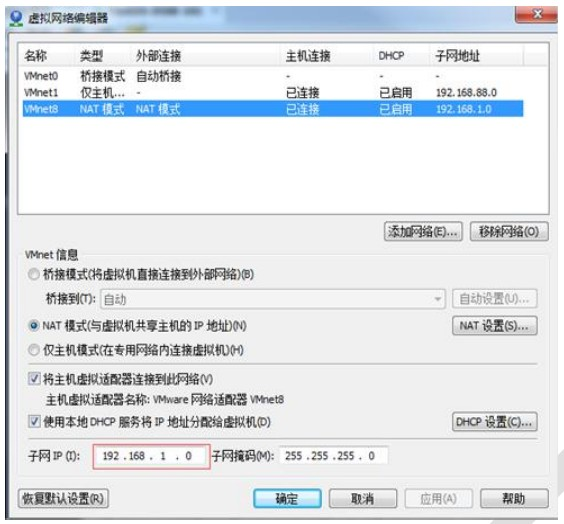
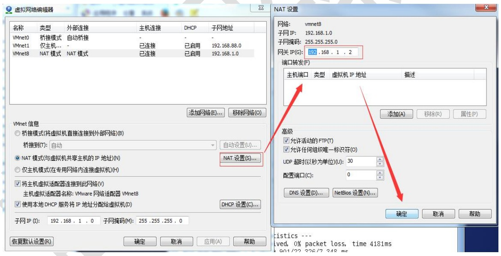
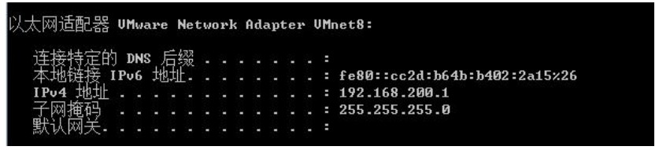
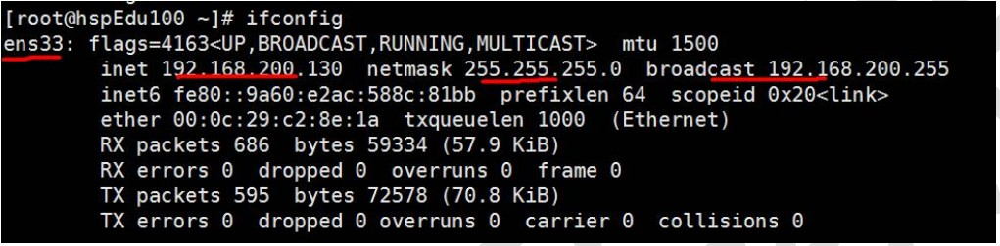
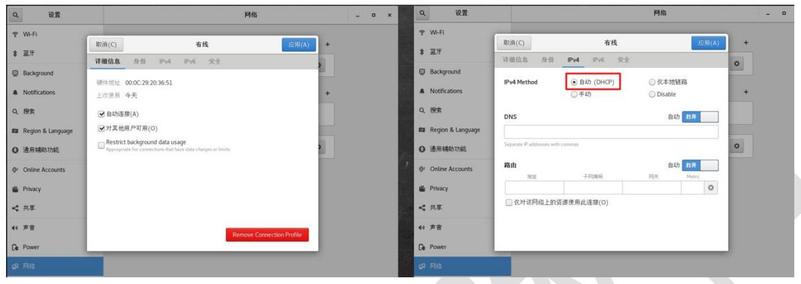

# 网络配置

[TOC]

## 1.Linux 网络配置原理图 

### 画出原理图，帮助理解


## 2.查看网络 IP 和网关 

### 查看虚拟网络编辑器和修改 IP 地址



### 查看网关




## 3.查看 windows 环境的中 VMnet8 网络配置 (ipconfig 指令)




## 4.查看 linux 的网络配置 ifconfig




## 5.ping 测试主机之间网络连通性 

### 基本语法 

ping 目的主机 （功能描述：测试当前服务器是否可以连接目的主机） 

### 应用实例 

测试当前服务器是否可以连接百度 ping www.baidu.com


## 6.linux 网络环境配置 

### 第一种方法(自动获取)： 

说明：登陆后，通过界面的来设置自动获取 ip，特点：linux 启动后会自动获取 IP,缺点是每次自动获取的ip地址可能不一样




### 第二种方法(指定 ip) 

- 说明 

直接修改配置文件来指定 IP,并可以连接到外网(程序员推荐) 

- 编辑 **vim /etc/sysconfig/network-scripts/ifcfg-ens33** 

要求：将 ip 地址配置的静态的，比如: ip 地址为 192.168.200.130

 

ifcfg-ens33 文件说明 

```
DEVICE=eth0 #接口名（设备,网卡） 

HWADDR=00:0C:2x:6x:0x:xx #MAC 地址 

TYPE=Ethernet #网络类型（通常是 Ethemet） 

UUID=926a57ba-92c6-4231-bacb-f27e5e6a9f44 #随机 id 

#系统启动的时候网络接口是否有效（yes/no） 

ONBOOT=yes 

# IP 的配置方法[none|static|bootp|dhcp]（引导时不使用协议|静态分配 IP|BOOTP 协议|DHCP 协议）

BOOTPROTO=static 

#IP 地址

IPADDR=192.168.200.130 #网关 

GATEWAY=192.168.200.2 #域名解析器 

DNS1=192.168.200.2 
```

- 重启网络服务或者重启系统生效 

service network restart 、reboot


## 7.设置主机名和 hosts 映射 

### 设置主机名 

1) 为了方便记忆，可以给 linux 系统设置主机名, 也可以根据需要修改主机名 

2) 指令 hostname ： 查看主机名 

3) 修改文件在 /etc/hostname 指定 

4) 修改后，重启生效 


### 设置 hosts 映射 

思考：如何通过 主机名能够找到(比如 ping) 某个 linux 系统? 

- windows 

  在 C:\Windows\System32\drivers\etc\hosts 文件指定即可 

  案例: 192.168.200.130 hspedu100 

- linux 

  在 /etc/hosts 文件 指定

  案例: 192.168.200.1 ThinkPad-PC