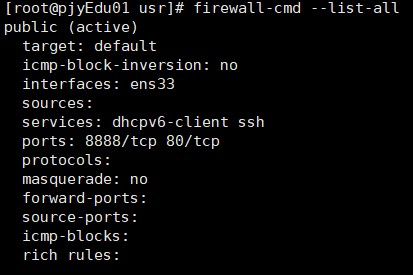
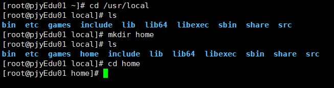
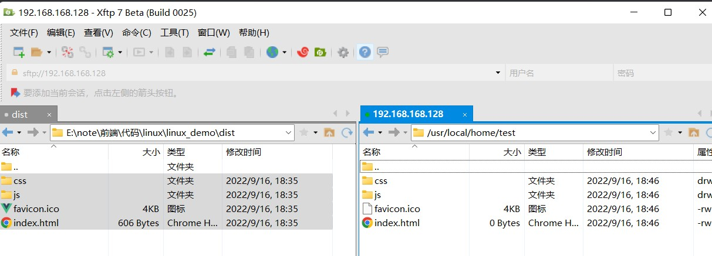
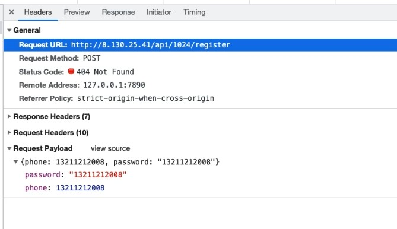

# Nginx简介

[TOC]


## 正向代理与反向代理

正向代理：**需要在客户端配置代理服务器进行指定网站访问**


反向代理：**暴露的是代理服务器地址，隐藏了真实服务器** **IP** **地址。**


## 负载均衡

**增加服务器的数量，然后将请求分发到各个服务器上，将原先请求集中到单个服务器上的情况改为将请求分发到多个服务器上，将负载分发到不同的服务器，也就是我们所说的负载均衡**


## 动静分离


## Nginx下载安装

### 下载

首先无法使用`yum install nginx`下载Nginx	

Centos 7下安装nginx，使用yum install nginx，报错提示没有可用的软件包。具体错误提示如下：

```
已加载插件：fastestmirror, product-id, search-disabled-repos, subscription-manager

This system is not registered with an entitlement server. You can use subscription-manager to register.

Loading mirror speeds from cached hostfile

- base: mirror.lzu.edu.cn
- extras: mirror.lzu.edu.cn
- updates: mirror.lzu.edu.cn
  base | 3.6 kB 00:00:00
  extras | 2.9 kB 00:00:00
  updates | 2.9 kB 00:00:00
  updates/7/x86_64/primary_db | 3.7 MB 00:00:01
  没有可用软件包 nginx。
  错误：无须任何处理
```

**具体解决方式：**

提示里说"没有可用软件包 nginx。"我们可以通过命令 `yum list | grep nginx` 查看关于nginx相关的所有可安装包。

```
[root@localhost ~]# yum list | grep nginx
pcp-pmda-nginx.x86_64 4.3.2-12.el7 base
```

通过 yum list 可以看到很多软件包在yum里面没有的。我们可以使用epel源(EPEL : Extra Packages for Enterprise Linux是基于Fedora的一个项目，为“红帽系”的操作系统提供额外的软件包，适用于RHEL、CentOS和Scientific Linux.)。


- 安装epel

  `sudo yum install epel-release`

  epel-release会自动配置yum的软件仓库。

- 更新系统

  `yum update`

- 再次安装nginx

  `yum install -y nginx`

安装好后 `nginx -v` 可以查看 Nginx 版本信息。

并且使用 `rpm -ql nginx` 可以查看 Nginx 被安装到了什么地方。


### 防火墙（如无开启过防火墙，直接忽略本步骤）

安装之后开启 Nginx，如果系统开启了防火墙，那么需要设置一下在防火墙中加入需要开放的端口，下面列举几个常用的防火墙操作（没开启的话不用管这个）：

```shell
systemctl start firewalld  # 开启防火墙
systemctl stop firewalld   # 关闭防火墙
systemctl status firewalld # 查看防火墙开启状态，显示running则是正在运行
firewall-cmd --reload      # 重启防火墙，永久打开端口需要reload一下

# 添加开启端口，--permanent表示永久打开，不加是临时打开重启之后失效
firewall-cmd --permanent --zone=public --add-port=8888/tcp

# 查看防火墙，添加的端口也可以看到
firewall-cmd --list-all
 
```

注意：当设置开放端口后，需要重启防火墙

、


相关错误参考文章：

[【备忘】关于nginx启动后访问首页跳转Welcome to CentOS问题和访问Nginx项目不跳转项目首页问题说明](https://blog.csdn.net/qq_15941409/article/details/114585282?ops_request_misc=%257B%2522request%255Fid%2522%253A%2522166331975316800182140053%2522%252C%2522scm%2522%253A%252220140713.130102334.pc%255Fall.%2522%257D&request_id=166331975316800182140053&biz_id=0&utm_medium=distribute.pc_search_result.none-task-blog-2~all~first_rank_ecpm_v1~rank_v31_ecpm-4-114585282-null-null.142^v47^new_blog_pos_by_title,201^v3^add_ask&utm_term=%E4%BB%80%E4%B9%88%E6%97%B6%E5%80%99%E5%87%BA%E7%8E%B0welcome%20to%20CentOS&spm=1018.2226.3001.4187)

[启动nginx后出现welcome to centos](https://blog.csdn.net/czt_666/article/details/125071392?ops_request_misc=&request_id=&biz_id=102&utm_term=%E4%BB%80%E4%B9%88%E6%97%B6%E5%80%99%E5%87%BA%E7%8E%B0welcome%20to%20CentOS&utm_medium=distribute.pc_search_result.none-task-blog-2~all~sobaiduweb~default-0-125071392.142^v47^new_blog_pos_by_title,201^v3^add_ask&spm=1018.2226.3001.4187)


### 开启

设置 Nginx 的开机启动：

```shell
systemctl enable nginx
```

启动 Nginx ：

```shell
systemctl start nginx
```

**浏览器访问公网IP**

在浏览器输入你的公网IP，无需端口号（默认80），如果看到 `Welcome to nginx` 之类的界面，就是Nginx安装并启动成功了。


### Nginx重启

```shell
nginx -s reload  # 向主进程发送信号，重新加载配置文件，热重启
```


## Nginx部署项目

我们一般对Nginx的修改主要就是修改 `/etc/nginx/nginx.conf` 这个配置文件，`nginx.conf` 结构图可以这样概括：

```nginx
main        # 全局配置，对全局生效
├── events  # 配置影响 Nginx 服务器或与用户的网络连接
├── http    # 配置代理，缓存，日志定义等绝大多数功能和第三方模块的配置
│   ├── upstream # 配置后端服务器具体地址，负载均衡配置不可或缺的部分
│   ├── server   # 配置虚拟主机的相关参数，一个 http 块中可以有多个 server 块
│   ├── server
│   │   ├── location  # server 块可以包含多个 location 块，location 指令用于匹配 uri
│   │   ├── location
│   │   └── ...
│   └── ...
└── ...
```


一般，我们的项目都会放在`/usr/local/home`目录下，如果没有，创建




然后上传自己的项目：




打开`etc/nginx/nginx.conf`，并使用vim编辑

我的文件位于：`/usr/local/home/test`

通常会找到server，然后做如下设置：

```nginx
server {
  listen 80;
  # server_name 设置为localhost 
	server_name localhost;

	location / {
    # root 中放的是文件根目录
		root  /usr/local/home/test;
    # 设置首页，一般都是index.html
		index index.html index.htm; 
	}
}
```


## 配置反向代理

反向代理是工作中最常用的服务器功能，经常被用来解决跨域问题，首先进入 Nginx 的主配置文件：

```shell
vim /etc/nginx/nginx.conf
```

我的项目配置：




我们去 `http` 模块的 `server` 块中的 `location /` 同级的位置添加：

```nginx
location /api {
	proxy_pass 跨域地址的baseURL;
}
```