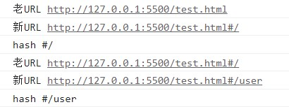
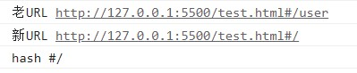
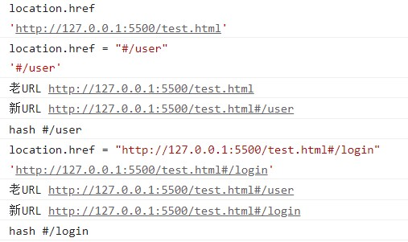
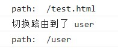

# 【vue】路由hash和history模式

[TOC]


## hash模式

hash 就是指 url 后的 # 号以及后面的字符，

比如，`http://127.0.0.1:5500/test.html#/user`，这里的hash值就是`#/user`。

hash 值的变化不会导致浏览器像服务器发送请求

hash 的改变会触发 **hashChange 事件**，浏览器的前进后退也能对其进行控制

```html
<!DOCTYPE html>
<html lang="en">
<head>
  <meta charset="UTF-8">
  <meta http-equiv="X-UA-Compatible" content="IE=edge">
  <meta name="viewport" content="width=device-width, initial-scale=1.0">
  <title>hash模式的实现</title>
</head>
<body>
  <button id="myBtn">改变hash的值</button>

  <script>
    const myBtn = document.getElementById('myBtn');

      // 通过 onhashchange 监听hash值变化
    window.onhashchange = (e) => {
      console.log('老URL',e.oldURL);
      console.log('新URL',e.newURL);

      console.log('hash',location.hash);
    }
  </script>
</body>
</html>
```

上面是通过 on 来监听事件，其实也可以用

```
window.addEventListener("hashchange", funcRef, false);
```


### 改变hash的三种方式：

#### 第一种：手动在导航栏中修改


​	控制台的输出




#### 第二种方式：手动点击前进后退按钮

这里是点击了后退按钮，从 `#/user` 后退到了 `#/`




#### 第三种方式：通过js代码修改

给按钮增加监听函数，当点击按钮时，进行路由改变。

```html
  <script>
    const myBtn = document.getElementById('myBtn');

    window.onhashchange = (e) => {
      console.log('老URL',e.oldURL);
      console.log('新URL',e.newURL);

      console.log('hash',location.hash);
    }

    // 增加监听函数
    myBtn.addEventListener('click',() => {
      location.href = '#/user';
    })
  </script>
```

起初，路由位于`http://127.0.0.1:5500/test.html#/`，

然后点击按钮


> 注：
>
> Location对象用于表示window上当前链接到的URL信息。
>
> - href: 当前window对应的超链接URL, 整个URL；
> - hash: 哈希值；
> - pathname：访问页面；

用一个网址来演示location的属性

```js
//http://127.0.0.1:8001/01-hash.html?a=100&b=20#/aaa/bbb

location.protocal // 'http:'
localtion.hostname // '127.0.0.1'
location.host // '127.0.0.1:8001'
location.port //8001
location.pathname //'01-hash.html'
location.serach // '?a=100&b=20'
location.hash // '#/aaa/bbb'
```

对于href属性




## history 模式

默认情况下, 路径的改变使用的URL的hash.

如果使用history模式，在配置路由规则时，加入"mode: 'history'".

```
//main.js文件中
const router = new VueRouter({
  mode: 'history',
  routes: [...]
})
```


history 模式，每访问一个页面都要发起网络请求，每个请求都需要服务器进行路由匹配、数据库查询、生成HTML文档后再发送响应给浏览器，这个过程会消耗服务器的大量资源，给服务器的压力较大。

```html
<!DOCTYPE html>
<html lang="en">
<head>
  <meta charset="UTF-8">
  <meta http-equiv="X-UA-Compatible" content="IE=edge">
  <meta name="viewport" content="width=device-width, initial-scale=1.0">
  <title>history模式的实现</title>
</head>
<body>
  <button id="myBtn">改变hash的值</button>

  <script>
    const myBtn = document.getElementById('myBtn');

    window.addEventListener('DOMContentLoaded',() => {
      //页面DOM加载完毕后打印出页面的路径
      console.log('path: ',location.pathname);
    })

    myBtn.addEventListener('click',() => {
      const state = {name:'user'};
      history.pushState(state, '', 'user');
      console.log('切换路由到了','user');
      console.log('path: ',location.pathname);
    })
  </script>
</body>
</html>
```

起初路由位于`http://127.0.0.1:5500/test.html`，

当点击了按钮之后，路由变成了`http://127.0.0.1:5500/user`。




> **history 模式**
>
> 利用了 HTML5 History Interface 中新增的 pushState() 和 replaceState() 方法。
>
> ```
> history.pushState();         // 添加新的状态到历史状态栈
> 
> history.replaceState();      // 用新的状态代替当前状态
> 
> history.state                // 返回当前状态对象
> ```
>
> - history.pushState() 在保留现有历史记录的同时，将 url 加入到历史记录中。
> - history.replaceState() 会将历史记录中的当前页面历史替换为 url。 
>
> 由于 history.pushState() 和 history.replaceState() 可以改变 url 同时，不会刷新页面，所以在 HTML5 中的 histroy 具备了实现前端路由的能力。
>
> 
>
> 这两个方法有个共同的特点：当调用他们修改浏览器历史记录栈后，虽然当前 URL 改变了，但浏览器不会刷新页面，这就为单页应用前端路由“更新视图但不重新请求页面”提供了基础。


**history 在修改 url 后，虽然页面并不会刷新，但我们在手动刷新，或通过 url 直接进入应用的时候， 服务端是无法识别这个 url 的，会报 404 问题。**

因为我们是单页应用，只有一个 html 文件，服务端在处理其他路径的 url 的时候，就会出现404的情况。 所以，如果要应用 history 模式，需要在服务端增加一个覆盖所有情况的候选资源：如果 URL 匹配不到任何静态资源，则应该返回单页应用的 html 文件。


#### popstate

在history模式中与hash模式的hashchange对应的是**popState**。

popstate是在浏览器回退前进或者js的 back() go() forward()方法的时候才会触发。

```js
    //监听 popstate 事件
    window.onpopstate = (e) => {
      console.log('onpopstate', e.state, location.pathname);
    }
```


## 二者对比

1. 从兼容角度分析。

　　hash 可以兼容到 IE8，history 只能兼容到 IE10。

2. 从网络请求的角度分析。

　　使用 hash 模式，地址改变时通过 hashchange 事件，只会读取哈希符号后的内容，并不会发起任何网络请求。

　　而 history 模式，每访问一个页面都要发起网络请求，每个请求都需要服务器进行路由匹配、数据库查询、生成HTML文档后再发送响应给浏览器，这个过程会消耗服务器的大量资源，给服务器的压力较大。

3. 服务器配置角度分析。

　　hash 不需要服务器任何配置。

　　history 进行刷新页面时，无法找到url对应的页面，会出现 404 问题。如果要应用 history 模式，需要在服务端增加一个覆盖所有情况的候选资源：如果 URL 匹配不到任何静态资源，则应该返回单页应用的 html 文件。


