# 【vue】虚拟节点与DOM Diff算法

[TOC]


## 虚拟DOM

> 虚拟 DOM 是为了解决浏览器性能问题而被设计出来的。
>
> 若一次操作中有 10 次更新 DOM的动作，虚拟DOM不会立即操作DOM，而是将这 10 次更新的diff内容保存到本地一个JS 对象中，最终将这个JS对象一次性 attch到 DOM树上，再进行后续操作，避免大量无谓的计算量。
>
> 所以，用 JS对象模拟DOM节点的好处是，页面的更新可以先全部反映在JS对象(虚拟 DOM)上，操作内存中的 JS对象的速度显然要更快，等更新完成后，再将最终的 JS对象映射成真实的DOM，交由浏览器去绘制。

`dom diff` 其实就是对比两个虚拟节点，然后对比它们的差异。然后再对应真实 `dom` 上进行一个打补丁操作。我们的目的就是找到其中的差异，然后用最小的代价来操作 `dom`。因为操作 `dom` 相对而言比较耗性能。

而对于虚拟节点，我们可以简单理解为**普通对象**。就是将真实节点用对象的方式模拟出来，通过比较两个新老虚拟节点，得到彼此的差异，形成一个补丁，最后再与真实的 `dom` 进行匹配，将这些补丁打到真实 `dom` 上去，最终，我们还是操作了原来的真实 `dom`，但是我们是用了差异化结果的 **最小的代价**  来操作的。


> 什么是虚拟DOM？ 用JS模拟DOM结构

### 一个🌰

```html
  <div id="app" class="container">
    <h1>虚拟DOM</h1>
    <ul style="color:brown">
      <li>第一项</li>
      <li>第二项</li>
      <li>第三项</li>
    </ul>
  </div>
```


将上面的真实dom转换为虚拟dom

```js
{
  tag: 'div';
  props: {
    id: 'app';
    className: 'container'
  };
  children: [
    {
      tag: 'h1',
      children: '虚拟DOM'
    },
    {
      tag: 'ul',
      props: { style: 'color: brown'},
      children: [
        {
          tag: 'li',
          children: '第一项'
        },
        {
          tag: 'li',
          children: '第二项'
        },
        {
          tag: 'li',
          children: '第三项'
        }
      ]
    }
  ]
}
```


## DOM Diff算法实现

> 数据改变 -> 虚拟DOM(计算变更) -> 操作真实DOM -> 视图更新

项目源码👉[myNote](https://gitee.com/mengqiuleo/my-note/tree/master/vue/domDiff%E5%AE%9E%E7%8E%B0%E6%BA%90%E7%A0%81/%E8%99%9A%E6%8B%9FDOM)


### 项目初始化

```
虚拟DOM
├─ index.html //入口文件
├─ index.js 
├─ Element.js //创建element类(放每一个节点)
├─ virtualDom.js //根据元素生成虚拟节点
├─ domDiff.js //找到新旧节点之间的差异
├─ patchTypes.js //定义补丁类型
├─ doPatch.js //将补丁包打在新的dom上
```


index.html作为入口，并在index.html中引入index.js

```html
<!DOCTYPE html>
<html lang="en">
<head>
  <meta charset="UTF-8">
  <meta http-equiv="X-UA-Compatible" content="IE=edge">
  <meta name="viewport" content="width=device-width, initial-scale=1.0">
  <title>Document</title>
</head>
<body>
  <div id="app"></div>

  <script type="module" src="index.js"></script>
  <!-- 注意：我们这里要将 type 改成 module -->
</body>
</html>
```


**将 type 改成 module**:

当我们还未更改时，运行程序，发现控制台报错

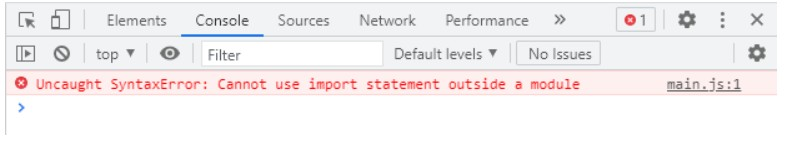

> 错误解释是`不能在模块外使用IMPORT语句`。
>
> 这里浏览器会默认将它当做模块导入，而script标签默认为type=“text/javascript”，需要改为type=“module”


### 创建虚拟DOM --> createElement()

首先我们要定义创建节点的函数，用来生成每一个节点。

1.在`Element.js`中，创建一个节点类。

```js
class Element {
  constructor(type, props, children) {
    this.type = type;
    this.props = props;
    this.children = children;
  }
}

export default Element;
```


2.在`virtualDom.js`中实现一个函数，该函数用来生成虚拟dom。

```js
import Element from './Element.js';

function createElement(type, props, children) {
  return new Element(type, props, children);
}

export {
  createElement
}
```


3.在index.js中准备好我们的虚拟DOM，并且引入`createElement`函数，用来生成虚拟dom。

根据下图创建对应的节点关系

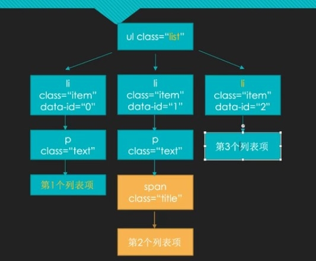

```js
import { createElement } from './virtualDom.js';

const vDom = createElement('ul', { class: 'list', style: 'width: 300px;height: 300px;background-color: orange' }, [
  createElement('li', { class: 'item', 'data-index': 0 }, [
    createElement('p', { class: 'text' }, ['第1个列表项'])
  ]),
  createElement('li', { class: 'item', 'data-index': 1 }, [
    createElement('p', { class: 'text' }, [
      createElement('span', { class: 'title' }, ['第2个列表项'])
    ])
  ]),
  createElement('li', { class: 'item', 'data-index': 2 }, ['第3个列表项'])
]);

console.log(vDom);
```


此时我们可以在控制台看到已经生成的虚拟DOM。

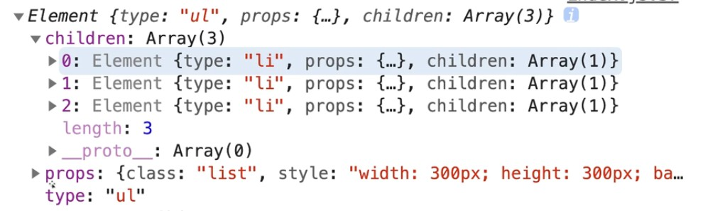


### 虚拟节点转换为真实DOM节点 --> render()

有了 虚拟dom后，我们还需要解析成为真实的 dom，才会显示我们对应的页面，而这里需要一个 `render` 函数。

```javascript
const rDom = render(vDom);
```

在virtualDom.js文件中，定义render函数。

在 `render`函数中，我们需要创建一个真实节点，然后将其属性加上去，而我们的属性 `key`值可能是 value，也可能是 style ，还有其它一些属性 key 值，因此我们不能直接通过 `node.setAttribute` 给节点设置属性值，需要分情况考虑。

```js
//# 将虚拟节点转换为真实DOM
function render(vDom) {
  const { type, props, children } = vDom;
  //创建真实节点
  const el = document.createElement(type);

  //遍历属性
  for(let key in  props) {
    //设置属性值
    setAttrs(el, key, props[key]);
  }

  //递归遍历子元素
  children.map((c) => {
    if(c instanceof Element) {
      c = render(c);
    } else {
      c = document.createTextNode(c);
    }

    el.appendChild(c);
  })
  //console.log(el);
  return el;
}
```

#### render递归孩子节点

我们只是对于祖先节点的设置属性操作，而对于孩子节点没有进行处理。对于孩子节点呢，我们也需要考虑一下，如果它还是属于 `Element`对象，那么我们就需要进行递归操作，而对于文本节点，直接创建一个新的节点即可。

```js
  //递归遍历子元素
  children.map((c) => {
    if(c instanceof Element) {
      c = render(c);
    } else {
      c = document.createTextNode(c);
    }

    el.appendChild(c);
  })
```


我们需要自定义一个设置节点属性值的方法，对不同属性进行区分，比如:value,style

```js
//# 单独定义一个函数：用来给节点设置属性
function setAttrs(node, prop, value) {
  switch(prop) {
    case 'value':
      if(node.tagName === 'INPUT' || node.tagName === 'TEXTAREA') {
        node.value = value;
      } else {
        node.setAttribute(prop, value)
      }
      break;
    case 'style':
      node.style.cssText = value;
      break;
    default:
      node.setAttribute(prop, value);
      break;
  }
}
```


此时，我们把真实生成的DOM打印出来：

```js
const rDom = render(vDom);

console.log(rDom);
```

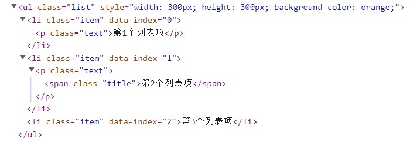


### 真实DOM渲染到页面 --> renderDOM()

有了真实dom后，我们还需要将这个真实dom渲染到页面去，方法如下：

在`virtualDom.js`中，定义一个方法renderDOM().

```javascript
// 渲染真实dom
function renderDOM(rDom, rootEl) {
  rootEl.appendChild(rDom);
}
```


然后在我们的`index.js`文件中执行该方法：

```javascript
const rDom = render(vDom);
// 执行渲染
renderDOM(
  rDom,
  document.getElementById('app')
)
```


此时，我们已成功将DOM渲染到页面上了。

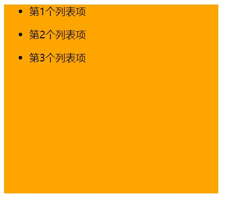


### 虚拟节点差异分析

根据新旧DOM创建虚拟节点

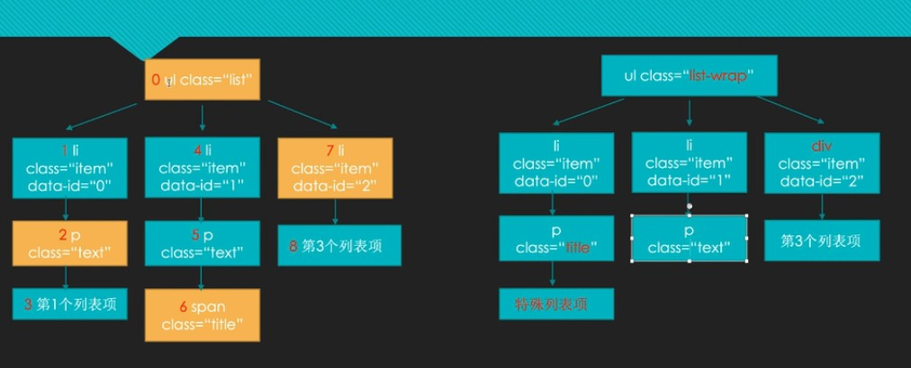

两个DOM

```js
const vDom = createElement('ul', { class: 'list', style: 'width: 300px;height: 300px;background-color: orange' }, [
  createElement('li', { class: 'item', 'data-index': 0 }, [
    createElement('p', { class: 'text' }, ['第1个列表项'])
  ]),
  createElement('li', { class: 'item', 'data-index': 1 }, [
    createElement('p', { class: 'text' }, [
      createElement('span', { class: 'title' }, ['第2个列表项'])
    ])
  ]),
  createElement('li', { class: 'item', 'data-index': 2 }, ['第3个列表项'])
]);

const vDom2 = createElement('ul', { class: 'list-wrap', style: 'width: 300px;height: 300px;background-color: orange' }, [
  createElement('li', { class: 'item', 'data-index': 0 }, [
    createElement('p', { class: 'title' }, ['特殊列表项'])
  ]),
  createElement('li', { class: 'item', 'data-index': 1 }, [
    createElement('p', { class: 'text' }, [])
  ]),
  createElement('div', { class: 'item', 'data-index': 2 }, ['第3个列表项'])
]);
```


#### patches介绍

补丁，是一个对象。对象的每一项的键是对应的dom节点的标号。而值是一个数组，数组的每一项是一个对象，对象里面包括了这个dom节点发生的变化类型和一些标注，比如移除某一项，那么就要记录移除的标号`index:6`。

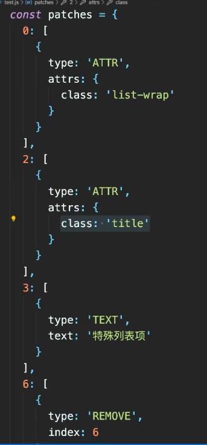


#### domDiff

domDiff函数用来实现虚拟dom差异比较

在index.js中用domDiff函数生成差异：

```js
const patches = domDiff(vDom, vDom2);
```

并且新建一个domDiff.js来实现该函数。

根据上面的补丁包：每一项都会标注是发生了什么类型的变化。

所以，我们单独创建一个`patchTypes.js`文件，来存放每一个类型。

```js
// patchTypes.js
export const ATTR ='ATTR';
export const TEXT = 'TEXT';
export const REPLACE = 'REPLACE';
export const REMOVE = 'REMOVE';
```


domDiff函数实现：对新旧DOM进行对比

```js
//# 节点对比函数，产生补丁包
function domDiff(oldVDom, newVDom) {
  let index = 0;//节点下标
  vNodeWalk(oldVDom, newVDom, index);//遍历每一个节点

  return patches;
}
```


#### 节点遍历函数 --> vnodeWalk()

分情况考虑：

- 如果这个节点被删除了
- 如果都是文本节点，说明发生了文本内容的变更
- 如果两个都是元素节点，并且它们的类型相同，此时我们需要对它们的属性进行差异比较。对属性判断是新增属性还是进行属性值修改，通过一个`attrsWalk()`函数实现
- 整个节点发生变化,加入整个新节点

```js
//# 遍历每一个节点
function vNodeWalk(oldNode, newNode, index){
  let vnPatch = [];//这个数组存放每一个节点发生的变化，
  //因为每一个节点可能发生多个变化，数组的每一项是一个对象，存放发生的变化的具体描述

  //* 如果这个节点被删除了
  if(!newNode) {
    vnPatch.push({
      type: REMOVE,
      index
    })
  } else if(typeof oldNode === 'string' && typeof newNode === 'string'){
    //* 如果都是文本节点，说明发生了文本内容的变更
    if(oldNode !== newNode) {
      vnPatch.push({
        type: TEXT,
        text: newNode
      })
    }
  } else if(oldNode.type === newNode.type) {
    //* 如果两个都是元素节点，并且它们的类型相同，此时我们需要对它们的属性进行差异比较
    const attrPatch = attrsWalk(oldNode.props,newNode.props);
    //console.log(attrPatch);
    if(Object.keys(attrPatch).length > 0) {//说明属性发生了变更
      vnPatch.push({
        type: ATTR,
        attrs: attrPatch
      });
    }

    //遍历儿子
    childrenWalk(oldNode.children, newNode.children);
  } else {
    //* 整个节点发生变化,加入整个新节点
    vnPatch.push({
      type: REPLACE,
      newNode: newNode
    })
  }

  if(vnPatch.length > 0){
    patches[index] = vnPatch;
  }
}

//# 遍历两个节点的属性，并产生补丁包
function attrsWalk(oldAttrs, newAttrs) {
  let attrPatch = {};

  //* 修改属性的情况
  for(let key in oldAttrs) {
    if(oldAttrs[key] !== newAttrs[key]) {
      attrPatch[key] = newAttrs[key];
    }
  }

  //* 新增属性的情况
  for(let key in newAttrs) {
    if(!oldAttrs.hasOwnProperty(key)) {
      attrPatch[key] = newAttrs[key];
    }
  }

  return attrPatch;
}

//# 遍历儿子节点
function childrenWalk(oldChildren,newChildren) {
  oldChildren.map((c,idx) => {
    vNodeWalk(c, newChildren[idx++], ++vnIndex);
  });
}
```


控制台输出的补丁包：
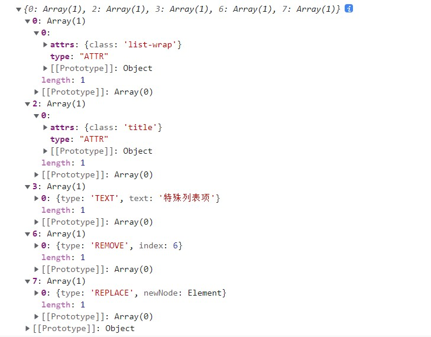


### 给真实 dom 打补丁 --> doPatch()

```js
//给真实dom打补丁
doPatch(rDom, patches);
```

创建一个doPatch.js的文件，里面放doPatch函数。

```js
function doPatch(rDom, patches) {
  finalPatches = patches;
  rNodeWalk(rDom);
}
```

`rNodeWalk()`函数用来遍历每一个节点以及它的子节点

```js
function rNodeWalk(rNode) {
  const rnPatch = finalPatches[rnIndex++];//拿到每一个补丁包
  const childNodes = rNode.childNodes;//遍历儿子

  [...childNodes].map((c) => {
    rNodeWalk(c);
  })

  if(rnPatch) {
    patchAction(rNode, rnPatch);//rNode 与 rnPatch 一一对应
  }
}
```


拿到每一个节点和它对应的补丁包，`patchAction()`实现打补丁的操作。

```js
//# 给对应的节点打补丁
function patchAction(rNode, rnPatch) {
  rnPatch.map((patch) => {
    //选择对应的补丁包类型
    switch (patch.type) {
      case ATTR:
        for(let key in patch.attrs) {
          const value = patch.attrs[key];

          if(value) {
            setAttrs(rNode, key, value);
          } else {
            rNode.removeAttribute(key);
          }
        }
        break;
      case TEXT:
        rNode.textContent = patch.text;
        break;
      case REPLACE:
        const newNode = (patch.newNode instanceof Element)
                      ? render(patch.newNode)
                      : document.createTextNode(patch.newNode);
        rNode.parentNode.replaceChild(newNode,rNode);
        break;
      case REMOVE:
        rNode.parentNode.removeChild(rNode);
        break;
      default:
        break;
    }
  })
}
```


到目前为止，打补丁的操作已经结束。

前后页面对比


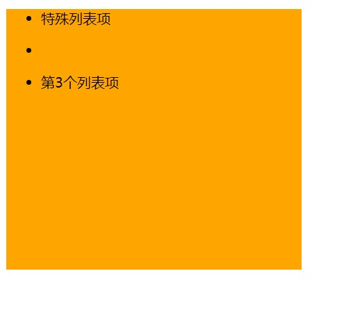

## 相关面试题

### 1.虚拟 DOM 是什么 有什么优缺点

由于在浏览器中操作 DOM 是很昂贵的。频繁的操作 DOM，会产生一定的性能问题。这就是虚拟 Dom 的产生原因。

> 虚拟DOM 本质就是用一个原生的 JS 对象去描述一个 DOM 节点，是对真实 DOM 的一层抽象。

**优点：**

1. 保证性能下限： 框架的虚拟 DOM 需要适配任何上层 API 可能产生的操作，它的一些 DOM 操作的实现必须是普适的，所以它的性能并不是最优的；但是比起粗暴的 DOM 操作性能要好很多，因此框架的虚拟 DOM 至少可以保证在你不需要手动优化的情况下，依然可以提供还不错的性能，即保证性能的下限；
2. 无需手动操作 DOM： 我们不再需要手动去操作 DOM，只需要写好 View-Model 的代码逻辑，框架会根据虚拟 DOM 和 数据双向绑定，帮我们以可预期的方式更新视图，极大提高我们的开发效率；
3. 跨平台： 虚拟 DOM 本质上是 JavaScript 对象,而 DOM 与平台强相关，相比之下虚拟Dom不依赖真实平台环境，可以实现跨平台。

**缺点:**

1. 无法进行极致优化： 虽然虚拟 DOM + 合理的优化，足以应对绝大部分应用的性能需求，但在一些性能要求极高的应用中虚拟 DOM 无法进行针对性的极致优化。
2. 首次渲染大量 DOM 时，由于多了一层虚拟 DOM 的计算，会比 innerHTML 插入慢。


### 2.v-for 为什么要加 key

key 是为 Vue 中 vnode 的唯一标记，通过这个 key，我们的 diff 操作可以更准确、更快速

**更准确**：因为带 key 就不是就地复用了，在 sameNode 函数 a.key === b.key 对比中可以避免就地复用的情况。所以会更加准确。

**更快速**：利用 key 的唯一性生成 map 对象来获取对应节点，比遍历方式更快


### 3.为什么不建议用index做key，为什么不建议用随机数做key

用`index`和用`随机数`都是同理，`随机数`每次都在变，做不到专一性，也很消耗性能。

- 如果你的列表顺序会改变，别用 `index` 作为 `key`，和没写基本上没区别，因为不管你数组的顺序怎么颠倒，index 都是 `0, 1, 2` 这样排列，导致 Vue 会复用错误的旧子节点，做很多额外的工作。

- 千万别用随机数作为 `key`，不然旧节点会被全部删掉，新节点重新创建。


#### 一个🌰

```html
 <!-- 准备好一个容器-->
 <div id="root">
  <!-- 遍历数组 -->
  <h2>人员列表（遍历数组）</h2>
  <button @click.once="add">添加一个老刘</button>
  <ul>
          <!-- 应该用p.id作为key, :key="p.id" -->
    <li v-for="(p,index) of persons" :key="index">
      {{p.name}}-{{p.age}}
      <input type="text">
    </li>
  </ul>
</div>

<script type="text/javascript">
  Vue.config.productionTip = false
  
  new Vue({
    el:'#root',
    data:{
      persons:[
        {id:'001',name:'张三',age:18},
        {id:'002',name:'李四',age:19},
        {id:'003',name:'王五',age:20}
      ]
    },
    methods: {
      add(){
        const p = {id:'004',name:'老刘',age:40}
        this.persons.unshift(p)
      }
    },
  })
</script>
```

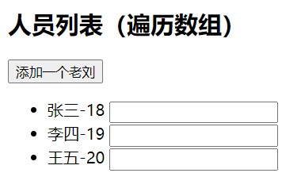

当我们`用index作为key`，并且添加一个老刘（`将老刘添加在列表的最前面`）后，

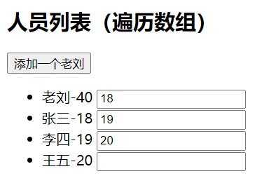

##### 当用index作为key时，

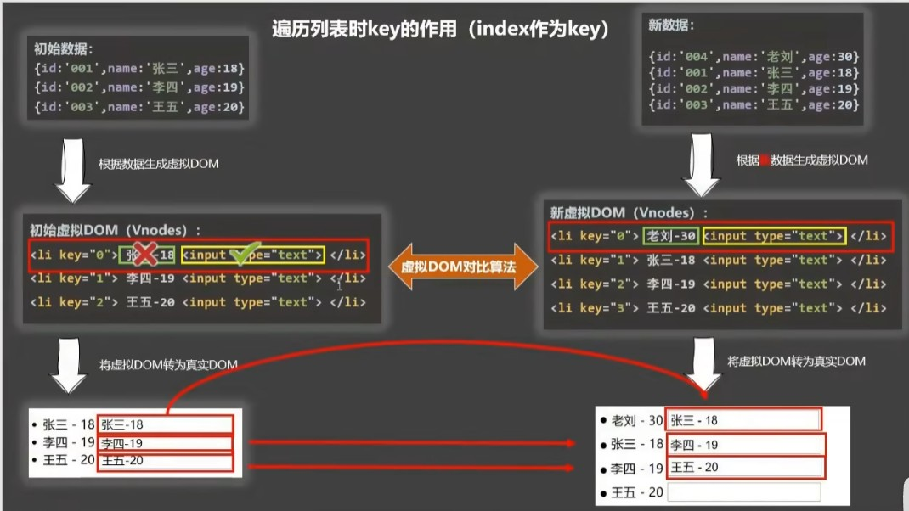

当对比`key=0`的节点时，在每一个节点里分别有两个节点`张三-18`和`input输入框`。

- 当对比`张三-18`时，它会对比两个节点的内容，发现内容不同，所以要进行更新。
- 但是当对比`input`输入框时，它并不会对比两个输入框的内容，而只是对比输入框的属性，发现没有变化，直接复用。
- 所以就导致了老刘的输入框中出现了张三的信息。


##### 当用id作为key时，

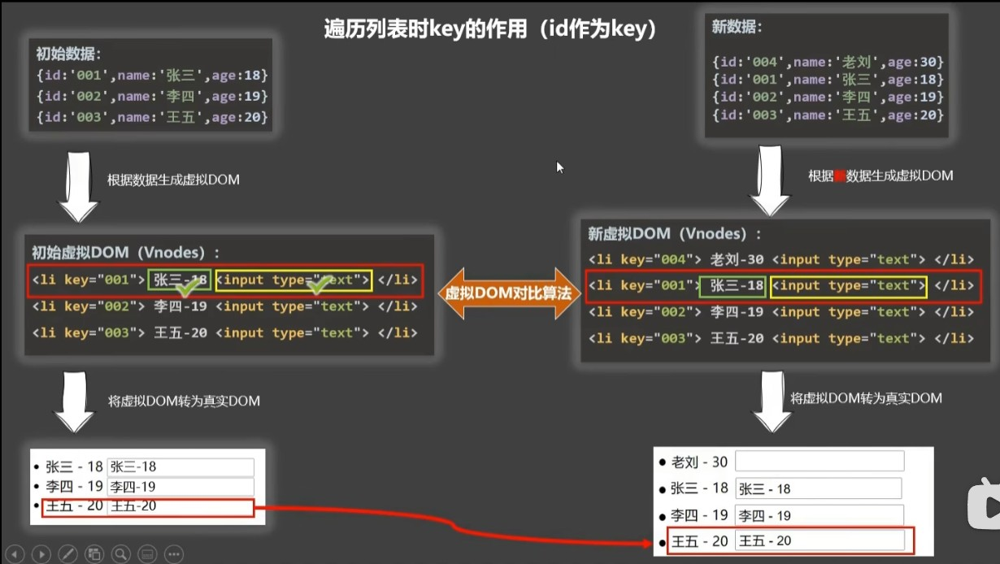
