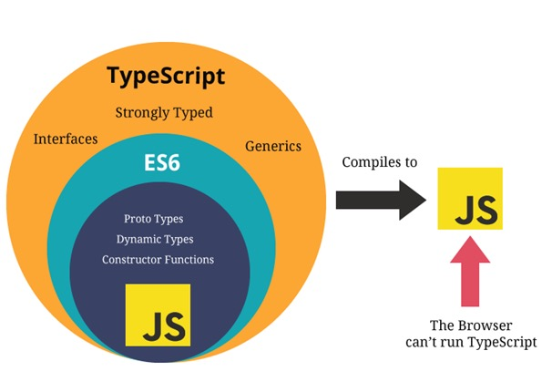

# TS学习笔记（一）

[TOC]

## 写在前面

这里是小飞侠Pan🥳，立志成为一名优秀的前端程序媛！！！

本篇博客收录于我的[github](https://github.com/mengqiuleo)前端笔记仓库中，持续更新中，欢迎star~

👉https://github.com/mengqiuleo/myNote


## 一.运行ts文件

### TypeScript的编译环境

TypeScript最终会被编译成JavaScript来运行，所以我们需要搭建对应的环境：

我们需要在电脑上安装TypeScript，这样就可以通过TypeScript的Compiler将其编译JavaScript；

我们需要先可以先进行全局的安装：

```
# 安装命令
npm install typescript -g
# 查看版本
tsc --version
```


**首次执行typescript代码**

- 创建ts代码片段`01_test.ts`
- 在命令行中执行`tsc 01_test.ts`
- 发现会生成对应的`01_test.js`文件
- 执行js文件


### TypeScript的运行环境

如果我们每次为了查看TypeScript代码的运行效果，都通过经过两个步骤的话就太繁琐了：

- 第一步：通过tsc编译TypeScript到JavaScript代码；
- 第二步：在浏览器或者Node环境下运行JavaScript代码；

是否可以简化这样的步骤呢？

- 比如编写了TypeScript之后可以直接运行在浏览器上？
- 比如编写了TypeScript之后，直接通过node的命令来执行？

上面提到的两种方式，可以通过两个解决方案来完成：

- 方式一：通过webpack，配置本地的TypeScript编译环境和开启一个本地服务，可以直接运行在浏览器上；
- 方式二：通过ts-node库，为TypeScript的运行提供执行环境；


### 方式一：webpack配置

👉 [webpack搭建typescript环境的配置](https://mp.weixin.qq.com/s/wnL1l-ERjTDykWM76l4Ajw)


### 方式二：使用ts-node

- 安装ts-node

  ```
  npm install ts-node -g
  ```

- 另外ts-node需要依赖tslib 和@types/node 两个包：

  ```
  npm install tslib @types/node -g
  ```

- 现在，我们可以直接通过ts-node 来运行TypeScript的代码：

  ```
  ts-node  01_test.ts
  ```

  


## 二.变量的使用

### 变量的声明

在TypeScript中定义变量需要指定标识符的类型。

声明了类型后TypeScript就会进行类型检测，声明的类型可以称之为类型注解；

`var/let/const 标识符: 数据类型= 赋值;`

**一个🌰**

```ts
let message: string = 'hello typescript'

function foo(payload: string) {
  console.log(payload.length)
}

foo(123) // 这里会报错，因为只支持string类型
```


### 声明变量的关键字

在TypeScript定义变量（标识符）和ES6之后一致，可以使用var、let、const来定义。

在TypeScript中并不建议再使用var关键字了，主要原因和ES6升级后let和var的区别是一样的，var是没有块级作用域的，会引起很多的问题，这里不再展开探讨。


### 变量的类型推导（推断）

在一个变量第一次赋值时，会根据后面的赋值内容的类型，来推断出变量的类型（即使在声明每一个变量时不都会写上对应的数据类型，TypeScript本身的特性帮助我们推断出对应的变量类型）：

```ts
let message = 'hello typescript'

message = 132 //报错：不能将类型“number”分配给类型“string”。
```


### JavaScript和TypeScript的数据类型

**TypeScript是JavaScript的一个超级：**




### TypeScript类型

#### 数组

```ts
let list1: number[] = [1, 2, 3] //方式一

let list2: Array<string> = ['a','b','c'] //方式二
```


#### 元组 Tuple

元组类型允许表示一个已知元素数量和类型的数组，`各元素的类型不必相同`。 比如，你可以定义一对值分别为 `string` 和 `number` 类型的元组。

```typescript
let t1: [string, number]
t1 = ['hello', 10] // OK
t1 = [10, 'hello'] // Error
```

当访问一个已知索引的元素，会得到正确的类型：

```typescript
console.log(t1[0].substring(1)) // OK
console.log(t1[1].substring(1)) // Error, 'number' 不存在 'substring' 方法
```


#### 枚举

`enum` 类型是对 JavaScript 标准数据类型的一个补充。 使用枚举类型可以`为一组数值赋予友好的名字`。

```typescript
enum Color {
  Red,
  Green,
  Blue
}

// 枚举数值默认从0开始依次递增
// 根据特定的名称得到对应的枚举数值
let myColor: Color = Color.Green // 0
console.log(myColor, Color.Red, Color.Blue)
```

默认情况下，从 `0` 开始为元素编号。 你也可以手动的指定成员的数值。 例如，我们将上面的例子改成从 `1` 开始编号：

```typescript
enum Color {
  Red = 1,
  Green,
  Blue
}
let c: Color = Color.Green
```

或者，全部都采用手动赋值：

```typescript
enum Color {
  Red = 1,
  Green = 2,
  Blue = 4
}
let c: Color = Color.Green
```

枚举类型提供的一个便利是你可以由枚举的值得到它的名字。 例如，我们知道数值为 2，但是不确定它映射到 Color 里的哪个名字，我们可以查找相应的名字：

```typescript
enum Color {
  Red = 1,
  Green,
  Blue
}
let colorName: string = Color[2]

console.log(colorName) // 'Green'
```


#### any

在某些情况下，我们确实无法确定一个变量的类型，并且可能它会发生一些变化，这个时候我们可以使用any类型

- 我们可以对any类型的变量进行任何的操作，包括获取不存在的属性、方法；
- 我们给一个any类型的变量赋值任何的值，比如数字、字符串的值；

如果对于某些情况的处理过于繁琐不希望添加规定的类型注解，或者在引入一些第三方库时，缺失了类型注解，这个时候我们可以使用any：

- 包括在Vue源码中，也会使用到any来进行某些类型的适配；

```ts
let notSure: any = 4
notSure = 'maybe a string'
notSure = false // 也可以是个 boolean
```

在对现有代码进行改写的时候，`any` 类型是十分有用的，它允许你在编译时可选择地包含或移除类型检查。并且当你只知道一部分数据的类型时，`any` 类型也是有用的。 比如，你有一个数组，它包含了不同的类型的数据：

```typescript
let list: any[] = [1, true, 'free']

list[1] = 100
```


#### void

某种程度上来说，`void` 类型像是与 `any` 类型相反，它`表示没有任何类型`。 当一个函数没有返回值时，你通常会见到其返回值类型是 `void`：

```typescript
/* 表示没有任何类型, 一般用来说明函数的返回值不能是undefined和null之外的值 */
function fn(): void {
  console.log('fn()')
  // return undefined
  // return null
  // return 1 // error
}
```

声明一个 `void` 类型的变量没有什么大用，因为你只能为它赋予 `undefined` 和 `null`：

```typescript
let unusable: void = undefined
```


#### object

`object` 表示非原始类型，也就是除 `number`，`string`，`boolean`之外的类型。

使用 `object` 类型，就可以更好的表示像 `Object.create` 这样的 `API`。例如：

```typescript
function fn2(obj: object): object {
  console.log('fn2()', obj)
  return {}
  // return undefined
  // return null
}
console.log(fn2(new String('abc')))
// console.log(fn2('abc') // error
console.log(fn2(String))
```


```tsx
function printCoordinate(point: {x: number, y: number}) {
  console.log("x坐标: ", point.x)
  console.log("y坐标: ", point.y)
}

printCoordinate({x: 10, y: 30})


// 增加可选属性
function printCoordinate(point: {x: number, y: number, z?: number}) {
  console.log("x坐标: ", point.x)
  console.log("y坐标: ", point.y)
  if(point.z){
    console.log("z坐标: ",point.z)
  }
}

printCoordinate({x: 10, y: 30, z: 40})
```


#### 联合类型

联合类型（Union Types）表示取值可以为多种类型中的一种 需求 1: 定义一个一个函数得到一个数字或字符串值的字符串形式值

```typescript
function toString2(x: number | string): string {
  return x.toString()
}
```

需求 2: 定义一个一个函数得到一个数字或字符串值的长度

```typescript
function getLength(x: number | string) {
  // return x.length // error

  if (x.length) {
    // error
    return x.length
  } else {
    return x.toString().length
  }
}
```


### 类型别名

```ts
type Point = {
  x: number
  y: number
}

function printPoint(point: Point){
  console.log(point.x, point.y)
}

function sumPoint(point: Point){
  console.log(point.x + point.y)
}
```


### 类型断言as

有时候TypeScript无法获取具体的类型信息，这个我们需要使用类型断言（Type Assertions）

比如我们通过document.getElementById，TypeScript只知道该函数会返回HTMLElement ，但并不知道它具体的类型：

```ts
const myEl = document.getElementById('my-img') as HTMLImageElement

myEl.src = '图片地址'
```


通过类型断言这种方式可以告诉编译器，“相信我，我知道自己在干什么”。 类型断言好比其它语言里的类型转换，但是不进行特殊的数据检查和解构。 它没有运行时的影响，只是在编译阶段起作用。 TypeScript 会假设你，程序员，已经进行了必须的检查。

类型断言有两种形式。 其一是“尖括号”语法, 另一个为 `as` 语法

```ts
/*
类型断言(Type Assertion): 可以用来手动指定一个值的类型
语法:
    方式一: <类型>值
    方式二: 值 as 类型  tsx中只能用这种方式
*/

/* 需求: 定义一个函数得到一个字符串或者数值数据的长度 */
function getLength(x: number | string) {
  if ((<string>x).length) {
    return (x as string).length
  } else {
    return x.toString().length
  }
}
console.log(getLength('abcd'), getLength(1234))
```


### 非空类型断言!

当我们编写下面的代码时，在执行ts的编译阶段会报错：

这是因为传入的message有可能是为undefined的，这个时候是不能执行方法的；

```tsx
function printMessage(message?: string){
  console.log(message.toUpperCase()) //报错：对象可能为“未定义”。
}

printMessage('hello')
```

但是，我们确定传入的参数是有值的，这个时候我们可以使用非空类型断言：
非空断言使用的是! ，表示可以确定某个标识符是有值的，跳过ts在编译阶段对它的检测；

```ts
function printMessage(message?: string){
  console.log(message!.toUpperCase())
}

printMessage('hello')
```


### 字面量类型

字面量类型的值和类型必须保持一致，相当于一个常量

```tsx
type Alignment = 'left' | 'right' | 'center'
function changeAlign(align: Alignment) { 
    //这里声明的形参变量只能为 left，right，center中的一个
  console.log('修改方向： ',align)
}

changeAlign('left')
```


**一个🌰**

```ts
type Method = 'GET' | 'POST'
function request(url: string, method: Method) {}

const options = {
  url: "https://baidu.com",
  method: "POST"
}

request(options.url, options.method) //这里会报错
```

上面的 options.method 会报错

因为 ts会将 options.method 判断为 string类型，而我们要求应该传入字面量类型

解决：

```ts
type Method = 'GET' | 'POST'
function request(url: string, method: Method) {}

const options = {
  url: "https://baidu.com",
  method: "POST"
}

request(options.url, options.method as "POST")

// 方法二：
type Method = 'GET' | 'POST'
function request(url: string, method: Method) {}

const options = {
  url: "https://baidu.com",
  method: "POST"
} as const

request(options.url, options.method)
```


### 类型补充 -- 类型缩小

- 什么是类型缩小呢？
  - 类型缩小的英文是Type Narrowing；
  - 我们可以通过类似于typeof padding === "number" 的判断语句，来改变TypeScript的执行路径；
  - 在给定的执行路径中，我们可以缩小比声明时更小的类型，这个过程称之为缩小;
  - 而我们编写的typeof padding === "number 可以称之为类型保护（type guards）；
- 常见的类型保护有如下几种：
  - typeof
  - 平等缩小（比如`===, !==`）
  - instanceof
  - in


#### typeof

在TypeScript 中，检查返回的值typeof是一种类型保护：因为TypeScript 对如何typeof操作不同的值进行编码。

```tsx
type IDType = number | string
function printID(id: IDType) {
  if (typeof id === 'string') {
    console.log(id.toUpperCase())
  } else {
    console.log(id)
  }
}
```


#### 平等缩小

我们可以使用Switch或者相等的一些运算符来表达相等性（比如 `===, !==, ==, and != `）：

```ts
type Direction = 'left' | 'right' | 'top' | 'bottom'
function printDirection(direction: Direction) {
  if(direction === 'left') {
    console.log(direction)
  }
}
```


#### instanceof

JavaScript 有一个运算符来检查一个值是否是另一个值的“实例”：

```tsx
function printTime(date: string | Date) {
  if(date instanceof Date)  {
    console.log(date.toLocaleString())
  } else {
    console.log(date)
  }
}

//举例二
class Student {
  studying() {}
}

class Teacher {
  teaching() {}
}

function work(p: Student | Teacher) {
  if(p instanceof Student) {
    p.studying()
  } else {
    p.teaching()
  }
}
```


#### in

如果指定的属性在指定的对象或其原型链中，则in 运算符返回true；

```ts
type Fish = {swim: () => void}
type Dog = {run: () => void}

function move(animal: Fish | Dog){
  if('swim' in animal) { // 判断swim属性是否在实例animal中
    animal.swim()
  } else {
    animal.run()
  }
}

const fish: Fish = {
  swim(){
    console.log('swim')
  }
}

move(fish)//输出swim
```

