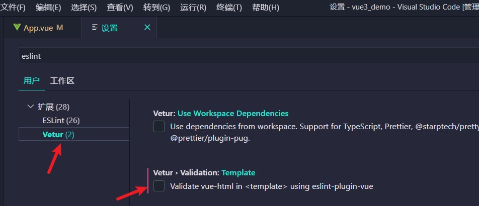

# Vue3+TS 之 Composition API(一)

[TOC]


### 1）setup

> vue3 的模板中不需要使用一个div包裹起来，

1. setup是Vue3.0中一个新的配置项，值为一个函数。

2. 组件中所用到的：数据、方法等等，均要配置在setup中。

3. setup函数的返回值：

​	若返回一个对象，则对象中的属性、方法, 在模板中均可以直接使用。

4. 注意点：

- 尽量不要与Vue2.x配置混用
  - Vue2.x配置（data、methos、computed...）中<strong style="color:#DD5145">可以访问到</strong>setup中的属性、方法。
  - 但在setup中<strong style="color:#DD5145">不能访问到</strong>Vue2.x配置（data、methos、computed...）。
  - 如果有重名, setup优先。

- setup不能是一个async函数，因为返回值不再是return的对象, 而是promise, 模板看不到return对象中的属性。（后期也可以返回一个Promise实例，但需要Suspense和异步组件的配合）

5. demo🌰

```vue
<template>
	<h1>一个人的信息</h1>
	<!-- 在这里直接使用属性和方法，而不需要使用 this.xxx -->
	<h2>姓名：{{name}}</h2>
	<h2>年龄：{{age}}</h2>
	<h2>a的值是：{{a}}</h2>
	<button @click="sayHello">说话</button>
</template>

<script>
	export default {
		name: 'App',
		setup(){
			//数据
			let name = '张三'
			let age = 18
			let a = 200

			//方法
			function sayHello(){
				alert(`我叫${name}，我${age}岁了，你好啊！`)
			}
			
			//返回一个对象
			return {
				name,
				age,
				sayHello,
				a
			}
		}
	}
</script>
```


6. 可能第一次使用vue3时会报错，因为使用的`vetur`插件

   ```
   [vue/no-multiple-template-root] The template root requires exactly one element.eslint-plugin-vue
   ```

   报错信息提示，必须使用一个根标签。

   此时我们需要修改设置，在设置中搜索eslint，

   


### 2）ref函数

我们需要用ref将属性变成响应式的数据。

语法：`const xxx = ref(initValue)，let xxx = ref(initValue)`

当我们需要修改数据时，使用`xxx.value`

demo🌰

```js
setup(){
    //数据
    let name = ref('张三')
    let age = ref(18)
    let job = ref({
        type:'前端工程师',
        salary:'30K'
    })

    //方法
    function changeInfo(){
        name.value = '李四'
   	    age.value = 48
    	console.log(job.value)
        job.value.type = 'UI设计师' //对于对象类型，只需要.value一次即可拿到属性
        job.value.salary = '60K'
        console.log(name,age)
    }
}
```


### 3）reactive函数

用来实现对象数据的响应式（基本类型不要用它，要用```ref```函数）

语法：```const 代理对象= reactive(源对象)```接收一个对象（或数组），返回一个<strong style="color:#DD5145">代理对象（Proxy的实例对象，简称proxy对象）</strong>

```vue
<template>
	<h2>姓名：{{person.name}}</h2>
	<h2>年龄：{{person.age}}</h2>
	<h3>工作种类：{{person.job.type}}</h3>
	<h3>工作薪水：{{person.job.salary}}</h3>
	<h3>爱好：{{person.hobby}}</h3>
	<h3>测试的数据c：{{person.job.a.b.c}}</h3>
	<button @click="changeInfo">修改人的信息</button>
</template>

<script>
	import {reactive} from 'vue'
	export default {
		name: 'App',
		setup(){
			//数据
			let person = reactive({
				name:'张三',
				age:18,
				job:{
					type:'前端工程师',
					salary:'30K',
					a:{
						b:{
							c:666
						}
					}
				},
				hobby:['抽烟','喝酒','烫头']
			})

			//方法
			function changeInfo(){
				person.name = '李四'
				person.age = 48
				person.job.type = 'UI设计师'
				person.job.salary = '60K'
				person.job.a.b.c = 999
				person.hobby[0] = '学习'
			}

			//返回一个对象（常用）
			return {
				person,
				changeInfo
			}
		}
	}
</script>
```


### 4）reactive对比ref

-  从定义数据角度对比：
   -  ref用来定义：<strong style="color:#DD5145">基本类型数据</strong>。
   -  reactive用来定义：<strong style="color:#DD5145">对象（或数组）类型数据</strong>。
   -  备注：ref也可以用来定义<strong style="color:#DD5145">对象（或数组）类型数据</strong>, 它内部会自动通过```reactive```转为<strong style="color:#DD5145">代理对象</strong>
-  从原理角度对比：
   -  ref通过``Object.defineProperty()``的```get```与```set```来实现响应式（数据劫持）。
   -  reactive通过使用<strong style="color:#DD5145">Proxy</strong>来实现响应式（数据劫持）, 并通过<strong style="color:#DD5145">Reflect</strong>操作<strong style="color:orange">源对象</strong>内部的数据。
-  从使用角度对比：
   -  ref定义的数据：操作数据<strong style="color:#DD5145">需要</strong>```.value```，读取数据时模板中直接读取<strong style="color:#DD5145">不需要</strong>```.value```。
   -  reactive定义的数据：操作数据与读取数据：<strong style="color:#DD5145">均不需要</strong>```.value```。


### 5）setup 细节

#### ① setup 执行的时机

- 在 beforeCreate 之前执行(一次), 此时组件对象还没有创建
- this 是 undefined, 不能通过 this 来访问 data/computed/methods / props
- 其实所有的 composition API 相关回调函数中也都不可以


#### ② setup的参数

```
setup(props, context) 
	或
setup(props, {attrs, slots, emit})
```

- props：值为对象，包含：组件外部传递过来，且组件内部声明接收了的属性。
- context：上下文对象
  - attrs: 值为对象，包含：组件外部传递过来，但没有在props配置中声明的属性, 相当于 ```this.$attrs```。
  - slots: 收到的插槽内容, 相当于 ```this.$slots```。
  - emit: 分发自定义事件的函数, 相当于 ```this.$emit```。

> setup的参数一班用来接收父组件传递过来的参数


#### ③ demo🌰

```js
		props:['msg','school'], //父组件传递过来的参数
		emits:['hello'],//vue3需要声明子组件向父组件触发的事件
		setup(props,context){
			// console.log('---setup---',props)
			// console.log('---setup---',context)
			// console.log('---setup---',context.attrs) //相当于Vue2中的$attrs
			// console.log('---setup---',context.emit) //触发自定义事件的
			console.log('---setup---',context.slots) //插槽
			//数据
			let person = reactive({
				name:'张三',
				age:18
			})

			//方法
			function test(){
				context.emit('hello',666)
			}

			//返回一个对象（常用）
			return {
				person,
				test
			}
		}
```


### 6）计算属性与监视

#### computed函数

需要引入`import { computed } from 'vue'`

```js
		setup(){
			//数据
			let person = reactive({
				firstName:'张',
				lastName:'三'
			})
			//计算属性——简写（没有考虑计算属性被修改的情况）
			/* person.fullName = computed(()=>{
				return person.firstName + '-' + person.lastName
			}) */

			//计算属性——完整写法（考虑读和写）
			person.fullName = computed({
				get(){
					return person.firstName + '-' + person.lastName
				},
				set(value){
					const nameArr = value.split('-')
					person.firstName = nameArr[0]
					person.lastName = nameArr[1]
				}
			})

			//返回一个对象（常用）
			return {
				person
			}
		}
```


#### watch函数

监视指定的一个或多个响应式数据, 一旦数据变化, 就自动执行监视回调

默认初始时不执行回调, 但可以通过配置immediate为true, 来指定初始时立即执行第一次

通过配置deep为true, 来指定深度监视

需要引入`import {  watch } from 'vue'`

```js
//情况一：监视ref定义的响应式数据
watch(sum,(newValue,oldValue)=>{
	console.log('sum变化了',newValue,oldValue)
},{immediate:true})


//情况二：监视多个ref定义的响应式数据
watch([sum,msg],(newValue,oldValue)=>{
	console.log('sum或msg变化了',newValue,oldValue)
}) 


/* 情况三：监视reactive定义的响应式数据
			若watch监视的是reactive定义的响应式数据，则无法正确获得oldValue！！
			若watch监视的是reactive定义的响应式数据，则强制开启了深度监视 
*/
watch(person,(newValue,oldValue)=>{
	console.log('person变化了',newValue,oldValue)
},{immediate:true,deep:false}) //此处的deep配置不再奏效


//情况四：监视reactive定义的响应式数据中的某个属性
watch(()=>person.job,(newValue,oldValue)=>{
	console.log('person的job变化了',newValue,oldValue)
},{immediate:true,deep:true}) 


//情况五：监视reactive定义的响应式数据中的某些属性
watch([()=>person.job,()=>person.name],(newValue,oldValue)=>{
	console.log('person的job变化了',newValue,oldValue)
},{immediate:true,deep:true})


//特殊情况
watch(()=>person.job,(newValue,oldValue)=>{
    console.log('person的job变化了',newValue,oldValue)
},{deep:true}) //此处由于监视的是reactive素定义的对象中的某个属性，所以deep配置有效
```


#### 3）watchEffect函数

- watch的套路是：既要指明监视的属性，也要指明监视的回调。

- watchEffect的套路是：不用指明监视哪个属性，监视的回调中用到哪个属性，那就监视哪个属性。

- watchEffect有点像computed：

  - 但computed注重的计算出来的值（回调函数的返回值），所以必须要写返回值。
  - 而watchEffect更注重的是过程（回调函数的函数体），所以不用写返回值。

```js
//watchEffect所指定的回调中用到的数据只要发生变化，则直接重新执行回调。
watchEffect(()=>{
    const x1 = sum.value
    const x2 = person.age
    console.log('watchEffect配置的回调执行了')
})
```


### 7）生命周期


- Vue3.0中可以继续使用Vue2.x中的生命周期钩子，但有有两个被更名：
  - ```beforeDestroy```改名为 ```beforeUnmount```
  - ```destroyed```改名为 ```unmounted```
- Vue3.0也提供了 Composition API 形式的生命周期钩子，与Vue2.x中钩子对应关系如下：
  - `beforeCreate` ==> `setup()`
  - `created` ==> `setup()`
  - `beforeMount`  ==> `onBeforeMount`
  - `mounted` ==> `onMounted`
  - `beforeUpdate` ==> `onBeforeUpdate`
  - `updated`  ==>  `onUpdated`
  - `beforeUnmount` ==> `onBeforeUnmount`
  - `unmounted`  ==> `onUnmounted`


### 8）toRef 与 toRefs

作用：创建一个 ref 对象，其value值指向另一个对象中的某个属性。

- 语法：`const name = toRef(person,'name')`，此时创建出来的name属性是响应式的
- 应用: 要将响应式对象中的某个属性单独提供给外部使用时。


- 扩展：```toRefs``` 与```toRef```功能一致，但可以批量创建多个 ref 对象，语法：```toRefs(person)```

```vue
<template>
	<h4>{{person}}</h4>
	<h2>姓名：{{name}}</h2>
	<h2>年龄：{{age}}</h2>
	<h2>薪资：{{job.j1.salary}}K</h2>
	<button @click="name+='~'">修改姓名</button>
	<button @click="age++">增长年龄</button>
	<button @click="job.j1.salary++">涨薪</button>
</template>

<script>
	import {ref,reactive,toRef,toRefs} from 'vue'
	export default {
		name: 'Demo',
		setup(){
			//数据
			let person = reactive({
				name:'张三',
				age:18,
				job:{
					j1:{
						salary:20
					}
				}
			})

			const x = toRefs(person)
			console.log('******',x)

			//返回一个对象，此时返回对象里面的东西都是响应式的
			return {
				name:toRef(person,'name'),
				age:toRef(person,'age'),
				salary:toRef(person.job.j1,'salary'),
				...toRefs(person)
                //toRefs将person对象进行响应式，
                //并通过...扩展运算符解构单独返回person对象中的每一个属性
			}
		}
	}
</script>
```

