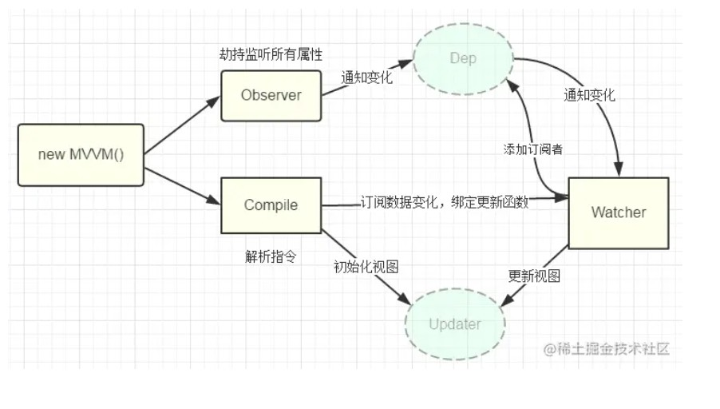
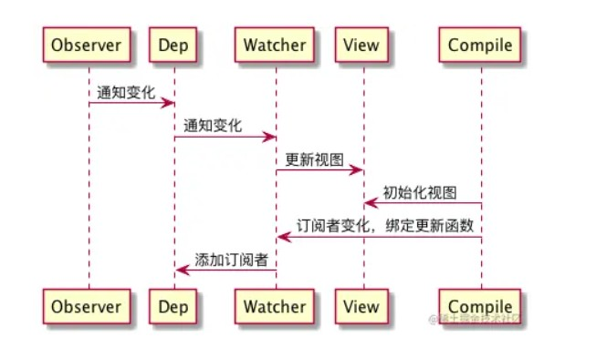

# vue2响应式原理

[TOC]


## 思路分析

实现mvvm主要包含两个方面，数据变化更新视图，视图变化更新数据：


关键点在于data如何更新view，因为view更新data其实可以通过事件监听即可，比如input标签监听 'input' 事件就可以实现了。所以我们着重来分析下，当数据改变，如何更新视图的。

数据更新视图的重点是如何知道数据变了，只要知道数据变了，那么接下去的事都好处理。如何知道数据变了，其实上文我们已经给出答案了，就是通过Object.defineProperty( )对属性设置一个set函数，当数据改变了就会来触发这个函数，所以我们只要将一些需要更新的方法放在这里面就可以实现data更新view了。


### 实现流程

我们已经知道实现数据的双向绑定，首先要对数据进行劫持监听，所以我们需要设置一个监听器Observer，用来监听所有属性。如果属性发上变化了，就需要告诉订阅者Watcher看是否需要更新。因为订阅者是有很多个，所以我们需要有一个消息订阅器Dep来专门收集这些订阅者，然后在监听器Observer和订阅者Watcher之间进行统一管理的。接着，我们还需要有一个指令解析器Compile，对每个节点元素进行扫描和解析，将相关指令对应初始化成一个订阅者Watcher，并替换模板数据或者绑定相应的函数，此时当订阅者Watcher接收到相应属性的变化，就会执行对应的更新函数，从而更新视图。因此接下去我们执行以下3个步骤，实现数据的双向绑定：

1.实现一个监听器Observer，用来劫持并监听所有属性，如果有变动的，就通知订阅者。

2.实现一个订阅者Watcher，可以收到属性的变化通知并执行相应的函数，从而更新视图。

3.实现一个解析器Compile，可以扫描和解析每个节点的**相关指令**，并根据初始化模板数据以及初始化相应的订阅器。


添加网上的一张图：






## 具体代码

### 测试代码

```js
<!DOCTYPE html>
<html lang="en">
<head>
    <meta charset="UTF-8">
    <title>响应式</title>
</head>
<style>
    #app {
        text-align: center;
    }
</style>
<body>
    <div id="app">
        <h2>{{title}}</h2>
        <input v-model="name">
        <h1>{{name}}</h1>
        <button v-on:click="clickMe">click me!</button>
    </div>
</body>
<script src="js/observer.js"></script>
<script src="js/watcher.js"></script>
<script src="js/compile.js"></script>
<script src="js/index.js"></script>
<script type="text/javascript">

     new SelfVue({
        el: '#app',
        data: {
            title: 'hello world',
            name: 'canfoo'
        },
        methods: {
            clickMe: function () {
                this.title = 'hello world';
            }
        },
        mounted: function () {
            window.setTimeout(() => {
                this.title = '你好';
            }, 1000);
        }
    });

</script>
</html>
```

我们需要实现对应的index.js，observer.js，watcher.js，compile.js


### 实现SelfVue类

```js
function SelfVue (options) {
  var self = this; //保存当前vue实例
  this.data = options.data;
  this.methods = options.methods;

  // 便于访问：this.data.name -> this.name
  Object.keys(this.data).forEach(function(key) {
      self.proxyKeys(key);
  });
  observe(this.data); //观测数据
  new Compile(options.el, this); //解析绑定模板数据到视图
  options.mounted.call(this); // 所有事情处理好后执行mounted函数
}

SelfVue.prototype = {
  /*
  * 为什么要实现该方法？
  * 我们已经实现了绑定数据到this.data，并且下面是对this.data进行数据劫持：observe(this.data)
  * 但是我们的数据访问是：this.data.name 而我们希望访问数据是通过 this.name
  * 所以这里再次进行劫持
  */
  proxyKeys: function (key) {
      var self = this;
      Object.defineProperty(this, key, {
          enumerable: false,
          configurable: true,
          get: function getter () { //当我们访问key属性时，返回的是this.data.key
              return self.data[key];
          },
          set: function setter (newVal) {
              self.data[key] = newVal;
          }
      });
  }
}
```


### 实现Observer

首先需要**理解dep和watcher**：

我们可以给模板中的属性 增加一个收集器dep

页面渲染的时候，我们将渲染逻辑封装到watcher中(渲染逻辑可以实现视图的更新)，然后当dep发生变化时，就会通知watcher，然后就会调用watcher中已经封装的渲染逻辑，那么页面就会更新。

让dep记住这个watcher即可，稍后属性变化了可以找到对应的dep中存放的watcher进行重新渲染

每个属性有一个dep(属性就是被观察者，即发布者)，watcher就是观察者，即订阅者（属性变化了会通知观察者来更新）

每一个组件都有一个watcher，watcher中放了一个组件中的很多属性dep

每一个属性有一个dep属性，里面存放了这个属性的watcher，可能一个属性的dep中存放了很多个watcher，因为这个属性在很多地方都用到了

当这个组件的属性没有被渲染时，dep和watcher是不会被收集的


Observer是一个数据监听器，其实现核心方法就是Object.defineProperty()。如果要对所有属性都进行监听的话，那么可以通过递归方法遍历所有属性值，并对其进行Object.defineProperty()处理。

在我们对所有属性进行遍历设置get和set时：

- 我们首先需要对当前属性增加一个dep类，这个dep数组中存放的是当前属性的watcher
- 执行get时，拿到当前的Dep.target，即当前的watcher，然后将当前watcher放入dep中
- 执行set时，比对新旧值，如果发生变化，让当前属性通知它的所有watcher


**既然Observer可以直接通知watcher更新，为什么需要dep?**

对于某个属性，如果它的值变了，Observer观测到，那么就需要通知该属性的watcher，但是这个属性可能出现在很多组件(即很多watcher)中，那么就需要Observer去通知该属性的所有watcher。如果我们设置了一个dep，这个dep是每个属性有一个自己的dep，让dep中存放该属性的所有watcher，那么Obeserver只需要通知到这个dep，然后在让dep去通知它的所有watcher。


根据发布-订阅模式：

在这里Observer是发布者，dep是Observer的订阅者。

dep也是发布者，watcher是dep的订阅者。

所以：dep既是发布者也是订阅者。

```js
function Observer(data) {
  this.data = data;
  this.walk(data); //遍历所有属性，进行监听
}

Observer.prototype = {
  walk: function(data) {
      var self = this;
      Object.keys(data).forEach(function(key) {
          self.defineReactive(data, key, data[key]);
      });
  },
  defineReactive: function(data, key, val) {
      var dep = new Dep(); //在你遍历当前属性时，为当前属性创建dep
      var childObj = observe(val);
      Object.defineProperty(data, key, {
          enumerable: true,
          configurable: true,
          get: function getter () {
              if (Dep.target) {
                  dep.addSub(Dep.target); //dep数组加入当前watcher
              }
              return val;
          },
          set: function setter (newVal) {
              if (newVal === val) {
                  return;
              }
              val = newVal;
              dep.notify();//让dep通知它的所有watcher
          }
      });
  }
};

// 向外暴露的函数，我们会在index.js中调用该函数来实现数据劫持
function observe(value, vm) {
  if (!value || typeof value !== 'object') { //只对对象进行劫持
      return;
  }
  return new Observer(value);
};
```


### 实现Dep

```js
function Dep () {
  this.subs = []; //subs数组存放它的watcher
}
Dep.prototype = {
  addSub: function(sub) { //增加watcher
      this.subs.push(sub);
  },
  notify: function() { //通知所有watcher进行视图更新(遍历所有watcher)
      this.subs.forEach(function(sub) {
          sub.update();//调用当前watcher的update方法：实现视图更新
      });
  }
};
Dep.target = null;//类的静态属性，用来记住当前遍历的是哪个watcher
```


### 实现watcher

什么时候调用watcher呢？

当我们进行模板编译的时候，会把整个页面分成不同组件，会给每个组件添加一个watcher

也就是在模板编译时，对于当前的组件，给它创建一个watcher(即 new Watcher)，那么就会调用它的get()方法，在get方法中，我们就保存了当前watcher，这样方便dep收集它的watcher.

并且因为Dep.target是静态属性，永远只有一份，这样就保证了dep收集的是当前的watcher。

```js
function Watcher(vm, exp, cb) {
  this.cb = cb; //cb是自定义的更新视图函数
  this.vm = vm;
  this.exp = exp; //属性
  this.value = this.get();  // 将自己添加到订阅器的操作
}

Watcher.prototype = {
  update: function() { //dep通知watcher：watcher执行update来更新视图
      this.run();
  },
  run: function() {
      var value = this.vm.data[this.exp]; //拿到新值
      var oldVal = this.value;
      if (value !== oldVal) { //值发生变化，执行cb函数更新视图
          this.value = value;
          this.cb.call(this.vm, value, oldVal);
      }
  },
  get: function() {
      Dep.target = this;  // 缓存自己：暴露静态属性，方便dep收集
      var value = this.vm.data[this.exp]  // 根据属性拿到值：exp是属性
      Dep.target = null;  // 释放自己
      return value;
  }
};
```


### 实现compile

```js
//向外暴露的函数
function Compile(el, vm) {
  this.vm = vm;
  this.el = document.querySelector(el);
  this.fragment = null;
  this.init();
}

Compile.prototype = {
  init: function () {
      if (this.el) {
          this.fragment = this.nodeToFragment(this.el); //获取要解析的节点片段
          this.compileElement(this.fragment);//解析当前节点片段
          this.el.appendChild(this.fragment);
      } else {
          console.log('Dom元素不存在');
      }
  },
  //获取要截取的节点片段
  nodeToFragment: function (el) {
      var fragment = document.createDocumentFragment();
      var child = el.firstChild;
      while (child) {
          // 将Dom元素移入fragment中
          fragment.appendChild(child);
          child = el.firstChild
      }
      return fragment;
  },
  //解析当前节点片段
  compileElement: function (el) {
      var childNodes = el.childNodes;
      var self = this;
      [].slice.call(childNodes).forEach(function(node) {
          var reg = /\{\{(.*)\}\}/;
          var text = node.textContent;

          if (self.isElementNode(node)) {  //元素节点
              self.compile(node);
          } else if (self.isTextNode(node) && reg.test(text)) {//判断是否是符合这种形式{{}}的指令
              self.compileText(node, reg.exec(text)[1]);
          }

          if (node.childNodes && node.childNodes.length) {
              self.compileElement(node); //递归遍历子节点
          }
      });
  },
  //解析元素节点
  compile: function(node) {
      var nodeAttrs = node.attributes;
      var self = this;
      Array.prototype.forEach.call(nodeAttrs, function(attr) {
          var attrName = attr.name;
          if (self.isDirective(attrName)) {
              var exp = attr.value;
              var dir = attrName.substring(2);
              if (self.isEventDirective(dir)) {  // 事件指令
                  self.compileEvent(node, self.vm, exp, dir);
              } else {  // v-model 指令
                  self.compileModel(node, self.vm, exp, dir);
              }
              node.removeAttribute(attrName);
          }
      });
  },
  compileText: function(node, exp) {
      var self = this;
      var initText = this.vm[exp];
      this.updateText(node, initText)// 将初始化的数据初始化到视图中
      // new Watcher：创建当前节点片段的watcher;
      new Watcher(this.vm, exp, function (value) { //watcher的第三个参数是我们自定义的更新视图的函数
          self.updateText(node, value); 
      });
  },
  // 解析事件指令
  compileEvent: function (node, vm, exp, dir) {
      var eventType = dir.split(':')[1];
      var cb = vm.methods && vm.methods[exp];

      if (eventType && cb) {
          node.addEventListener(eventType, cb.bind(vm), false);
      }
  },
  // 解析v-model 指令
  compileModel: function (node, vm, exp, dir) {
      var self = this;
      var val = this.vm[exp];
      this.modelUpdater(node, val);
      new Watcher(this.vm, exp, function (value) {
          self.modelUpdater(node, value);
      });

      node.addEventListener('input', function(e) {
          var newValue = e.target.value;
          if (val === newValue) {
              return;
          }
          self.vm[exp] = newValue;
          val = newValue;
      });
  },
  //更新函数
  updateText: function (node, value) {
      node.textContent = typeof value == 'undefined' ? '' : value;
  },
  //更新函数
  modelUpdater: function(node, value, oldValue) {
      node.value = typeof value == 'undefined' ? '' : value;
  },
  isDirective: function(attr) {
      return attr.indexOf('v-') == 0;
  },
  isEventDirective: function(dir) {
      return dir.indexOf('on:') === 0;
  },
  isElementNode: function (node) {
      return node.nodeType == 1;
  },
  isTextNode: function(node) {
      return node.nodeType == 3;
  }
}
```


## 实现v-model命令

上面的代码实现的响应式原理，而双向数据绑定通常是指我们使用的`v-model`指令的实现，是`Vue`的一个特性，也可以说是一个`input`事件和`value`的语法糖。 `Vue`通过`v-model`指令为组件添加上`input`事件处理和`value`属性的赋值。

其实双向数据绑定的实现是基于响应式原理，具体实现是在compile中添加了对v-model指令的解析，类似于解析文本，{{}}，子节点...

```js
// 解析v-model 指令
  compileModel: function (node, vm, exp, dir) {
      var self = this;
      var val = this.vm[exp];
      this.modelUpdater(node, val);
      new Watcher(this.vm, exp, function (value) {
          self.modelUpdater(node, value);
      });

      node.addEventListener('input', function(e) { //监听input输入事件
          var newValue = e.target.value;
          if (val === newValue) {
              return;
          }
          self.vm[exp] = newValue; //更新值
          val = newValue;
      });
  },
```


双向数据绑定的实现是基于响应式原理，我们首先对数据进行劫持，当属性值发生变化时，observer是可以知道的然后通知dep，dep再通知watcher。

而对于v-model，在我们编译模板时，会针对v-model进行解析：如果发现当前节点有v-model(eg: v-model='str')，那就会监听input事件，当str的值发生变化时，会将用户输入的值赋值到str属性上，此时相当于属性值发生变化，observer就会检测到值的变化，那就会通知到dep，然后dep通知到watcher.


在这里拓展一下v-model的其他用法：

👉 [彻底搞懂v-model](https://blog.csdn.net/weixin_52834435/article/details/127339536?csdn_share_tail=%7B%22type%22%3A%22blog%22%2C%22rType%22%3A%22article%22%2C%22rId%22%3A%22127339536%22%2C%22source%22%3A%22weixin_52834435%22%7D)


参考文章：

[vue的双向绑定原理及实现](https://www.cnblogs.com/canfoo/p/6891868.html)