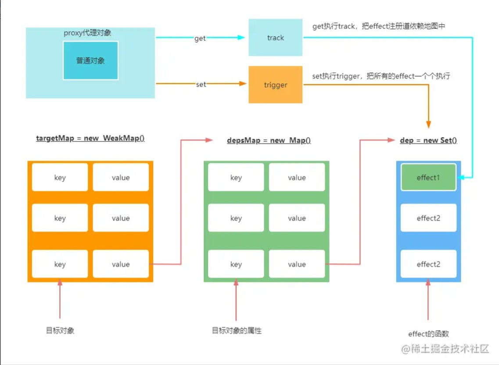

# vue3响应式原理

[TOC]


> vue3响应式的核心是使用proxy
>
> 👉 [【ES6】Proxy 与 Reflect](https://blog.csdn.net/weixin_52834435/article/details/124545096)


测试代码：
**测试对象**

核心是使用**reactive**

```js
let { effect, reactive } = VueReactivity
let state = reactive({ name:'zf', age: 12, arr: [1,2,3] })
effect(() => {
	app.innerHTML = '今年' + state.name + ',' + 'arr: ' + state.arr;
})

setTimeout(() => {
	state.arr.length = 5
}, 1000);
```


**测试普通值**

核心是使用**ref**

```js
let { reactive, effect, ref, shallowRef, toRef, toRefs } = VueReactivity
let name = ref('zf')
console.log(name)
effect(() => { //track
	app.innerHTML = name.value
})

setTimeout(() => { //trigger
	name.value = 'jw'
}, 1000);
```


**测试toRef, toRefs**

```js
let { reactive, effect, ref, shallowRef, toRef, toRefs } = VueReactivity
let proxy = reactive({name:'zf', age:1})
let r1 = toRefs(proxy)
console.log(r1)
effect(() => {
	app.innerHTML = r1.name.value + r1.age.value
})
setTimeout(() => {
	proxy.name = 'jw'
}, 1000);
```


上面都出现了**effect()**函数：
effect()函数默认上来会执行一次，然后当属性值发生变化时，effect函数又会执行。


## 一.响应式API实现

主要的api有：reactive，shallowReactive，readonly，shallowReadonly。

它们内部都是使用proxy实现代理，区别在于：是不是仅读，是不是深度

所以我们可以封装一个通用的函数createReactiveObject()，然后使用一些参数变量来区分是否是可读或者是深度监听

```js
import {
    mutableHandlers,
    readonlyHandlers,
    shallowReactiveHandlers,
    shallowReadonlyHandlers
} from "./baseHandlers"; // 不同的拦截函数

export function reactive(target) {
    return createReactiveObject(target, false, mutableHandlers)
}

export function shallowReactive(target) {
    return createReactiveObject(target, false, shallowReactiveHandlers)
}

export function readonly(target) {
    return createReactiveObject(target, true, readonlyHandlers)
}

export function shallowReadonly(target) {
    return createReactiveObject(target, true, shallowReadonlyHandlers)
}
/**
 * 
 * @param target 拦截的目标
 * @param isReadonly 是不是仅读属性
 * @param baseHandlers 对应的拦截函数
 */
function createReactiveObject(target, isReadonly, baseHandlers) {}
```


> Vue3中采用proxy实现数据代理, 核心就是拦截`get`方法和`set`方法，当获取值时收集`effect`函数，当修改值时触发对应的effect重新执行

我们这里的控制器就是用来定义：get和set方法。


题外话：我们会在一个文件中封装一些功能函数。就先在这里全部体现：

```js
export const isObject = (value) => typeof value == 'object' && value !== null;
export const extend = Object.assign

export const isArray = Array.isArray
export const isFunction = (value) => typeof value == 'function' 
export const isNumber = (value) => typeof value == 'number'
export const isString = (value) => typeof value == 'string'
export const isIntegerKey = (key) => parseInt(key) + '' == key //判断一个属性是不是索引(针对数组)

let hasOwnProperty = Object.prototype.hasOwnProperty
export const hasOwn = (target, key) => hasOwnProperty.call(target,key) //判断对象身上有没有这个属性

export const hasChanged = (oldValue,value) => oldValue !== value //判断老值和新值是否一致
```


## 二.createReactiveObject 实现

下面实现 **createReactiveObject()** 函数

```js
//我们需要一个映射表判断某个对象是否被代理了
//映射表：分为仅读代理和深度代理
const reactiveMap = new WeakMap()
const readonlyMap = new WeakMap()

export function createReactiveObject(target, isReadonly, baseHandlers){
  //如果目标不是对象，没法拦截， reactive这个api只能拦截对象类型
  if(!isObject(target)){
    return target;
  }

  // 如果某个对象已经被代理过了 就不要再次代理了: 所以我们需要一个映射表判断某个对象是否被代理了
  // 可能一个对象 被深度代理了 又是仅读代理
  const proxyMap = isReadonly? readonlyMap : reactiveMap; //判断isReadonly是否有值，来区分放到哪个映射表

  const existProxy = proxyMap.get(target)
  if(existProxy){
    return existProxy; //如果已经被代理了，直接返回即可
  }

  const proxy = new Proxy(target, baseHandlers)
  proxyMap.set(target, proxy) //将要代理的对象 和 对应代理结果缓存起来

  return proxy
}
```


## 三.收集依赖/触发更新的思路

响应式顺序：effect > track > trigger > effect

在组件渲染过程中，一个 effect 会会触发get，从而对值进行 track，当值发生改变，就会进行 trigger，执行 effect 来完成一个响应.




## 四.baseHandlers 实现

这四个handlers都是在内部实现了get和set。

所以：我们可以封装公共的get和set，然后复用上面的思想：也通过变量区分是否是仅读的。

我们封装的公共的get函数：**createGetter()**，封装的公共set函数：**createSetter()**

```js
const get = createGetter()
const shallowGet = createGetter(false, true)
const readonlyGet = createGetter(true)
const shallowReadonlyGet = createGetter(true, true)

const set = createSetter()
const shallowSet = createSetter(true)

export const mutableHandlers = {
  get,
  set
}
export const shallowReactiveHandlers = {
  get: shallowGet,
  set: shallowSet
}

//特殊处理只读属性
export const extend = Object.assign
let readonlyObj = {
  set: (target, key) => {
    console.warn(`set on key ${key} failed`)
  }
}
export const readonlyHandlers = extend({
  get: readonlyGet
}, readonlyObj)

export const shallowReadonlyHandlers = extend({
  get: shallowReadonlyGet
}, readonlyObj)
```


### createGetter()

```js
function createGetter(isReadonly = false, shallow = false){ //拦截获取功能
  return function get(target, key, receiver){
    
    const res = Reflect.get(target, key, receiver)

    if(!isReadonly){
      //收集依赖，等会儿数据变化后更新对应的视图
      //这里相当于属性值的最外面的一层，下面才是如果里层是对象进行递归
    
      //每个属性都会去走一遍这个函数
      console.log('执行effect时会取值，收集effect')
      track(target, TrackOpTypes.GET, key) //调用get方法时，追踪target对象的key属性，追踪该属性就是进行依赖收集
    }

    if(shallow){ //浅读直接返回即可
      return res
    }
    //如果不是浅读并且当前属性值是对象
    if(isObject(res)){
      //递归：保证属性值里面的对象仍然是响应式的
      // vue2是一上来就递归，vue3是取值时才会代理（懒代理），如果你不用这个值就不会代理
      return isReadonly ? readonly(res) : reactive(res)
    }

    return res
  }
}
```


### createSetter()

```js
function createSetter(shallow = false){ //拦截设置功能
  return function set(target, key, value, receiver){
    // 首先判断是新增还是修改
    const oldValue = target[key]; //获取老的值

    // 判断key是否是数组并且是数组索引，如果是，该索引是已存在的还是新增的，如果不是数组判断该对象的属性key是否存在
    // 这里就对数组和对象进行了区分
    //我们也不需要像vue2那样去重写数组方法：因为push方法也是修改数组索引
    let hadKey = isArray(target) && isIntegerKey(key) ? Number(key) < target.length : hasOwn(target,key)
    // hadKey 此时就判断出来了该key是新增的还是修改

    const result = Reflect.set(target, key, value, receiver)

    if(!hadKey){
      //新增
      trigger(target, TriggerOrTypes.ADD, key, value)//在trigger中就会执行该属性的effect
    }else if(hasChanged(oldValue,value)){//判断老值和新值是否一致
      //修改
      trigger(target, TriggerOrTypes.SET, key, value, oldValue)
    }

    // vue2里无法监控更改索引，无法监控数组的长度
    // 当数据更新时，通知对应属性的effect重新执行
    return result
  }
}
```


## 五.effect实现

effect()函数默认上来会执行一次，然后当属性值发生变化时，effect函数又会执行。

effect函数的参数是个fn函数，然后当数据变化时会调用该fn函数。

```js
export function effect(fn, options:any = {}){
  // 我需要让这个effect变成响应的effect，可以做到effect里面的数据变化：重新执行

  const effect = createReactiveEffect(fn, options);

  if(!options.lazy){ //lazy表示这个effect是懒执行，默认的effect会先执行一次
    effect();
  }

  return effect;
}


let uid  = 0;
let activeEffect;//一个变量：存储当前属性的effect
const effectStack = []; //栈：effect函数中可能会嵌套effect，那么就需要栈来存储当前属性的effect（区分）
function createReactiveEffect(fn, options){ //fn就是用户传入的函数
  const effect = function reactiveEffect(){
    if(!effectStack.includes(effect)){ //如果没有再加进去：保证effect没有加入到effectStack中
      //如果出现异常，希望还可以正常的将栈中元素抛出去
      try{
        effectStack.push(effect); //将当前属性的effect入栈
        activeEffect = effect; //存储当前属性的effect
        //让effect上来先执行一次,执行的是我们传入的那个函数: 执行就会去我们设置的变量中取值 
        return fn();
      }finally{
        effectStack.pop();
        activeEffect = effectStack[effectStack.length-1]
      }
    }
    
  }
  effect.id = uid++; //制作一个effect标识，用于区分effect
  effect._isEffect = true; //用于标识这个effect是响应式effect
  effect.raw = fn; //保留effect对应的原函数
  effect.options = options; //在effect上保存用户的属性

  return effect;
}
```


举例：利用栈型结构存储effect，保证依赖关系

```js
const state =reactive({name:'zf',age:12,address:'回龙观'})
effect(()=>{ // effect1      
    console.log(state.name); // 收集effect1          
    effect(()=>{ // effect2 
        console.log(state.age); // 收集effect2
    });
    console.log(state.address); // 收集effect1
})
```


## 六.`track`依赖收集

track函数在何处使用？

```js
function createGetter(isReadonly = false, shallow = false) {
    return function get(target, key, receiver) {
      	// ...
        if (!isReadonly) { // effect函数执行时，进行取值操作，让属性记住对应的effect函数
            track(target, TrackOpTypes.GET, key);
        }
    }
}
```


track完整代码：

```js
let activeEffect;//一个变量：存储当前属性的effect

// 让 某个对象中的属性 收集当前它对应的effect函数
const targetMap = new WeakMap()
export function track(target, type, key){
  //这里可以拿到当前属性的effect： activeEffect

  if(activeEffect === undefined){ //该属性不用收集effect
    return;
  }

  /**
   * targetMap代表的是所有对象的集合：里面的key是每一个target，value是这个target的map
   * depsMap代表的是某个target的map：它的value是map，这个map是target的所有属性的集合
   * dep就是从targetMap中根据key(这里的key就是target)，然后拿到对应的depsMap，然后根据key(key就是某个属性)，找到这个属性的set
   * 注意：每个属性对应一个set，然后这个set里面放了它的effect（因为set可以去重，所以是set）
   * 如果这个set里面没有当前的effect，那就加上
   */
  let depsMap = targetMap.get(target)
  if(!depsMap){
    targetMap.set(target, (depsMap = new Map()))
  }
  let dep = depsMap.get(key)
  if(!dep){
    depsMap.set(key, (dep = new Set))
  }
  if(!dep.has(activeEffect)){
    dep.add(activeEffect)
  }

  console.log('targetMap: ',targetMap)
}
```


## 七.`trigger`触发更新

何处使用trigger？

```js
function createSetter(shallow = false) {
    return function set(target, key, value, receiver) {
        const oldValue = target[key];
        const hadKey =
            isArray(target) && isIntegerKey(key) ? Number(key) < target.length : hasOwn(target, key);
        const result = Reflect.set(target, key, value, receiver);
        if (!hadKey) {
            // 新增属性
            trigger(target, TriggerOpTypes.ADD, key, value)
        } else if (hasChanged(value, oldValue)) {
            // 修改属性
            trigger(target, TriggerOpTypes.SET, key, value, oldValue)
        }
        return result;
    }
}
```


完整代码：

```js
export function trigger(target, type, key?, newValue?, oldValue?){
  // target：我们代理的整个对象  type: 0/1 -> 新增/修改   key: 新增或修改的属性
  // console.log('执行set或add',type, key, newValue, oldValue)
  
  /**
   * targetMap是整个对象(即：let obj = reactive({name:'zs', age:12, arr: [1,2,3]}) )
   * 那么 targetMap 就是 {name:'zs', age:12, arr: [1,2,3]}
   * 
   * 这里的传参的target比如是：arr
   * 那么depsMap就是[1,2,3]，但其实浏览器会自动加上一些方法：valueOf, toString, join, length，然后才是每一项：1,2,3
   * 对于depsMap来说：它也有key和value：
   * key就是valueOf, toString, join, length，每一项... 
   * value是一个set：这个set的值是function reactiveEffect()，对于function reactiveEffect()，这个函数的返回值是一个effect
   * 也就是说，对于每个key(valueOf, toString, join, length，每一项... ),它的值是一个set，里面是它的effect
   * 因为一个属性可能有好几个effect，所以用set
   */
  const depsMap = targetMap.get(target)
  // 如果这个属性没有收集过effect，那就不需要做任何操作：就像我们在effect中写了一个不是reactive的属性并对他做修改，
  if(!depsMap) return;

  const effects = new Set()
  // 将所有的要执行的effect 全部存到一个新的集合中，最终一起执行：就是把当前属性所依赖的所有effect存起来
  const add = (effectsToAdd) => {
    if(effectsToAdd){ //effectsToAdd是一个set，里面放了当前属性的所有effect
      effectsToAdd.forEach(effect => effects.add(effect))
    }
  }

  // 1.看修改的是不是数组的长度（因为改长度影响比较大）
  if(key === 'length' && isArray(target)){
    depsMap.forEach((dep, key) => {
      // depsMap对于数组：前几项都是：valueOf, toString, join, length,下面几项是数组的每一项
      // dep：是一个set，上面的depsMap的每一项的value：这个set的值是function reactiveEffect()
      // key：valueOf, toString, join 
      // console.log('depsMap: ',depsMap,'dep: ', dep,'key: ', key)

      if(key === 'length' || key > newValue){
        // 如果更改的长度 小于收集的索引，那么这个索引也需要触发effect重新执行
        add(dep);
        //dep是一个set，是当前key的所有effect的集合
      }
    })
  } else {
    //修改的是对象
    if(key !== undefined){ //这里肯定是修改，不是新增
      add(depsMap.get(key))
    }
    //如果修改数组中的 某一个索引 怎么办？
    switch(type){
      case TriggerOrTypes.ADD: //这种情况：原来arr:[1,2,3]  但是现在：arr[100]=1
        if(isArray(target) && isIntegerKey(key)){ //如果是数组并且修改的索引大于数组的长度(上面首先判断的是修改索引小于数组长度的情况)
          add(depsMap.get('length'))
        }
    }
  }

  //取出所有effect，遍历
  effects.forEach((effect:any) => effect())
}
```


## 八.实现`Ref`

ref将普通的类型 转化成一个对象，这个对象中有个value属性 指向原来的值

let name = ref('zf')  name.value


ref和reactive的区别：reactive内部采用proxy ref内部使用的是defineProperty

```js
export function ref(value){
  return createRef(value)
}


export function shallowRef(value){
  return createRef(value,true)
}

function createRef(rawValue, shallow = false){
  return new RefImpl(rawValue, shallow)
}
```

ref返回的是一个RefImpl类的实例


```js
const convert = (val) => isObject(val) ? reactive(val) : val
class RefImpl { //ref返回的是一个RefImpl类的实例
  public _value; //表示声明了一个_value属性，但是没有赋值
  public __v_isRef = true; //产生的实例会被添加 __v_isRef 表示是一个ref属性
  constructor(public rawValue, public shallow){ //参数前面添加修饰符，该属性会被直接放到实例上 可以直接this.xxx获取
    this._value = shallow ? rawValue : convert(rawValue) //如果是深度(出现你在ref中放对象的情况)，需要把里面的都变成响应式的
  }
  //类的属性访问器
  get value(){ //代理 取值取value会帮我们代理到_value上
    track(this, TrackOpTypes.GET, 'value')
    return this._value
  }
  set value(newValue){
    if(hasChanged(newValue, this.rawValue)){ //判断新值和老值是否一致
      this.rawValue = newValue;//新值作为老值
      this._value = this.shallow ? newValue : convert(newValue)
      trigger(this, TriggerOrTypes.SET,'value',newValue)
    }
  }
}

```


## 九.实现`toRefs`

```js
class ObjectRefImpl{
  public __v_isRef = true;
  constructor(public target, public key){}
  get value(){
    return this.target[this.key]
  }
  set value(newValue){
    this.target[this.key] = newValue
  }
}

export function toRef(target, key){ //可以把一个对象的某属性转化为 ref类型
// 实质上就是将某一个key对应的值转化为ref
/**
 * let state = { name: 'zf' }
 * let ref = toRef(state, 'name')
 */
  return new ObjectRefImpl(target, key)
}

export function toRefs(object){ //object可能是对象/数组
  const ret = isArray(object) ? new Array(object.length) : {}
  for(let key in object){
    ret[key] = toRef(object, key);
  }
  return ret;
}
```


参考文章：

[手写简单vue3响应式原理](https://juejin.cn/post/7134281691295645732#heading-0)