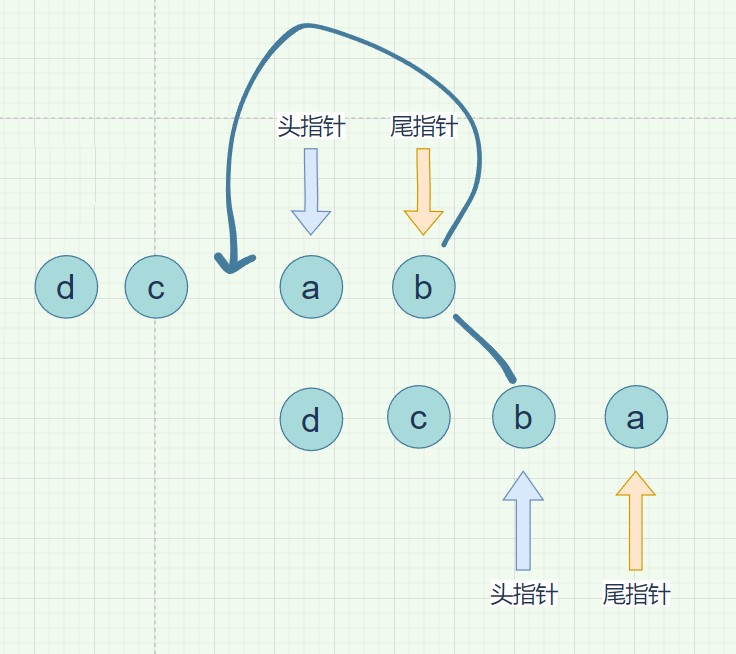

# 五.diff算法原理

[TOC]


首先，我们在src/index.js文件中写入一段测试代码：

```js
// diff的测试代码
let render1 = compileToFunction(`<ul key='a' a='1' style='color:red'>
  <li key='a'>a</li>
  <li key='b'>b</li>
  <li key='c'>c</li>
</ul>`)
let vm1 = new Vue({data: { name: 'zf' }})
let prevVNode = render1.call(vm1)

let el = createElm(prevVNode)
document.body.appendChild(el)


let render2 = compileToFunction(`<ul key='a' a='1' style='color:red'>
  <li key='d'>d</li>
  <li key='a'>a</li>
  <li key='b'>b</li>
  <li key='c'>c</li>
</ul>`)
let vm2 = new Vue({data: { name: 'zf' }})
let nextVNode = render2.call(vm2)

console.log(prevVNode, nextVNode)

setTimeout(() => {
  patch(prevVNode, nextVNode) //patch中实现diff算法
  //原来的做法：直接将新的节点替换掉老的
  // let newEl = createEle(nextVNode)
  // el.parentNode.replaceChild(newEl, el)
}, 1000);
```


## 一.基本Diff算法

我们在patch函数中实现diff算法。

1.两个节点不是同一个节点，直接删除老的换上新的（没有比对了）

2.两个节点是同一个节点（判断节点的tag和节点的key）比较两个节点的属性是否有差异（复用老的节点，将差异的属性更新）

3.节点比较完毕后就需要比较两个节点的儿子


patch函数也负责初渲染流程，用if-else判断是否是初渲染。

```js
// patch(el,vnode)
export function patch(oldVNode, vnode){
  const isRealElement = oldVNode.nodeType;
  if(isRealElement){  //初渲染流程
    const elm = oldVNode; //获取真实元素
    const parentElm = elm.parentNode; //拿到父元素
    let newElm = createElm(vnode) //此时元素已经创建好了，属性也绑定了
    parentElm.insertBefore(newElm, elm.nextSibling) //插入新节点
    parentElm.removeChild(elm) //删除老节点

    return newElm
  }else{
    //diff算法
    /**
     * 1.两个节点不是同一个节点，直接删除老的换上新的（没有比对了）
     * 2.两个节点是同一个节点（判断节点的tag和节点的key）比较两个节点的属性是否有差异（复用老的节点，将差异的属性更新）
     * 3.节点比较完毕后就需要比较两个节点的儿子
     */

    return patchVNode(oldVNode, vnode)
    
  }
}
```

我们在patchVNode(oldVNode, vnode)函数中实现两个节点的对比。


### 不是同一个节点

先写一个功能函数：判断两个节点是否是同一个节点

```js
//判断两个节点是否是同一个节点
export function isSameVNode(vnode1, vnode2){
  return vnode1.tag === vnode2.tag && vnode1.key === vnode2.key
}
```


首先在patchVNode(oldVNode, vnode)函数中实现：判断两个节点是否是同一个节点

```js
function patchVNode(oldVNode, vnode){
  //两个节点不是同一个节点，直接删除老的换上新的（没有比对了）
  if(!isSameVNode(oldVNode, vnode)){ //tag===tag && key===key
    //用老节点的父亲 进行替换
    let el = createElm(vnode);
    oldVNode.el.parentNode.replaceChild(el, oldVNode.el)
    return el;
  }
	
	//...

  return el;
}
```


处理完不是同一个节点的情况，剩下的就是同一个节点的情况。

如果是同一个节点，又分为这个节点是普通节点或者文本节点。

如果是文本节点：

```js
function patchVNode(oldVNode, vnode){
  //两个节点不是同一个节点，直接删除老的换上新的（没有比对了）
  if(!isSameVNode(oldVNode, vnode)){ //tag===tag && key===key
    //用老节点的父亲 进行替换
    let el = createElm(vnode);
    oldVNode.el.parentNode.replaceChild(el, oldVNode.el)
    return el;
  }
	
	//上面的情况是节点完全不一样，现在是节点一样，先特殊处理文本
  let el = vnode.el = oldVNode.el; //复用老节点的元素
  if(!oldVNode.tag){ //是文本
    if(oldVNode.text !== vnode.text){
      el.textContent = vnode.text; //用新的文本覆盖掉老文本
    }
  }
  
  //...

  return el;
}
```


### 同一个节点

我们需要比对两个标签的属性。

我们将比较两个标签的代码抽离成一个函数patchProps。

```js
function patchVNode(oldVNode, vnode){
	//不是同一个节点的情况...

  //是标签的情况, 我们需要对比标签的属性
  patchProps(el, oldVNode.data, vnode.data)


  return el;
}
```


patchProps：

```js
//对比新旧节点的属性
export function patchProps(el, oldProps = {}, props = {}){ //更新属性
  //老的属性中有，新的没有，要删除老的
  let oldStyles = oldProps.style || {}
  let newStyles = props.style || {} //老的样式中有，新的没有，则删除
  for(let key in oldStyles){
    if(!newStyles[key]){
      el.style[key] = ''
    }
  }
  for(let key in oldProps){ //老的属性中有，新的没有，删除
    if(!props[key]){
      el.removeAttribute(key);
    }
  }
  
  for(let key in props){ //用新的覆盖掉老的
    if(key === 'style'){
      for(let styleName in props.style){
        el.style[styleName] = props.style[styleName]
      }
    }else{
      el.setAttribute(key, props[key]);
    }
  }
}
```


### 递归比较儿子节点

如果双方都有儿子，就涉及到diff算法了。

```js
function patchVNode(oldVNode, vnode){
  //...

  //是标签的情况, 我们需要对比标签的属性
  patchProps(el, oldVNode.data, vnode.data)

  //开始比较儿子节点
  let oldChildren = oldVNode.children || [];
  let newChildren = vnode.children || [];
  if(oldChildren.length > 0 && newChildren.length > 0){
    //完整的diff算法，需要比较两个人的儿子
    updateChildren(el, oldChildren, newChildren)
  }else if(newChildren.length > 0){ //没有老的，只有新的
    mountChildren(el, newChildren) //挂载新的儿子
  }else if(oldChildren.length > 0){ //新的没有
    el.innerHTML = ''
  }

  return el;
}

//循环新儿子，挂载所有节点
function mountChildren(el, newChildren){
  for(let i=0; i<newChildren.length; i++){
    let child = newChildren[i];
    el.appendChild(createElm(child));
  }
}
```


## 二.完整的Diff算法

我们在`updateChildren(el, oldChildren, newChildren)`函数中实现完整的diff算法。

diff算法只会比较同级的节点

vue2采用双指针的算法 ：头指针和尾指针

四种比较方式(我们第一个指的是旧结点，第二个是新节点)：头头，尾尾，头尾，尾头

一个最简单的比较思路：

旧结点和新节点都有头结点和尾结点。


当头指针移动到尾指针后面，就停止移动 -> 头指针 > 尾指针

然后将多余的部分增加/删除，多余的部分就是头指针和尾指针之间的部分。


先声明几个指针：

```js
function updateChildren(el, oldChildren, newChildren){
  //diff算法只会比较同级的节点
  // vue2采用双指针的算法 ：头指针和尾指针
  //头头，尾尾，头尾，尾头

  let oldStartIndex = 0;
  let oldStartVnode = oldChildren[0];
  let oldEndIndex = oldChildren.length - 1;
  let oldEndVnode = oldChildren[oldEndIndex];

  let newStartIndex = 0;
  let newStartVnode = newChildren[0];
  let newEndIndex = newChildren.length - 1;
  let newEndVnode = newChildren[newEndIndex];
}
```

我门使用while循环，不论新旧节点，只要有一方的头指针大于尾指针我们就停止循环。

```js
function updateChildren(el, oldChildren, newChildren){
  //...
  
  while(oldStartIndex <= oldEndIndex && newStartIndex <= newEndIndex){
  
  }
}
```


### 在开头和结尾新增元素

这里我们引用了上面定义的`patchVNode`和`isSameVNode`方法。

isSameVNode：判断两个节点是否是同一个节点

patchVNode： 比较同一级的两个节点(比较他们的属性和样式，以及孩子节点)

```js
function updateChildren(el, oldChildren, newChildren){
	//...

  while(oldStartIndex <= oldEndIndex && newStartIndex <= newEndIndex){
    //双方有一方头指针，大于尾指针则停止循环
    
    //#头比头
    if(isSameVNode(oldStartVnode, newStartVnode)){ //如果是同一个节点
      patchVNode(oldStartVnode, newStartVnode); //先比较当前节点的属性和样式，并且递归比较子节点
      oldStartVnode = oldChildren[++oldStartIndex]; //两个头指针同时向后移动
      newStartVnode = newChildren[++newStartIndex];
    }
    
    //#尾比尾
    else if(isSameVNode(oldEndVnode,newEndVnode)){
      patchVNode(oldEndVnode, newEndVnode);
      oldEndVnode = oldChildren[--oldEndIndex]; //尾指针同时向前移动
      newEndVnode = newChildren[--newEndIndex];
    }
   
    
  }
  if(newStartIndex <= newEndIndex){ //如果新dom的节点长度大于旧结点，那就将新节点的多余部分插入
    for(let i=newStartIndex; i<= newEndIndex; i++){
      let childEl = createElm(newChildren[i]);
      //这里不仅要适用于头比头，也要适用于尾比尾
      //头比头：在后面继续追加，尾比尾：在前面插入
      let anchor = newChildren[newEndIndex+1] ? newChildren[newEndIndex+1].el : null; 
      //anchor是一个参照物：判断新节点的尾指针的下一个是否有值，如果有值，证明是尾比尾，是在前面插入，如果没有值，那证明是头比头，要在后面继续插入
      el.insertBefore(childEl, anchor);
      // el.appendChild(childEl);
    }
  }
  if(oldStartIndex <= oldEndIndex){ //如果新dom的节点长度小于旧结点，那就将旧节点的多余部分删除
    for(let i=oldStartIndex; i<= oldEndIndex; i++){
      if(oldChildren[i]){ //这部分的逻辑也适用于乱序比对
        let childEl = oldChildren[i].el;
        el.removeChild(childEl);
      }
    }
  }

  console.log(oldStartVnode,newStartVnode)
}
```

新dom的节点长度小于旧结点: 直接删除即可

如果新dom的节点长度大于旧结点：那就将新节点的多余部分插入

注意插入的情况有两种：一个是在最后面插入(头比头)，一个是在最前面插入(尾比尾)

**最后面插入(头比头)的情况**：

如果新节点的尾指针下一个没有节点，那就证明是头比头，继续在后面插入。


**最前面插入(尾比尾)的情况**


如果尾指针后面还有指针，证明是尾比尾，


### 头移尾，尾移头

```js
    //#尾比头
    else if(isSameVNode(oldEndVnode, newStartVnode)){
      patchVNode(oldEndVnode, newStartVnode);
      //insertBefore具备移动性，会将原来的元素移动走
      el.insertBefore(oldEndVnode.el, oldStartVnode.el); //将老的尾移动到老的开头
      oldEndVnode = oldChildren[--oldEndIndex]; //老的尾指针向前移动
      newStartVnode = newChildren[++newStartIndex]; //新的头向后移动
    }
    //#头比尾(全部都是旧结点比新节点)
    else if(isSameVNode(oldStartVnode, newEndVnode)){
      patchVNode(oldStartVnode, newEndVnode);
      el.insertBefore(oldStartVnode.el, oldEndVnode.el.nextSibling); //将老的头移动到老的尾
      oldStartVnode = oldChildren[++oldStartIndex];
      newEndVnode = newChildren[--newEndIndex];
    }
```


#### 图示

**abcd -> dcba**

- 旧结点的尾指针 VS 新节点的头指针


- 比对成功后，将旧结点的尾指针移动到最前面，然后尾指针向前移，头指针向后移

  




### 乱序比对

测试代码：

```js
// diff的测试代码
let render1 = compileToFunction(`<ul key='a' a='1' style='color:red'>
  <li>a</li>
  <li>b</li>
  <li>c</li>
  <li>d</li>
</ul>`)
let vm1 = new Vue({data: { name: 'zf' }})
let prevVNode = render1.call(vm1)

let el = createElm(prevVNode)
document.body.appendChild(el)


let render2 = compileToFunction(`<ul key='a' a='1' style='color:red'>
  <li>b</li>
  <li>m</li>
  <li>a</li>
  <li>p</li>
  <li>c</li>
  <li>q</li>
</ul>`)
let vm2 = new Vue({data: { name: 'zf' }})
let nextVNode = render2.call(vm2)

console.log(prevVNode, nextVNode)
```


**abcd -> bmapcq**


首先，新旧节点进行四种比对方式，失败。

然后拿着新指针的头结点，去纠结点的映射关系表中进行查找，找到，然后根据映射表将目标节点插入到最前面，并且将该节点设置为undefined。


然后新节点的头指针向后移动，继续比对，比对映射表，发现没有该节点m，然后将节点m插入到旧结点的前面。


新节点的头指针继续向后移，发现使用头比头已经比对到，然后新旧节点的头结点都向后移，因为旧结点的节点b已经被设置为undefined，所以旧结点的头指针指向节点c.


现在新节点的节点p匹配不到，将节点p插入到旧结点的头指针前面，然后新节点的头指针向后移，


继续比对，可以比对到，新旧节点的头指针都往后移。


此时节点q无法比对到，直接插入到旧结点的头结点之前，然后将旧结点中多余的节点d删除。


```js
  //针对乱序比对 -> 制作一个映射表
  function makeIndexByKey(children){
    let map = {};
    children.forEach((child,index) => {
      map[child.key] = index;
    })
    return map;
  }
  let map = makeIndexByKey(oldChildren); 


	//#乱序比对
    else {
      // 根据老的列表做一个映射关系，用新的去找，找到则移动，找不到则添加，最后多余的删除
      let moveIndex = map[newStartVnode.key];//如果拿到则说明是我要移动的索引(新旧节点都有，移动即可)
      if(moveIndex !== undefined){
        let moveVnode = oldChildren[moveIndex]; //找到对应的旧结点 -> 复用
        el.insertBefore(moveVnode.el, oldStartVnode.el); //将要移动的节点插入到旧开始结点的前面！！！
        oldChildren[moveIndex] = undefined; //表示这个节点已经被移动走了
        patchVNode(moveVnode, newStartVnode); //对比属性和子节点
      }else {//如果找不到要移动的节点，那就根据新开始节点创造出一个节点，然后插入到旧开始节点的前面
        el.insertBefore(createElm(newStartVnode), oldStartVnode.el);
      }
      newStartVnode = newChildren[++newStartIndex]; //新开始节点向后移动
    }
```

