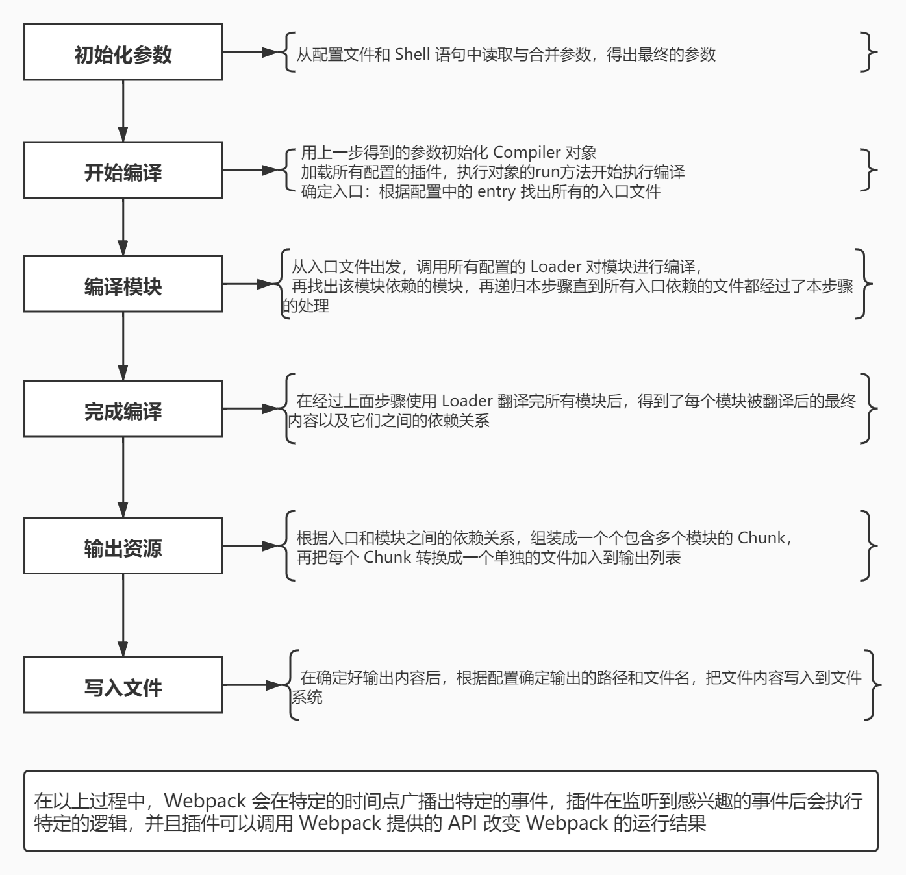
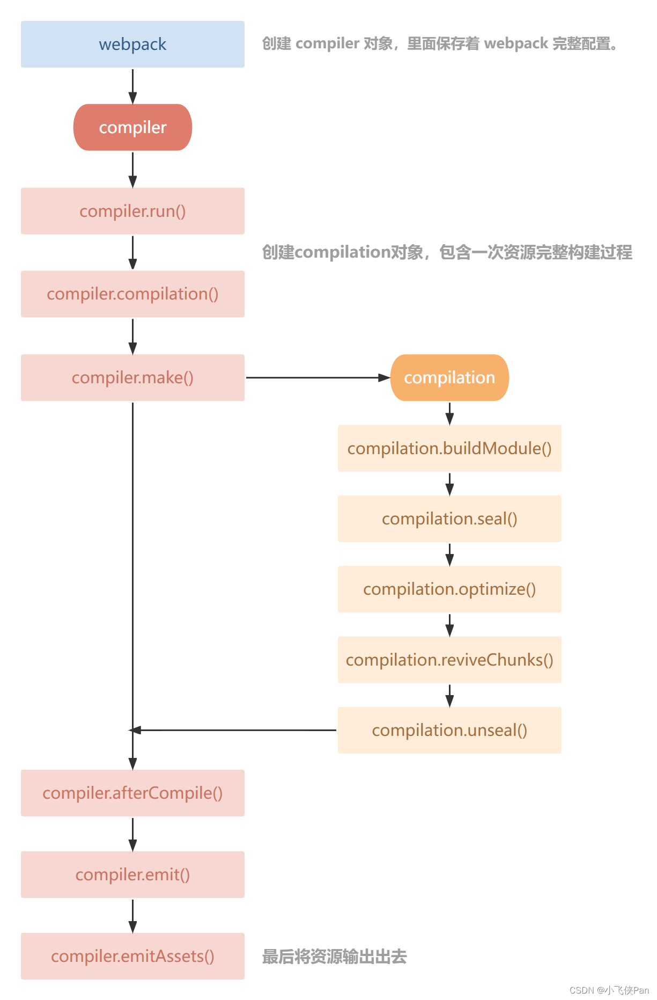

# webpack 编译流程

[TOC]

## 整体流程

1. 初始化参数：从配置文件和Shell语句中读取并合并参数,得出最终的配置对象
2. 用上一步得到的参数初始化Compiler对象
3. 加载所有配置的插件(依次调用插件中的apply方法)
4. 执行对象的run(Compiler.run)方法开始执行编译
5. 根据配置中的`entry`找出入口文件
6. 从入口文件出发,调用所有配置的`Loader`对模块进行编译
7. 再找出该模块依赖的模块，再递归本步骤直到所有入口依赖的文件都经过了本步骤的处理
8. 根据入口和模块之间的依赖关系，组装成一个个包含多个模块的 Chunk
9. 再把每个Chunk转换成一个单独的文件加入到输出列表
10. 在确定好输出内容后，根据配置确定输出的路径和文件名，把文件内容写入到文件系统(dist/build目录)

> 在以上过程中，Webpack 会在特定的时间点广播出特定的事件，插件在监听到感兴趣的事件后会执行特定的逻辑，并且插件可以调用 Webpack 提供的 API 改变 Webpack 的运行结果

## 一些细节

根据配置中的`entry`找出入口文件后，从入口文件出发，调用所有配置的 Loader 对模块进行翻译，再找出该模块依赖的模块，再递归本步骤直到所有入口依赖的文件都经过了本步骤的处理，再根据入口和模块之间的依赖关系，组装成一个个包含多个模块的 Chunk。

在上面的这一步骤中，具体流程如下：

1. 获取主模块内容

2. 分析模块

- 安装@babel/parser包（转AST）

3. 对模块内容进行处理

- 安装@babel/traverse包（遍历AST收集依赖）
- 安装@babel/core和@babel/preset-env包   （es6转ES5）

4. 递归所有模块

5. 生成最终代码

## 核心概念

- Entry：入口，webpack构建的起始

- Module：模块，webpack里面一切皆模块，也是代表着文件，从Entry配置的入口文件开始，递归找出依赖的模块

- Chunk：代码块，找出递归依赖模块经转换后组合成代码块

- Loader：模块转换器，也就是将模块的内容按照需求装换成新内容

- Plugin：扩展插件，webpack构建过程中，会在特定的时机广播对应的事件，而插件可以监听这些事件的发生

## Compiler 和 Compilation 的区别

`webpack` 打包离不开 `Compiler` 和 `Compilation`,它们两个分工明确，理解它们是我们理清 `webpack` 构建流程重要的一步。

### Compiler

`Compiler` 负责监听文件和启动编译 它可以读取到 `webpack` 的 config 信息，整个 `Webpack` 从启动到关闭的生命周期，一般只有一个 Compiler 实例，整个生命周期里暴露了很多方法，常见的 `run`,`make`,`compile`,`finish`,`seal`,`emit` 等，我们写的插件就是作用在这些暴露方法的 hook 上

compiler 对象中保存着完整的 Webpack 环境配置，每次启动 webpack 构建时它都是一个独一无二，仅仅会创建一次的对象。

这个对象会在首次启动 Webpack 时创建，我们可以通过 compiler 对象上访问到 Webapck 的主环境配置，比如 loader 、 plugin 等等配置信息。

它有以下主要属性：

- `compiler.options` 可以访问本次启动 webpack 时候所有的配置文件，包括但不限于 loaders 、 entry 、 output 、 plugin 等等完整配置信息。
- `compiler.inputFileSystem` 和 `compiler.outputFileSystem` 可以进行文件操作，相当于 Nodejs 中 fs。
- `compiler.hooks` 可以注册 tapable 的不同种类 Hook，从而可以在 compiler 生命周期中植入不同的逻辑。

### Compilation

`Compilation` 负责构建编译。 每一次编译（文件只要发生变化，）就会生成一个 `Compilation` 实例，`Compilation` 可以读取到当前的模块资源，编译生成资源，变化的文件，以及依赖跟踪等状态信息。同时也提供很多事件回调给插件进行拓展。

一个 compilation 对象会对构建依赖图中所有模块，进行编译。 在编译阶段，模块会被加载(load)、封存(seal)、优化(optimize)、 分块(chunk)、哈希(hash)和重新创建(restore)。

它有以下主要属性：

- `compilation.modules` 可以访问所有模块，打包的每一个文件都是一个模块。
- `compilation.chunks` chunk 即是多个 modules 组成而来的一个代码块。入口文件引入的资源组成一个 chunk，通过代码分割的模块又是另外的 chunk。
- `compilation.assets` 可以访问本次打包生成所有文件的结果。
- `compilation.hooks` 可以注册 tapable 的不同种类 Hook，用于在 compilation 编译模块阶段进行逻辑添加以及修改。

**Webpack 内部的钩子**

钩子的本质就是：事件。为了方便我们直接介入和控制编译过程，webpack 把编译过程中触发的各类关键事件封装成事件接口暴露了出来。这些接口被很形象地称做：`hooks`（钩子）。开发插件，离不开这些钩子

## 一些问题

1. webpack 与 babel 分别实现了什么？

- Webpack 读出 AST 之后仅遍历 AST 集合；babel 则对源码做等价转换

  

2. Webpack 编译过程中，如何识别资源对其他资源的依赖？

  - Webpack 遍历 AST 集合过程中，识别 `require/ import` 之类的导入语句，确定模块对其他资源的依赖关系

## 生命周期简图

