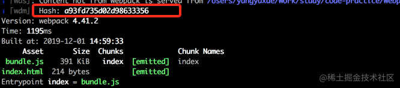
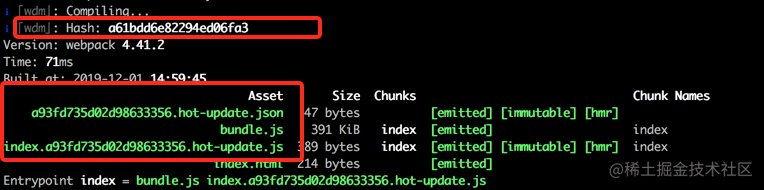
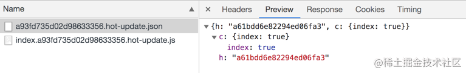
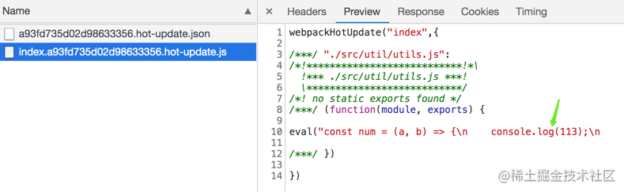
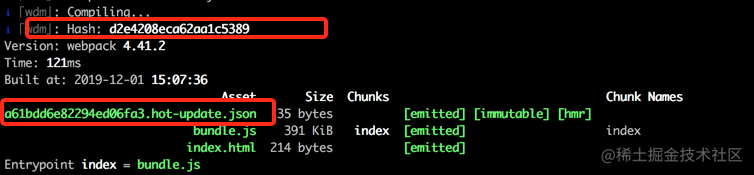
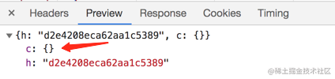
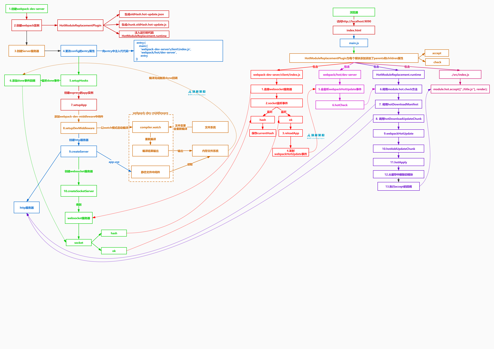

# webpack热更新原理

[TOC]


## 理解

刷新我们一般分为两种：

- 一种是页面刷新，不保留页面状态，就是简单粗暴，直接`window.location.reload()`。
- 另一种是基于`WDS (Webpack-dev-server)`的模块热替换，只需要局部刷新页面上发生变化的模块，同时可以保留当前的页面状态，比如复选框的选中状态、输入框的输入等。

`HMR`作为一个`Webpack`内置的功能，可以通过`HotModuleReplacementPlugin`或`--hot`开启。


### 如何使用热更新

```js
npm install webpack webpack-dev-server --save-dev
```

设置 `HotModuleReplacementPlugin`，`HotModuleReplacementPlugin` 是 `webpack`  是自带的

```js
plugins: {
    HotModuleReplacementPlugin: new webpack.HotModuleReplacementPlugin()
}
```

再设置一下 `devServer`

```js
const webpack = require('webpack')
module.exports = {
  // ...
  devServer: {
    contentBase: path.resolve(__dirname, 'dist'),
    hot: true, // 重点关注
    historyApiFallback: true,
    compress: true
	}
}
```

- `hot` 为 `true`，代表开启热更新


## hash值

项目启动后，进行构建打包，控制台会输出构建过程，我们可以观察到生成了一个 **Hash值**：`a93fd735d02d98633356`。



然后，在我们每次修改代码保存后，控制台都会出现 `Compiling…`字样，触发新的编译中...可以在控制台中观察到：

- **新的Hash值**：`a61bdd6e82294ed06fa3`
- **新的json文件**： `a93fd735d02d98633356.hot-update.json`
- **新的js文件**：`index.a93fd735d02d98633356.hot-update.js`



首先，我们知道`Hash`值代表每一次编译的标识。其次，根据新生成文件名可以发现，上次输出的`Hash`值会作为本次编译新生成的文件标识。依次类推，本次输出的`Hash`值会被作为下次热更新的标识。

然后看一下，新生成的文件是什么？每次修改代码，紧接着触发重新编译，然后浏览器就会发出 2 次请求。请求的便是本次新生成的 2 个文件。如下：



首先看`json`文件，返回的结果中，`h`代表本次新生成的`Hash`值，用于下次文件热更新请求的前缀。`c`表示当前要热更新的文件对应的是`index`模块。

再看下生成的`js`文件，那就是本次修改的代码，重新编译打包后的。



还有一种情况是，如果没有任何代码改动，直接保存文件，控制台也会输出编译打包信息的。

- **新的Hash值**：`d2e4208eca62aa1c5389`
- **新的json文件**：`a61bdd6e82294ed06fa3.hot-update.json`



但是我们发现，并没有生成新的`js`文件，因为没有改动任何代码，同时浏览器发出的请求，可以看到`c`值为空，代表本次没有需要更新的代码。




## 实现原理


- 上图底部红色框内是服务端，而上面的橙色框是浏览器端。
- 绿色的方框是 webpack 代码控制的区域。蓝色方框是 webpack-dev-server 代码控制的区域，洋红色的方框是文件系统，文件修改后的变化就发生在这，而青色的方框是应用本身。


### 初始化本地环境

**第一步**：

> webpack的构建可以选择watch模式，他自身已经具备了监听文件变化，持续构建的能力。但还未有将自动刷新客户端的能力，并且对新构建的文件未有进行热替换的能力。

在 webpack 的 watch 模式下，文件系统中某一个文件发生修改，webpack 监听到文件变化，根据配置文件对模块重新编译打包，并将打包后的代码通过简单的 JavaScript 对象保存在内存中。


**第二步**

第二步是 webpack-dev-server 和 webpack 之间的接口交互，而在这一步，主要是 dev-server 的中间件 webpack-dev-middleware 和 webpack 之间的交互，webpack-dev-middleware 调用 webpack 暴露的 API对代码变化进行监控，并且告诉 webpack，将代码打包到内存中。

`webpack-dev-middleware`插件,利用sockjs和webpack-dev-server/client建立webSocket长连接，他最主要是能够将webpack编译产物提交给server服务器，并且他将产物放置在内存中【这也是为啥我们在开发过程中在文件夹中找不到我们的打包代码】

`webpack-dev-server`：是【node-express[启动服务] + webpack-dev-middleware】的集成封装。

webpack提供的持续监控文件变化的能力是基于node的fs.watch()实现的。他的原理是通过轮询文件的修改时间比对去判断该文件是否发生变化。这里的express服务器会负责其他事情，比如收到webpack-dev-middleware完成文件打包的通知，而socket仅仅负责通信，为了解耦。

在`webpack-dev-server`中，首先使用express框架启动本地server，让浏览器可以请求本地的静态资源。本地server启动后，再去启动`websocket`服务，通过`websocket`，可以建立本地服务和浏览器的双向通信。

既然要建立双端通信，那么就需要在客户端建立socket服务：

webpack-dev-server会为打包产物注入HMR代码，使得客户端具备热更新能力。

webpack-dev-server插件是如何在我们的产物中注入代码的？

首先会获取`websocket`客户端代码路径，另一个是根据配置获取`webpack`热更新代码路径。

```
webpack-dev-server/client 【socket管理】
webpack/hot/dev-server 【热更新能力】
```

然后修改webpack的entry文件：

```
// 修改后的entry入口
{ entry:
    { index: 
        [
            // 上面获取的clientEntry
            'xxx/node_modules/webpack-dev-server/client/index.js?http://localhost:8080',
            // 上面获取的hotEntry
            'xxx/node_modules/webpack/hot/dev-server.js',
            // 开发配置的入口
            './src/index.js'
    	],
    },
}      
```

为什么要新增了 2 个文件？在入口默默增加了 2 个文件，那就意味会一同打包到`bundle`文件中去，也就是线上运行时(其实这里走的就是上面的第一步，并且在第一步之前在entry注入文件然后打包)。

在上面我们说过会建立socket服务，在socket中我们会编写方法：当webpack编译结束后，服务器端需要向浏览器发送`hash`值。

**webpack监听文件变化**

当文件发生变化时，构建过程以compiler.watch()的方式运行，这种模式下打包完不会结束掉打包进程，而是持续运行，监听文件变化后进行增量构建【前面有提到这是webpack的能力之一】。一般`npm run build`的方式就是执行compiler.run()打包一次就结束了。

每次修改代码，就会触发编译。说明我们还需要监听本地代码的变化，主要是通过`webpack-dev-middleware`实现的。它主要是本地文件的**编译**和**输出**以及**监听**。

`webpack-dev-middleware`做了什么事:

```scss
// node_modules/webpack-dev-middleware/index.js
compiler.watch(options.watchOptions, (err) => {
    if (err) { /*错误处理*/ }
});

// 通过“memory-fs”库将打包后的文件写入内存
setFs(context, compiler); 
```

compiler.watch()构建后的产物通过webpack-dev-middleware插件提交到server服务器。

- 首先对本地文件代码进行编译打包，也就是`webpack`的一系列编译流程。
- 其次编译结束后，开启对本地文件的监听，当文件发生变化，重新编译，编译完成之后继续监听。

补充：

上面说到，entry注入后的文件构建后的产物会通过webpack-dev-middleware插件提交到server服务器，然后server服务器通知socket去通知浏览器，那么，如何知道构建结束并调用socket通知浏览器的？

webpack-dev-server插件监听hooks.done【这里需要你对webpack的tapable机制有一定了解，类似于发布订阅模式，当编译完成就会触发钩子hooks.done,插件可以监听钩子做自己的逻辑】，触发则调用socket发送消息给客户端，此时会把本次构建生成的hash一起传给客户端。

```js
const express = require("express");
const updateCompiler = require('./utils/updateCompiler');
const http = require("http");
class Server {
    constructor(compiler,devServerOptions) {
        this.compiler = compiler;
        this.devServerOptions=devServerOptions;
        updateCompiler(compiler);
+       this.sockets = [];
+       this.setupHooks();
        this.setupApp();
        this.createServer();
    }
+    setupHooks() {
+        this.compiler.hooks.done.tap('webpack-dev-server', (stats) => {
+            console.log("stats.hash", stats.hash);
+            this.sockets.forEach((socket) => {
+                socket.emit("hash", stats.hash);
+                socket.emit("ok");
+            });
+            this._stats = stats;
+        });
+    }
    setupApp() {
        this.app = new express();
    }
    createServer() {
        this.server = http.createServer(this.app);
    }
    listen(port, host = "localhost", callback = ()=>{}) {
         this.server.listen(port, host, callback);
    }
}
module.exports = Server;
```


**至此我们的项目处于一种运行的状态，能够对代码改动触发增量构建并更新到服务器。**


### 客户端更新

当文件更新后，会进行编译，entry注入，然后打包(webpack-dev-middleware实现)，接着告诉webpack-dev-server，该插件里面的socket服务会通知浏览器，通知内容是一个新的`hash`值。

那浏览器是如何接收到`websocket`的消息呢？

我们已经在客户端注入了socket代码`webpack-dev-server/client/index.js`。

```js
// webpack-dev-server/client/index.js
var socket = require('./socket');
var onSocketMessage = {
    hash: function hash(_hash) {
        // 更新currentHash值
        status.currentHash = _hash;
    },
    ok: function ok() {
        sendMessage('Ok');
        // 进行更新检查等操作
        reloadApp(options, status);
    },
};
// 连接服务地址socketUrl，?http://localhost:8080，本地服务地址
socket(socketUrl, onSocketMessage);

function reloadApp() {
	if (hot) {
        log.info('[WDS] App hot update...');
        
        // hotEmitter其实就是EventEmitter的实例
        var hotEmitter = require('webpack/hot/emitter');
        hotEmitter.emit('webpackHotUpdate', currentHash);
    } 
}
```

`socket`方法建立了`websocket`和服务端的连接，并注册了 2 个监听事件。

- `hash`事件，更新最新一次打包后的`hash`值。
- `ok`事件，进行热更新检查。

热更新检查事件是调用`reloadApp`方法。比较奇怪的是，这个方法又利用`node.js`的`EventEmitter`，发出`webpackHotUpdate`消息。这是为什么？为什么不直接进行检查更新呢？

其实就是为了更好的维护代码，以及职责划分的更明确。`websocket`仅仅用于客户端（浏览器）和服务端进行通信。而真正做事情的活还是交回给了`webpack`。

接着我们就需要对比新旧hash值来进行更新。

从上面的`webpack-dev-server/client/index.js`文件中，我们可以看出：调用`reloadApp`方法实现热更新检查，在`reloadApp`中发出一个通知事件`hotEmitter.emit(""webpackHotUpdate)`,这时候`webpack/hot/dev-server.js`【这个文件是上面提到被注入到客户端的代码，用来热更新】监听到该事件。这个文件主要是执行了`module.hot.check()`函数，那个这个函数又是哪里来的？

这个函数是`HotModuleReplacementPlugin插件`自带的。


**moudle.hot.check 开始热更新**

`module.hot.check`函数:

- 利用上一次保存的`hash`值，调用`hotDownloadManifest`发送`xxx/hash.hot-update.json`的`ajax`请求: 服务端返回一个 json，该 json 包含了所有要更新的模块的 hash 值，获取到更新列表后，该模块再次通过 jsonp 请求，获取到最新的模块代码。这就是上图中 7、8、9 步骤。
- 请求结果获取热更新模块，以及下次热更新的`Hash` 标识，并进入热更新准备阶段。

```
// XXX.hot-update.json
  {
    "c":["index"], // 更新chunk
    "r":[],
    "m":[]
    // 有些是有"h":hash,版本不同略微不一样
  }
```

为什么使用`JSONP`获取最新代码？主要是因为`JSONP`获取的代码可以直接执行。为什么要直接执行？我们来回忆下`/hash.hot-update.js`的代码格式是怎么样的。


可以发现，新编译后的代码是在一个`webpackHotUpdate`函数体内部的。也就是要立即执行`webpackHotUpdate`这个方法。

再看下`webpackHotUpdate`这个方法。

```scss
window["webpackHotUpdate"] = function (chunkId, moreModules) {
    hotAddUpdateChunk(chunkId, moreModules);
} ;
```

- `hotAddUpdateChunk`方法会把更新的模块`moreModules`赋值给全局全量`hotUpdate`。
- `hotUpdateDownloaded`方法会调用`hotApply`进行代码的替换。

```scss
function hotAddUpdateChunk(chunkId, moreModules) {
    // 更新的模块moreModules赋值给全局全量hotUpdate
    for (var moduleId in moreModules) {
        if (Object.prototype.hasOwnProperty.call(moreModules, moduleId)) {
	    hotUpdate[moduleId] = moreModules[moduleId];
        }
    }
    // 调用hotApply进行模块的替换
    hotUpdateDownloaded();
}
```

**hotApply 热更新模块替换**

热更新的核心逻辑就在`hotApply`方法了。

对新旧模块进行对比，决定是否更新模块，在决定更新模块后，检查模块之间的依赖关系，更新模块的同时更新模块间的依赖引用。

①删除过期的模块，就是需要替换的模块

通过`hotUpdate`可以找到旧模块

```js
var queue = outdatedModules.slice();
while (queue.length > 0) {
    moduleId = queue.pop();
    // 从缓存中删除过期的模块
    module = installedModules[moduleId];
    // 删除过期的依赖
    delete outdatedDependencies[moduleId];
    
    // 存储了被删掉的模块id，便于更新代码
    outdatedSelfAcceptedModules.push({
        module: moduleId
    });
}
```

②将新的模块添加到 modules 中

```js
appliedUpdate[moduleId] = hotUpdate[moduleId];
for (moduleId in appliedUpdate) {
    if (Object.prototype.hasOwnProperty.call(appliedUpdate, moduleId)) {
        modules[moduleId] = appliedUpdate[moduleId];
    }
}
```

③通过__webpack_require__执行相关模块的代码

```js
for (i = 0; i < outdatedSelfAcceptedModules.length; i++) {
    var item = outdatedSelfAcceptedModules[i];
    moduleId = item.module;
    try {
        // 执行最新的代码
        __webpack_require__(moduleId);
    } catch (err) {
        // ...容错处理
    }
}
```


## 思维导图




## 思考

webpack 可以将不同的模块打包成 bundle 文件或者几个 chunk 文件，但是当我通过 webpack HMR 进行开发的过程中，我并没有在我的 dist 目录中找到 webpack 打包好的文件，它们去哪呢？

- 原来 webpack 将 bundle.js 文件打包到了内存中，不生成文件的原因就在于访问内存中的代码比访问文件系统中的文件更快，而且也减少了代码写入文件的开销，这一切都归功于memory-fs，memory-fs 是 webpack-dev-middleware 的一个依赖库，webpack-dev-middleware 将 webpack 原本的 outputFileSystem 替换成了MemoryFileSystem 实例，这样代码就将输出到内存中。


使用 HMR 的过程中，通过 Chrome 开发者工具我知道浏览器是通过 websocket 和 webpack-dev-server 进行通信的，但是 websocket 的 message 中并没有发现新模块代码。打包后的新模块又是通过什么方式发送到浏览器端的呢？为什么新的模块不通过 websocket 随消息一起发送到浏览器端呢？

- 功能块的解耦，各个模块各司其职，dev-server/client 只负责消息的传递而不负责新模块的获取，而这些工作应该有 HMR runtime 来完成，HMR runtime 才应该是获取新代码的地方。再就是因为不使用 webpack-dev-server 的前提，使用 webpack-hot-middleware 和 webpack 配合也可以完成模块热更新流程，在使用 webpack-hot-middleware 中有件有意思的事，它没有使用 websocket，而是使用的 EventSource。综上所述，HMR 的工作流中，不应该把新模块代码放在 websocket 消息中。


浏览器拿到最新的模块代码，HMR 又是怎么将老的模块替换成新的模块，在替换的过程中怎样处理模块之间的依赖关系？当模块的热替换过程中，如果替换模块失败，有什么回退机制吗？

- 模块热更新的错误处理，如果在热更新过程中出现错误，热更新将回退到刷新浏览器


参考文章：
[轻松理解webpack热更新原理](https://juejin.cn/post/6844904008432222215#heading-0)

[webpack热更新原理(面试大概率会问)](https://juejin.cn/post/7152845665477869582#heading-0)