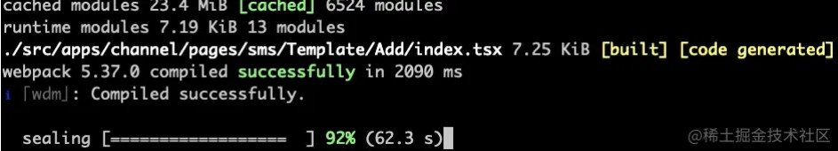
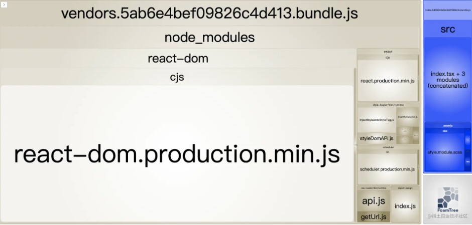
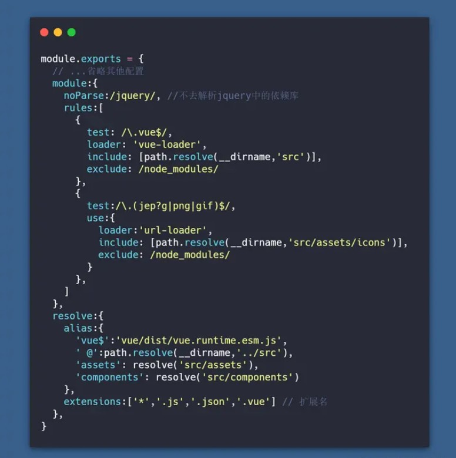

# 【webpack】常见优化手段

[TOC]

本文并非原创，而是笔者最近在研究webpack方面的知识，看了一些比较好的文章，对此进行总结。


## 优化效率分析工具

### 编译进度条

一般来说，中型项目的首次编译时间为 5-20s，没个进度条等得多着急，通过 [progress-bar-webpack-plugin](https://link.juejin.cn?target=https%3A%2F%2Fwww.npmjs.com%2Fpackage%2Fprogress-bar-webpack-plugin) 插件查看编译进度，方便我们掌握编译情况。

安装：

```javascript
npm i -D progress-bar-webpack-plugin
```

`webpack.common.js` 配置方式如下：

```javascript
const chalk = require('chalk')
const ProgressBarPlugin = require('progress-bar-webpack-plugin')
module.exports = {
  plugins: [
    // 进度条
    new ProgressBarPlugin({
        format: `  :msg [:bar] ${chalk.green.bold(':percent')} (:elapsed s)`
      })
  ],
}
```

> 贴心的为进度百分比添加了加粗和绿色高亮态样式。

包含内容、进度条、进度百分比、消耗时间，进度条效果如下：




### 编译速度分析

优化 webpack 构建速度，首先需要知道是哪些插件、哪些 loader 耗时长，方便我们针对性的优化。

通过 [speed-measure-webpack-plugin](https://link.juejin.cn?target=https%3A%2F%2Fwww.npmjs.com%2Fpackage%2Fspeed-measure-webpack-plugin) 插件进行构建速度分析，可以看到各个 loader、plugin 的构建时长，后续可针对耗时 loader、plugin 进行优化。

安装：

```javascript
npm i -D speed-measure-webpack-plugin
```

`webpack.dev.js` 配置方式如下：

```javascript
const SpeedMeasurePlugin = require("speed-measure-webpack-plugin");
const smp = new SpeedMeasurePlugin();
module.exports = smp.wrap({
  // ...webpack config...
})
```


### 打包体积分析

引入 **webpack-bundle-analyzer** 分析打包后的文件

`webpack-bundle-analyzer`查看打包后生成的 bundle 体积分析，将 bundle 内容展示为一个便捷的、交互式、可缩放的树状图形式。帮助我们分析输出结果来检查模块在何处结束。

```css
npm i -D webpack-bundle-analyzer
```

```js
const BundleAnalyzerPlugin = require('webpack-bundle-analyzer').BundleAnalyzerPlugin;
module.exports = {
  plugins: [
    // 打包体积分析
    new BundleAnalyzerPlugin()
  ],
}
```




## 优化打包速度

### 构建区分环境

`webpack.dev.js`   开发环境配置文件

> 开发环境主要实现的是热更新,不要压缩代码，完整的sourceMap

`webpack.prod.js`  生产环境配置文件

> 生产环境主要实现的是压缩代码、提取css文件、合理的sourceMap、分割代码
> 需要安装以下模块:
> npm i -D  webpack-merge copy-webpack-plugin optimize-css-assets-webpack-plugin uglifyjs-webpack-plugin

- `webpack-merge` 合并配置
- `copy-webpack-plugin` 拷贝静态资源
- `optimize-css-assets-webpack-plugin` 压缩css
- `uglifyjs-webpack-plugin` 压缩js

> `webpack mode`设置`production`的时候会自动压缩js代码。原则上不需要引入`uglifyjs-webpack-plugin`进行重复工作。但是`optimize-css-assets-webpack-plugin`压缩css的同时会破坏原有的js压缩，所以这里我们引入`uglifyjs`进行压缩


### 缩小文件的搜索范围

配置include，exclude，alias，noParse，extensions

- `alias`: 当我们代码中出现 `import 'vue'`时， webpack会采用向上递归搜索的方式去`node_modules` 目录下找。为了减少搜索范围我们可以直接告诉webpack去哪个路径下查找。也就是别名(`alias`)的配置。

- `include exclude` 同样配置`include exclude`也可以减少`webpack loader`的搜索转换时间。

- `noParse ` 当我们代码中使用到`import jq from 'jquery'`时，webpack会去解析jq这个库是否有依赖其他的包。但是我们对类似`jquery`这类依赖库，一般会认为不会引用其他的包(特殊除外,自行判断)。增加`noParse`属性,告诉webpack不必解析，以此增加打包速度。

- `extensions`  webpack会根据`extensions`定义的后缀查找文件(频率较高的文件类型优先写在前面)




### 优化代码的压缩时间

使用 **webpack-parallel-uglify-plugin** 增强代码压缩

```
npm i -D webpack-parallel-uglify-plugin
```

在使用 Webpack 构建出用于发布到线上的代码时，都会有压缩代码这一流程。 最常见的 JavaScript 代码压缩工具是 [UglifyJS](https://github.com/mishoo/UglifyJS2)，并且 Webpack 也内置了它。

用过 UglifyJS 的你一定会发现在构建用于开发环境的代码时很快就能完成，但在构建用于线上的代码时构建一直卡在一个时间点迟迟没有反应，其实卡住的这个时候就是在进行代码压缩。

由于压缩 JavaScript 代码需要先把代码解析成用 Object 抽象表示的 AST 语法树，再去应用各种规则分析和处理 AST，导致这个过程计算量巨大，耗时非常多。

为什么不把**多进程并行处理**的思想也引入到代码压缩中呢？

[ParallelUglifyPlugin](https://github.com/gdborton/webpack-parallel-uglify-plugin) 就做了这个事情。 当 Webpack 有多个 JavaScript 文件需要输出和压缩时，原本会使用 UglifyJS 去一个个挨着压缩再输出， 但是 ParallelUglifyPlugin 则会开启多个子进程，把对多个文件的压缩工作分配给多个子进程去完成，每个子进程其实还是通过 UglifyJS 去压缩代码，但是变成了并行执行。 所以 ParallelUglifyPlugin 能更快的完成对多个文件的压缩工作。

使用 ParallelUglifyPlugin 也非常简单，把原来 Webpack 配置文件中内置的 UglifyJsPlugin 去掉后，再替换成 ParallelUglifyPlugin，相关代码如下：

```js
const path = require('path');
const DefinePlugin = require('webpack/lib/DefinePlugin');
const ParallelUglifyPlugin = require('webpack-parallel-uglify-plugin');

module.exports = {
  plugins: [
    // 使用 ParallelUglifyPlugin 并行压缩输出的 JS 代码
    new ParallelUglifyPlugin({
      // 传递给 UglifyJS 的参数
      uglifyJS: {
        output: {
          // 最紧凑的输出
          beautify: false,
          // 删除所有的注释
          comments: false,
        },
        compress: {
          // 在UglifyJs删除没有用到的代码时不输出警告
          warnings: false,
          // 删除所有的 `console` 语句，可以兼容ie浏览器
          drop_console: true,
          // 内嵌定义了但是只用到一次的变量
          collapse_vars: true,
          // 提取出出现多次但是没有定义成变量去引用的静态值
          reduce_vars: true,
        }
      },
    }),
  ],
};
```

在通过 `new ParallelUglifyPlugin()` 实例化时，支持以下参数：

- `test`：使用正则去匹配哪些文件需要被 ParallelUglifyPlugin 压缩，默认是 `/.js$/`，也就是默认压缩所有的 .js 文件。
- `include`：使用正则去命中需要被 ParallelUglifyPlugin 压缩的文件。默认为 `[]`。
- `exclude`：使用正则去命中不需要被 ParallelUglifyPlugin 压缩的文件。默认为 `[]`。
- `cacheDir`：缓存压缩后的结果，下次遇到一样的输入时直接从缓存中获取压缩后的结果并返回。cacheDir 用于配置缓存存放的目录路径。默认不会缓存，想开启缓存请设置一个目录路径。
- `workerCount`：开启几个子进程去并发的执行压缩。默认是当前运行电脑的 CPU 核数减去1。
- `sourceMap`：是否输出 Source Map，这会导致压缩过程变慢。
- `uglifyJS`：用于压缩 ES5 代码时的配置，Object 类型，直接透传给 UglifyJS 的参数。
- `uglifyES`：用于压缩 ES6 代码时的配置，Object 类型，直接透传给 UglifyES 的参数。

其中的 `test`、`include`、`exclude` 与配置 Loader 时的思想和用法一样。


### 抽离第三方模块

> 对于开发项目中不经常会变更的静态依赖文件。类似于我们的`elementUi、vue`全家桶等等。因为很少会变更，所以我们不希望这些依赖要被集成到每一次的构建逻辑中去。 这样做的好处是每次更改我本地代码的文件的时候，`webpack`只需要打包我项目本身的文件代码，而不会再去编译第三方库。以后只要我们不升级第三方包的时候，那么`webpack`就不会对这些库去打包，这样可以快速的提高打包的速度。

`Dllplugin`插件可以帮助我们把这些不做修改的包抽取为动态链接库，并且会生成一个名为manifest.json的文件，这个文件是用来让`DLLReferencePlugin`映射到相关的依赖上去的。

webpack5 开箱即用的持久缓存是比 dll 更优的解决方案，所以，不用再配置 dll了。


### cache

通过配置 [webpack 持久化缓存](https://link.juejin.cn?target=https%3A%2F%2Fwebpack.docschina.org%2Fconfiguration%2Fcache%2F%23root) `cache: filesystem`，来缓存生成的 webpack 模块和 chunk，改善构建速度。

简单来说，通过 `cache: filesystem` 可以将构建过程的 webpack 模板进行缓存，大幅提升二次构建速度、打包速度，当构建突然中断，二次进行构建时，可以直接从缓存中拉取，可提速 **90%** 左右。

`webpack.common.js` 配置方式如下：

```javascript
module.exports = {
    cache: {
      type: 'filesystem', // 使用文件缓存
    },
}
```


### cache-loader

缓存资源，提高二次构建的速度，使用方法是将`cache-loader`放在比较费时间的loader之前，比如`babel-loader`

> 由于启动项目和打包项目都需要加速，所以配置在`webpack.base.js`

```
npm i cache-loader -D
```

使用：

```js
// webpack.base.js

{
        test: /\.js$/,
        use: [
          'cache-loader',
          'thread-loader',
          'babel-loader'
        ],
},
```


[cache-loader](https://link.juejin.cn/?target=https%3A%2F%2Fwebpack.docschina.org%2Floaders%2Fcache-loader%2F) 也不需要引入了，上面的 cache 已经帮助我们缓存了。


### thread-loader

由于有大量文件需要解析和处理，构建是文件读写和计算密集型的操作，特别是当文件数量变多后，`Webpack` 构建慢的问题会显得严重。文件读写和计算操作是无法避免的，那能不能让 `Webpack` 同一时刻处理多个任务，发挥多核 CPU 电脑的威力，以提升构建速度呢？

> 把任务分解给多个子进程去并发的执行，子进程处理完后再把结果发送给主进程。

把 `thread-loader` 放置在其它 `loader` 之前，那么放置在这个 `loader` 之后的 `loader` 就会在一个单独的 `worker` 池中运行。

在 worker 池(worker pool)中运行的 loader 是受到限制的。例如：

- 这些 `loader` 不能产生新的文件。
- 这些 `loader` 不能使用定制的 `loader` API（也就是说，通过插件）。
- 这些 `loader` 无法获取 `webpack` 的选项设置。

首先安装依赖：

```arduino
npm install thread-loader -D
```

修改配置:

```java
module.exports = {
    module: {
        //我的项目中,babel-loader耗时比较长，所以我给它配置 thread-loader
        rules: [
            {
                test: /\.jsx?$/,
                use: ['thread-loader', 'cache-loader', 'babel-loader']
            }
        ]
    }
}
```


## 优化打包文件体积

### CSS代码压缩

CSS代码压缩使用`css-minimizer-webpack-plugin`，效果包括压缩、去重

> 代码的压缩比较耗时间，所以只用在打包项目时，所以只需要在`webpack.prod.js`中配置

```
npm i css-minimizer-webpack-plugin -D
```

完整代码：

```js
// webpack.prod.js

const CssMinimizerPlugin = require('css-minimizer-webpack-plugin')

  optimization: {
    minimizer: [
      new CssMinimizerPlugin(), // 去重压缩css
    ],
  }
```


### JS代码压缩

JS代码压缩使用`terser-webpack-plugin`，实现打包后JS代码的压缩

> 代码的压缩比较耗时间，所以只用在打包项目时，所以只需要在`webpack.prod.js`中配置

```
npm i terser-webpack-plugin -D
```

完整代码：

```js
// webpack.prod.js

const TerserPlugin = require('terser-webpack-plugin')

  optimization: {
    minimizer: [
      new CssMinimizerPlugin(), // 去重压缩css
      new TerserPlugin({ // 压缩JS代码
        terserOptions: {
          compress: {
            drop_console: true, // 去除console
          },
        },
      }), // 压缩JavaScript
    ],
  }
```


### tree-shaking

`tree-shaking`简单说作用就是：只打包用到的代码，没用到的代码不打包，而`webpack5`默认开启`tree-shaking`，当打包的`mode`为`production`时，自动开启`tree-shaking`进行优化

```js
module.exports = {
  mode: 'production'
}
```


### sideEffects

通过 package.json 的 `"sideEffects"` 属性，来实现这种方式。

```javascript
{
  "name": "your-project",
  "sideEffects": false
}
```

需注意的是，当代码有副作用时，需要将 `sideEffects` 改为提供一个数组，添加有副作用代码的文件路径：

```javascript
{
  "name": "your-project",
  "sideEffects": ["./src/some-side-effectful-file.js"]
}
```

添加 TreeShaking 后，未引用的代码，将不会被打包


### source-map类型

`source-map`的作用是：方便你报错的时候能定位到错误代码的位置。它的体积不容小觑，所以对于不同环境设置不同的类型是很有必要的。

- **开发环境**

开发环境的时候我们需要能精准定位错误代码的位置

```js
// webpack.dev.js

module.exports = {
  mode: 'development',
  devtool: 'eval-cheap-module-source-map'
}
```

- **生产环境**

生产环境，我们想开启`source-map`，但是又不想体积太大，那么可以换一种类型

```js
// webpack.prod.js

module.exports = {
  mode: 'production',
  devtool: 'nosources-source-map'
}
```


### 抽离重复代码

[SplitChunksPlugin](https://link.juejin.cn?target=https%3A%2F%2Fwebpack.docschina.org%2Fplugins%2Fsplit-chunks-plugin) 插件开箱即用，可以将公共的依赖模块提取到已有的入口 chunk 中，或者提取到一个新生成的 chunk。

将公共的模块单独打包，不再重复引入。

webpack 将根据以下条件自动拆分 chunks：

- 新的 chunk 可以被共享，或者模块来自于 `node_modules` 文件夹；
- 新的 chunk 体积大于 20kb（在进行 min+gz 之前的体积）；
- 当按需加载 chunks 时，并行请求的最大数量小于或等于 30；
- 当加载初始化页面时，并发请求的最大数量小于或等于 30； 通过 splitChunks 把 react 等公共库抽离出来，不重复引入占用体积。

`webpack.prod.js` 配置方式如下：

```javascript
module.exports = {
    splitChunks: {
      // include all types of chunks
      chunks: 'all',
      // 重复打包问题
      cacheGroups:{
        vendors:{ // node_modules里的代码
          test: /[\\/]node_modules[\\/]/,
          chunks: "all",
          // name: 'vendors', 一定不要定义固定的name
          priority: 10, // 优先级
          enforce: true 
        }
      }
    },
}
```


### Scope Hoisting

Scope Hoisting 即作用域提升，原理是将多个模块放在同一个作用域下，并重命名防止命名冲突，**通过这种方式可以减少函数声明和内存开销**。

- webpack 默认支持，在生产环境下默认开启
- 只支持 es6 代码


## 优化运行时用户体验(提升首屏渲染速度)

运行时优化的核心就是提升首屏的加载速度，主要的方式就是

- 降低首屏加载文件体积，首屏不需要的文件进行预加载或者按需加载


### splitChunks 分包配置

optimization.splitChunks 是基于 [SplitChunksPlugin](https://link.juejin.cn/?target=https%3A%2F%2Fwebpack.docschina.org%2Fplugins%2Fsplit-chunks-plugin%2F) 插件实现的

默认情况下，它只会影响到按需加载的 chunks，因为修改 initial chunks 会影响到项目的 HTML 文件中的脚本标签。

一个demo：

```js
const config = {
  //...
  optimization: {
    splitChunks: {
      cacheGroups: { // 配置提取模块的方案
        default: false,
        styles: {
            name: 'styles',
            test: /\.(s?css|less|sass)$/,
            chunks: 'all',
            enforce: true,
            priority: 10,
          },
          common: {
            name: 'chunk-common',
            chunks: 'all',
            minChunks: 2,
            maxInitialRequests: 5,
            minSize: 0,
            priority: 1,
            enforce: true,
            reuseExistingChunk: true,
          },
          vendors: {
            name: 'chunk-vendors',
            test: /[\\/]node_modules[\\/]/,
            chunks: 'all',
            priority: 2,
            enforce: true,
            reuseExistingChunk: true,
          },
         // ... 根据不同项目再细化拆分内容
      },
    },
  },
}
```


### prefetch 与 preload

**prefetch** (预获取)：浏览器空闲的时候进行资源的拉取

```js
// 按需加载
img.addEventListener('click', () => {
  import( /* webpackPrefetch: true */ './desc').then(({ default: element }) => {
    console.log(element)
    document.body.appendChild(element)
  })
})
```

**preload** (预加载)：提前加载后面会用到的关键资源

- 因为会提前拉取资源，如果不是特殊需要，谨慎使用

```
import(/* webpackPreload: true */ 'ChartingLibrary');
```


### 小图片转base64

对于一些小图片，可以转base64，这样可以减少用户的http网络请求次数，提高用户的体验。`webpack5`中`url-loader`已被废弃，改用`asset-module`

> 在`webpack.base.js`中配置

```js
// webpack.base.js

{
   test: /\.(png|jpe?g|gif|svg|webp)$/,
   type: 'asset',
   parser: {
     // 转base64的条件
     dataUrlCondition: {
        maxSize: 25 * 1024, // 25kb
     }
   },
   generator: {
     // 打包到 image 文件下
    filename: 'images/[contenthash][ext][query]',
   },
},
```


### 合理配置hash

我们要保证，改过的文件需要更新hash值，而没改过的文件依然保持原本的hash值，这样才能保证在上线后，浏览器访问时没有改变的文件会命中缓存，从而达到性能优化的目的

> 在`webpack.base.js`中配置

```js
// webpack.base.js

  output: {
    path: path.resolve(__dirname, '../dist'),
    // 给js文件加上 contenthash
    filename: 'js/chunk-[contenthash].js',
    clean: true,
  },
```


参考文章：

[学习 Webpack5 之路（优化篇）- 近 7k 字](https://juejin.cn/post/6996816316875161637#heading-52)

[2020年了,再不会webpack敲得代码就不香了(近万字实战)](https://juejin.cn/post/6844904031240863758#heading-22)

[🔥【万字】透过分析 webpack 面试题，构建 webpack5.x 知识体系](https://juejin.cn/post/7023242274876162084#heading-49)

[每个前端都必须要学会的Webpack优化手段](https://juejin.cn/post/7083519723484708878#heading-9)