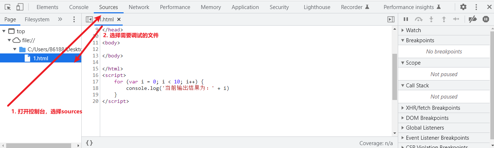
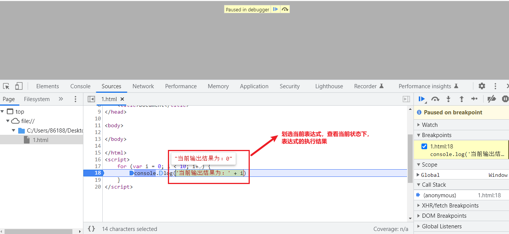

# 断点调试

[TOC]

某些情况下，我们必须知道当前代码的执行顺序，以及每一步变量的执行状态来确定代码是否正确按照我们意愿执行。

此时使用断点调试是非常明智的选择。

## 起步

使用断点调试的第一步，我们需要打开控制台，选择sources，并点击需要调试的文件。

此时在右侧面板可以看到调试操作区域：

## 1.标记断点

在中间代码区域，点击代码行号，出现蓝色（红色）标记点则说明当前代码行被标记断点，此后每一次代码执行到当前行的时候都会暂停

此时刷新，开始调试

## 2.查看变量状态

将鼠标放置到变量身，可以查看当前变量在当前状态下的值

另外，我们也可以通过划选来查看某一句表达式或语句的执行结果：

## 3.单步跳过—F10

我们也可以点击右侧菜单中的"单步跳过" `step over next`按钮来让代码进入下一个函数调用。

关于`step over next`:

- 它在意的是执行调用结果，并不会进入函数内部
- 当遇到自定义函数的时候，会在后台静默调用，直接得出结果。

如上图，当你点击`step over next`的时候，会直接跳过`showInfo`进而得出结果，而不是进入`showInfo`函数的内部继续单步执行

## 4.单步进入—F11

如果在执行的时候遇到自定义函数，并且你希望让断点单步执行进入自定义 函数内部继续依次执行的话，可以点击"单步进入"`step into next`按钮

往往单步进入F11与单步跳过F10配合能让我们非常高效的调试代码，毕竟不是每一个函数你都需要进入内部去查看结果，所以**该跳过就跳过，该进入就进入**

## 5.跳出—Shift+F11

如果你在调试的时候不小心进入了一个本来不关心的函数，此时可以点击"跳出"`step outcurrent`来跳出当前进入的函数。

## 6.单步执行—F9

"单步执行"`step`不会区分任何自定义函数，所有脚本代码都会依次执行。

一般情况下，我们使用"单步执行"`step`很少,因为不是每一个自定义函数我们都需要进入到内部来观察其执行状态，所以实际开发调试中，我们使用"单步跳过"`step over next`+"单步进入"`step into next`更多

## 7.恢复脚本执行—F8

如果我们想要放弃当前脚本的调试，可以点击"恢复脚本执行"`resume script excution`，这会让当前脚本直接执行到最后，如果要重新调试的话，保持断点存在的前提下刷新页面即可

比如：我们正在执行一个循环，并且希望查看这个循环的第八次，那么我们就可以连续点击这个按钮，直接跳过前七次循环，到达第八次循环，然后进行循环开始一步一步执行。

## 8.断点调试指令

如果代码非常复杂，行数很多的情况下，我们在sources中打断点无疑会变得非常困难。此时我们可以使用`debugger`指令来让chrome帮助我们打断点。

请注意，调试结束后，不论是手动在sources中标记的断点还是debugger标记的断点，都一定要清除掉，否则你的代码会一致被暂停，进入debugger调试状态