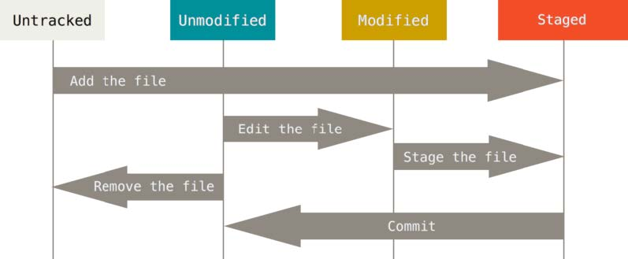

# Git常见命令

[TOC]


## Git的配置选项

**安装Git后，要做的第一件事就是设置用户名和邮件地址**

```
git config --global user.name "xxxxxxxx"

git config --global user.email "xxxxx@xxxx.com"
```


**检查当前的配置信息**

```
git config --list
// 按键盘q退出
```

也可以直接通过配置文件查找：C盘 -> 用户 -> lenovo -> .gitconfig


**如果我们希望修改配置文件，直接重新执行上面的两个命令即可**

再次设置：

```
git config --global user.name "xxxxxxxx"

git config --global user.email "xxxxx@xxxx.com"
```


**查看单独的配置**

```
git config user.name
```


## 版本控制

- 不同版本的存储管理
- 重大版本的备份维护
- 恢复之前的项目版本(在开发中发生一些严重问题时，需要恢复之前的操作或回退到之前的版本)


### 集中式版本控制

CVS和SVN都是属于集中式版本控制系统，协同开发人员通过客户端连接到这台服务器，取出最新的文件或者提交更新。

**核心问题：**中央服务器不能出现故障。

如果宕机一小时，那么在这一小时内，谁都无法提交更新，也就无法协同工作。

如果中心数据库所在的磁盘发送损坏，又没有备份，那么将丢失所有数据。


### 分布式版本控制

- 客户端并不只是提取最小版本的文件快照，而是**把代码仓库完整地镜像下来，包括完整的历史记录**
- 这样一来，任何一处协同工作用的**服务器发送故障**，事后都**可以用任何一个镜像出来的本地仓库恢复**
- 因为每一次的克隆操作，实际上都是一次**对代码仓库的完整备份**


## 获取Git仓库

通常有两种获取 Git 项目仓库的方式：

- **git init **: 初始化一个 Git 仓库 ，并且可以将当前项目的文件都添加到 Git 仓库中（目前很多的脚手架在创建项时都会默认一个 Git 仓库）
- **git clone **: 从其它服务器 克隆（ clone ） 一个已存在的 Git 仓库 （第一天到公司通常我们需要做这个操作）； 


## 文件的状态划分

现在我们的电脑上已经有一个Git仓库：

- 在实际开发中，你需要将某些文件交由这个Git仓库来管理；

- 并且我们之后会修改文件的内容，当达成某一个目标时，想要记录下来这次操作，就会将它提交到仓库中；


那么我们需要对文件来划分不同的状态，以确定这个文件是否已经归于Git仓库的管理：

- 未跟踪：默认情况下，Git仓库下的文件也没有添加到Git仓库管理中，我们需要通过**add**命令来操作；

- 已跟踪：添加到Git仓库管理的文件处于已跟踪状态，Git可以对其进行各种跟踪管理；


已跟踪的文件又可以进行细分状态划分：

- staged：暂缓区中的文件状态；

- Unmodified：commit命令，可以将staged中文件提交到Git仓库

- Modified：修改了某个文件后，会处于Modified状态；


在工作时，你可以选择性地将这些修改过的文件放入暂存区；

然后提交所有已暂存的修改，如此反复；




### 检测文件的状态 - git status

```
git status
```

Untracked files：未跟踪的文件

- 未跟踪的文件意味着 Git 在之前的提交中没有这些文件；

- Git 不会自动将之纳入跟踪范围，除非你明明白白地告诉它“我需要跟踪该文件”；


我们也可以查看更加简洁的状态信息：

- git status –s

- git status --short


左栏指明了暂存区的状态，右栏指明了工作区的状态；


### 文件添加到暂存区 – git add

跟踪新文件命令：

```
git add aaa.js
```


跟踪修改的文件命令：

- 如果我们已经跟踪了某一个文件，这个时候修改了文件也需要重新添加到暂存区中；


通过git add . 将所有的文件添加到暂存区中：

```
git add .
```

 


### git忽略文件

一般我们总会有些文件无需纳入 Git 的管理，也不希望它们总出现在未跟踪文件列表。

通常都是些自动生成的文件，比如日志文件，或者编译过程中创建的临时文件等；

我们可以创建一个名为 .gitignore 的文件，列出要忽略的文件的模式；

在实际开发中，这个文件通常不需要手动创建，在必须的时候添加自己的忽略内容即可；


比如右侧是创建的Vue项目自动创建的忽略文件：

- 包括一些不需要提交的文件、文件夹；

- 包括本地环境变量文件；

- 包括一些日志文件；

- 包括一些编辑器自动生成的文件；


### 文件更新提交 – git commit

现在的暂存区已经准备就绪，可以提交了。

- 每次准备提交前，先用 git status 看下，你所需要的文件是不是都已暂存起来了；

- 再运行提交命令 git commit；

- 可以在 commit 命令后添加 -m 选项，将提交信息与命令放在同一行; 

  ```
  git commit –m "提交信息" 
  ```

- 如果我们修改文件的add操作，加上commit的操作有点繁琐，那么可以将两个命令结合来使用：

  ```
  git commit -a -m "修改了bbb文件" 
  ```


### 查看提交的历史 – git log

在提交了若干更新，又或者克隆了某个项目之后，有时候我们想要查看一下所有的历史提交记录。

这个时候我们可以使用git log命令：

- 不传入任何参数的默认情况下，git log 会按时间先后顺序列出所有的提交，最近的更新排在最上面；

- 这个命令会列出每个提交的 SHA-1 校验和、作者的名字和电子邮件地址、提交时间以及提交说明；

**git log**

按空格可以查看每一次提交的历史


**git log --pretty=oneline --graph**

每一个*表示一次提交，比较适用于**有多个分支**的时候进行查看


**git log --pretty=oneline**

每一行显示一次提交


### 版本回退 – git reset

如果想要进行版本回退，我们需要先知道目前处于哪一个版本：Git通过HEAD指针记录当前版本。

- HEAD 是当前分支引用的指针，它总是指向该分支上的最后一次提交；

- 理解 HEAD 的最简方式，就是将它看做 该分支上的最后一次提交 的快照；


我们可以通过HEAD来改变Git目前的版本指向：

- 上一个版本就是HEAD^，上上一个版本就是HEAD^^；

- 如果是上1000个版本，我们可以使用HEAD~1000；

- 我们可以可以指定某一个commit id；如果是使用commit id进行回退，我们可以只填写前几位校验和，一般是7位或8位，只要不重复就行，也可以把全部校验和写上

```
git reset --hard HEAD^

git reset --hard HEAD~1000

git reset --hard 2d44982
```


**注意**

当我们回退到指定版本时，那么这个版本之后的log信息都会消失。

如果想要查看指定版本之后的log信息，

```
git reflog
```

然后再指定要跳转的版本


## 管理远程服务器

查看远程地址：比如我们之前从GitHub上clone下来的代码，它就是有自己的远程仓库的：

- git remote

- git remote –v

-v是—verbose的缩写(冗长的)


添加远程地址：我们也可以继续添加远程服务器（让本地的仓库和远程服务器仓库建立连接）：

- git remote add <shortname> <url> 

- git remote add gitlab http://152.136.185.210:7888/coderwhy/gitremotedemo.git


重命名远程地址：

- git remote rename gitlab glab


移除远程地址：

- git remote remove gitlab


### 远程仓库的交互

从远程仓库clone代码：将存储库克隆到新创建的目录中；

- git clone http://152.136.185.210:7888/coderwhy/gitremotedemo.git 


将代码push到远程仓库：将本地仓库的代码推送到远程仓库中；

默认情况下是将当前分支（比如master）push到origin远程仓库的；

```
git push

git push origin master
```


从远程仓库fetch代码：从远程仓库获取最新的代码

- 默认情况下是从origin中获取代码；

```
git fetch

git fetch origin
```

- 获取到代码后默认并没有合并到本地仓库，我们需要通过merge来合并；

```
git merge
```


从远程仓库pull代码：上面的两次操作有点繁琐，我们可以通过一个命令来操作

git pull

git fetch + git merge(rebase)


### 一个bug：If you wish to set tracking information for this branch you can do so with...

当我们在本地建立一些文件，并且使用`git init`初始化本地仓库，然后与远程仓库建立链接后，

此时如果我们希望将远程仓库的代码拉下来`git pull`，会报错：


**错误原因**：虽然现在我们已经建立连接了，但是它不知道是本地仓库的哪一个分支和远程仓库的哪一个分支建立连接。

解决：`git pull origin master`，我们给它指定更详细的分支

但是每次都要执行上述命令，太麻烦。

我们可以给本地的当前分支创建一个上游分支，之后我们再次进行`git pull`时，就会自动从上游分支获取东西：

```
git branch --set-upstream-to=origin/master
```

origin/master指定的远程仓库的某个分支

当执行后，会出现以下提示：

```
branch 'master' set up track 'origin/master'.
```


但是此时还会出现一个错误：

```
git pull
fatal: refusing to merge unrelated histories

翻译：合并远程分支时，拒绝合并不相干的历史
原因：我们将两个不相干的分支进行了合并
```


原因：

其实`git pull`是`git fetch`和`git merge`的合并，其实此时`git fetch`已经完全没问题了，出现问题的地方在`git merge`.

解决链接：[Git refusing to merge unrelated histories on rebase - Stack Overflow](https://stackoverflow.com/questions/37937984/git-refusing-to-merge-unrelated-histories-on-rebase)

You can use `--allow-unrelated-histories` to force the merge to happen.

The reason behind this is that default behavior has changed since Git 2.9:

> "git merge" used to allow merging two branches that have no common base by default, which led to a brand new history of an existing project created and then get pulled by an unsuspecting maintainer, which allowed an unnecessary parallel history merged into the existing project. The command has been taught **not to allow this by default**, with an escape hatch `--allow-unrelated-histories` option to be used in a rare event that merges histories of two projects that started their lives independently.


简单来说就是：过去git merge允许将两个没有共同基础(服务器的和本地的就是没有共同基础，也就是没有共同祖先)的分支进行合并，这导致了一个后果：新创建的项目可能被一个毫不怀疑的维护者合并了很多没有必要的历史，到一个已经存在的项目中，目前这个命令已经被纠正，但是我们依然可以通过-- allow-unrelated-histories选项来逃逸这个限制，来合并两个独立的项目；

```
$ git merge --allow-unrelated-histories
Merge nade by the 'ort' strategy.
```


此时问题就已经解决：

然后我们就可以使用`git pull/push`,但是如果刚才我们没有设置上游分支，那还是需要`git push origin/master`


## Git标签（tag）

### 创建tag

◼ 对于重大的版本我们常常会打上一个标签，以表示它的重要性：

- Git 可以给仓库历史中的某一个提交打上标签；

- 比较有代表性的是人们会使用这个功能来标记发布结点（ v1.0 、 v2.0 等等）；


◼ 创建标签：

- Git 支持两种标签：轻量标签（lightweight）与附注标签（annotated）；

- 附注标签：通过-a选项，并且通过-m添加额外信息；

```
git tag v1.0

git tag -a v1.1 -m "附注标签"
```

打完标签后，我们可以使用`git tag`命令查看历史tag


◼ 默认情况下，git push 命令并不会传送标签到远程仓库服务器上。

- 在创建完标签后你必须显式地推送标签到共享服务器上，当其他人从仓库中克隆或拉取，他们也能得到你的那些标签；

```
git push origin v1.0

git push origin --tags //push所有的tag
```


### 删除和检出tag

◼ 删除本地tag：

要删除掉你本地仓库上的标签，可以使用命令 git tag -d <tagname> ，此时远程服务器的tag没有被删掉

```
git tag -d v1.0.0
```

◼ 删除远程tag：

  要删除远程的tag我们可以通过git push <remote> –delete <tagname> 

```
git push origin -d v1.0.0
```

◼ 检出tag(回到某个tag)：

  如果你想查看某个标签所指向的文件版本，可以使用 git checkout 命令；

  通常我们在检出tag的时候还会创建一个对应的分支（分支后续了解）；

```
git checkout v1.0.0
```


## Git分支

### master分支

Git 的分支，其实本质上仅仅是指向提交对象的可变指针。

- Git 的默认分支名字是 master，在多次提交操作之后，你其实已经有一个指向最后那个提交对象的 master 分支；

- master 分支会在每次提交时自动移动；


Git 的 master 分支并不是一个特殊分支。

- 它就跟其它分支完全没有区别；

- 之所以几乎每一个仓库都有 master 分支，是因为 git init 命令默认创建它，并且大多数人都懒得去改动它；


### Git创建分支

Git 是怎么创建新分支的呢？

  很简单，它只是为你创建了一个可以移动的新的指针；


比如，创建一个 testing 分支， 你需要使用 git branch 命令：

```
git branch testing

git checkout testing //切换分支
```


那么，Git 又是怎么知道当前在哪一个分支上呢？

  也很简单，它有一个名为 HEAD 的特殊指针；


### 创建分支同时切换

◼ 创建新分支的同时切换过去

- 通常我们会在创建一个新分支后立即切换过去；

- 这可以用 git checkout -b <newbranchname> 一条命令搞定；


### 分支开发和合并

◼ 分支上开发、修复bug：

- 我们可以在创建的hotfix分支上继续开发工作或者修复bug；

- 当完成要做的工作后，重新打上一个新的tag v1.0.1；

◼ 切换回master分支，但是这个时候master分支也需要修复刚刚的bug：

- 所以我们需要将master分支和hotfix分支进行合并；

```
git checkout master

git merge hotfix
```


### 查看和删除分支

◼ 如果我们希望查看当前所有的分支，可以通过以下命令：

git branch # 查看当前所有的分支

git branch –v # 同时查看最后一次提交

git branch --merged # 查看所有合并到当前分支的分支

git branch --no-merged # 查看所有没有合并到当前分支的分支

◼ 如果某些已经合并的分支我们不再需要了，那么可以将其移除掉：

git branch –d hotfix # 删除当前分支

git branch –D hotfix # 强制删除某一个分支


### Git的远程分支

上面的分支都只是在本地建立分支

◼ 远程分支是也是一种分支结构：

- 以 <remote>/<branch> 的形式命名的；

◼ 如果我们刚刚clone下来代码，分支的结构如下：

  

◼ 如果其他人修改了代码，那么远程分支结构如下：


并且，此时你需要通过fetch来获取最新的远程分支提交信息：


### 远程分支的管理

◼ 操作一：推送分支到远程

- 当你想要公开分享一个分支时，需要将其推送到有写入权限的远程仓库上；

- 运行 git push <remote> <branch>；

```
git push origin <branch> 
```


◼ 操作二：跟踪远程分支

- 当克隆一个仓库时，它通常会自动地创建一个跟踪 origin/master 的 master 分支；

- 如果你愿意的话可以设置其他的跟踪分支，可以通过运行 `git checkout --track <remote>/<branch>`

- 如果你尝试检出的分支 (a) 不存在且 (b) 刚好只有一个名字与之匹配的远程分支，那么 Git 就会为你创建一个跟踪分支；

```
git checkout --track <remote>/<branch> 

git checkout <branch> 
```


◼ 操作三：删除远程分支

- 如果某一个远程分支不再使用，我们想要删除掉，可以运行带有 --delete 选项的 git push 命令来删除一个远程分支。

```
git push origin --delete <branch> 
```


## Git rebase用法

**通过merge来合并分支**

我们将c4的experiment分支和c3分支进行合并，生成c5，并且是master分支


**通过rebase来合并分支**

原来c4是experiment分支，然后我们将c4在 C3 的基础上应用一次，生成新的主分支master。

此时experiment分支就拥有了所有分支的所有代码。


◼ 在 Git 中整合来自不同分支的修改主要有两种方法：merge 以及 rebase。

◼ 什么是rebase呢？

- 在上面的图例中，你可以提取在 C4 中引入的补丁和修改，然后在 C3 的基础上应用一次；

- 在 Git 中，这种操作就叫做 变基（rebase）；

- 你可以使用 rebase 命令将提交到某一分支上的所有修改都移至另一分支上，就好像“重新播放”一样；

```
git checkout experiment
git rebase master
```


merge  用于 记录 git 的所有历史 ，那么分支的历史错综复杂也全部记录下来； 
rebase 用于 简化历史记录 ，将两个分支的历史简化整更加洁； 


rebase 有一条黄金法则：永远不要在主分支上使用rebase

- 如果 在main 上面使用 rebase ，会造成大量的提交历史在 main 分支中不同；
- 而多人开发时，其他依然在原来的 main 中，对于提交历史来说会有很大的变化； 


