# 前端代码规范实践指南(ESLint,Prettier,Husky...)

[TOC]


刚开始接触代码规范，每个项目都是按照配置教程下载npm包，配置文件，如果遇到bug，直接复制粘贴错误到百度，然后修改配置，结束...

起初我只是想让代码跑起来，至于里面的配置是什么意思，每个npm包之间又有什么关系，不好意思，我并不关心。但是，时间一长，强烈的求知欲就会驱使你去探索(因为项目中用了，怕面试被问到🙃，一句玩笑)。

所以，关于这篇文章：理清楚各个npm包各有什么作用，之间有什么联系，以及常见的配置。


## ESLint

官方文档：[ESLint](https://eslint.org/)

> Find and fix problems in your JavaScript code
>
> ESLint statically analyzes your code to quickly find problems. It is built into most text editors and you can run ESLint as part of your continuous integration pipeline.
>
> ​																										--官方文档

### 功能

- 代码质量方面的错误/建议
- 代码风格方面的错误/建议

代码质量非常容易理解，比如 [eqeqeq](https://eslint.org/docs/rules/eqeqeq)这个把双等改三等的规则： `==` 改成 `===`，这样的规则可以有效地避免一些 Magic Code Bug。

代码风格也是很容易理解，比如不喜欢加分号就加一条规则 [semi](https://eslint.org/docs/2.0.0/rules/semi)规则：

```json
{
  "semi": [2, "never"]
}
```


### 为什么要用ESLint

代码千万行，安全第一行；前端不规范，同事两行泪

- 统一团队编码规范（命名，众多格式等）
- 统一语法，毕竟es版本已经不少了(var/let....)
- 减少git不必要的提交（如果文件格式不一样，也会被git提交的）
- 避免低级错误
- 在编译时检查语法，而不是等JS引擎运行时才检查


### 安装

安装ESLint包有两种方式：

- 通过 npm 或 yarn 直接进行 全局 或 项目安装 `npm i eslint -D`
- 通过 vue 脚手架 创建项目时 选择安装 eslint 模块包 `vue create 创建项目过程中选择 lint`

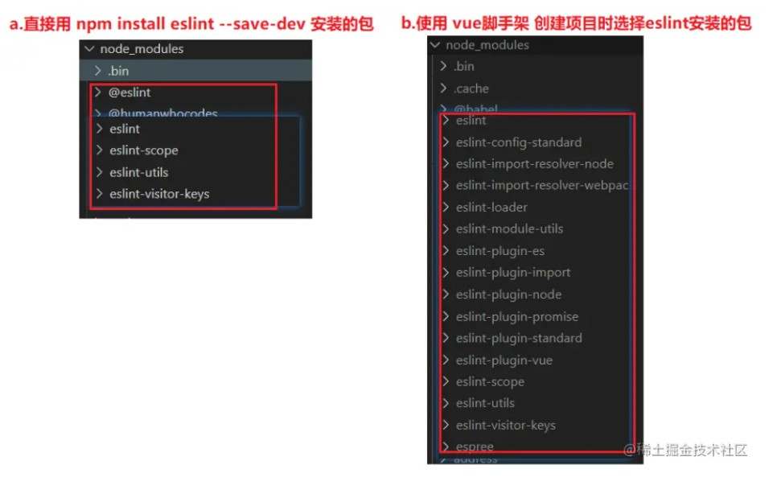

### 手动配置

首先，

- 创建一个测试文件夹：`eslint_test`
- 初始化项目：`npm init -y` (创建 package.json)

然后，直接安装eslint包：`npm i eslint -D`

注意安装结果：**node_moduels** 中下载了很多包

- **.bin/eslint.cmd** 脚本文件，内部通过 **nodejs** 执行 **eslint运行包** 的代码
- **@eslint包** 用来规范 **eslint配置文件**
- **eslint开头的包** 是 **eslint运行包**，包含eslint代码

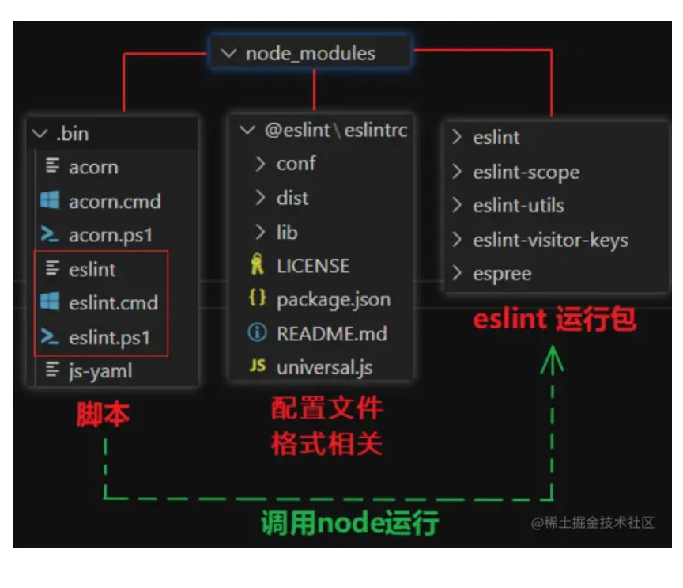

**生成ESLint配置文件**

> ESLint 可以创建独立的配置文件 **.eslintrc.js**，也可以 直接在 **package.json** 中配置
>
> 支持 JavaScript、JSON 或者 YAML 文件三种格式（`.eslintrc.*`），会在创建过程中让我们选择使用哪种文件格式

1. 执行 `node_modules/.bin` 文件夹里的 **eslint脚本** 来**创建配置文件**

   - 包含完整脚本路径的命令：`./node_modules/.bin/eslint --init`

   - 也可以用 **npx** 来执行 **(推荐)**：`npx eslint --init`

     （**npx**是随node一起安装的，能去 **.bin 目录** 里找 目标脚本文件，简化执行脚本的语法）

2. 创建配置文件过程中，需要选择配置：

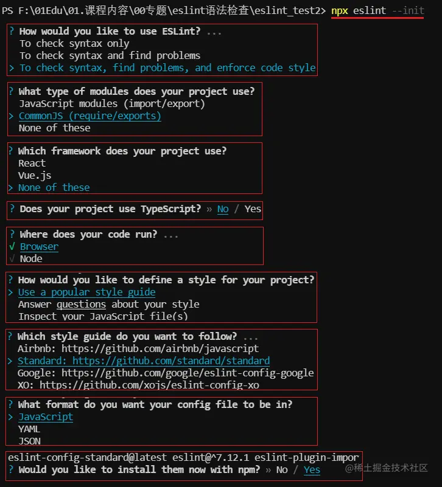

3. 执行结果：

- 创建了 配置文件 `.eslintrc.js`

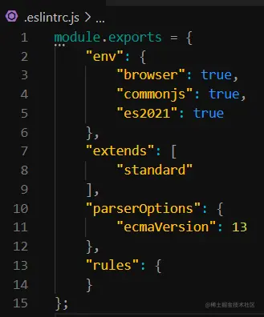

- 下载了相关规范包
  - 主要是下载了 standard 语法规范包，而它需要 用到 import、node、promise 插件包

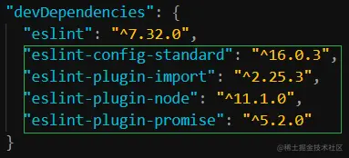

ESLint执行

- 命令：`npx eslint ./需要检查语法的文件路径`
- 如果违法规范，会将错误提示到 终端，说明 eslint 工作正常

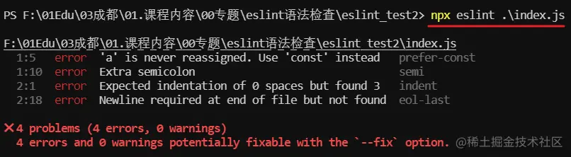

**编辑器上使用**

> 我们用编辑器上安装eslint集成，可以在编写代码时，就会出现错误或者警告提示，不用每次执行eslint 来知道是否有问题。


### ESLint配置文件解析

**配置文件格式**

- 我们通过 `npx eslint --init` 创建配置文件时，有提供配置文件的格式给我们选择：
  - .js / .yaml / .json


​	eslint 加载的优先级是 ： js > yaml > json，所以我们最好选择 **js格式**

**JS格式使用模式**

- 我们注意到 配置文件内部使用的 **module.exports** 导出配置数据
- 这是因为 我们在前面 添加配置文件时，选择了 `CommonJS`

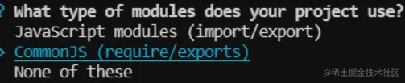

如果选择了 `JavaScript modules`，那么就会是使用 **export** 导出配置数据

推荐：`CommonJS`

- 由于我们开发时，一般使用的是 vue脚手架，内部webpack打包默认用的是CommonJS
- 所以 ESLlint配置文件 应尽可能与它保持一致


**env节点**

```js
"env": {
    "browser": true,
    "commonjs": true,
    "es2021": true
}
```

- 由于 ESLint 的各种规范中，一般都不允许使用未在页面内声明的成员
- 而开发中经常会用到 一些运行环境自带的 api，如：
  - 浏览器中的 **window/document** 等
  - nodejs中的**__dirname** 等
  - es2021中的 **WeakRef** 等
- 所以要告诉eslint，当前代码是运行在哪些环境中，这样检查时就不会报错了


**globals节点**

- 当访问当前源文件内未定义的变量时，[no-undef](https://link.juejin.cn?target=https%3A%2F%2Feslint.bootcss.com%2Fdocs%2Frules%2Fno-undef) 规则将发出警告。如果你想在一个源文件里使用全局变量，推荐你在 ESLint 中定义这些全局变量，这样 ESLint 就不会发出警告了。你可以使用注释或在配置文件中定义全局变量。

```js
 "globals": {
  "_": true  // 可以读取，可以修改
  "$": false // 可以读取，不能修改
 }
```

- 也可以使用 `globals` 节点来手动配置全局成员
- 注意：这个节点需要手动添加，默认是没有的


**插件（plugins）**

```json
"plugins": ["standard","promise","react"],
```


**extends 节点**

```js
"extends": [
  "standard" // "eslint-config-standard"
 ]
```

- ESLint 检查时用哪些规范呢？通过这个节点可以配置使用 内置规范 还是 第三方规范
  - 这里配置的是 使用 第三方下载的 `eslint-config-standard` 规范
  - 注意：配置 extends时，可以省略 `eslint-config-`，直接写成 `standard`


**解析器（parser）**

默认情况下ESLint使用Espree解析器，这里我们可以修改它的默认设置。

```python
parser": "babel-eslint",

parser: '@typescript-eslint/parser',
```


**parserOptions 节点**

```js
"parserOptions": {
	"ecmaVersion": 6, //ES的版本，默认为5
	"sourceType": "module", //指定源代码存在的位置，script | module，默认为script。
	"ecmaFeatures": { //指定要使用其他那些语言对象
		"experimentalObjectRestSpread": true,//启用对对象的扩展
		"jsx": true, //启用jsx语法
		"globalReturn":true, //允许return在全局使用
		"impliedStrict":true //启用严格校验模式
	}
}
```

- ESLint 解析器 解析代码时，可以指定 用哪个 js 的版本
- 注意：这里是指定 检查时按照哪个js版本语法检查，但这里不包含 全局变量
- 全局变量 需要通过 前面的 `env` 节点配置


**rules 节点**

```js
 "rules": {
 }
```

- 两个用法：

  - 不使用 `extend` 节点 配置 **整套的规范**，而是在 `rules`节点中直接配置

    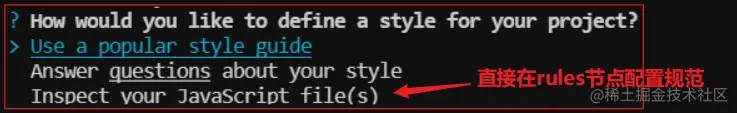

  - 使用 `extend` 节点 配置 **整套的规范**，在 `rules`节点中修改部分规范的配置 eg：

    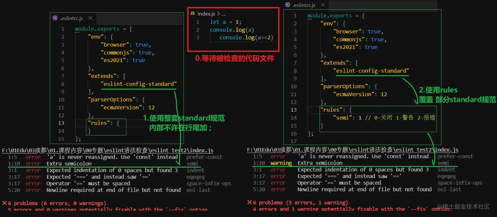

 **规则的错误等级有三种：**

- "off" 或者 0：关闭规则。
- "warn" 或者 1：打开规则，并且作为一个警告（不影响exit code）。
- "error" 或者 2：打开规则，并且作为一个错误（exit code将会是1）。

例子：

```
{
    "rules": {
        "eqeqeq": "off",
        "curly": "error",
        "quotes": ["error", "double"]
    }
}
```


### ESLint配置文件：`extends` 和 `plugins` 的区别⭐

通常 EsLint 中默认提供了一系列内置的 Rules 规则提供给我们进行配置，从而检测我们的 JavaScript 代码。

但是在某些特定条件下，内置的一些规则并不能满足我们的代码检查。

所以此时我们就要基于该情况做一些特殊的拓展了，Plugin 的作用正是处理这些功能而生。

比如，通常在我们使用 Eslint 来检查我们的代码时，需要将解析器替换为 `@typescript-eslint/parser` 的同时针对于一些 TypeScript 特定语法我们还需要使用 `@typescript-eslint/eslint-plugin` 来支持一些特定的 TS 语法检查。

这里我们额外安装的 ` @typescript-eslint/eslint-plugin` 中就包含了一系列有关于 TS 文件检测的特殊规则。

在 EsLint 内部并不支持有关于 Ts 的一些语法，自然我们需要通过 Plugin 来拓展对应的检测规则。

如果说上述 Plugins 和 Rules 可以满足项目的 Lint 配置的话，那么 Extends 关键字可以理解为关于 Plugins 和 Rules 结合而来的最佳实践。

正如其名，Extends 表示继承的意思。通常在不同的项目中，大多数情况下都具有相同的 Lint 相关配置。

基于这种情况 EsLint 提供了 Extends 关键字来解决不同项目下存在的通用配置。我们可以利用 EsLint 中的 Extends 关键字来继承一些通用的配置。

比如，EsLint 官方提供了 `eslint:recommended` 规则，当我们在配置文件中继承 `"eslint:recommended"` 时，相当于启用了一系列核心规则，这些规则会被 EsLint 官方维护在 `"eslint:recommended"` 中定期更新：

```js
// .eslintrc.js
module.exports = {
  root: true,
  parser: 'espress',
  parserOptions: {
    ecmaVersion: 6,
  },
  extends: ['eslint:recommended'],
};

// index.js
const a = 'hello world'; // error: 'a' is assigned a value but never used.eslintno-unused-vars
```

上述的代码可以看到，我们没有定义任何 rules 以及 plugins 。仅仅是 ` extends: ['eslint:recommended']`。

此时我们在 `index.js` 中定义了 a 变量但为使用，EsLint 会为我们检测出错误 `'a' is assigned a value but never used.eslintno-unused-vars`。

**其实，`extends` 的作用简单来说就是在项目内继承于另一份 EsLint 配置文件而已。**

Extends 继承关键字存在三种写法（情况）：

- 从 EsLint 本身的规则进行继承，比如 ` extends: ['eslint:recommended']`
- 从第三方的 NPM 包规则进行继承，比如 `extends : ['eslint-config-airbnb']`
- 从 ESLint 的插件进行继承，比如 `extends: ['plugin:react/recommended']`
- 从绝对路径继承而来，比如 `extends: ["./node_modules/coding-standard/eslintDefaults.js"]`

```js
// .eslintrc.js
module.exports = {
   "extends": [
     // 直接从 EsLint 本身集成的规则继承
     "eslint:recommended",
    // 从一些第三方NPM包进行继承，比如 eslint-config-standard、eslint-config-airbnb 
    // eslint-config-* 中 eslint-config- 可以省略 
     "airbnb",
     // 直接从插件继承规则，可以省略包名中的 `eslint-plugin`
     // 通常格式为 `plugin:${pluginName}/${configName}`
     "plugin:@typescript-eslint/recommended",     
   ]
}
```


### ESLint检查语法的规则原理

运行ESLint

- 使用 eslint 检查 目标 文件或文件夹
- 注意：ESLint 默认只检查 js 文件代码，如果想 检查 vue 或 react文件，需要装其它插件包

```js
npx eslint ./index.js // 检查 目标文件
npx eslint ./src // 检查 目标文件夹 中所有js文件
```


**ESLint语法规范本质**

- 就是**函数**
- 我们可以通过 看 **ESLint** 源码查看：
  - eslint 内置285个规则，每条规则 都是一个 **create函数**
  - 在进行语法检查时，会将代码转成另一种


### 语法规范包类型

- 前面看到，ESLint 安装时自带280多个规范，而开发时，未必都要使用，各个公司根据自己的习惯选择

- 所以就用了不同的选择组合：

  a. **ESLint内置规范包** ：eslint-all / eslint-recommended

  b. **标准规范包**：eslint-config-standard

  c. **第三方规范包**(google/airbnb/facebook....)

**内置规范包**

- 已经随eslint一起下载：

  `eslint-all` ：使用全部280多个规则

  `eslint-recommended`：只使用推荐的60个规则

**标准规范包(需要下载)**

- 包名：`eslint-config-standard`也使用了200多个规则

- 下载方式：

  - 可以在前面创建 eslint配置文件时 选择下载

    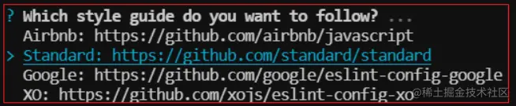

  - 手动下载，官方git地址：[github.com/standard/st…](https://link.juejin.cn?target=https%3A%2F%2Fgithub.com%2Fstandard%2Fstandard)

    - 下载包：`npm i eslint-config-standard -D`

    - 降低eslint版本：`npm i eslint@7.32.0` （standard依赖低版本的eslint）

    - 修改eslint配置文件中的 es版本：

      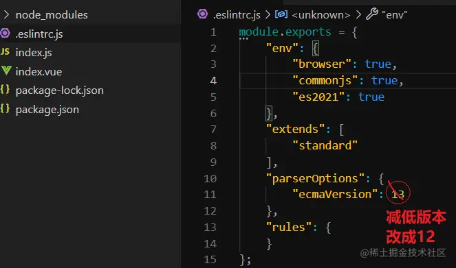


**第三方规范包**

> 有很多啊，我们就拿最流行的 airbnb 来举例

- 包名：`eslint-config-airbnb-base` ：好多规则，数不过来。。。

- 官方npm地址：[www.npmjs.com/package/esl…](https://link.juejin.cn?target=https%3A%2F%2Fwww.npmjs.com%2Fpackage%2Feslint-config-airbnb-base)

- 手动下载： 

  - 查看需要下载的包和版本  `npm info "eslint-config-airbnb-base@latest" peerDependencies`

    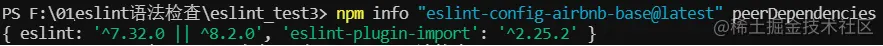

  - 下载 相关包 `npx install-peerdeps --dev eslint-config-airbnb-base`

    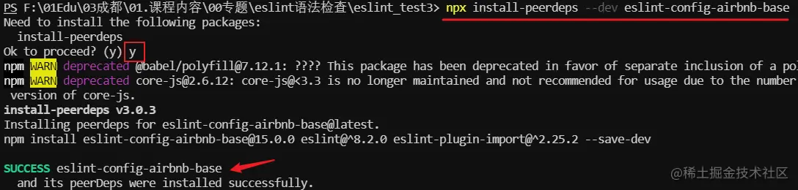


总结：严格程度 **all > airbnb-base > standard > recommended**


### ESLint的忽略文件

> 我们的整个项目中，有一些文件是不需要eslint进行检查，我们可以用到忽略文件。

 在我们的工程目录中新建一个文件，命名为“`.eslintignore`”，Eslint会自动识别这个文件。

这个配置文件里面，每一行都是一个glob模式语句，具体格式如下： 

- 以 # 开头的行被当作注释，不影响忽略模式。
- 路径是相对于 .eslintignore 的位置或当前工作目录。这也会影响通过 --ignore-pattern传递的路径。 
- 忽略模式同 .gitignore 规范
- 以 ! 开头的行是否定模式，它将会重新包含一个之前被忽略的模式。

 .eslintignore当 ESLint 在目录上运行时，ESLint 支持文件从linting 进程中排除文件。作为单独的 CLI 参数给出的文件将免除排除。该.eslintignore文件是一个纯文本文件，每行包含一个模式。它可以位于任何目标目录的祖先中; 它会影响其包含目录中的文件以及所有子目录。

```
node_modules/* 

**/vendor/*.js 
```


## Prettier

### 作用

Prettier（直译过来就是"更漂亮的"😂）

Prettier是一个能够完全统一你和同事代码风格的利器.

一般是ESLint 与 Prettier配合使用：

- ESLint 主要负责处理两种规则：格式化和代码质量问题。格式化不是它的强项，需要用 Prettier 格式化大师来处理代码风格有问题的代码。

- Prettier 格式化后的代码，理论上是最好看的。正因为 Prettier 只关注格式化，所以它也可以格式化其它的文件，如 `.yml`, `.json`, `.md` 等。


### 使用

先安装依赖：

```sh
npm i -D prettier # 安装依赖
```

下面对prettier进行配置：一共有三种方式支持对Prettier进行配置：

1. 根目录创建`.prettierrc.js`文件，能够写入YML、JSON的配置格式，并且支持`.yaml/.yml/.json/.js`后缀；
2. 根目录创建`.prettier.config.js `文件，并对外export一个对象；
3. 在`package.json`中新建`prettier`属性。

下面我们使用`prettierrc.js`的方式对prettier进行配置，同时讲解下各个配置的作用。

```
module.exports = {
  "printWidth": 80, //一行的字符数，如果超过会进行换行，默认为80
  "tabWidth": 2, //一个tab代表几个空格数，默认为80
  "useTabs": false, //是否使用tab进行缩进，默认为false，表示用空格进行缩减
  "singleQuote": false, //字符串是否使用单引号，默认为false，使用双引号
  "semi": true, //行位是否使用分号，默认为true
  "trailingComma": "none", //是否使用尾逗号，有三个可选值"<none|es5|all>"
  "bracketSpacing": true, //对象大括号直接是否有空格，默认为true，效果：{ foo: bar }
  "parser": "babylon" //代码的解析引擎，默认为babylon，与babel相同。
}
```

或者我们在根目录下创建`.prettierrc`文件：

```
{
  "useTabs": false,
  "tabWidth": 2,
  "printWidth": 80,
  "singleQuote": true,
  "trailingComma": "none",
  "semi": false
}
```


创建`.prettierignore`忽略文件

```
/dist/*
.local
.output.js
/node_modules/**

**/*.svg
**/*.sh

/public/*
```

一般而言，我们还需要集成 `vscode-prettier`这个插件来完成自动保存格式化，在插件市场安装好了以后，在我们的`.vscode/settings.json`中添加如下规则

```json
{
   "editor.formatOnSave": true, // 开启自动保存
   "editor.defaultFormatter": "esbenp.prettier-vscode", // 默认格式化工具选择prettier
}
```

这样一来，当我们在vscode写代码的时候，便会自动格式化了。


## eslint和prettier配合使用

### 为什么要配合使用

为什么要两者配合使用？因为，第一在 ESLint 推出 --fix 参数前，ESLint 并没有自动化格式代码的功能，要对一些格式问题做批量格式化只能用 Prettier 这样的工具。第二 ESLint 的规则并不能完全包含 Prettier 的规则，两者不是简单的谁替代谁的问题。但是在 ESLint 推出 --fix 命令行参数之后，如果你觉得 ESLint 提供的格式化代码够用了，也可以不使用 Prettier。

> prettier 是擅长代码格式的校验，eslint擅长代码质量的校验。虽说 eslint 也能格式校验，但是并没有 prettier 那么强势。


ESLint 和 Prettier 相互合作的时候有一些问题，对于他们交集的部分规则，ESLint 和 Prettier 格式化后的代码格式不一致。导致的问题是：当你用 Prettier 格式化代码后再用 ESLint 去检测，会出现一些因为格式化导致的 warning。


### 配合使用时到底谁的格式化在生效？

ESLint 和 Prettier 相互合作的时候有一些问题，对于他们交集的部分规则，ESLint 和 Prettier 格式化后的代码格式不一致。导致的问题是：当你用 Prettier 格式化代码后再用 ESLint 去检测，会出现一些因为格式化导致的 warning。这个时候有两个解决方案：

1.运行 Prettier 之后，再使用 eslint --fix 格式化一把，这样把冲突的部分以 ESLint 的格式为标准覆盖掉，剩下的 warning 就都是代码质量问题了。

2.在配置 ESLint 的校验规则时候把和 Prettier 冲突的规则 disable 掉，然后再使用 Prettier 的规则作为校验规则。那么使用 Prettier 格式化后，使用 ESLint 校验就不会出现对前者的 warning。

为什么不能先使用 ESLint 再使用 Prettier？ 针对方案1，如果你后使用 Prettier，那么格式化后提交的代码在下一次或者别人 checkout 代码后是通不过 lint 校验的。

针对方案2，其实是可以的，但是本人在实践中看社区方案的时候有提到某些情况下 eslint --fix 和 prettier 混用会出现格式问题。所以保险起见还是先用 perttier 格式化，再用 eslint 命令校验，而不用 eslint --fix 命令去格式化。


### 解决eslint和prettier冲突的问题⭐

在理想的状态下，eslint与prettier应该各司其职。eslint负责我们的代码质量，prettier负责我们的代码格式。但是在使用的过程中会发现，由于我们开启了自动化的eslint修复与自动化的根据prettier来格式化代码。所以我们已保存代码，会出现屏幕闪一起后又恢复到了报错的状态。

这其中的根本原因就是eslint有部分规则与prettier冲突了，所以保存的时候显示运行了eslint的修复命令，然后再运行prettier格式化，所以就会出现屏幕闪一下然后又恢复到报错的现象。这时候你可以检查一下是否存在冲突的规则。

查阅资料会发现，社区已经为我们提供了一个非常成熟的方案，即eslint-config-prettier + eslint-plugin-prettier。

安装插件：（vue在创建项目时，如果选择prettier，那么这两个插件会自动安装）

```
npm i eslint-plugin-prettier eslint-config-prettier -D
```

在 .eslintrc.json中extends的最后添加一个配置:

关键在于新增加的 `plugin:prettier/recommended` 这个规则

```
{ 
    extends: [
    'eslint:recommended',
    'plugin:vue/vue3-essential',
    'plugin:@typescript-eslint/recommended',
+    // 新增，必须放在最后面
+    'plugin:prettier/recommended' 
  ],
}

```

`eslint-plugin-prettier`插件会调用prettier对你的代码风格进行检查，**其原理是先使用prettier对你的代码进行格式化，然后与格式化之前的代码进行对比，如果过出现了不一致，这个地方就会被prettier进行标记,最后eslint自动fix按照prettier的规范修复error代码**

```
// (重要)这个是为了 eslint 跟 prettier 可以联合使用
npm install --save-dev eslint-plugin-prettier

// (重要)这个是为了让 eslint 跟 prettier 兼容，关闭 prettier 跟 eslint 冲突的rules
npm install --save-dev eslint-config-prettier
```

最后再来解释下`plugin:prettier/recommended`的含义，这个其实是多个eslint的配置集合，一个配置搞定，降低配置成本，下面代码就是实际eslint的原子配置：

```json
{
  "extends": ["prettier"],        // 生效 eslint-config-prettier 屏蔽配置
  "plugins": ["prettier"],        // 生效 eslint-plugin-prettier 提示配置
  "rules": {
    "prettier/prettier": "error",   // prettier报错的级别，红色波浪线
    "arrow-body-style": "off",      // 冲突无法解决，直接关闭
    "prefer-arrow-callback": "off"  // 冲突无法解决，直接关闭
  }
}
```


## 添加 .editorconfig 文件

`.editorconfig` 配置文件用于抹平不同编辑器或系统之间的编码差异，放在项目根目录。最常见的配置之一是 `end_of_line = lf`，如果用 Windows 和 Mac 混合开发，不统一行尾符会造成 eslint 爆红。

由于不同开发者的编辑器设置不同， 故在项目中应当包含 .editorconfig，用来统一配置编辑器的换行、缩进存储格式。
 配置参考：

```ini
# http://editorconfig.org
root = true

[*]
indent_style = space                    # 输入的 tab 都用空格代替
indent_size = 2                         # 一个 tab 用 2 个空格代替
# end_of_line = lf                      # 换行符使用 unix 的换行符 \n
charset = utf-8                         # 字符编码 utf-8
trim_trailing_whitespace = true         # 去掉每行末尾的空格
insert_final_newline = true             # 每个文件末尾都加一个空行

[*.md]
trim_trailing_whitespace = false        # .md 文件不去掉每行末尾的空格
```


## ESlint node包跟VScode插件有什么区别

node包是里面的是在编译期给你报错用的，报错了会停止编译，直到你修复。 vscode插件是可视化插件 在你编写代码时候就可以看到不合规范的代码


## vscode环境

因为我平时前端开发用的是vscode居多，所以这里暂时就介绍vscode的环境配置

在根目录的`.vscode/settings.json`添加如下：

```json
{
    "eslint.enable": true, //是否开启vscode的eslint
    "eslint.alwaysShowStatus": true,//是否在保存的时候自动fix eslint 
    "eslint.options": { //指定vscode的eslint所处理的文件的后缀
        "extensions": [
            ".js",
          	".vue",
          	".ts",
          	".tsx"
        ]
    },
    "eslint.validate": [ //确定校验准则
        "javascript",
    ],
    "editor.codeActionsOnSave": {
        "source.fixAll.eslint": true
    }
}
```

并且确保Vscode安装过下面的插件：

- ESLint
- prettier

如果安装了prettier插件，下面是`.vscode/settings.json`中要加上的配置：

```json
{
    "editor.formatOnSave": true, //开启自动保存
    "editor.defaultFormatter": "esbenp.prettier-vscode", //默认格式化工具选择prettier
    "[javascript]": {
        "editor.defaultFormatter": "esbenp.prettier-vscode"
    }
}
```


以后只要按了保存快捷键，就会**自动格式化**，一步到位。


## 用ESLint来规范Typescript代码

首先安装依赖：

```bash
npm i -d eslint @typescript-eslint/parser @typescript-eslint/eslint-plugin
```

这三个依赖分别是：

- eslint: ESLint的核心代码
- @typescript-eslint/parser：ESLint的解析器，用于解析typescript，从而检查和规范Typescript代码
- @typescript-eslint/eslint-plugin：这是一个ESLint插件，包含了各类定义好的检测Typescript代码的规范

安装好这3个依赖包之后，在根目录下新建.eslintrc.js文件，该文件中定义了ESLint的基础配置，一个最为简单的配置如下所示：

```java
module.exports = {
		env:{                          //指定代码的运行环境
        browser: true,
        node: true,
    }  
    parser:  '@typescript-eslint/parser', //定义ESLint的解析器
    extends: ['plugin:@typescript-eslint/recommended'],//定义文件继承的子规范
    plugins: ['@typescript-eslint'],//定义了该eslint文件所依赖的插件
  	parserOptions: {
    	project: ["./tsconfig.json"], // 告诉 eslint：tsconfig 在哪
  	},                             
}
```

- 在ts项目中必须执行解析器为@typescript-eslint/parser，才能正确的检测和规范TS代码
- env环境变量配置，形如console属性只有在browser环境下才会存在，如果没有设置支持browser,那么可能报console is undefined的错误。


### 此处一个常见的bug

```text
Parsing error: "parserOptions.project" has been set for @typescript-eslint/parser.
```

**这个错误是因为：既然你默认规定 ESLint 要 lint `.eslintrc.js`，可是 `tsconfig.json` 里又没有 include 这个文件。导致 ESLint 想 Lint `.eslintrc.js` 的时候，发现它又不在 Parser 的 `tsconfig.json` 名单列表上，就蒙逼了。**

最简单的解决方法就是在在 `tsconfig.json` 里 include 一下就 OK 了：

```json
{
  "compilerOptions": {...},
  "include": [".eslintrc.js", "src"],
  "exclude": ["node_modules"]
}
```

或者在 `.eslintignore` 里添加该文件，将其忽略掉：

```text
# 忽略 .eslintrc.js
.eslintrc.js
```

**但是这两都不是很好的解决方法，因为除了 `src` 目录，正常项目中还会有很多其它普通的 `.js` 文件，比如 `.babelrc.js`, `webpack.config.js`, `start.js` 等配置文件。我们既想要 ESLint x Prettier 格式化这些文件，但又不想将它们放到 `tsconfig.json` 里做类型检查。**

ESLint 正好提供了一个 `overrides` 配置来解决这样的问题：

```js
module.exports = {
  env: {
    // 支持浏览器环境
    browser: true,
    // 识别 ES 的代码，使用 ECMAScript 2021 自动设置 ecmaVersion parser 为 12，
    es2021: true,
    // Linter .eslintrc.js 自己的时候要用 node 环境
    node: true,
  },
  extends: [
    "eslint:recommended",
    "plugin:prettier/recommended"
  ],
  overrides: [
    // 处理 TS 文件
    {
      files: ["**/*.{ts,tsx}", "**/*.{js,jsx}"], // 只处理 ts 和 js 文件
      excludedFiles: [".eslintrc.js"], // 这里禁用了 .eslintrc.js 的类型检查
      parser: "@typescript-eslint/parser", // 能看懂 TypeScript
      parserOptions: {
        project: ["./tsconfig.json"], // 告诉 eslint：tsconfig 在哪
      },
      extends: [
        // typescript-eslint 的推荐规则，只是这些最佳规则都是针对 TS 的
        "plugin:@typescript-eslint/recommended",
        // tsconfig.json 里 Type Checking 的推荐规则
        "plugin:@typescript-eslint/recommended-requiring-type-checking",
      ],
      plugins: [
        // 使用 typescript x eslint 的插件
        "@typescript-eslint",
      ],
    },
  ],
}
```

上面的配置把 TypeScript 的 ESLint 配置归为一类，并只对 `"**/*.{ts,tsx}", "**/*.{js,jsx}"` 进行 Lint 操作，同时将 `.eslintrc.js` 排除掉。**这样一来，ESLint 不仅可以针对这类文件来做 Linter 检查，开发者也不用把冗余的 `.js` 文件放到 `tsconfig.json` 里了。**

到此为止， ESLint x TypeScript 已经完成了。


## Tip:命名规律

通过上面的 ESLint x TypeScript 配置，我们不难发现 ESLint 的又一大规律：

- 当 ESLint 无法解析文件时，比如看不懂新语法时，就可以搜索 "ESLint xxx Parser" 来找对应的 NPM 包
- 当 ESLint 要 Lint 一些非 `.js` 文件时，可以搜索 "ESLint xxx plugin" 来解决


## 常用Plugin

### ESLint x Babel

ESLint可以通过 `env` 来设定 ESLint 的默认 ECMAScript parser 的版本，所以 ESLint 其实是自带有 parser 的，但是它只支持 [最新版的 ECMAScript 标准](https://github.com/eslint/eslint/blob/a675c89573836adaf108a932696b061946abf1e6/README.md#what-about-experimental-features)。

而 JavaScript 依然在不断发展，时不时又出一些新的 API 或者提案，对于要尝鲜的开发者，ESLint 的 Parser 就解析不动 `.js` 了，因此，我们需要 [@babel/eslint-parser](https://www.npmjs.com/package/@babel/eslint-parser)。

```sh
npm i -D @babel/core @babel/eslint-parser
```

然后添加 `.babelrc.js`，在里面写项目的 babel 规则。

然后在 `overrides` 里新增对 `.js` 的处理：

```js
module.exports = {
  env: {
    // 支持浏览器环境
    browser: true,
    // 识别 CommonJS
    node: true,
    // 识别 ES 的代码，使用 ECMAScript 2021 自动设置 ecmaVersion parser 为 12，
    es2021: true,
  },
  extends: [
    "eslint:recommended", // eslint 自己的推荐规则，最佳实践最小集
    "plugin:prettier/recommended", // 禁用 eslint 关于代码的风格的规则，使用 prettier 的风格
  ],
  overrides: [
    // 处理 JS 文件
    {
      files: ["**/*.{js,jsx}"], // 只处理 js 和 jsx 文件
      parser: "@babel/eslint-parser", // 使用 babel 来解析 js 文件
      parserOptions: {
        sourceType: "module", // 支持 import/export
        allowImportExportEverywhere: false,
        ecmaFeatures: {
          globalReturn: false,
        },
      },
    },
    // 处理 TS 文件
    {
      files: ["**/*.{ts,tsx}"], // 只处理 ts 和 js 文件
      parser: "@typescript-eslint/parser", // 能看懂 TypeScript
      parserOptions: {
        project: ["./tsconfig.json"], // 告诉 eslint：tsconfig 在哪
      },
      extends: [
        // typescript-eslint 的推荐规则，只是这些最佳规则都是针对 TS 的
        "plugin:@typescript-eslint/recommended",
        // tsconfig.json 里 Type Checking 的推荐规则
        "plugin:@typescript-eslint/recommended-requiring-type-checking",
      ],
      plugins: [
        // 使用 typescript x eslint 的插件
        "@typescript-eslint",
      ],
    },
  ],
};
```


### ESLint x Vue

它只需要一个 [eslint-plugin-vue](https://eslint.vuejs.org/)：

```sh
npm i -D eslint-plugin-vue
```

我们依然可以在 `overrides` 中新增一条只针对 `.vue` 文件的配置：

```json
overrides: [
  // 处理 vue 文件
  {
    files: ["**/*.vue"], // 只处理 vue 文件
    extends: ["plugin:vue/vue3-recommended"], // 使用 vue3 的推荐规则
  }
]
```

这样就可以对所有 `.vue` 文件执行 `eslint '**/*.vue' --fix` 了


## StyleLint

ESLint 再强大也只是 JavaScript 和 TypeScript 的 Linter，对样式文件 `.css`, `less`, `scss` 则需要 [StyleLint](https://stylelint.io/user-guide/configure/)。

先来安装一些必要的 NPM 包：

```sh
# StyleLint
npm i -D stylelint
# StyleLint 的 Prettier 插件，类似 eslint-plugin-prettier
npm i -D stylelint-prettier
# 禁用与 Prettier 冲突的 StyleLint 规则
npm i -D stylelint-config-prettier
# 基础规则（可选）
npm i -D stylelint-config-standard
```

配置 `.stylelintrc.js`：

```js
module.exports = {
  "plugins": ["stylelint-prettier"],
  "extends": [
    "stylelint-config-standard",
    "stylelint-config-prettier"
  ],
  "rules": {
    "prettier/prettier": true
  }
}
```


### StyleLint x Less

**不过，当要配置 less 或者 scss 还需要一点步骤。**

```sh
# StyleLint 的 Less 插件
npm i -D stylelint-less
# StyleLint 的 Less 规则
npm i -D stylelint-config-recommended-less 
# StyleLint 处理 customSyntax
npm i -D postcss-less
```

修改配置：

```js
module.exports = {
  "plugins": ["stylelint-prettier"],
  "extends": [
    "stylelint-config-standard",
    "stylelint-config-recommended-less",
    "stylelint-config-prettier"
  ],
  "customSyntax": "postcss-less",
  "rules": {
    "prettier/prettier": true
  }
}
```


## Husky x LintStaged

### 好处

对于不使用vscode的，或者没有安装eslint、preitter与stylelint插件的同学来说，就不能实现在保存的时候自动的去修复与和格式化代码。

这样提交到git仓库的代码还是不符合要求的。因此需要引入强制的手段来保证提交到git仓库的代码时符合我们的要求的。

husky是一个用来管理git hook的工具，git hook即在我们使用git提交代码的过程中会触发的钩子。
虽然我们已经要求项目使用eslint了，但是不能保证组员提交代码之前都将eslint中的问题解决掉了：

也就是我们希望保证代码仓库中的代码都是符合eslint规范的；

那么我们需要在组员执行 git commit 命令的时候对其进行校验，如果不符合eslint规范，那么自动通过规范进行修复；

那么如何做到这一点呢？可以通过Husky工具：

husky是一个git hook工具，可以帮助我们触发git提交的各个阶段：pre-commit、commit-msg、pre-push


### Husky 配置

注意，执行这里的操作的前提是已经执行了`git init`命令，可能在自己建立测试文件时忘记执行`git init`命令，导致命令执行失败。

```sh
# 安装哈士奇
npm install husky -D
# 添加 prepare 命令
npm set-script prepare "husky install"
# prepare 创建 bash 脚本，安装 git hooks
npm run prepare
# 添加 pre-commit 的 git hook 脚本
npx husky add .husky/pre-commit "npx eslint src --fix"
```

运行之后会发现在 `./.husky/pre-commit` 里看到 `git commit` 前会运行的脚本：

```sh
#!/bin/sh
. "$(dirname "$0")/_/husky.sh"

# git commit 前先 eslint fix 一波
npx eslint src --fix
```

**但是这样的命令会让每次 commit 前都把整个 `src` 都扫描并 fix 一次，速度太慢了，而且很容易把别人的屎山也 fix 掉，然后提交上去。**

我们更希望只针对提交的文件进行 Lint 操作。


### LintStaged 配置

```sh
# 安装
npm i -D lint-staged
```

然后添加 `.lintstagedrc.js` 配置文件，里面对提交不同的文件进行 `eslint --fix` 操作。

```js
module.exports = {
  '**/*.{ts,tsx,js,jsx}': [
    "eslint --cache --fix",
  ],
  "**/*.vue": [
    "eslint --cache --fix",
  ],
  "**/*.{css,less}": [
    "stylelint --cache --fix",
  ]
}
```

`lint-staged` 配置的含义是对提交上来不同类型的文件执行对应的 lint fix 命令。

最后在刚刚创建的 `./.husky/pre-commit` 里改成执行 `lint-staged` 命令：

```bash
#!/bin/sh
. "$(dirname "$0")/_/husky.sh"

npx lint-staged
```

以后每次 commit 前都会跑一次 `lint-staged`，而 `lint-staged` 又会对提交的文件进行 ESLint Fix。


## git commit规范

### 代码提交风格

通常我们的git commit会按照统一的风格来提交，这样可以快速定位每次提交的内容，方便之后对版本进行控制。

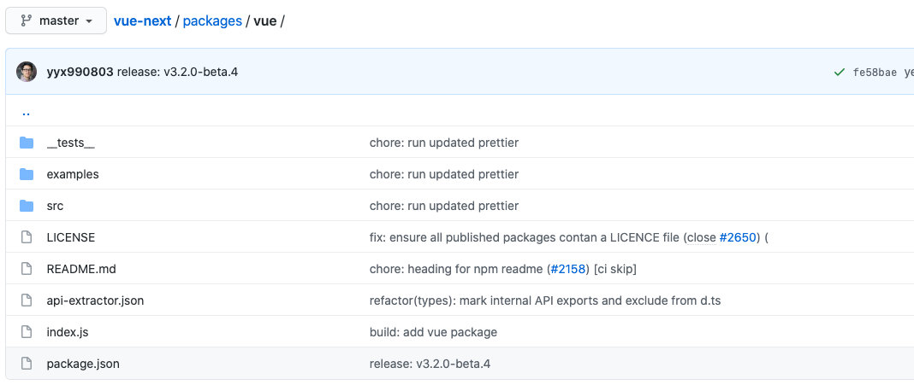

但其实那些一串长长的英文提交信息并不是每次都手写上去。

我们可以使用一个工具：`Commitizen`

Commitizen 是一个帮助我们编写规范 commit message 的工具；
1.安装Commitizen

```
npm install commitizen -D
```


2.安装cz-conventional-changelog，并且初始化cz-conventional-changelog：

```
npx commitizen init cz-conventional-changelog --save-dev --save-exact
```

这个命令会帮助我们安装cz-conventional-changelog：

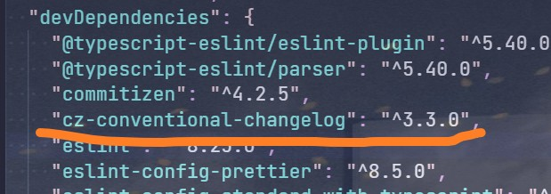

并且在package.json中进行配置：

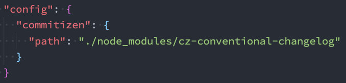

**这个时候我们提交代码需要使用 `npx cz`：而不是使用 git commit -m "xxx"**

* 第一步是选择type，本次更新的类型

| Type     | 作用                                                         |
| -------- | ------------------------------------------------------------ |
| feat     | 新增特性 (feature)                                           |
| fix      | 修复 Bug(bug fix)                                            |
| docs     | 修改文档 (documentation)                                     |
| style    | 代码格式修改(white-space, formatting, missing semi colons, etc) |
| refactor | 代码重构(refactor)                                           |
| perf     | 改善性能(A code change that improves performance)            |
| test     | 测试(when adding missing tests)                              |
| build    | 变更项目构建或外部依赖（例如 scopes: webpack、gulp、npm 等） |
| ci       | 更改持续集成软件的配置文件和 package 中的 scripts 命令，例如 scopes: Travis, Circle 等 |
| chore    | 变更构建流程或辅助工具(比如更改测试环境)                     |
| revert   | 代码回退                                                     |

* 第二步选择本次修改的范围（作用域）

  

- 第三步选择提交的信息

  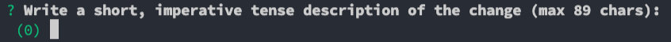

- 第四步提交详细的描述信息：这里直接回车跳过

  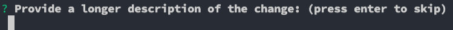

- 第五步是否是一次重大的更改

  

- 第六步是否影响某个open issue

  

我们也可以在scripts中构建一个命令来执行 cz：

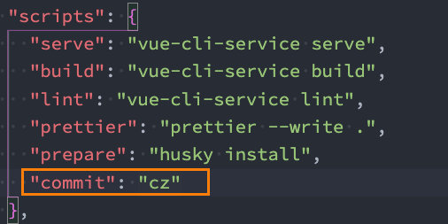


### 代码提交验证

如果我们按照cz来规范了提交风格，但是依然有同事通过 `git commit` 按照不规范的格式提交应该怎么办呢？

* 我们可以通过commitlint来限制提交；

1.安装 @commitlint/config-conventional 和 @commitlint/cli

```shell
npm i @commitlint/config-conventional @commitlint/cli -D
```

2.在根目录创建commitlint.config.js文件，配置commitlint

```js
module.exports = {
  extends: ['@commitlint/config-conventional']
}
```

3.使用husky生成commit-msg文件，验证提交信息：(**对提交信息进行拦截**)

```shell
npx husky add .husky/commit-msg "npx --no-install commitlint --edit $1"
```

或者手动创建文件：

我们手动创建文件 `commit-msg`：该文件与`pre-commit`文件同级

```
#!/usr/bin/env sh
. "$(dirname -- "$0")/_/husky.sh"

npx --no-install commitlint --edit
```


此时我们测试用git commit 提交，失败

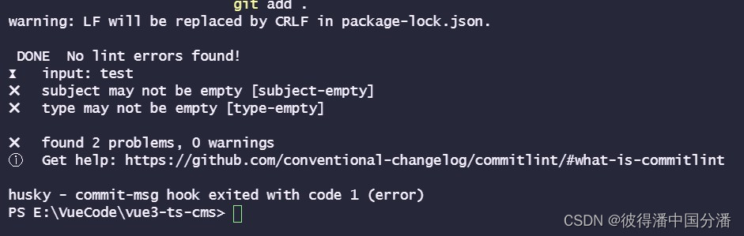

所以我们必须用npx cz提交，但是该命令不太熟悉，要改名

我们在package.json中新增脚本："commit": "cz"

整体配置如下：

```
 "scripts": {
    "serve": "vue-cli-service serve",
    "build": "vue-cli-service build",
    "lint": "vue-cli-service lint",
    "prettier": "prettier --write .",
    "prepare": "husky install",
    "commit": "cz"
  },
```

以后我们使用 `npm run commit` 来进行提交


### 补充：自定义代码提交风格

如果想自己定义提交规范也是可以的，首先要下载自定义规范约束的包替换第三方规范。

```arduino
npm i -D commitlint-config-cz cz-customizable
```

变更 **commitlint.config.js** 这里采用自己定义的规范,将会覆盖上面那个,所以上面那个可以不用安装:

```
module.exports = {
  extends: ['cz'], //采用 cz 自定义的提交规范 -> .cz-config.js
};
```

在项目根目录创建`.cz-config.js`，可以再这个文件里自定义规范（下面这是我自定义的配置）

新增`.cz-config.js`文件：

```js
  'use strict'
  module.exports = {
    types: [
      { value: '✨新增', name: '新增:    新的内容' },
      { value: '🐛修复', name: '修复:    修复一个Bug' },
      { value: '📝文档', name: '文档:    变更的只有文档' },
      { value: '💄格式', name: '格式:    空格, 分号等格式修复' },
      { value: '♻️重构', name: '重构:    代码重构，注意和特性、修复区分开' },
      { value: '⚡️性能', name: '性能:    提升性能' },
      { value: '✅测试', name: '测试:    添加一个测试' },
      { value: '🔧工具', name: '工具:    开发工具变动(构建、脚手架工具等)' },
      { value: '⏪回滚', name: '回滚:    代码回退' }
    ],
    scopes: [
      { name: 'leetcode' },
      { name: 'javascript' },
      { name: 'typescript' },
      { name: 'Vue' },
      { name: 'node' }
    ],
    // it needs to match the value for field type. Eg.: 'fix'
    /*  scopeOverrides: {
      fix: [
        {name: 'merge'},
        {name: 'style'},
        {name: 'e2eTest'},
        {name: 'unitTest'}
      ]
    },  */
    // override the messages, defaults are as follows
    messages: {
      type: '选择一种你的提交类型:',
      scope: '选择一个scope (可选):',
      // used if allowCustomScopes is true
      customScope: 'Denote the SCOPE of this change:',
      subject: '短说明:\n',
      body: '长说明，使用"|"换行(可选)：\n',
      breaking: '非兼容性说明 (可选):\n',
      footer: '关联关闭的issue，例如：#31, #34(可选):\n',
      confirmCommit: '确定提交说明?(yes/no)'
    },
    allowCustomScopes: true,
    allowBreakingChanges: ['特性', '修复'],
    // limit subject length
    subjectLimit: 100
  }

```

package.json 中,将原来commit配置,变更为自定义配置:

```
// 使用自定义规范则使用
"config": {
    "commitizen": {
      "path": "node_modules/cz-customizable"
    }
}
```


到目前为止，我们已经实现了一份较完整的代码规范配置。

以后当我们进行代码提交时，具体操作如下：

- git add .
- npm run commit
- git push origin main


## 写项目时，一些Prettier的烦人的报错

### Delete `␍`eslint(prettier/prettier)

如果存在.prettierrc文件添加如下配置

```
"endOfLine": "auto"
```

如果不存在该文件 打开vscode编辑器的setting.json文件添加如下配置

```
 "prettier.endOfLine": "auto", // 结尾是 \n \r \n\r auto
```


### Failed to load config “@vue/prettier“ to extend from

这种是版本问题。

解决方案:
@vue/prettier改为prettier
原因还不知道, @vue/prettier在@vue/下没找到


### return old(m, filename)； Error [ERR_REQUIRE_ESM]: require() of ES Module

在使用eslint配置时，提交出现bug:

```
C:\Users\USER\AppData\Roaming\npm\node_modules\ts-node\dist\index.js:729
            return old(m, filename);
                   ^
Error [ERR_REQUIRE_ESM]: require() of ES Module C:\Users\USER\Desktop\tindin\node_modules\node-fetch\src\index.js from C:\Users\USER\Desktop\tindin\src\api\services\unsplash.ts not supported.
Instead change the require of index.js in C:\Users\USER\Desktop\tindin\src\api\services\unsplash.ts to a dynamic import() which is available in all CommonJS modules.
    at Object.require.extensions.<computed> [as .js] (C:\Users\USER\AppData\Roaming\npm\node_modules\ts-node\dist\index.js:729:20)
    at Object.<anonymous> (C:\Users\USER\Desktop\tindin\src\api\services\unsplash.ts:23:30)
    at Module.m._compile (C:\Users\USER\AppData\Roaming\npm\node_modules\ts-node\dist\index.js:735:29)
    at Object.require.extensions.<computed> [as .ts] (C:\Users\USER\AppData\Roaming\npm\node_modules\ts-node\dist\index.js:737:16)
    at main (C:\Users\USER\AppData\Roaming\npm\node_modules\ts-node\dist\bin.js:238:16)
    at Object.<anonymous> (C:\Users\USER\AppData\Roaming\npm\node_modules\ts-node\dist\bin.js:351:5) {
  code: 'ERR_REQUIRE_ESM'

```

本人参考了一些解决方案，但都未解决该问题，相关解决方式链接如下：
[return old(m, filename); Error : require() of ES Module](https://stackoverflow.com/questions/70800567/return-oldm-filename-error-err-require-esm-require-of-es-module)

我的解决方式： 将根目录下的 `commitlint.config.js`文件后缀名改为 cjs，即 commitlint.config.cjs 文件


### 代码规范配置未生效，解决思路

最常见的 eslint 和 prettier 冲突：
eslint 侧重于代码规范，而 prettier 是满足代码规范前提下的格式优化。如果两者冲突，首先肯定是符合规范的，我们只需要让 eslint 对格式的要求按照 prettier 的来就行。注意 prettier 一定要置于 extends 的最后，才不会被其他扩展覆盖。

```
.eslintrc.js
module.exports = {   
  extends: [ 
  	// ...
    'plugin:prettier/recommended' //注意要放在最后
  ], 
};
```


参考文章：

[【一听就懂】ESLint机制浅析-整体机制与规范包](https://juejin.cn/post/7037426216671903780#heading-23)

[深入浅出 Eslint，告别 Lint 恐惧症](https://juejin.cn/post/7136458949322080292#heading-9)

[前端项目代码规范落地方案 ESlint+Prettier](https://juejin.cn/post/6844903992330305550#heading-6)

[前端工具小指南之Prettier](https://juejin.cn/post/7139686780143403039#heading-0)

[Linter上手完全指南](https://github.yanhaixiang.com/linter-tutorial/)

[Eslint + Prettier + Husky + Commitlint+ Lint-staged 规范前端工程代码规范](https://juejin.cn/post/7038143752036155428#heading-5)