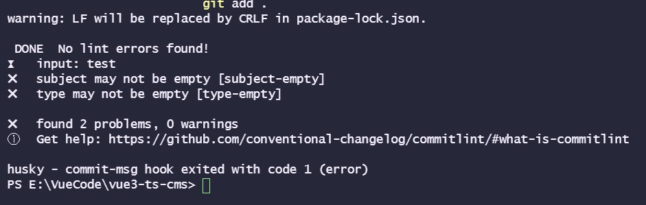
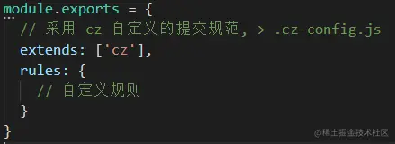
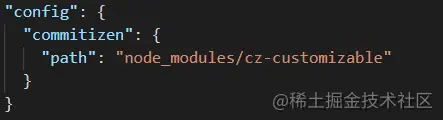
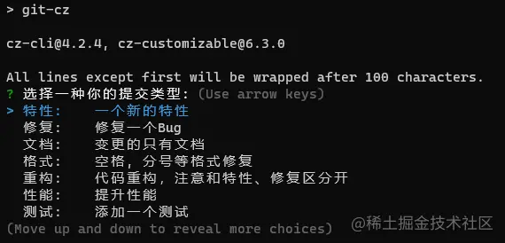

# 前端项目代码规范的搭建

> Eslint + Prettier + Husky + Commitlint 使用指南

[TOC]


## 写在前面

这里是小飞侠Pan🥳，立志成为一名优秀的前端程序媛！！！

本篇博客收录于我的[github](https://github.com/mengqiuleo)前端笔记仓库中，持续更新中，欢迎star~

👉[https://github.com/mengqiuleo/myNote](https://github.com/mengqiuleo/myNote)


## 1.1. 集成editorconfig配置

EditorConfig 有助于为不同 IDE 编辑器上处理同一项目的多个开发人员维护一致的编码风格。

下面的代码放到 .editorconfig 文件中

```yaml
# http://editorconfig.org

root = true

[*] # 表示所有文件适用
charset = utf-8 # 设置文件字符集为 utf-8
indent_style = space # 缩进风格（tab | space）
indent_size = 2 # 缩进大小
end_of_line = lf # 控制换行类型(lf | cr | crlf)
trim_trailing_whitespace = true # 去除行首的任意空白字符
insert_final_newline = true # 始终在文件末尾插入一个新行

[*.md] # 表示仅 md 文件适用以下规则
max_line_length = off
trim_trailing_whitespace = false
```


VSCode需要安装一个插件：EditorConfig for VS Code


## 1.2. 使用prettier工具

Prettier 是一款强大的代码格式化工具，支持 JavaScript、TypeScript、CSS、SCSS、Less、JSX、Angular、Vue、GraphQL、JSON、Markdown 等语言，基本上前端能用到的文件格式它都可以搞定，是当下最流行的代码格式化工具。

1.安装prettier

```shell
npm install prettier -D
```

2.配置.prettierrc文件：

* useTabs：使用tab缩进还是空格缩进，选择false；
* tabWidth：tab是空格的情况下，是几个空格，选择2个；
* printWidth：当行字符的长度，推荐80，也有人喜欢100或者120；
* singleQuote：使用单引号还是双引号，选择true，使用单引号；
* trailingComma：在多行输入的尾逗号是否添加，设置为 `none`；
* semi：语句末尾是否要加分号，默认值true，选择false表示不加；

```json
{
  "useTabs": false,
  "tabWidth": 2,
  "printWidth": 80,
  "singleQuote": true,
  "trailingComma": "none",
  "semi": false
}
```


3.创建.prettierignore忽略文件

```
/dist/*
.local
.output.js
/node_modules/**

**/*.svg
**/*.sh

/public/*
```


4.VSCode需要安装prettier的插件


5.测试prettier是否生效

* 测试一：在代码中保存代码；
* 测试二：配置一次性修改的命令；

在package.json中配置一个scripts：

```json
    "prettier": "prettier --write ."
```


## 1.3. 使用ESLint检测

1.在前面创建项目的时候，我们就选择了ESLint，所以Vue会默认帮助我们配置需要的ESLint环境。

2.VSCode需要安装ESLint插件：


3.解决eslint和prettier**冲突**的问题：

在理想的状态下，`eslint`与`prettier`应该各司其职。`eslint`负责我们的代码质量，`prettier`负责我们的代码格式。但是在使用的过程中会发现，由于我们开启了自动化的`eslint`修复与自动化的根据`prettier`来格式化代码。所以我们已保存代码，会出现屏幕闪一起后又恢复到了报错的状态。

这其中的根本原因就是`eslint`有部分规则与`prettier`冲突了，所以保存的时候显示运行了`eslint`的修复命令，然后再运行`prettier`格式化，所以就会出现屏幕闪一下然后又恢复到报错的现象。这时候你可以检查一下是否存在冲突的规则。

查阅资料会发现，社区已经为我们提供了一个非常成熟的方案，即`eslint-config-prettier` + `eslint-plugin-prettier`。

安装插件：（vue在创建项目时，如果选择prettier，那么这两个插件会自动安装）

```shell
npm i eslint-plugin-prettier eslint-config-prettier -D
```

**在 `.eslintrc.json`中`extends`的最后添加一个配置**

```diff
{ 
    extends: [
    'eslint:recommended',
    'plugin:vue/vue3-essential',
    'plugin:@typescript-eslint/recommended',
+    // 新增，必须放在最后面
+    'plugin:prettier/recommended' 
  ],
}
```


.eslintrc.js文件完整配置如下：

```json
  extends: [
    "plugin:vue/vue3-essential",
    "eslint:recommended",
    "@vue/typescript/recommended",
    "@vue/prettier",
    "@vue/prettier/@typescript-eslint",
    "plugin:prettier/recommended"
  ],
```


## 1.4. git Husky和eslint

> 对于不使用`vscode`的，或者没有安装`eslint`、`preitter`与`stylelint`插件的同学来说，就不能实现在保存的时候自动的去修复与和格式化代码。
>
> 这样提交到`git`仓库的代码还是不符合要求的。因此需要引入强制的手段来保证提交到`git`仓库的代码时符合我们的要求的。
>
> `husky`是一个用来管理`git hook`的工具，`git hook`即在我们使用`git`提交代码的过程中会触发的钩子。

虽然我们已经要求项目使用eslint了，但是不能保证组员提交代码之前都将eslint中的问题解决掉了：

* 也就是我们希望保证代码仓库中的代码都是符合eslint规范的；

* 那么我们需要在组员执行 `git commit ` 命令的时候对其进行校验，如果不符合eslint规范，那么**自动**通过规范进行修复；

那么如何做到这一点呢？可以通过Husky工具：

* husky是一个git hook工具，可以帮助我们触发git提交的各个阶段：pre-commit、commit-msg、pre-push

如何使用husky呢？

**这里我们可以使用自动配置命令：**直接下载就行

```shell
npx husky-init && npm install
```

这里会做三件事：

1.安装husky相关的依赖：


2.在项目目录下创建 `.husky` 文件夹：

```
npx huksy install
```


3.在package.json中添加一个脚本：


接下来，我们需要去完成一个操作：在进行commit时，执行lint脚本：


这个时候我们执行git commit的时候会自动对代码进行lint校验。


**注意：**

执行命令时出错的情况：

```js
E:\note\前端\代码\vue3_demo\vite_demo\vite_test>npx husky-init && npm install
npx: 2 安装成功，用时 2.084 秒
husky-init updating package.json
  setting prepare script to command "husky install"
can't create hook, .husky directory doesn't exist (try running husky install)
```

安装husky报错（遇到的问题）

```
husky - can't create hook, .husky directory doesn't exist (try running husky install)
不能创建钩子，.husky目录不存在(尝试运行Husky install)
```

不能创建钩子，.husky目录不存在(尝试运行Husky install)
**解决：**

重新执行下面的命令

```
git init
npx husky-init
```


**注意：**

- 上述命令需要在git bash中执行！！！
- 否则会报错


## 1.5. git commit规范

### 1.5.1. 代码提交风格

通常我们的git commit会按照统一的风格来提交，这样可以快速定位每次提交的内容，方便之后对版本进行控制。


但是如果每次手动来编写这些是比较麻烦的事情，我们可以使用一个工具：Commitizen

* Commitizen 是一个帮助我们编写规范 commit message 的工具；

1.安装Commitizen

```shell
npm install commitizen -D
```

2.安装cz-conventional-changelog，并且初始化cz-conventional-changelog：

```shell
npx commitizen init cz-conventional-changelog --save-dev --save-exact
```

这个命令会帮助我们安装cz-conventional-changelog：


并且在package.json中进行配置：


**这个时候我们提交代码需要使用 `npx cz`：而不是使用 git commit -m "xxx"**

* 第一步是选择type，本次更新的类型

| Type     | 作用                                                         |
| -------- | ------------------------------------------------------------ |
| feat     | 新增特性 (feature)                                           |
| fix      | 修复 Bug(bug fix)                                            |
| docs     | 修改文档 (documentation)                                     |
| style    | 代码格式修改(white-space, formatting, missing semi colons, etc) |
| refactor | 代码重构(refactor)                                           |
| perf     | 改善性能(A code change that improves performance)            |
| test     | 测试(when adding missing tests)                              |
| build    | 变更项目构建或外部依赖（例如 scopes: webpack、gulp、npm 等） |
| ci       | 更改持续集成软件的配置文件和 package 中的 scripts 命令，例如 scopes: Travis, Circle 等 |
| chore    | 变更构建流程或辅助工具(比如更改测试环境)                     |
| revert   | 代码回退                                                     |

* 第二步选择本次修改的范围（作用域）


* 第三步选择提交的信息


* 第四步提交详细的描述信息：这里直接回车跳过


* 第五步是否是一次重大的更改


* 第六步是否影响某个open issue


我们也可以在scripts中构建一个命令来执行 cz：


### 1.5.2. 代码提交验证

如果我们按照cz来规范了提交风格，但是依然有同事通过 `git commit` 按照不规范的格式提交应该怎么办呢？

* 我们可以通过commitlint来限制提交；

1.安装 @commitlint/config-conventional 和 @commitlint/cli

```shell
npm i @commitlint/config-conventional @commitlint/cli -D
```

2.在根目录创建commitlint.config.js文件，配置commitlint

```js
module.exports = {
  extends: ['@commitlint/config-conventional']
}
```

3.使用husky生成commit-msg文件，验证提交信息：(**对提交信息进行拦截**)

```shell
npx husky add .husky/commit-msg "npx --no-install commitlint --edit $1"
```

这里使用命令不成功

我们手动创建文件 `commit-msg`：该文件与`pre-commit`文件同级

```
#!/usr/bin/env sh
. "$(dirname -- "$0")/_/husky.sh"

npx --no-install commitlint --edit
```


此时我们测试用git commit 提交，失败




所以我们必须用`npx cz`提交，但是该命令不太熟悉，要改名

我们在package.json中新增脚本：`"commit": "cz"`

整体配置如下：

```js
 "scripts": {
    "serve": "vue-cli-service serve",
    "build": "vue-cli-service build",
    "lint": "vue-cli-service lint",
    "prettier": "prettier --write .",
    "prepare": "husky install",
    "commit": "cz"
  },
```

以后我们使用 `npm run commit` 来进行提交

具体提交流程如下：

- 首先要在git bush的命令行窗口下执行命令！！！
- 然后执行 git add .
- 执行 `npm run commit`
- 接下来的操作就是上面的注释的操作 


### 1.5.3 扩展——自定义提交规范

```
npm i -D commitlint-config-cz  cz-customizable
```

变更 **commitlint.config.js** 这里采用自己定义的规范,将会覆盖上面那个,所以上面那个可以不用安装



增加 .cz-config.js

```scss
  'use strict'
  module.exports = {
    types: [
      { value: '✨新增', name: '新增:    新的内容' },
      { value: '🐛修复', name: '修复:    修复一个Bug' },
      { value: '📝文档', name: '文档:    变更的只有文档' },
      { value: '💄格式', name: '格式:    空格, 分号等格式修复' },
      { value: '♻️重构', name: '重构:    代码重构，注意和特性、修复区分开' },
      { value: '⚡️性能', name: '性能:    提升性能' },
      { value: '✅测试', name: '测试:    添加一个测试' },
      { value: '🔧工具', name: '工具:    开发工具变动(构建、脚手架工具等)' },
      { value: '⏪回滚', name: '回滚:    代码回退' }
    ],
    scopes: [
      { name: 'leetcode' },
      { name: 'javascript' },
      { name: 'typescript' },
      { name: 'Vue' },
      { name: 'node' }
    ],
    // it needs to match the value for field type. Eg.: 'fix'
    /*  scopeOverrides: {
      fix: [
        {name: 'merge'},
        {name: 'style'},
        {name: 'e2eTest'},
        {name: 'unitTest'}
      ]
    },  */
    // override the messages, defaults are as follows
    messages: {
      type: '选择一种你的提交类型:',
      scope: '选择一个scope (可选):',
      // used if allowCustomScopes is true
      customScope: 'Denote the SCOPE of this change:',
      subject: '短说明:\n',
      body: '长说明，使用"|"换行(可选)：\n',
      breaking: '非兼容性说明 (可选):\n',
      footer: '关联关闭的issue，例如：#31, #34(可选):\n',
      confirmCommit: '确定提交说明?(yes/no)'
    },
    allowCustomScopes: true,
    allowBreakingChanges: ['特性', '修复'],
    // limit subject length
    subjectLimit: 100
  }
```

package.json 中,将原来commit配置,变更为自定义配置



然后提交会变成这样



## bug解决

```
Failed to load config “@vue/prettier“ to extend from
```

这种是版本问题。

解决方案:
@vue/prettier改为prettier
原因还不知道, @vue/prettier在@vue/下没找到

参考解决方案：https://www.cnblogs.com/boji/p/15929707.html


相关文章：

[vue3+ts+vite项目中使用eslint+prettier+stylelint+husky指南](https://juejin.cn/post/7118294114734440455#heading-24)

[Eslint + Prettier + Husky + Commitlint+ Lint-staged 规范前端工程代码规范](https://juejin.cn/post/7038143752036155428#heading-5)