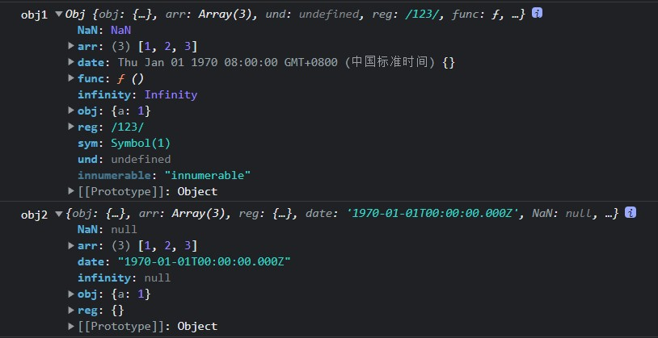
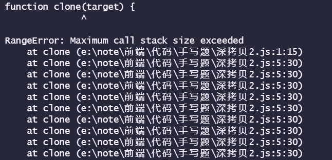
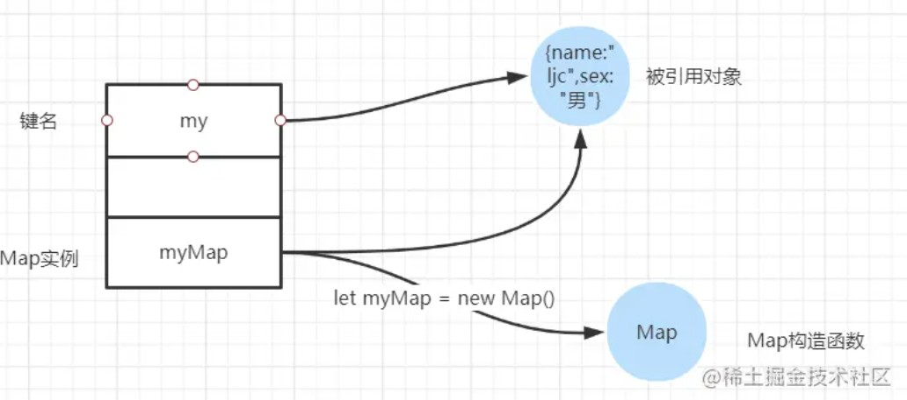
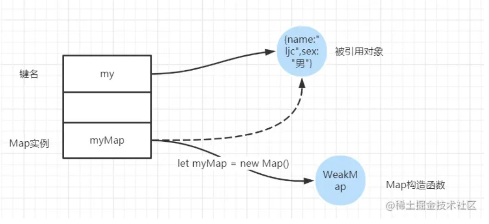

[TOC]


## 写在前面

这里是小飞侠Pan🥳，立志成为一名优秀的前端程序媛！！！

本篇文章收录于我的专栏：[前端精进之路](https://blog.csdn.net/weixin_52834435/category_11886356.html?spm=1001.2014.3001.5482)

同时收录于我的[github](https://github.com/mengqiuleo)前端笔记仓库中，持续更新中，欢迎star~

👉[https://github.com/mengqiuleo/myNote](https://github.com/mengqiuleo/myNote)

<hr>

## 浅拷贝的原理和实现

**浅拷贝的定义**：

> 自己创建一个新的对象，来接受你要重新复制或引用的对象值。如果对象属性是基本的数据类型，复制的就是基本类型的值给新对象；但如果**属性是引用数据类型，复制的就是内存中的地址**，如果其中一个对象改变了这个内存中的地址，肯定会影响到另一个对象。


### 方法一：object.assign

**该方法的第一个参数是拷贝的目标对象，后面的参数是拷贝的来源对象（也可以是多个来源）**。

```
Object.assign(target, ...sources)
```

举例：

```js
let target = {};
let source = {
  a:{
    b:2
  }
};
Object.assign(target, source);
console.log(target);//{ a: { b: 2 } }
source.a.b = 10;
console.log(source);//{ a: { b: 10 } }
console.log(target);//{ a: { b: 10 } }
```


使用 object.assign 方法有几点需要注意：

- 它不会拷贝对象的继承属性；

- 它不会拷贝对象的不可枚举的属性；

- 可以拷贝 Symbol 类型的属性。

举例：

```js
let obj1 = { a:{ b:1 }, sym:Symbol(1)}; 

Object.defineProperty(obj1, 'innumerable' ,{

    value:'不可枚举属性',

    enumerable:false

});

let obj2 = {};

Object.assign(obj2,obj1)

obj1.a.b = 2;

console.log('obj1',obj1);

console.log('obj2',obj2);

```

控制台输出结果：



### 方法二：扩展运算符方式

扩展运算符的语法为：`let cloneObj = { ...obj };`

扩展运算符 和 object.assign 有同样的缺陷，也就是实现的浅拷贝的功能差不多，但是如果属性都是基本类型的值，使用扩展运算符进行浅拷贝会更加方便。

```js
/* 对象的拷贝 */

let obj = {a:1,b:{c:1}}

let obj2 = {...obj}

obj.a = 2

console.log(obj)  //{a:2,b:{c:1}} 
console.log(obj2); //{a:1,b:{c:1}}

obj.b.c = 2

console.log(obj)  //{a:2,b:{c:2}} 
console.log(obj2); //{a:1,b:{c:2}}


/* 数组的拷贝 */

let arr =  [{a:1},{b:2},{c:3}];
let newArr = [...arr]; //跟arr.slice()是一样的效果

console.log(newArr);//[ { a: 1 }, { b: 2 }, { c: 3 } ]

newArr[1].b = 10;

console.log(newArr);//[ { a: 1 }, { b: 10 }, { c: 3 } ]
console.log(arr);//[ { a: 1 }, { b: 10 }, { c: 3 } ]


```


### 方法三：concat 拷贝数组

```js
let arr = [{a:1},{b:2},{c:3}];

let newArr = arr.concat();

console.log(newArr);//[ { a: 1 }, { b: 2 }, { c: 3 } ]

newArr[1].b = 10;

console.log(newArr);//[ { a: 1 }, { b: 10 }, { c: 3 } ]
console.log(arr);//[ { a: 1 }, { b: 10 }, { c: 3 } ]
```


### 方法四：slice 拷贝数组

slice 方法也比较有局限性，因为它仅仅针对数组类型。slice 方法会返回一个新的数组对象，这一对象由该方法的前两个参数来决定原数组截取的开始和结束时间，是不会影响和改变原始数组的。

slice 的语法为：`arr.slice(begin, end);`

```js
let arr = [1, 2, {val: 4}];

let newArr = arr.slice();

newArr[2].val = 1000;

console.log(arr);  //[ 1, 2, { val: 1000 } ]

```


### 手工实现一个浅拷贝

1. 对基础类型做一个最基本的一个拷贝；
2. 对引用类型开辟一个新的存储，并且拷贝一层对象属性。

```js
const shallowClone = (target) => {
    if (typeof target === 'object' && target !== null) {  //如果源对象是引用数据类型

      const cloneTarget = Array.isArray(target) ? []: {}; 

      for (let prop in target) {  //遍历源对象中的属性
        if (target.hasOwnProperty(prop)) { 
            cloneTarget[prop] = target[prop]; 
        }  
      }  
      return cloneTarget; 

    } else {  //如果是基本数据类型，直接返回
      return target;  
    }  
}

let obj = {a:2,b:{c:1}};

let obj1 = shallowClone(obj);

console.log(obj1);//{ a: 2, b: { c: 1 } }

obj1.b.c = 10;
obj1.a = 20;

console.log(obj);//{ a: 2, b: { c: 10 } }
console.log(obj1);//{ a: 20, b: { c: 10 } }

```


## 深拷贝的原理和实现

浅拷贝只是创建了一个新的对象，复制了原有对象的基本类型的值，而引用数据类型只拷贝了一层属性，再深层的还是无法进行拷贝。深拷贝则不同，对于复杂引用数据类型，其在堆内存中完全开辟了一块内存地址，并将原有的对象完全复制过来存放。

这两个对象是相互独立、不受影响的，彻底实现了内存上的分离。

> 将一个对象从内存中完整地拷贝出来一份给目标对象，并从堆内存中开辟一个全新的空间存放新对象，且新对象的修改并不会改变原对象，二者实现真正的分离。


### 方法一：JSON.stringify 实现深拷贝

> 把一个对象序列化成为 JSON 的字符串，并将对象里面的内容转换成字符串，最后再用 JSON.parse() 的方法将JSON 字符串生成一个新的对象。

JSON 的 详细解释：点击这里👉 [JSON 详解](https://blog.csdn.net/weixin_52834435/article/details/123437494?spm=1001.2014.3001.5501)

```js
let obj1 = { a:1, b:[1,2,3] }

let str = JSON.stringify(obj1);

let obj2 = JSON.parse(str);

console.log(obj2);   //{a:1,b:[1,2,3]} 

obj1.a = 2;

obj1.b.push(4);

console.log(obj1);   //{a:2,b:[1,2,3,4]}

console.log(obj2);   //{a:1,b:[1,2,3]}

```


使用 `JSON.stringify` 实现深拷贝的注意点：

1. 拷贝的对象的值中如果有函数、undefined、symbol 这几种类型，经过 JSON.stringify 序列化之后的字符串中这个键值对会消失；
2. 拷贝 Date 引用类型会变成字符串；
3. 无法拷贝不可枚举的属性；
4. 无法拷贝对象的原型链；
5. 拷贝 RegExp 引用类型会变成空对象；
6. 对象中含有 NaN、Infinity 以及 -Infinity，JSON 序列化的结果会变成 null；
7. 无法拷贝对象的循环应用，即对象成环 (obj[key] = obj)。


举例：

```js
function Obj() { 

    this.func = function () { alert(1) }; 
  
    this.obj = {a:1};
  
    this.arr = [1,2,3];
  
    this.und = undefined; 
  
    this.reg = /123/; 
  
    this.date = new Date(0); 
  
    this.NaN = NaN;
  
    this.infinity = Infinity;
  
    this.sym = Symbol(1);
  
} 
  
let obj1 = new Obj();//obj1为原对象
  
Object.defineProperty(obj1,'innumerable',{ 
  
    enumerable:false,
  
    value:'innumerable'
  
});
  
console.log('obj1',obj1);
  
let str = JSON.stringify(obj1);
  
let obj2 = JSON.parse(str);//obj2为拷贝后的对象(即目标对象)
  
console.log('obj2',obj2);
  
```

控制台输出结果：


## 手动实现深拷贝 

### 最基础的深拷贝

```js
function clone(target) {
  if (typeof target === 'object') {
      let cloneTarget = {};
      for (const key in target) {
          cloneTarget[key] = clone(target[key]);// 这里就是与浅拷贝的区别，这里利用了递归，如果某个value值是对象会继续递归下去
      }
      return cloneTarget;
  } else {
      return target;
  }
};
```


### 考虑数组

对数组进行兼容

```js
function clone(target) {
    if (typeof target === 'object') {
        let cloneTarget = Array.isArray(target) ? [] : {};
        for (const key in target) {
            cloneTarget[key] = clone(target[key]);
        }
        return cloneTarget;
    } else {
        return target;
    }
};

```


### 循环引用问题

对下面的案例进行测试：

```js
const target = {
    field1: 1,
    field2: undefined,
    field3: {
        child: 'child'
    },
    field4: [2, 4, 8]
};
target.target = target; // 循环引用

const obj = clone(target);
console.log(obj);
```




可以发现：因为递归进入死循环导致栈内存溢出了。

原因就是上面的对象存在循环引用的情况，即对象的属性间接或直接的引用了自身的情况：

> 解决循环引用问题，我们可以额外开辟一个存储空间，来存储当前对象和拷贝对象的对应关系，当需要拷贝当前对象时，先去存储空间中找，有没有拷贝过这个对象，如果有的话直接返回，如果没有的话继续拷贝，这样就巧妙化解的循环引用的问题。

这个存储空间，需要可以存储`key-value`形式的数据，且`key`可以是一个引用类型，我们可以选择`Map`这种数据结构：

- 检查`map`中有无克隆过的对象
- 有 - 直接返回
- 没有 - 将当前对象作为`key`，克隆对象作为`value`进行存储
- 继续克隆

```js
function clone(target, map = new Map()) {//因为是递归，我们需要将这种映射关系继续向下传递，所以放在参数列表中
    if (typeof target === 'object') {
        let cloneTarget = Array.isArray(target) ? [] : {};
        if (map.get(target)) { //get方法拿到传入的key值的对应value值，如果存在，表明这个对象已经被拷贝过了
            return map.get(target);//返回已经拷贝了的对象即可
        }
        map.set(target, cloneTarget);//不存在，我们要保存源对象和克隆后的对象之间的映射关系
        for (const key in target) {
            cloneTarget[key] = clone(target[key], map);
        }
        return cloneTarget;
    } else {
        return target;
    }
};
```


### 使用WeakMap

> WeakSet中的对象都是弱引用，即垃圾回收机制不考虑 WeakSet 对该对象的引用，也就是说，**如果其他对象都不再引用该对象，那么垃圾回收机制会自动回收该对象所占用的内存，不考虑该对象还存在于 WeakSet 之中**。 这是因为垃圾回收机制根据对象的可达性（reachability）来判断回收，如果对象还能被访问到，垃圾回收机制就不会释放这块内存。结束使用该值之后，有时会忘记取消引用，导致内存无法释放，进而可能会引发内存泄漏。WeakSet 里面的引用，都不计入垃圾回收机制，所以就不存在这个问题。因此，WeakSet 适合临时存放一组对象，以及存放跟对象绑定的信息。只要这些对象在外部消失，它在 WeakSet 里面的引用就会自动消失。 由于上面这个特点，WeakSet 的成员是不适合引用的，因为它会随时消失。另外，由于 WeakSet 内部有多少个成员，取决于垃圾回收机制有没有运行，运行前后很可能成员个数是不一样的，而垃圾回收机制何时运行是不可预测的，因此 ES6 规定 WeakSet 不可遍历。 这些特点同样适用于本章后面要介绍的 WeakMap 结构。-- [阮一峰](https://link.juejin.cn?target=http%3A%2F%2Fwww.ruanyifeng.com%2F)


**用demo来解释强引用和弱引用**

```js
// 对于强引用
const myMap = new Map()
let my = {
    name: "ljc",
    sex: "男"
}
myMap.set(my, 'info');
console.log(myMap);
```



```js
// 对于弱引用
const myMap = new WeakMap()
let my = {
    name: "ljc",
    sex: "男"
}
myMap.set(my, 'info');
console.log(myMap);
```



> `WeakMap` 保持了对键名所引用的对象的弱引用，即垃圾回收机制不将该引用考虑在内。只要所引用的对象的其他引用都被清除，垃圾回收机制就会释放该对象所占用的内存。也就是说，一旦不再需要，`WeakMap` 里面的键名对象和所对应的键值对会自动消失，不用手动删除引用。


而对于这里的实现深拷贝，我们需要对源对象进行标记，用weakMap来记录这个源对象是否被拷贝了，也就是说，在我们的weakmap实例中，源对象是作为key值存在，当完成拷贝后，如果这个源对象不再被需要且没有被其他对象引用，那么这个对象会被垃圾回收机制回收。即使我们现在还存在使用weakmap对源对象进行引用。

```js
function clone(target, map = new WeakMap()) {//因为是递归，我们需要将这种映射关系继续向下传递，所以放在参数列表中
    if (typeof target === 'object') {
        let cloneTarget = Array.isArray(target) ? [] : {};
        if (map.get(target)) { //get方法拿到传入的key值的对应value值，如果存在，表明这个对象已经被拷贝过了
            return map.get(target);//返回已经拷贝了的对象即可
        }
        map.set(target, cloneTarget);//不存在，我们要保存源对象和克隆后的对象之间的映射关系
        for (const key in target) {
            cloneTarget[key] = clone(target[key], map);
        }
        return cloneTarget;
    } else {
        return target;
    }
};
```


### 使用Reflect.ownKeys()方法，并对symbol类型拷贝

Reflect有什么用呢？

- 它主要提供了很多操作JavaScript对象的方法，有点像Object中操作对象的方法；
  - 比如 Reflect.getPrototypeOf(target) 类似于 Object.getPrototypeOf()；
  - 比如 Reflect.defineProperty(target, propertyKey, attributes) 类似于Object.defineProperty() ；
- 如果我们有Object可以做这些操作，那么为什么还需要有Reflect这样的新增对象呢？
  - 这是因为在早期的ECMA规范中没有考虑到这种对对象本身的操作如何设计会更加规范，所以将这些API放到了Object上面；
  - 但是Object作为一个构造函数，这些操作实际上放到它身上并不合适；
  - 另外还包含一些类似于in、delete操作符，让JS看起来是会有一些奇怪的；
  - 所以在ES6中新增了Reflect，让我们这些操作都集中到了Reflect对象上；
    

> Reflect 对象的方法和object一一对应的，并且大部分与 Object 对象的同名方法的作用都是相同的。
>
> `Reflect.ownKeys()`方法可以返回所有类型的键名，包括常规键名和 **Symbol 键名**。

```js
function clone(target, map = new WeakMap()) {//因为是递归，我们需要将这种映射关系继续向下传递，所以放在参数列表中
  if (typeof target === 'object') {
      let cloneTarget = Array.isArray(target) ? [] : {};
      if (map.get(target)) { //get方法拿到传入的key值的对应value值，如果存在，表明这个对象已经被拷贝过了
          return map.get(target);//返回已经拷贝了的对象即可
      }
      map.set(target, cloneTarget);//不存在，我们要保存源对象和克隆后的对象之间的映射关系
      Reflect.ownKeys(target).forEach(key => {
        cloneTarget[key] = clone(target[key], map);
      })
      return cloneTarget;
  } else {
      return target;
  }
};
```


测试代码如下：

```js
const target = {
  field1: 1,
  field2: undefined,
  field3: {
      child: 'child'
  },
  field4: [2, 4, 8],
  [Symbol('1')]: 1,//symbol类型
};
target.target = target; // 循环引用

const obj = clone(target);
console.log(obj);

/*
<ref *1> {
  field1: 1,
  field2: undefined,
  field3: { child: 'child' },
  field4: [ 2, 4, 8 ],
  target: [Circular *1],
  [Symbol(1)]: 1
}
*/
```


**参考文章**

[浅析 Map 和 WeakMap 区别以及使用场景](https://juejin.cn/post/6993101968545677319#heading-29)

[如何写出一个惊艳面试官的深拷贝?](https://juejin.cn/post/6844903929705136141#heading-6)