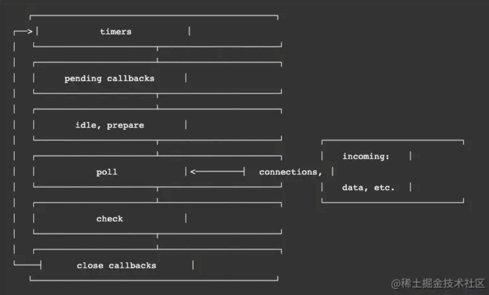

[TOC]


## 写在前面

这里是小飞侠Pan🥳，立志成为一名优秀的前端程序媛！！！

本篇文章收录于我的专栏：[前端精进之路](https://blog.csdn.net/weixin_52834435/category_11886356.html?spm=1001.2014.3001.5482)

同时收录于我的[github](https://github.com/mengqiuleo)前端笔记仓库中，持续更新中，欢迎star~

👉[https://github.com/mengqiuleo/myNote](https://github.com/mengqiuleo/myNote)

<hr>

## 一、浏览器中的Event Loop

### 宏任务与微任务

可以理解是每次执行栈执行的代码就是一个宏任务（包括每次从事件队列中获取一个事件回调并放到执行栈中执行）。

包括 script 全部代码、setTimeout、setInterval、setImmediate（Node.js）、requestAnimationFrame（浏览器）、I/O 操作、UI 渲染（浏览器），这些代码执行便是宏任务。

- 每一个task会从头到尾将这个任务执行完毕，不会执行其它
- 浏览器为了能够使得JS内部task与DOM任务能够有序的执行，会在一个task执行结束后，在下一个 task 执行开始前，对页面进行重新渲染

```
（`task->渲染->task->...`）
```


常见宏任务：

**事件队列中的每一个事件都是一个macrotask**

- setTimeout()

- setInterval()

- setImmediate()
- 常见的点击和键盘等事件
- 主代码块

常见微任务：

- promise.then()、promise.catch()

- new MutaionObserver()

- process.nextTick()


### 执行过程：

在浏览器的异步回调队列中，宏任务和微任务的执行过程如下：

1. **宏任务队列一次只从队列中取一个任务执行**，执行完后就去执行微任务队列中的任务。
2. 微任务队列中所有的任务都会被依次取出来执行，直到微任务队列为空。

3. 在执行完所有的微任务之后，执行下一个宏任务之前，浏览器会执行 UI 渲染操作、更新界面。

**微任务是在当前事件循环的尾部去执行；宏任务是在下一次事件循环的开始去执行。**


### async/await(微任务)执行顺序

> async/await成对出现，async标记的函数会返回一个Promise对象，可以使用then方法添加回调函数。在await之前的语句，await后面的语句会同步执行。但 await 下面的语句会被当成**微任务**添加到当前任务队列的末尾异步执行。

#### 一个demo

```js
async function async1(){
    console.log('async1 start')
    await async2()
    console.log('async1 end')
}
async function async2(){
    console.log('async2')
}
console.log('script start')
setTimeout(function(){
    console.log('setTimeout') 
},0)  
async1();
new Promise(function(resolve){
    console.log('promise1')
    resolve();
}).then(function(){
    console.log('promise2')
})
console.log('script end')
```

打印结果为：

```
script start --> async1 start --> async2 --> promise1 --> script end --> async1 end
--> promise2 --> setTimeout
```

分析：

- 先定义函数async1，async2。输出同步代码 `script start`
- 将`setTimeout`里面的回调函数(宏任务)添加到下一轮任务队列。因为这段代码前面没有执行任何的异步操作且等待时间为0s。所以回调函数会被立刻放到下一轮任务队列的开头。
- 执行`async1`，因为async函数里面await标记之前的语句和 await 后面的语句是同步执行的，所以这里先后输出`async1 start`，`async2`。
- 这时暂停执行下面的语句，相当于变成一个promise.then，下面的语句被放到当前队列的最后。
- 继续执行同步任务。
- 输出`Promise1`。将then里面的函数放在当前队列的最后。
- 然后输出`script end`，此时同步任务执行完毕，微任务队列中有两个微任务。队列是先进先出的结构，所以这里先输出`async1 end`，再输出`Promise2`。
- 然后执行下一个宏任务，执行`setTimeout`里面的异步函数。输出`setTimout`。


#### 另一个demo

```js
console.log('script start')

async function async1() {
    await async2()
    console.log('async1 end')
}
async function async2() {
    console.log('async2 end')
    return Promise.resolve().then(()=>{
        console.log('async2 end1')
    })
}
async1()

setTimeout(function() {
    console.log('setTimeout')
}, 0)

new Promise(resolve => {
    console.log('Promise')
    resolve()
})
.then(function() {
    console.log('promise1')
})
.then(function() {
    console.log('promise2')
})

console.log('script end')
```

打印结果：

```js
script start
async2 end
Promise
script end
async2 end1
promise1
promise2
async1 end
setTimeout
```

**分析：**

- 首先输出`script start`,定义函数：async1，async2。然后执行async1()
- 在async1()首先会进入到async2()中，输出`async2 end`。然后async2返回的是一个promise微任务，所以将`async2 end1`放入队列，注意：此时`保留async1函数的上下文（ 这里并不会动 await 下面的代码，也就是不会将它变成一个微任务 ）`，因为await后面的语句是同步执行，但是要等到await后面的语句有了返回值，才能把下面的语句放入微任务
- 继续向下执行，将setTimeout放入宏任务队列
- 执行promise中的同步代码`Promise`，然后将`promise1`放入微任务队列，注意：此时并不会将`promise2`放入队列，它并不是一下将所有的都放入微任务队列，而是等到上一个then有了返回值才会将下一个then放入队列。
- 继续执行同步代码`script end`。此时开始执行微任务队列
- 首先输出`async2 end`，然后此时并不会回到async1()，async1()是属于下一轮的微任务了。
- 此时会执行`promise1`，然后这个promise有了返回值，将`promise2`加入微任务队列
- 然后取出微任务队列中的`promise2`执行。然后此时微任务队列为空
- 然后`回到async1函数，并将await后面的代码注册为微任务并执行`。
- 最后执行那个宏任务。


#### 二者对比

分析：

第二个例子和上面的第一个例子的区别是：

- 第一个例子的await 后面跟的是一个直接变量，这种情况直接相当于`把await下面的代码注册为promise.then(一个微任务)`。然后跳出async1函数，继续向下执行其他代码。
- 第二个例子是await后面跟的是一个异步函数的调用，此时`将这个异步函数放入微任务队列`，然后`保留async1函数的上下文（ 这里并不会动 await 下面的代码，也就是不会将它变成一个微任务 ）`，执行其他同步代码，当同步代码执行完毕后，此时微任务队列中第一个是async2函数里的异步，取出并执行，**然后执行promise放入的两个微任务**。目前微任务队列已经空了，然后`回到async1函数，并将await后面的代码注册为微任务并执行`。最后执行那个宏任务。


## 二、Node 中的 Event Loop

> 在node中，首先会开启一个node进程，node进程也是多线程的
>
> 其中有一个是js线程，用来执行js代码
>
> 其他线程用来执行 I/O操作，setTimeout，网络请求

Node.js的运行机制如下:

- V8引擎解析JavaScript脚本。
- 解析后的代码，调用Node API。
- libuv库负责Node API的执行。它将不同的任务分配给不同的线程，形成一个Event Loop（事件循环），以异步的方式将任务的执行结果返回给V8引擎。
- V8引擎再将结果返回给用户。


### 事件循环各阶段



**执行的几个阶段**

1. **timers 阶段：执行 timers 的回调，也是执行 setTimeout 和 setInterval 的回调**
2. pending IO callbacks：系统操作的回调
3. idle，pepare：内部使用
4. **poll：等待新的 I/O 事件进来**
5. **check：执行 setImmediate 回调**
6. close callbacks：内部使用

**只需关注 1、4、5 阶段**


#### timer阶段

**timers阶段有几个setTimeout/setInterval都会依次执行**，并不像浏览器端，每执行一个宏任务后就去执行一个微任务

```js
console.log('start')
setTimeout(() => {
  console.log('timer1')
  Promise.resolve().then(function() {
    console.log('promise1')
  })
}, 0)
setTimeout(() => {
  console.log('timer2')
  Promise.resolve().then(function() {
    console.log('promise2')
  })
}, 0)
Promise.resolve().then(function() {
  console.log('promise3')
})
console.log('end')
//start=>end=>promise3=>timer1=>timer2=>promise1=>promise2
```


#### poll阶段

poll 是一个至关重要的阶段，这一阶段中，系统会做两件事情

1.回到 timer 阶段执行回调

2.执行 I/O 回调

并且在进入该阶段时如果没有设定了 timer 的话，会发生以下两件事情

- 如果 poll 队列不为空，会遍历回调队列并同步执行，直到队列为空或者达到系统限制
- 如果 poll 队列为空时，会有两件事发生
  - 如果有 setImmediate 回调需要执行，poll 阶段会停止并且进入到 check 阶段执行回调
  - 如果没有 setImmediate 回调需要执行，会等待回调被加入到队列中并立即执行回调，这里同样会有个超时时间设置防止一直等待下去

当然设定了 timer 的话且 poll 队列为空，则会判断是否有 timer 超时，如果有的话会回到 timer 阶段执行回调。


### setImmediate 和 setTimeout

- setImmediate 设计在poll阶段完成时执行，即check阶段；
- setTimeout 设计在poll阶段为空闲时，且设定时间到达后执行，但它在timer阶段执行

**执行定时器的顺序将根据调用它们的上下文而有所不同。 如果从主模块中调用两者，那么时间将受到进程性能的限制。**

#### demo1

```js
console.log('outer');

setTimeout(() => {
  setTimeout(() => {
    console.log('setTimeout');
  }, 0);
  setImmediate(() => {
    console.log('setImmediate');
  });
}, 0);
```

运行结果：

```js
outer
setImmediate
setTimeout
```

解释：

- 首先最外面是一个setTimeout，所以执行当前的回调的时候已经在`timers`阶段了
- 处理里面的`setTimeout`，因为本次循环的`timers`正在执行，所以他的回调其实加到了下个`timers`阶段
- 处理里面的`setImmediate`，将它的回调加入`check`阶段的队列

- 外层`timers`阶段执行完，进入`pending callbacks`，`idle, prepare`，`poll`，这几个队列都是空的，所以继续往下

- 到了`check`阶段，发现了`setImmediate`的回调，拿出来执行

- 然后是`close callbacks`，队列是空的，跳过

- 又是`timers`阶段，执行我们的`console`


#### demo2

```js
console.log('outer');

setTimeout(() => {
  console.log('setTimeout');
}, 0);

setImmediate(() => {
  console.log('setImmediate');
});
```

运行结果：

```js
outer
setTimeout
setImmediate
```

但是运行结果不唯一：

```
outer
setImmediate
setTimeout
```

**解释上面的情况：**

node.js里面`setTimeout(fn, 0)`会被强制改为`setTimeout(fn, 1)`

> 官方文档说明：**当`delay`大于`2147483647`或小于`1`时，`delay`将设置为`1`。非整数延迟被截断为整数。**

HTML 5里面`setTimeout`最小的时间限制是4ms

对于上面的情况：

- 首先上述代码在nodejs进程的js线程中执行(nodejs也是多线程的)
- 遇到`setTimeout`，虽然设置的是0毫秒触发，但是被node.js强制改为1毫秒，塞入`times`阶段
- 遇到`setImmediate`塞入`check`阶段
- 同步代码执行完毕，进入Event Loop
- 先进入`times`阶段，检查当前时间过去了1毫秒没有，如果过了1毫秒，满足`setTimeout`条件，执行回调，如果没过1毫秒，跳过
- 跳过空的阶段，进入check阶段，执行`setImmediate`回调


而我们demo1中的例子是在`timers`阶段，所以里面的`setTimeout`只能等下个循环了，所以`setImmediate`肯定先执行

同理的还有其他`poll`阶段的API也是这样的，比如：

```js
var fs = require('fs')

fs.readFile(__filename, () => {
    setTimeout(() => {
        console.log('setTimeout');
    }, 0);
    setImmediate(() => {
        console.log('setImmediate');
    });
});
```

这里`setTimeout`和`setImmediate`在`readFile`的回调里面，由于`readFile`回调是I/O操作，他本身就在`poll`阶段，所以他里面的定时器只能进入下个`timers`阶段，但是`setImmediate`却可以在接下来的`check`阶段运行，所以`setImmediate`肯定先运行，他运行完后，去检查`timers`，才会运行`setTimeout`。

类似的，再来看一段代码，如果他们两个不是在最外层，而是在`setImmediate`的回调里面，其实情况跟外层一样，结果也是随缘的，看下面代码:

```javascript
console.log('outer');

setImmediate(() => {
  setTimeout(() => {
    console.log('setTimeout');
  }, 0);
  setImmediate(() => {
    console.log('setImmediate');
  });
});
```

原因跟写在最外层差不多，因为`setImmediate`已经在`check`阶段了，里面的循环会从`timers`阶段开始，会先看`setTimeout`的回调，如果这时候已经过了1毫秒，就执行他，如果没过就执行`setImmediate`。


> `setImmediate`和`setTimeout(fn, 0)`哪个回调先执行，需要看他们本身在哪个阶段注册的，如果在定时器回调或者I/O回调里面，`setImmediate`肯定先执行。如果在最外层或者`setImmediate`回调里面，哪个先执行取决于当时机器状况。


### process.nextTick() 

process.nextTick()比 promise.then() 的执行还早，在同步任务之后，其他所有异步任务之前，会优先执行 nextTick。可以想象是把 nextTick 的任务放到了当前循环的后面，与 promise.then() 类似，但比 promise.then() 更前面。

意思就是在当前同步代码执行完成后，不管其他异步任务，先尽快执行 nextTick。

> process.nextTick 是一个独立于 eventLoop 的任务队列。
>
> 在每一个 eventLoop 阶段完成后会去检查 nextTick 队列，如果里面有任务，会让这部分任务优先于微任务执行。

```js
const promise = Promise.resolve()
setImmediate(() => {
  console.log('setImmediate');
});
promise.then(()=>{
    console.log('promise')
})
process.nextTick(()=>{
    console.log('nextTick')
})
```

运行结果：

```
nextTick
promise
setImmediate
```


### 一个demo

```js
async function async1() {
  console.log('async start')
  await async2()
  console.log('async1 end')
}

async function async2() {
  console.log('async2')
}

console.log('script start')

setTimeout(function () {
  console.log('setTimeout0')
},0)

setTimeout(function () {
  console.log('setTimeout2')
},300)

setImmediate(() => console.log('setImmediate'))

process.nextTick(() => console.log('nextTick1'))

async1()

process.nextTick(() => console.log('nextTick2'))

new Promise(function (resolve) {
  console.log('promise1')
  resolve()
  console.log('promise2')
}).then(function () {
  console.log('promise3')
})

console.log('script end')
```

打印结果：

```js
script start
async start
async2
promise1
promise2
script end
nextTick1
nextTick2
async1 end
promise3
setTimeout0
setImmediate
setTimeout2
```

**分析**：

对应的队列有：

```
 ① main script      ② nextTick       ③ other micro        ④ timers        ⑤ check
```

- 首先定义async1() 和 async2()，然后执行同步代码script start。
- 然后将setTimeout0加入timers队列，而对于setTimeout2会先进行定时器执行300ms,此时还没有进入timers队列。
- 然后将setImmediate放入check队列。
- 接下来将nextTick1放入nextTick队列。
- 执行async1(),输出async1 satrt,然后跳到async2()中，输出async2,再回到async1()中，将async1 end放入other micro队列中。
- 接下来将nextTick2放入nextTick队列。
- 此时执行Promsie中的同步代码promise1，将then的promise3放入other micro队列中，继续输出promise2。
- 接下来输出script end。此时同步代码已经执行完毕。
- 因为nextTick的优先级高，所以依次执行nextTick1和nextTick2。
- 然后执行other micro队列中的代码，输出async1 end,再输出promise3。
- 此时微任务队列已为空，执行宏任务队列，`首先进入timer阶段`，先输出setTimeout0，然后执行`check`队列，输出setImmediate
- 注意，此时setTimeout2的定时器(延迟300ms)执行完毕后，将它加入`timers`队列，然后取出执行，输出setTimeout2。


## 三、总结

1. JS所谓的“单线程”只是指主线程只有一个，并不是整个运行环境都是单线程
2. JS的异步靠底层的多线程实现
3. 异步线程与主线程通讯靠的是Event Loop
4. 异步线程完成任务后将其放入任务队列
5. 主线程不断轮询任务队列，拿出任务执行
6. `process.nextTick`不在Event Loop的任何阶段，他是一个特殊API，他会立即执行，然后才会继续执行Event Loop


**参考文章**

[setTimeout和setImmediate到底谁先执行，本文让你彻底理解Event Loop](https://juejin.cn/post/6844904100195205133#heading-7)