# 【前端精进之路】JS篇：第15期 JavaScript模块化规范

[TOC]


## CommonJS规范

- Node是CommonJS在服务器端一个具有代表性的实现；

- webpack打包工具具备对CommonJS的支持和转换；

> - exports和module.exports可以负责对模块中的内容进行导出；
> - require函数可以帮助我们导入其他模块（自定义模块、系统模块、第三方库模块）中的内容；


### 使用

**exports - require**

```js
//导出.js
const UTIL_NAME = "util-name"

function formatCount(){
	return '200'
}

function formatDate(){
	return '2022-10-10'
}

exports.UTIL_NAME = UTIL_NAME
exports.formatCount = formatCount
exports.formatDate = formatDate


//导入.js
const util = require('./util.js')
// 或者使用结构
const {
	UTIL_NAME
	formatCount,
	formatDate
} = require('./util.js')

console.log(util.UTIL_NAME)
console.log(util.formatCount())
console.log(util.formatDate())
```

**exports是一个对象，我们可以在这个对象中添加很多个属性，添加的属性会导出**

exprots导出的原理：

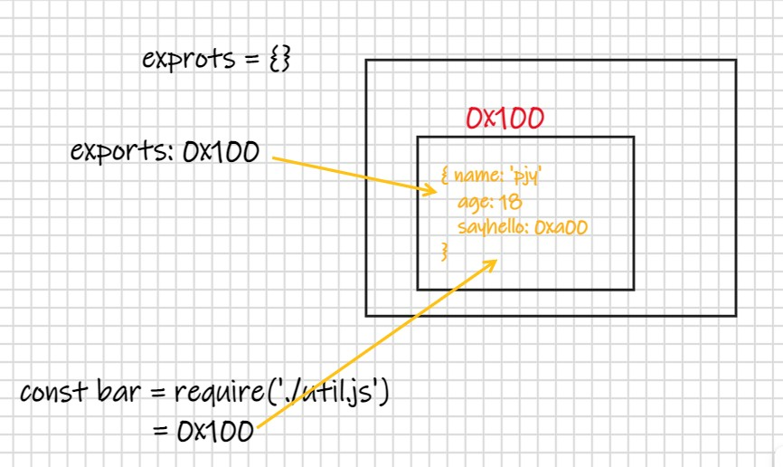

exports导出一个对象，require导入这个对象，它们指向的是同一个对象，在一个文件中对该对象进行修改，另一个文件中也会受到影响。

验证：

```js
//导出.js
let name = 'bar'
exports.name = name
//新增代码
setTimeout(() => {
	console.log(exports.name) //会被修改
},4000)

//导入.js
const bar = require('./bar.js')
console.log(bar.name)
//新增代码
setTimeout(() => {
  bar.name = 'kobe' //在引用的地方修改值，看源文件会不会被修改
},2000)
```


**module.exports导出**

上面的exports.name = name 导出方式用的很少

使用 module.exports.name = name 也可以实现导出，这里和上面的导出并没有什么区别

```js
let name = 'bar'
let age = 18

module.exports.name = name
module.exports.age = age
```

module.exports原理：

module是一个对象，exports也是一个对象。在node中每一个模块都是Module的一个实例，那么这个实例上会有一个属性exports，即`module.exports`，并且`module.exports`的属性值是个对象，指向exports对象。

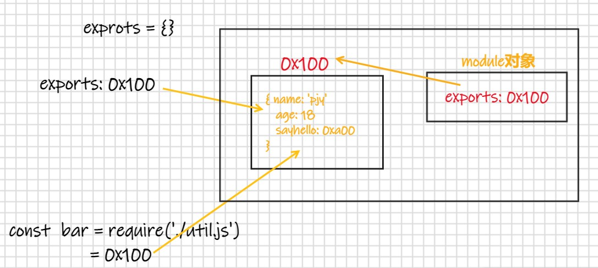

**module.exports和exports有什么关系或者区别呢？**

- CommonJS中是没有module.exports的概念的；

- 但是为了实现模块的导出，Node中使用的是Module的类，每一个模块都是Module的一个实例，也就是module；

- 所以在Node中真正用于导出的其实根本不是exports，而是module.exports；

- 因为module才是导出的真正实现者；

**但是，为什么exports也可以导出呢？**

- 这是因为module对象的exports属性是exports对象的一个引用；

- 也就是说 module.exports = exports = 一个对象；

```
exports === module.exports // true
```


开发中最常见的写法：

```js
module.exports = {

}
```

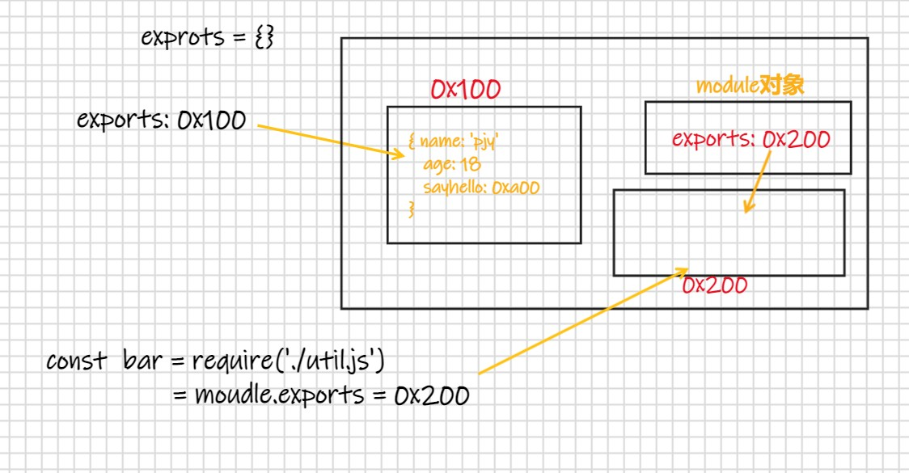


### require细节

我们现在已经知道，require是一个函数，可以帮助我们引入一个文件（模块）中导出的对象。

并且在引入文件时，我们可以省略文件名后缀，为什么？require的查找规则是怎么样的呢？

导入格式如下：require(X)

- 情况一：X是一个Node核心模块，比如path、http

​		  直接返回核心模块，并且停止查找

- 情况二：X是以./ 或../ 或/（根目录）开头的

  - 第一步：将X**当做一个文件**在对应的目录下查找；
    1.如果有后缀名，按照后缀名的格式查找对应的文件
    2.如果没有后缀名，会按照如下顺序：
    - 直接查找文件X
    - 查找X.js文件
    - 查找X.json文件
    - 查找X.node文件

  - 第二步：没有找到对应的文件，将X**作为一个目录**
    查找目录下面的index文件
    - 查找X/index.js文件

    - 查找X/index.json文件

    - 查找X/index.node文件

  - 如果没有找到，那么报错：not found

- 情况三：直接是一个X（没有路径），并且X不是一个核心模块

  - 自定义模块，先在当前目录的`node_modules`里找这个模块，如果没有，它会往上一级目录查找，查找上一级的`node_modules`，依次往上，直到根目录下都没有, 就抛出错误。

  - ```js
    LinDaiDaideMBP:commonJS lindaidai$ node test.js
    [
      '/Users/lindaidai/codes/test/CommonJS和ES6/commonJS/node_modules',
      '/Users/lindaidai/codes/test/CommonJS和ES6/node_modules',
      '/Users/lindaidai/codes/test/node_modules',
      '/Users/lindaidai/codes/node_modules',
      '/Users/lindaidai/node_modules',
      '/Users/node_modules',
      '/node_modules'
    ]
    ```

    


**模块的加载过程**

- 结论一：模块在被第一次引入时，模块中的js代码会被运行一次

- 结论二：模块被多次引入时，会缓存，最终只加载（运行）一次

  - 为什么只会加载运行一次呢？
  - 这是因为每个模块对象module都有一个属性：loaded。
  - 为false表示还没有加载，为true表示已经加载；

- 结论三：如果有循环引入，那么加载顺序是什么？

  - 如果出现下图模块的引用关系，那么加载顺序是什么呢？

    - 这个其实是一种数据结构：图结构；

    - 图结构在遍历的过程中，有深度优先搜索（DFS, depth first search）和广度优先搜索（BFS, breadth first search）；

    - Node采用的是深度优先算法：main -> aaa -> ccc -> ddd -> eee ->bbb

      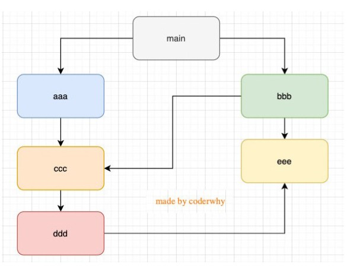


### CommonJS规范缺点

- CommonJS加载模块是同步的：
  - 同步的意味着只有等到对应的模块加载完毕，当前模块中的内容才能被运行；
  - 这个在服务器不会有什么问题，因为服务器加载的js文件都是本地文件，加载速度非常快；
- 如果将它应用于浏览器呢？
  - 浏览器加载js文件需要先从服务器将文件下载下来，之后再加载运行；
  - 那么采用同步的就意味着后续的js代码都无法正常运行，即使是一些简单的DOM操作；
- 所以在浏览器中，我们通常不使用CommonJS规范：
  - 当然在webpack中使用CommonJS是另外一回事；
  - 因为它会将我们的代码转成浏览器可以直接执行的代码；
- 在早期为了可以在浏览器中使用模块化，通常会采用AMD或CMD：
  - 但是目前一方面现代的浏览器已经支持ES Modules，另一方面借助于webpack等工具可以实现对CommonJS或者ESModule代码的转换；
  - AMD和CMD已经使用非常少了


### 总结

- 每个文件就是一个模块，有自己的作用域。每个模块内部，module变量代表当前模块，是一个对象，它的exports属性（即module.exports）是对外的接口。
- module.exports属性表示当前模块对外输出的接口，其他文件加载该模块，实际上就是读取module.exports变量。
- 为了方便，Node为每个模块提供一个exports变量，指向module.exports。

```java
let exports = module.exports
```

- require命令用于加载模块文件。 **CommonJS加载原理：**
   CommonJS模块就是一个脚本文件，require命令第一次加载该脚本时就会执行整个脚本，然后在内存中生成该模块的一个说明对象。

```java
{
    id: '',  //模块名，唯一
    exports: {  //模块输出的各个接口
        ...
    },
  	filename: '/absolute/path/to/entry.js', // 当前模块的绝对路径
    loaded: true,  //模块的脚本是否执行完毕
    children: [], // 被该模块引用的模块
  	parent: '', // 第一个引用该模块的模块
  	paths: [ // 模块的搜索路径
   		'/absolute/path/to/node_modules',
   		'/absolute/path/node_modules',
   		'/absolute/node_modules',
   		'/node_modules'
  	]
}
```

以后用到这个模块时，就会到对象的`exports`属性中取值。即使再次执行`require`命令，也不会再次执行该模块，而是到缓存中取值。
 `CommonJS模块`是加载时执行，即脚本代码在`require`时就全部执行。一旦出现某个模块被“循环加载/引用”，就只输出已经执行的部分，没有执行的部分不会输出。


## ES6 模块

### 定义和引用

> ES6模块与CommonJS有本质区别，ES6模块对导出变量，方法，对象是动态引用，JS 引擎对脚本静态分析的时候，遇到模块加载命令`import`，就会生成一个只读引用。等到脚本真正执行时，再根据这个只读引用，到被加载的那个模块里面去取值。

ES Module和CommonJS的模块化有一些不同之处：

- 一方面它使用了import和export关键字；
- 另一方面它采用编译期的静态分析，并且也加入了动态引用的方式；

ES Module模块采用export和import关键字来实现模块化：

- export负责将模块内的内容导出；

- import负责从其他模块导入内容；

**采用ES Module将自动采用严格模式：use strict**


虽然大部分主流浏览器支持 ES6 模块，但是和引入普通 JS 的方式略有不同，需要在对应 script 标签中将属性 type 值设置为“module”才能被正确地解析为 ES6 模块；

```
<script src="./main.js" type="module"></script>
```

并且，我们不允许将该html的文件直接在浏览器中打开： 如果你通过本地加载 HTML 文件 (比如一个 `file://` 路径的文件), 你将会遇到 CORS 错误，因为 JavaScript 模块安全性需要。你需要通过一个服务器来测试。一般使用 Live Server 插件。


导入与导出

```js
//导出.js
const name = 'zs'
const age = 18

export {
	name,
	age
}
export {
  name as fName,
  age as fAge,
  foo as fFoo
}
export const name = "pjy";


//导入.js
import { name, age } from './foo.js' //注意这里必须要加文件后缀名

import {name as fName,age as fAge} from "./foo.js"

import * as foo from "./foo.js"
//在使用时
console.log(foo.name);
console.log(foo.age);
```


### default用法

**在一个模块中，只能有一个默认导出（default export）**。

- 默认导出export时可以不需要指定名字；
- 在导入时不需要使用{}，并且可以自己来指定名字；

```js
//foo.js
const foo = "foo value";

export default foo;


//main.js
import pjy from "./foo.js"

console.log(pjy);//foo value
```


**通过import加载一个模块，是不可以在其放到逻辑代码中的**

但是某些情况下，我们确确实实希望动态的来加载某一个模块：

这个时候我们需要使用 import() 函数来动态加载；

import函数返回一个Promise，可以通过then获取结果；

```js
let flag = true;
if(flag){
	import('./moudles/aaa.js').then(res => {
		console.log(res.name, res.age)
	})
} else {
	import('./moudles/aaa.js').then(aaa => {
		//...
	})
}
```


### 关于值的引用

**ES6 模块输出的是值的引用，export default 也是对值的引用** 

1. 在a.js中输出一个对象，属性value的值为10

```js
// a.js
export default {
    value: 10,
}
```

2. 在b.js中引用a.js中输出的对象，并输出一个打印a对象的函数

```javascript
// b.js
import defA from './a';
export default function logA() {
    console.log(defA);
}
```

3. 在c.js中引用a.js中输出的对象与b.js中的方法，设置a对象的value为20后调用logA方法

```javascript
// c.js
import defA from './a';
import logA from './b';
defA.value = 20;
logA();
// {value: 20}
```

4. 可以看到打印出来的a对象的value值为20，这说明a提供的对象中的属性值被修改了。


**import的单个值是只读的**

输入的模块变量是不可重新赋值的，它只是个可读引用，不过却可以改写属性，例子在上面已经写了

1. 在a.js中输出一个变量a，值为10

```ini
// a.js
export let a = 10;
```

2. 在b.js中获取a.js中输出的a，并将其赋值为20

```javascript
// b.js
import { a } from './a';
a = 20;
// ReferenceError: a is not defined
```

3. 在经过webpack打包后在浏览器中将报出引用错误。

4. 换一种方式看看能不能修改a的值，在c.js中用import as来获取a.js输出的值，再修改a的值

```javascript
// c.js
import * as A from './a';
A.a = 20;
// TypeError: Cannot set property a of #<Object> which has only a getter
```

5. 可以看到，经过webpack打包之后，依然不能如愿修改a的值。


**当前脚本(内部)内可以修改输出的单个值**

1. a.js中输出a为10，并在两秒后修改变量a的值为20

```ini
// a.js
export let a = 10;
setTimeout(function () {
    console.log('两秒后修改a的值为20');
    a = 20;
}, 2000);
```

2. b.js中获取a的值，分别在获取后就打印和获取三秒后打印

```javascript
import { a } from './a';
console.log(a);
setTimeout(function () {
    console.log(a);
}, 3000);
// b.js：10
// a.js: 两秒后修改a的值为20
// b.js: 20
```

3. 可以看到当前脚本内可以修改输出的值，并且会在修改后应用到所有引用该值的地方。


**补充说明**

1. export或export default一个对象时，对象的属性在外部脚本中都是可以修改的。
2. export default的单个值在外部脚本中也是不能修改的，只是属性可以被修改。

为了保证数据的稳定性，应当尽量使用export输出多个变量的值，而不是使用export default输出一个包含多个属性的对象。


## ESModule的解析流程

ESModule是如何被浏览器解析并且让模块之间可以相互引用的呢？

👉 https://hacks.mozilla.org/2018/03/es-modules-a-cartoon-deep-dive/

当你使用模块进行开发时，你会构建一个依赖关系图。不同依赖项之间的连接来自你使用的任何导入语句。

这些导入语句是浏览器或 Node 如何确切知道它需要加载哪些代码的方式。你给它一个文件(比如以main.js作为入口文件)以用作依赖关系图的入口点。从那里它开始跟随任何导入语句来查找其余代码。

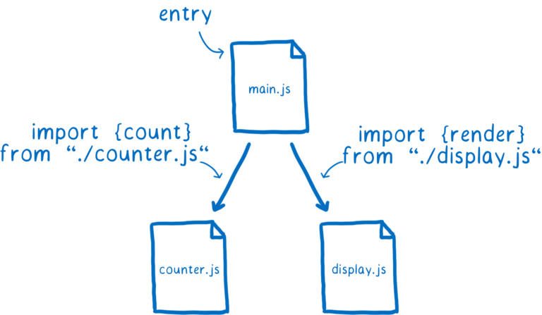

但是文件本身并不是浏览器可以使用的。它需要解析所有这些文件以将它们转换为称为模块记录的数据结构。这样，它实际上才能知道文件中发生了什么。

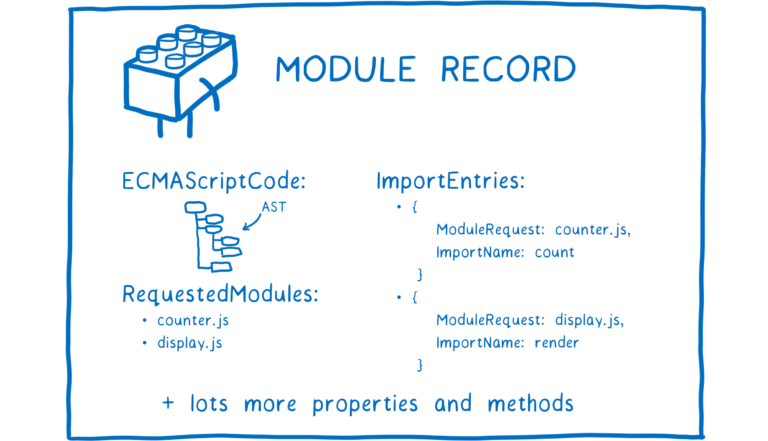

之后，需要将模块记录转化为模块实例。一个实例结合了两件事：代码和状态。

代码基本上是一组指令。这就像一个如何制作东西的食谱。但就其本身而言，您不能使用代码做任何事情。您需要原材料才能按照这些说明使用。

什么是状态？状态给你那些原材料。状态是变量在任何时间点的实际值。当然，这些变量只是内存中保存值的盒子的昵称。

所以模块实例将代码（指令列表）与状态（所有变量的值）结合起来。

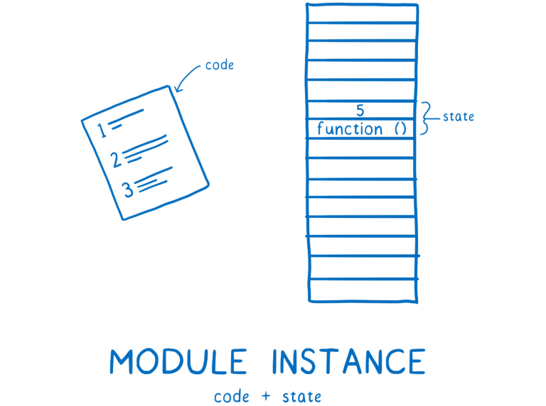

我们需要的是每个模块的模块实例。模块加载的过程是从这个入口点文件到拥有完整的模块实例图。

对于 ES 模块，这发生在三个步骤中。

- 阶段一：构建（Construction），根据地址查找js文件，并且下载，将其解析成模块记录（Module Record）；

- 阶段二：实例化（Instantiation），对模块记录进行实例化，并且分配内存空间，解析模块的导入和导出语句，把模块指向对应的内存地址。

- 阶段三：运行（Evaluation），运行代码，计算值，并且将值填充到内存地址中；

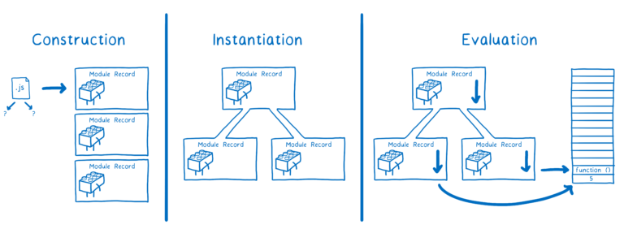


### 阶段一：构建阶段

在构建阶段，每个模块都会发生三件事。

1. 找出从哪里下载包含模块的文件（又名模块解析）
2. 获取文件（通过从 URL 下载或从文件系统加载）
3. 将文件解析为模块记录

#### 查找文件并获取它

loader将负责查找文件并下载它。首先它需要找到入口点文件。在 HTML 中，您使用脚本标记告诉加载程序在哪里找到它。

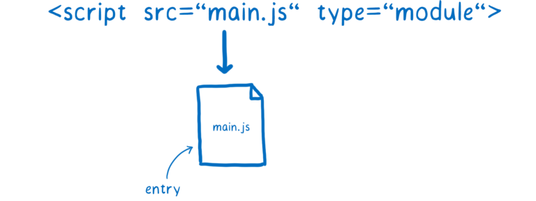

但是它如何找到下一组模块——`main.js`直接依赖的模块？

这就是导入语句的用武之地。导入语句的一部分称为模块说明符。它告诉loader在哪里可以找到每个下一个模块。


我们必须逐层遍历树，解析一个文件，然后找出它的依赖关系，然后找到并加载这些依赖关系。

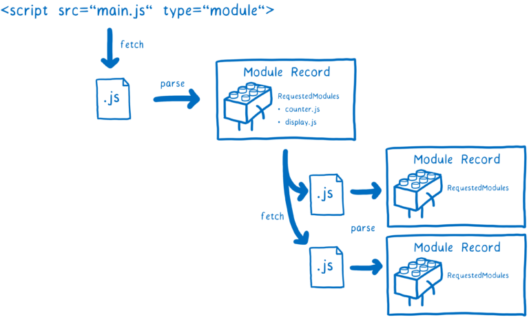

如果主线程要等待这些文件中的每一个下载完成，许多其他任务就会堆积在它的队列中。

像这样阻塞主线程会使使用模块的应用程序太慢而无法使用。

`CommonJS` 规范**是在代码运行时同步阻塞性地加载模块**，在执行代码过程中遇到 `require(X)` 时会停下来等待，直到新的模块加载完成之后再继续执行接下去的代码。

虽说是同步阻塞性，但这一步实际上非常快，和浏览器上阻塞性下载、解析、执行 `js` 文件不是一个级别，硬盘上读文件比网络请求快得多。

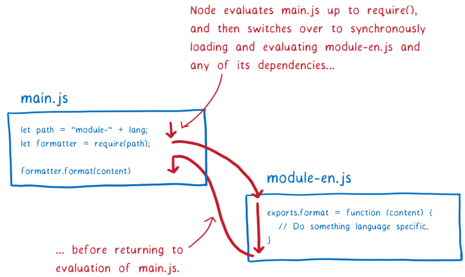

但是使用 ES 模块，您需要预先构建整个模块图……在您进行任何运行值之前。这意味着您的模块说明符中不能有变量，因为这些变量还没有值。

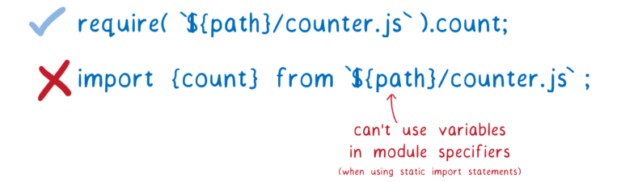

但有时将变量用于模块路径确实很有用。例如，您可能希望根据代码正在执行的操作或运行的环境来切换加载的模块。

为了使 ES 模块成为可能，有一个名为[动态导入](https://github.com/tc39/proposal-dynamic-import)的提议。有了它，您可以使用类似的导入语句`import(`${path}/foo.js`)`。

其工作方式是使用`import()`加载的任何文件都被处理为单独图形的入口点。动态导入的模块会启动一个新的依赖图，该图是单独处理的。

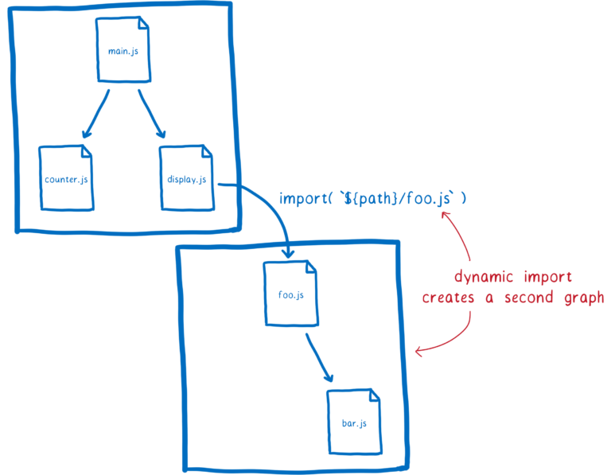

不过需要注意的一点是——这两个图中的任何模块都将共享一个模块实例。这是因为加载器缓存了模块实例。对于特定全局范围内的每个模块，将只有一个模块实例。

这意味着浏览器的工作量更少。例如，这意味着即使有多个模块依赖，模块文件也只会被获取一次。（这是缓存模块的一个原因。）

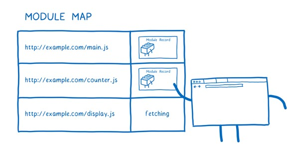

loader使用称为[模块映射](https://html.spec.whatwg.org/multipage/webappapis.html#module-map)的东西来管理这个缓存。每个全局都在单独的模块映射中跟踪其模块。

当loader去获取一个 URL 时，它会将该 URL 放入模块映射中并记下它当前正在获取该文件。然后它将发出请求并继续开始获取下一个文件。

如果另一个模块依赖于同一个文件会发生什么？加载器将在模块映射中查找每个 URL。如果它`fetching`在那里看到，它将继续前进到下一个 URL。

但是模块映射不只是跟踪正在获取的文件。模块映射还用作模块的缓存.


#### 解析

现在我们已经获取了这个文件，我们需要将它解析成一个模块记录。这有助于浏览器了解模块的不同部分是什么。

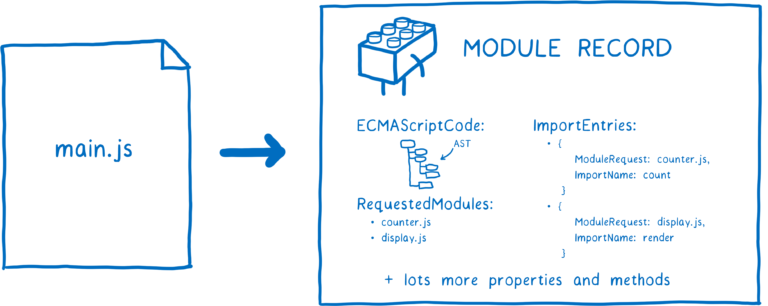

一旦创建了模块记录，它就会被放置在模块映射中。这意味着无论何时从这里请求它，加载程序都可以从该地图中拉出它。


解析中有一个细节看似微不足道，但实际上具有相当大的影响。所有模块都被解析，就好像它们有`"use strict"`在顶部一样。还有其他一些细微的差别。例如，关键字`await`在模块的顶层代码中保留，其`this`值为`undefined`.

在加载过程结束时，你已经从只有一个入口点文件变为拥有一堆模块记录。

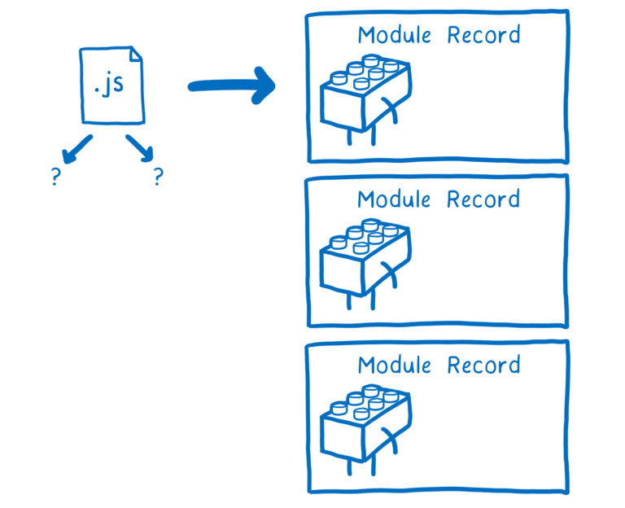

下一步是实例化这个模块并将所有实例链接在一起。


### 阶段二：实例化

对模块记录进行实例化，并且分配内存空间，解析模块的导入和导出语句，把模块指向对应的内存地址。

首先，JS引擎创建一个模块环境记录。这管理模块记录的变量。然后它会在内存中找到所有导出的框。模块环境记录将跟踪内存中的哪个框与每个导出相关联。

内存中的这些盒子还没有得到它们的值。只有在运行之后才会填写它们的实际值。这个规则有一个警告：任何导出的函数声明都在这个阶段初始化。这使实例化变得更容易。

请注意，导出和导入都指向内存中的同一位置。首先连接出口可以保证所有进口都可以连接到匹配的出口。

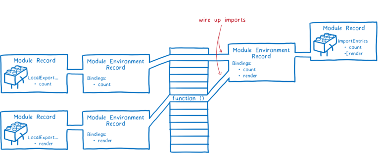

这与 CommonJS 模块不同。在 CommonJS 中，整个导出对象在导出时被复制。这意味着导出的任何值（如数字）都是副本。

这意味着如果导出模块稍后更改该值，则导入模块不会看到该更改。

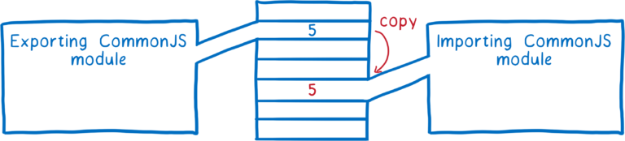

相比之下，ES 模块使用称为实时绑定的东西。两个模块都指向内存中的相同位置。这意味着当导出模块更改值时，该更改将显示在导入模块中。

导出值的模块可以随时更改这些值，但导入模块不能更改其导入的值。话虽如此，如果模块导入一个对象，它可以更改该对象上的属性值。

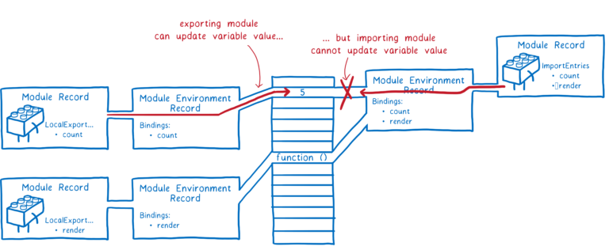

所以在这一步结束时，我们已经连接了导出/导入变量的所有实例和内存位置。

现在我们可以开始运行代码并用它们的值填充这些内存位置。


### 阶段三：运行

最后一步是在内存中填写这些框。JS 引擎通过执行顶层代码——函数之外的代码来做到这一点。

除了在内存中填充这些框外，评估代码还可以触发副作用。例如，一个模块可能会调用一个服务器。

由于潜在的副作用，您只想运行该模块一次。与实例化中发生的链接相反，可以多次执行相同的结果，运行可能有不同的结果，具体取决于您执行的次数。

这是拥有模块图的原因之一。模块映射通过规范 URL 缓存模块，以便每个模块只有一个模块记录。这确保每个模块只执行一次。


## 关于循环引用

### CommonJS中的循环引用案例

```js
//a.js
exports.done = false;

var b = require('./b.js');
console.log('在a.js中，b.done = %j', b.done);

exports.done = true;
console.log('a.js执行完毕！')

//b.js
exports.done = false;

var a = require('./a.js');
console.log('在b.js中，a.done = %j', a.done);

exports.done = true;
console.log('b.js执行完毕！')

//main.js
var a = require('./a.js');
var b = require('./b.js');

console.log('在main.js中，a.done = %j, b.done = %j', a.done, b.done);
```

依CommonJS规范(`node main.js`)，运行结果为：

```ini
在b.js中，a.done = false
b.js执行完毕！
在a.js中，b.done = true
a.js执行完毕！
在main.js中，a.done = true, b.done = true
```

JS代码执行顺序如下：

1）main.js中先加载a.js，a脚本先输出done变量，值为false，然后加载b脚本，a的代码停止执行，等待b脚本执行完成后，才会继续往下执行。

2）b.js执行到第二行会去加载a.js，这时发生循环加载，系统会去a.js模块对应对象的exports属性取值，**因为a.js没执行完，从exports属性只能取回已经执行的部分，未执行的部分不返回，所以取回的值并不是最后的值。**

3）a.js已执行的代码只有一行，exports.done = false;所以对于b.js来说，require a.js只输出了一个变量done，值为false。往下执行console.log('在b.js中，a.done = %j', a.done);控制台打印出：`在b.js中，a.done = false`

4）b.js继续往下执行，done变量设置为true，console.log('b.js执行完毕！')，等到全部执行完毕，将执行权交还给a.js。此时控制台输出：`b.js执行完毕！`

5）执行权交给a.js后，a.js接着往下执行，执行console.log('在a.js中，b.done = %j', b.done);控制台打印出：`在a.js中，b.done = true`

6）a.js继续执行，变量done设置为true，直到a.js执行完毕。 `a.js执行完毕！`

7）main.js中第二行不会再次执行b.js，直接输出缓存结果。最后控制台输出：`在main.js中，a.done = true, b.done = true`


### ES6 Module中的循环引用案例

```javascript
//even.js
import {odd} from './odd';

var counter = 0;
export function even(n){
    counter ++;
    console.log(counter);

    return n == 0 || odd(n-1);
}

//odd.js
import {even} from './even.js';

export function odd(n){
    return n != 0 && even(n-1);
}

//index.js
import * as m from './even.js';  // 1

var x = m.even(5);  // 2
console.log(x);  // 3

var y = m.even(4);  // 4
console.log(y);  // 5
```

依ES6 Module(`babel-node index.js`)执行结果：

```arduino
1
2
3
false
4
5
6
true
```

**解析**

1. ES Module的加载时**不执行**，换句话说, 在代码1处，声明了一个变量m指向even模块，even加载在内存中，函数没有调用并不会执行。
2. 代码2通过m调用even函数，进而声明odd指向odd模块，odd加载在内存中，等待被调用。
3. 执行odd,even函数中的代码，打印count，最后返回false
4. 代码4同理。


## CommonJS与ES6 Modules规范的区别

- CommonJS模块是运行时加载，ES6 Module是编译时输出接口(即会输出一个引用)；

- CommonJS加载的是整个模块，将所有的接口全部加载进来(当CommonJS文件被引用时，会同步暂停当前文件执行，而是会去执行整个CommonJS文件)，ES6 Module可以单独加载其中的某个接口；

- CommonJS输出是值的拷贝，ES6 Module输出的是值的引用，被输出模块的内部的改变会影响引用的改变；

- CommonJS `this`指向当前模块，ES6 Module `this`指向`undefined`;


## AMD规范

### 产生原因

上面介绍的`CommonJS`规范看起来挺好用的啊，为什么又还要有其它的规范呢？比如`AMD、CMD`，那它们和`CommonJS`又有什么渊源呢？

我们知道，模块化这种概念不仅仅适用于服务器端，客户端同样也适用。

而`CommonJS`规范不太适合用在客户端(浏览器)环境。


### 使用

requireJS定义了一个函数 define，它是全局变量，用来定义模块。

通过`define`来定义一个模块，使用`require`可以导入定义的模块。

```
define(id?, dependencies?, factory);
```

1. id：可选参数，用来定义模块的标识，如果没有提供该参数，脚本文件名（去掉拓展名）
2. dependencies：是一个当前模块依赖的模块名称数组
3. factory：工厂方法，模块初始化要执行的函数或对象。如果为函数，它应该只被执行一次。如果是对象，此对象应该为模块的输出值 


```
require([dependencies], function(){}); 
```


require()函数接受两个参数

1. 第一个参数是一个数组，表示所依赖的模块
2. 第二个参数是一个回调函数，当前面指定的模块都加载成功后，它将被调用。加载的模块会以参数形式传入该函数，从而在回调函数内部就可以使用这些模块

require()函数在加载依赖的函数的时候是异步加载的，这样浏览器不会失去响应，它指定的回调函数，只有前面的模块都加载成功后，才会运行，解决了依赖性的问题。


**使用**

在项目的根目录下执行：

```css
npm i requirejs
```

定义math.js

```js
define(function () {
  var add = function (a, b) {
    return a + b;
  }
  return {
    add: add
  }
})
```

定义test.js

```js
var requirejs = require("requirejs"); //引入requirejs模块

requirejs(['math'],function(math) {
  console.log(math)
  console.log(math.add(1, 2));
})
```

运行结果：

```
{ add: [Function: add] }
3
```


**依赖其它模块的define**

我们在使用define定义模块时，也可以引用其他模块。

m1.js:

```js
define(function () {
  console.log('我是m1, 我被加载了...')
  return {
    name: 'lindaidai',
    sex: 'boy'
  }
})
```

math.js:

```js
define(['m1'], function (m1) {
  console.log('我是math, 我被加载了...')
  var add = function (a, b) {
    return a + b;
  }
  var print = function () {
    console.log(m1.name)
  }
  return {
    add: add,
    print: print
  }
})
```

test.js:

```js
var requirejs = require("requirejs"); //引入requirejs模块

requirejs(['math'],function(math) {
  console.log('我是test, 我被加载了...')
  console.log(math.add(1, 2));
  math.print();
})
function other () {
  console.log('我是test模块内的, 但是我不依赖math')
};
other();
```

此时依赖关系依次为：

```rust
test -> math -> m1
```

运行结果：

```
LinDaiDaideMBP:commonJS lindaidai$ node test.js
我是test模块内的, 但是我不依赖math
我是m1, 我被加载了...
我是math, 我被加载了...
我是test, 我被加载了...
3
lindaidai
```


既然AMD适用于浏览器端，上面我们仍然使用的是node端，下面我们将它改成浏览器端。

首先创建html文件作为入口，此时我们还需要去requireJS的官网上下载require.js文件。

```html
<!DOCTYPE html>
<html lang="en">
<head>
  <meta charset="UTF-8">
  <meta http-equiv="X-UA-Compatible" content="IE=edge">
  <meta name="viewport" content="width=device-width, initial-scale=1.0">
  <title>Document</title>
</head>
<body>
  <script src="./require.js"></script>
  <script>
    require(['math'])
  </script>
</body>
</html>
```

math.js:

```js
define(['m1'], function (m1) {
  console.log('我是math, 我被加载了...')
  var add = function (a, b) {
    return a + b;
  }
  var print = function () {
    console.log(m1.name)
  }
  return {
    add: add,
    print: print
  }
})
```

m1.js:

```js
define(function () {
  console.log('我是m1, 我被加载了...')
  return {
    name: 'lindaidai',
    sex: 'boy'
  }
})
```

控制台输出结果为：

```
我是m1, 我被加载了...
我是math, 我被加载了...
```


## CMD规范

> AMD和CMD最大的区别是对依赖模块的执行时机处理不同，注意不是加载的时机或者方式不同，二者皆为异步加载模块。

也是使用`define`定义：

```
define(id?, dependencies?, factory)
```

区别在于最后一个参数：`factory`函数中是会接收三个参数：

- `require`：引入某个模块
- `exports`：当前模块的`exports`，也就是`module.exports`的简写
- `module`：当前这个模块


**`AMD`和`CMD`的区别**

虽然它们的`define()`方法的参数都相同，但是:

- `AMD`中会把当前模块的依赖模块放到`dependencies`中加载，并在`factory`回调中拿到加载成功的依赖
- `CMD`一般不在`dependencies`中加载，而是写在`factory`中，使用`require`加载某个依赖模块

> AMD和CMD最大的区别是对依赖模块的执行时机处理不同，注意不是加载的时机或者方式不同，二者皆为异步加载模块。


举例：

SeaJS是一个遵循CommonJS规范的JavaScript模块加载框架，可以实现JavaScript的模块化开发及加载机制。

首先我们需要全局定义一个html作为入口：

```html
<!DOCTYPE html>
<html lang="en">
<head>
  <meta charset="UTF-8">
  <meta http-equiv="X-UA-Compatible" content="IE=edge">
  <meta name="viewport" content="width=device-width, initial-scale=1.0">
  <title>Document</title>
</head>
<body>
  <script src="./sea.js"></script>
  <script>
      seajs.use("./math.js");
  </script>
</body>
</html>
```

注意：上面的sea.js文件(与html同级)，sea.js文件是在github上拉取的配置文件。

下面定义main.js:

为了方便，我们在这里再次写一下AMD的进行对比

```js
//AMD
define(['m1'], function (m1) {
  console.log('我是math, 我被加载了...')
  var add = function (a, b) {
    return a + b;
  }
  var print = function () {
    console.log(m1.name)
  }
  return {
    add: add,
    print: print
  }
})
```

但是在CMD中：

```js
//CMD
define(function (require, exports, module) {
  console.log('我是math, 我被加载了...')
  var m1 = require('m1');
  //下面的代码可写可不写，我们主要是探究执行顺序
  var add = function (a, b) {
    return a + b;
  }
  var print = function () {
    console.log(m1.name)
  }
  module.exports = {
    add: add,
    print: print
  }
})
```

m1.js:

```js
define(function (require, exports, module) {
  console.log('我是m1, 我被加载了...')
})
```

在浏览器中打开，执行结果为：

```
我是math, 我被加载了...
我是m1, 我被加载了...
```

执行结果区别：

- `AMD`，会先加载`m1`，`"我是m1"`会先执行
- `CMD`，我是`"我是math"`会先执行，因为本题中`console.log('我是math, 我被加载了...')`是放在`require('m1')`前面的。


## AMD和CMD的区别

现在可以很明显的看到区别了。

`AMD`依赖前置，`js`很方便的就知道要加载的是哪个模块了，因为已经在`define`的`dependencies`参数中就定义好了，会立即加载它。

`CMD`是就近依赖，需要使用把模块变为字符串解析一遍才知道依赖了那些模块。


两者之间，最明显的区别就是在模块定义时对依赖的处理不同

**AMD推崇依赖前置，在定义模块的时候就要声明其依赖的模块** **2、CMD推崇就近依赖，只有在用到某个模块的时候再去require**

AMD和CMD最大的区别是对依赖模块的执行时机处理不同，注意不是加载的时机或者方式不同

很多人说requireJS是异步加载模块，SeaJS是同步加载模块，这么理解实际上是不准确的，其实加载模块都是异步的，只不过AMD依赖前置，js可以方便知道依赖模块是谁，立即加载，而CMD就近依赖，需要使用把模块变为字符串解析一遍才知道依赖了那些模块。

同样都是异步加载模块，AMD在加载模块完成后就会执行该模块，所有模块都加载执行完后会进入require的**回调函数**，执行主逻辑，这样的效果就是依赖模块的执行顺序和书写顺序不一定一致，看网络速度，哪个先下载下来，哪个先执行，但是主逻辑一定在所有依赖加载完成后才执行

CMD加载完某个依赖模块后并不执行，只是下载而已，在所有依赖模块加载完成后进入主逻辑，遇到require语句的时候才执行对应的模块，这样模块的执行顺序和书写顺序是完全一致的


参考文章：

[ES6 Module 与 CommonJS 的区别](https://juejin.cn/post/7095733682794840094#heading-3)

[使用export输出值，而不是使用export default输出对象](https://juejin.cn/post/7053619070905614349#heading-1)

[一篇不是标题党的CommonJS和ES6模块规范讲解](https://juejin.cn/post/6844904145443356680#heading-16)

[前端模块化，AMD与CMD的区别](https://juejin.cn/post/6844903541853650951#heading-3)