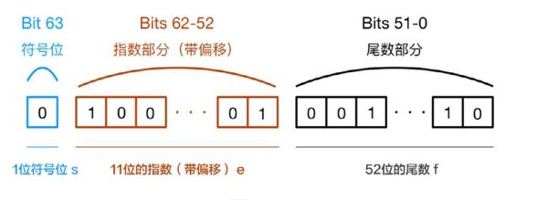

[TOC]


## 写在前面

这里是小飞侠Pan🥳，立志成为一名优秀的前端程序媛！！！

本篇文章收录于我的专栏：[前端精进之路](https://blog.csdn.net/weixin_52834435/category_11886356.html?spm=1001.2014.3001.5482)

同时收录于我的[github](https://github.com/mengqiuleo)前端笔记仓库中，持续更新中，欢迎star~

👉[https://github.com/mengqiuleo/myNote](https://github.com/mengqiuleo/myNote)

<hr/>

本篇文章是自己重新学习相关知识的查漏补缺，这个部分知识较多，推荐先看下面👇🏻的这些文章，然后再看此篇

[基本数据类型介绍](https://blog.csdn.net/weixin_52834435/article/details/122355828)

[数据类型检测及相关面试题](https://blog.csdn.net/weixin_52834435/article/details/123841751)

[数据类型转换(隐式转换、显式转换)](https://blog.csdn.net/weixin_52834435/article/details/123844514)


数据类型：Undefined、Null、Boolean、Number、String、Object、Symbol、BigInt

Symbol 和 BigInt 是ES6 中新增的数据类型


## Undefined 与 Null

### Undefined

**常见的出现undefined的场景**

```js
// ① 使用只声明而未初始化的变量时，会返回“undefined”
var a
console.log(a)

// ② 获取一个对象的某个不存在的属性（自身属性和原型链继承属性）时，会返回“undefined”
var obj = {
  name: 'pan'
};
console.log(obj.app)

// ③ 函数没有明确的返回值时，却在其他地方使用了返回值，会返回“undefined”
function foo() {}
console.log(foo())

// ④ 函数定义时使用了多个形参，而在调用时传递的参数的数量少于形参数量，那么未匹配上的参数就为“undefined”
function bar(a,b,c){
  console.log(c)
}
bar(1,2)
```


### Null

Null类型只有一个唯一的字面值null，表示一个空指针对象，这也是在使用typeof运算符检测null值时会反回“object”的原因。

**常见的出现null的场景**

```js
//# ①一般情况下，如果声明的变量是为了以后保存某个值，则应该在声明时就将其赋值为"null"
var obj = null
function foo(){
  return {
    name: 'pan'
  }
}
obj = foo()

//# JavaScript在获取DOM元素时，如果没有获取到指定的元素对象，就会返回"null"
document.querySelector('#id'); //null

//# ③在使用正则表达式进行捕获时，如果没有捕获结果，就会返回"null"
'test'.match(/a/); //null
```


### Undefined和Null两种类型的异同

#### （1）相同点

- 都只有一个字面值，分别是undefined和null

- 在转换为Boolean类型的值时，都会转换为false。所以通过非运算符（！）获取结果为true的变量时，无法判断其值为undefined还是null

#### （2）不同点

- 在使用typeof运算符检测时，Undefined类型的值会返回“undefined”，而Null类型的值会返回“object”

  ```js
  typeof undefined //undefined
  typeof null //object
  ```

- 在需要进行数值类型的转换时，undefined会转换为NaN，无法参与计算；null会转换为0，可以参与计算。

  ```js
  undefined + 0 //NaN
  null + 0 //0
  ```

- 无论在什么情况下都没有必要将一个变量显式设置为undefined。如果需要定义某个变量来保存将来要使用的对象，应该将其初始化为null。这样不仅能将null作为空对象指针的惯例，还有助于区分null和undefined。


## Boolean

Boolean的字面值只有两个，分别是**true和false**，它们是**区分大小写**的，其他值（如True和False）并不是Boolean类型的值。

### 其他类型转换为Boolean类型规则

- String类型
  - 空字符串""或者''（即双引号或单引号）都会转换为false
  - 任何非空字符串都会转换为true，包括只有空格的字符串""

- Number类型
  - 0 和 NaN 会转换为false。
  - 除了0和NaN以外，都会转换为true，包括表示无穷大和无穷小的Infinity和-Infinity。

- Object类型
  - 当object为null时，会转换为false。
  - 如果object不为null，则都会转换为true，包括空对象{}。
  - 任何Function类型的值都会转换为true
- Null 和 Undefined 都会转换为 false

**总结：undefined、null、false、+0、-0、NaN、""、'' 会转换为false**


## Number

### 其他类型转换为Number类型规则

- Boolean类型：true转换为1，false转换为0

- Null类型： Null类型只有一个字面值null，直接转换为0。

- Undefined类型： Undefined类型只有一个字面值undefined，直接转换为NaN。

- String类型： 
  - 如果字符串中只包含数字，则会转换成十进制数；如果前面有0，会直接省略掉，例如"0123"会转换为123
  - 如果字符串中包含的是有效的浮点数，则同样按照十进制转换，例如"1.23"会转换为1.23
  - 如果字符串中包含有效的十六进制格式，则会按照十进制转换，例如"0x3f"会转换为63
  - 如果是空字符串，则转换为0
  - 如果字符串中包含了除上述格式以外的字符串，则会直接转换为NaN

- Object类型 
  - Object类型在转换为Number类型时，会优先调用valueOf()函数，然后通过valueOf()函数的返回值按照上述规则进行转换。如果转换的结果是NaN，则调用toString()函数，通过toString


### isNaN 和 Number.isNaN

点击这里👉 [【JavaScript】isNaN 和 Number.isNaN 函数的区别？](https://blog.csdn.net/weixin_52834435/article/details/124374875?spm=1001.2014.3001.5501)


### 0.1 + 0.2为什么不是等于0.3

**问题原因**

一个浮点型数在计算机中，它总共长度是64位，其中最高位为符号位，接下来的11位为指数位，最后的52位为小数位，即有效数字的部分。

- 第0位：符号位sign表示数的正负，0表示正数，1表示负数。
- 第1位到第11位：存储指数部分，用e表示。
- 第12位到第63位：存储小数部分（即有效数字），用f表示。



因为浮点型数使用64位存储时，最多只能存储52位的小数位，对于一些存在无限循环的小数位浮点数，会截取前52位，从而**丢失精度**，所以会出现上面实例中的结果。


## String

### string类型字符串常见算法题

- 字符串逆序输出
- 统计字符串中出现次数最多的字符及出现的次数
- 去除字符串中重复的字符

点击这里👉 [string类型字符串常见算法题](https://blog.csdn.net/weixin_52834435/article/details/125522433?spm=1001.2014.3001.5501)


## toString()函数与valueOf()函数

所有引用类型都拥有这两个函数。

### toString()函数

toString()函数的作用是把一个逻辑值转换为字符串，并返回结果。Object类型数据的toString()函数默认的返回结果是"[object Object]"，当我们自定义新的类时，可以重写toString()函数，返回可读性更高的结果。

在JavaScript中，Array，Function，Date等类型都实现了自定义的toString()函数。

- Array的toString()函数返回值为以逗号分隔构成的数组成员字符串，例如[1, 2,3].toString()结果为字符串'1,2,3'。
- Function的toString()函数返回值为函数的文本定义，例如(function(x){return x *2;}).toString()的结果为字符串"function(x){return x * 2;}"。
- Date的toString()函数返回值为具有可读性的时间字符串，例如，new Date().toString()的结果为字符串"Sun Nov 25 2018 15:00:16 GMT+0800 (中国标准时间)"。


### valueOf()函数

valueOf()函数的作用是返回最适合引用类型的原始值，如果没有原始值，则会返回引用类型自身。Object类型数据的valueOf()函数默认的返回结果是"{}"，即一个空的对象字面量。

对于Array、Function、Date等类型，valueOf()函数的返回值是什么呢？

- Array的valueOf()函数返回的是数组本身，例如[1, 2, 3].valueOf()返回的结果为“[1,2,3]”。
- function的valueOf()函数返回的是函数本身，例如(function(x){return x * 2;}).valueOf()返回的结果为函数本身“function(x){return x * 2;}”。
- Date的valueOf()函数返回的是指定日期的时间戳，例如new Date().valueOf()返回的结果为“1543130166771”。


### 引用类型转换为String类型 - toString()函数

- 如果对象具有toString()函数，则会优先调用toString()函数。如果它返回的是一个原始值，则会直接将这个原始值转换为字符串表示，并返回该字符串。
- 如果对象没有toString()函数，或者toString()函数返回的不是一个原始值（即基本数据类型），则会再去调用valueOf()函数，如果valueOf()函数返回的结果是一个原始值，则会将这个结果转换为字符串表示，并返回该字符串。
- 如果通过toString()函数或者valueOf()函数都无法获得一个原始值，则会直接抛出类型转换异常。


### 引用类型转换为Number类型 - valueOf()函数

- 如果对象具有valueOf()函数，则会优先调用valueOf()函数，如果valueOf()函数返回一个原始值，则会直接将这个原始值转换为数字表示，并返回该数字。
- 如果对象没有valueOf()函数，或者valueOf()函数返回的不是原生数据类型，则会再去调用toString()函数，如果toString()函数返回的结果是一个原始值，则会将这个结果转换为数字表示，并返回该数字。
- 如果通过toString()函数或者valueOf()函数都无法获得一个原始值，则会直接抛出类型转换异常。


**总结**

对除了Date类型以外的引用类型数据转换为原生数据类型时，

- 如果是用于数据运算，则会优先调用valueOf()函数，在valueOf()函数无法满足条件时，则会继续调用toString()函数，如果toString()函数也无法满足条件，则会抛出类型转换异常。

- 如果是用于数据展示，则会优先调用toString()函数，在toString()函数无法满足条件时，则会继续调用valueOf()函数，如果valueOf()函数也无法满足条件，则会抛出类型转换异常。


## object

### new操作符的实现

创建一个新的对象obj
将对象与构建函数通过原型链连接起来
将构建函数中的this绑定到新建的对象obj上,并且执行该构造函数
根据构建函数返回类型作判断，如果是原始值则被忽略，如果是返回对象，需要正常处理

```js
function myNew(fn,...args) {
  let obj = Object.create(fn.prototype);
  let res = fn.call(obj,...args);
  if(res && (typeof res === "object" || typeof res === "function")){
    return res;
  }
  return obj;
}
```


测试案例：


测试案例：

```js
function Person(name,age){
  this.name = name;
  this.age = age;
}

Person.prototype.say = function(){
  console.log(this.age);
}

let p1 = myNew(Person,"zs",18);
console.log(p1.name);//zs
console.log(p1);//Person { name: 'zs', age: 18 }
p1.say();//18
```


### 对象创建的7种方式

点击这里 [JavaScript的对象7种创建方式（总结）](https://blog.csdn.net/weixin_52834435/article/details/123309164)


### object常用方法

[JavaScript中的Object.defineProperty](https://blog.csdn.net/weixin_52834435/article/details/123303297)

[JavaScript中的Object常用方法](https://blog.csdn.net/weixin_52834435/article/details/123314488)


### 实现 instanceof 操作符

[instanceof手写题](https://blog.csdn.net/weixin_52834435/article/details/123840182?spm=1001.2014.3001.5501)


### 遍历对象

`Js`遍历对象的方法主要有`for in`、`Object.keys()`、`Object.getOwnPropertyNames()`、`Reflect.ownKeys()`、`Object.getOwnPropertySymbols()`


#### for in

`for in`语句以任意顺序迭代对象的可枚举属性，包括原型链上的可枚举属性，不包括`Symbol`属性。

```js
var obj = {
  2: "11",
  1: "1",
  b: "1111",
  a: "111",
  [Symbol()]: "11111"
}
Object.prototype.c = "111111"; // 在原型链上增加一个可枚举属性
Object.defineProperty(obj, "d", {value:"1111111", enumerable:false}); // 在obj上增加一个不可枚举属性
console.log(obj); // {1: "1", 2: "11", b: "1111", a: "111", d: "1111111", Symbol(): "11111"}
for( let unit in obj ){
  console.log(unit, obj[unit]);
}
/* 
1 1
2 11
b 1111
a 111
c 111111
*/
/*
对于迭代时的顺序：
1. 如果属性名的类型是Number，那么属性的迭代顺序是按照key从小到大排序。
2. 如果属性名的类型是String，那么属性的迭代顺序是按照属性被创建的时间升序排序。
3. 如果属性名的类型是Symbol，那么逻辑同String相同。
*/
```


#### Object.keys

`Object.keys()`方法会返回一个由一个指定对象的自身可枚举属性组成的数组，数组中属性名的排列顺序和使用`for...in`循环遍历该对象时返回的顺序一致，

`Object.entries()`方法返回一个指定对象自身可枚举属性的键值对数组

`Object.values()`方法返回一个指定对象自身的所有可枚举属性值的数组

```js
var obj = {
    2: "11",
    1: "1",
    b: "1111",
    a: "111",
    [Symbol()]: "11111"
}
Object.prototype.c = "111111"; // 在原型链上增加一个可枚举属性
Object.defineProperty(obj, "d", {value:"1111111", enumerable:false}); // 在obj上增加一个不可枚举属性
console.log(obj); // {1: "1", 2: "11", b: "1111", a: "111", d: "1111111", Symbol(): "11111"}

var propertyArr = Object.keys(obj);
for( let unit of propertyArr ){
    console.log(unit, obj[unit]);
}
/* 
 1 1
 2 11
 b 1111
 a 111
*/
console.log(Object.entries(obj)); // [["1", "1"],["2", "11"],["b", "1111"],["a", "111"]]
console.log(Object.values(obj)); // ["1", "11", "1111", "111"]
```


#### Object.getOwnPropertyNames

`Object.getOwnPropertyNames()`方法返回一个由指定对象的所有自身属性的属性名，包括不可枚举属性但不包括`Symbol`值作为名称的属性组成的数组。

```js
var obj = {
    2: "11",
    1: "1",
    b: "1111",
    a: "111",
    [Symbol()]: "11111"
}
Object.prototype.c = "111111"; // 在原型链上增加一个可枚举属性
Object.defineProperty(obj, "d", {value:"1111111", enumerable:false}); // 在obj上增加一个不可枚举属性
console.log(obj); // {1: "1", 2: "11", b: "1111", a: "111", d: "1111111", Symbol(): "11111"}

var propertyArr = Object.getOwnPropertyNames(obj);
for( let unit of propertyArr ){
    console.log(unit, obj[unit]);
}
/* 
 1 1
 2 11
 b 1111
 a 111
 d 1111111
*/
```


#### Object.getOwnPropertySymbols

`Object.getOwnPropertySymbols()`方法返回一个指定对象自身的所有`Symbol`属性的数组

```js
var obj = {
    2: "11",
    1: "1",
    b: "1111",
    a: "111",
    [Symbol()]: "11111"
}
Object.prototype.c = "111111"; // 在原型链上增加一个可枚举属性
Object.defineProperty(obj, "d", {value:"1111111", enumerable:false}); // 在obj上增加一个不可枚举属性
console.log(obj); // {1: "1", 2: "11", b: "1111", a: "111", d: "1111111", Symbol(): "11111"}

var propertyArr = Object.getOwnPropertySymbols(obj);
for( let unit of propertyArr ){
    console.log(unit, obj[unit]);
}
/* 
 Symbol() "11111"
*/
```


#### Reflect.ownKeys

`Reflect.ownKeys`方法返回一个由指定对象自身的属性键组成的数组，包括不可枚举属性与`Symbol`属性，它的返回值等同于`Object.getOwnPropertyNames(target).concat(Object.getOwnPropertySymbols(target))`。

```js
var obj = {
    2: "11",
    1: "1",
    b: "1111",
    a: "111",
    [Symbol()]: "11111"
}
Object.prototype.c = "111111"; // 在原型链上增加一个可枚举属性
Object.defineProperty(obj, "d", {value:"1111111", enumerable:false}); // 在obj上增加一个不可枚举属性
console.log(obj); // {1: "1", 2: "11", b: "1111", a: "111", d: "1111111", Symbol(): "11111"}

var propertyArr = Reflect.ownKeys(obj);
for( let unit of propertyArr ){
    console.log(unit, obj[unit]);
}
/* 
 1 1
 2 11
 b 1111
 a 111
 d 1111111
 Symbol() "11111"
*/
```

此部分参考文章：

[Js遍历对象总结](https://blog.touchczy.top/#/JavaScript/Js%E9%81%8D%E5%8E%86%E5%AF%B9%E8%B1%A1%E6%80%BB%E7%BB%93)


## 函数

### compose函数

[JavaScript中的组合（Compose）函数](https://blog.csdn.net/weixin_52834435/article/details/122465839)


### 函数柯里化

[JavaScript柯里化](https://blog.csdn.net/weixin_52834435/article/details/123302639)


### 类数组对象

[【JavaScript】类数组详解](https://blog.csdn.net/weixin_52834435/article/details/123932595)